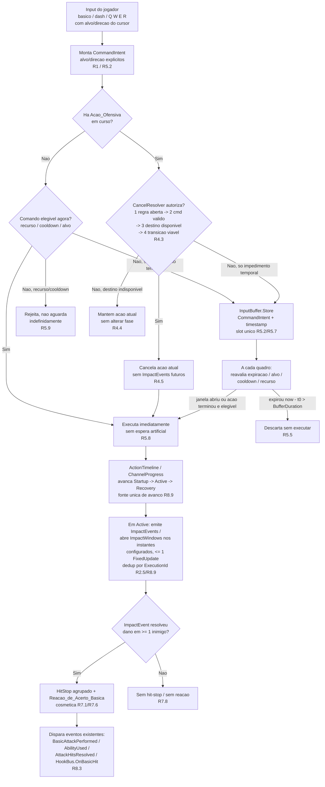
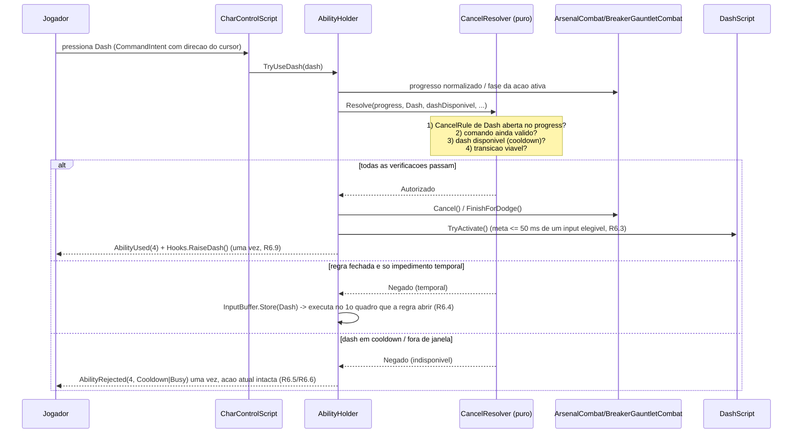

# Design Document

## Overview

Este documento descreve o design técnico da **Fase 1 — Combat Foundation (P0)** da reestruturação de gameplay de **Tech-Guy** (Unity 3D, C#), conforme `requirements.md` e o backlog da seção 54 de `Docs/Tech-Guy_Gameplay_Rework.md`.

O objetivo é refazer o **núcleo do combate** para que ele deixe de ser automático e rígido e passe a ser responsivo e controlado pelo jogador, **sem descartar os sistemas existentes**. Em vez de reescrever `CharControlScript` e `AbilityHolder`, o design extrai **apenas o que o núcleo determinístico precisa** para **classes C# puras, sem herança de `MonoBehaviour`** (mesmo padrão do helper já existente `ChargedShot`), mantendo os dois `MonoBehaviour` como **coordenadores finos** que delegam a essas classes (R8.7). Isso atende diretamente à regra do `AGENTS.md` de "mover a lógica de jogo que cresce para classes C# menores".

### Núcleo_Compartilhado + Manopla-first

Esta fase entrega uma **fundação de combate compartilhável — o Nucleo_Compartilhado** — e a **valida na Manopla**. O Nucleo_Compartilhado é o único caminho de código **independente de arma**: estado de ação, avanço da linha do tempo, autorização de transição/cancelamento, Buffer_de_Input, identificação de execução e despacho de eventos. Ele é validado nas **5 Ações_Ofensivas da Manopla (ataque básico + Q/W/E/R) e no dash da Manopla** (R2.8).

**Arco e Lança permanecem funcionais** (equipar, mover, atacar, usar habilidades e dash) via **fluxo legado ou Adaptador_de_Compatibilidade**, sem regressão nos caminhos afetados; sua **migração/ajuste fino completos são adiados** para fases posteriores (R2.8). **Comportamento específico de arma** (socos, avanços, estocadas, projéteis, sequências, geração de energia Asura) **pode residir** em definições de arma, executores (`ArsenalCombat`/`BreakerGauntletCombat`) ou Adaptadores — **apenas o Nucleo_Compartilhado é caminho único** (R8.8). Se uma mudança no Nucleo_Compartilhado alterar o comportamento de Arco ou Lança, a alteração **deve ser documentada** e exigir uma **verificação de regressão proporcional** ao caminho afetado (R2.9).

Princípios que guiam o design:

- **Compatibilidade por contrato primeiro (R8.3).** Os canais de evento (`BasicAttackPerformed`, `AbilityUsed`, `AbilityRejected`, `AttackHitsResolved`, `HookBus.OnBasicHit`) e as APIs (`CancelCombo`, `RequireAttackRelease`, `IsCasting`, `MovementAllowedWhileCasting`, `ReduceCooldowns`) continuam com as mesmas **assinaturas** e preservam a **semântica observável que os consumidores de fato usam**. A ordenação interna pode mudar; o que se preserva (ou se adapta explicitamente) é o **significado** de cada ocorrência, não uma contagem/ordem cega.
- **Lógica pura, testável sem cena (R8.7).** Fases, janelas de cancelamento, buffer de input, identidade de execução e a decisão de hit-stop vivem em classes puras exercitáveis via o harness `PropertyCheck` (EditMode), sem instanciar `GameObject`/`MonoBehaviour`.
- **Dado, não código especial (R3).** Peso, cancelabilidade e Categoria_de_Compromisso de cada Ação_Ofensiva são **autorados por asset**, com default retrocompatível (`Committed` + aviso de validação).
- **Fases governam compromisso; eventos governam impacto (R2).** As fases Startup/Active/Recovery definem o quanto a ação prende o Jogador; os impactos discretos são emitidos por **ImpactEvents**, não por uma hitbox contínua entre `startupEnd` e `activeEnd`.
- **Mudanças escopadas à Fase 1.** Postura/stagger pesado, knockdown, launch, mana universal, reworks de arma e estrutura de run ficam **fora de escopo**.

### Mapeamento de alto nível entre requisitos e componentes (estrutura revisada)

| Requisito | Componente principal |
| --- | --- |
| R1 — Remoção do auto-combate | `CharControlScript` (refatorar `FollowTarget`/`TryAttackTarget`), `BasicAttackDriver` (puro), `CommandIntent` (puro) |
| R2 — Fases + ImpactEvents | `ActionTimeline` / `ChannelProgress` (puro), `ImpactEvent`/`ImpactWindow`, `ExecutionId`, fonte única de avanço |
| R3 — Categorias de compromisso | `CommitmentCategory` + `CommitmentRules` (puro, perfis + default `Committed` com aviso) |
| R4 — CancelRules por destino | `CancelRule` + `CancelRuleSet` (puro), `CancelResolver` (puro, único) |
| R5 — Buffer de input | `InputBuffer` (puro, slot único de `CommandIntent`), fontes de comando em `CharControlScript`/`AbilityHolder` |
| R6 — Dash de cancelamento | `AbilityHolder.TryUseDash` via `CancelResolver`, generaliza `BreakerGauntletCombat.FinishForDodge`, `DashScript` |
| R7 — Feedback de acerto | `HitStop` + `HitStopGrouping` (puro) + `HitStopRunner` (fino), reação via `HitReactionRequest` existente |
| R8 — Compatibilidade por contrato | Fachadas preservadas; Adaptadores_de_Compatibilidade documentados; roteamento por `HookBus` |
| R9 — Gate de playtest | Nota de design; critério manual, não automatizado |

## Architecture

### Camadas

1. **Camada de coordenação (MonoBehaviour, já existente):** `CharControlScript` e `AbilityHolder`. Leem input, resolvem referências de cena (câmera, agente, alvo), disparam os eventos públicos e **delegam toda decisão de combate** às classes puras. Permanecem os únicos pontos que tocam a Unity. Os executores `ArsenalCombat`/`BreakerGauntletCombat` continuam executando a ação concreta de habilidade e passam a **reportar progresso** (fase + progresso local) ao Nucleo_Compartilhado.
2. **Camada de lógica pura (novas classes C#, sem `MonoBehaviour`):** `ActionTimeline`, `ChannelProgress`, `CommitmentRules`, `CancelRule`/`CancelRuleSet`, `CancelResolver`, `InputBuffer`, `CommandIntent`, `ImpactEvent`/`ImpactWindow`/`ExecutionId`, `HitStop`/`HitStopGrouping`, `BasicAttackDriver`. Determinísticas, sem estado de cena, testáveis por propriedade.
3. **Camada de dados (assets serializados):** `CombatActionProfile` autorado por Ação_Ofensiva (ataque básico + Q/W/E/R da Manopla nesta fase), com defaults retrocompatíveis.
4. **Camada de adaptação (opcional, por arma):** Adaptadores_de_Compatibilidade conectam o fluxo legado de Arco/Lança ao Nucleo_Compartilhado sem forçar migração completa (R8.8).

### (a) Fluxo input → execução imediata ou transição por cancelamento → buffer → reavaliação → ImpactEvent → resolução



### (b) Máquina de estados da linha do tempo de uma Ação_Ofensiva

```mermaid
stateDiagram-v2
    [*] --> Startup : inicio da acao (progress = 0)
    Startup --> Active : progress >= startupEnd (R2.2)
    Active --> Recovery : progress >= activeEnd (R2.2) ou termino de Channel (R3.6)
    Recovery --> [*] : fim de Recovery - devolve controle em <= 1 FixedUpdate (R2.7)

    Startup --> Cancelado : CancelResolver autoriza (R4.3)
    Active --> Cancelado : CancelResolver autoriza (R4.3)
    Recovery --> Cancelado : CancelResolver autoriza (R4.3)
    Cancelado --> [*] : encerra ImpactWindows abertas, sem ImpactEvents futuros (R4.5)

    note right of Startup
        Nenhum ImpactEvent emitido;
        nenhuma ImpactWindow aberta.
        VFX / SFX / deslocamento de
        antecipacao permitidos (R2.4)
    end note
    note right of Active
        Emite 1+ ImpactEvents e abre 1+ ImpactWindows
        nos instantes configurados (R2.5).
        Ex. Manopla: Q avanco + 2 socos; W sequencia + finalizador;
        E 2 impactos; R rajada + finalizador circular.
        Channel sustenta enquanto controle pressionado (R3.6)
    end note
    note right of Recovery
        Encerra ImpactWindows abertas e nao
        emite ImpactEvents futuros (R2.6).
        Efeitos JA emitidos (projeteis, zonas)
        seguem sua propria politica de vida (R2.6/R8.5)
    end note
    note right of Cancelado
        Nao desfaz acertos ja resolvidos.
        Efeitos independentes ja emitidos
        (ex. projetil) seguem vivos (R8.5)
    end note
```



### (c) Sequência de um dash atravessando o `CancelResolver` compartilhado (R6.2)



## Components and Interfaces

### Novas classes puras (sem `MonoBehaviour`)

Diretório proposto: `Assets/_Project/Scripts/Characters/Combat/Core/` (domínio `Characters`/`Combat`, consistente com o `AGENTS.md`). Cada arquivo acompanha seu `.meta` gerado pela Unity (não editar GUIDs manualmente).

#### `ActionTimeline` (R2 — ações de duração fixa)

Modela a linha do tempo normalizada `[0,1]` com as fronteiras `startupEnd` e `activeEnd`, resolve a fase e valida/clampa valores. **Não** governa impacto — apenas compromisso de fase.

```csharp
public enum ActionPhase { Startup, Active, Recovery }

public readonly struct ActionTimeline
{
    public float StartupEnd { get; }   // fim de Startup / inicio de Active
    public float ActiveEnd  { get; }   // fim de Active / inicio de Recovery

    // Clampa para 0 <= startupEnd <= activeEnd <= 1 (R2.3 em runtime).
    public ActionTimeline(float startupEnd, float activeEnd);

    // Startup [0, startupEnd); Active [startupEnd, activeEnd); Recovery [activeEnd, 1].
    public ActionPhase PhaseOf(float progress);   // R2.1/R2.2

    // Validacao de editor: retorna false e descreve a fronteira invalida sem lancar (R2.3).
    public static bool Validate(float startupEnd, float activeEnd, out string error);
}
```

#### `ChannelProgress` (R3.7 — Channel de duração variável)

Para Ações_Ofensivas Channel de **duração variável**, a linha do tempo global `[0,1]` **não** se aplica. A posição de cancelamento é expressa por **fase + progresso/tempo local da fase**, sem depender de uma duração total conhecida.

```csharp
public readonly struct ChannelProgress
{
    public ActionPhase Phase { get; }          // Startup / Active / Recovery
    public float LocalProgress { get; }        // progresso [0,1] DENTRO da fase corrente

    public ChannelProgress(ActionPhase phase, float localProgress); // clampa localProgress a [0,1]
}
```

O Nucleo_Compartilhado consulta cancelamento por `(ActionPhase, localProgress)` tanto para duração fixa (derivando a fase e um progresso local a partir de `ActionTimeline`) quanto para Channel variável (recebendo-os diretamente do executor). A linha global `[0,1]` permanece válida apenas para ações de duração fixa.

#### `CommitmentCategory` + `CommitmentRules` (R3)

Categorias são **perfis de valores padrão**, não relações rígidas entre categorias. Mobilidade e cancelamento concretos derivam da **configuração por ação/por fase** no `CombatActionProfile`.

```csharp
public enum CommitmentCategory { Fluid, Committed, Channel }

public enum ChannelTerminationMode { Hold, Timed, Condition } // R3.5 (nem todos exigidos nesta fase)

public static class CommitmentRules
{
    public const CommitmentCategory Default = CommitmentCategory.Committed; // R3.10

    // Resolve a categoria; nulo/nao declarado -> Committed, com aviso de validacao em editor (R3.10).
    public static CommitmentCategory Resolve(CommitmentCategory? declared, out bool emitWarning);

    // Fracao de velocidade de movimento permitida por fase, clampada a [0,1] (R3.2).
    // Deriva da config concreta por acao/fase; NAO impoe "Fluid > Channel".
    public static float ClampMovementFraction(float configuredFraction);
}
```

Nota de design: a revisão **removeu** as regras rígidas "Fluid sempre cancela antes de Committed" e "Channel sempre Hold e mais lento que Fluid". A semântica de cada ação vem dos **valores autorados** de `CancelRuleSet` e das frações de movimento por fase, não de `if` por categoria. A **Rajada Asura (R da Manopla) preserva seu controle atual** (R3.9).

#### `CancelRule` + `CancelRuleSet` (R4 — por destino)

Substitui a antiga `CancelWindow` única com três booleanos por **regras independentes por destino**. A **ausência** de regra para um destino significa que o cancelamento naquele destino **não é permitido**.

```csharp
public enum CancelTarget { Dash, Basic, Skill }

public readonly struct CancelRule
{
    public CancelTarget Target { get; }
    public float Start { get; }   // fracao [0,1]
    public float End   { get; }   // fracao [0,1], End >= Start

    // Clampa Start/End a [0,1] e forca End >= Start (R4.8).
    public CancelRule(CancelTarget target, float start, float end);

    public bool IsOpenAt(float progress); // Start <= progress <= End (R4.1/R4.3)

    public static bool Validate(float start, float end, out string error); // R4.8
}

public sealed class CancelRuleSet
{
    // Guarda no maximo uma regra por destino. Sem regra para um destino => proibido (R4.2).
    public bool TryGet(CancelTarget target, out CancelRule rule);
    public bool HasRule(CancelTarget target);
}
```

#### `CancelResolver` (R3.3, R4, R6) — único, compartilhado

Lógica **única** que avalia as CancelRules **e** a disponibilidade do destino, usada por **todas as categorias e também pelo dash**. Encapsula a ordenação segura de verificação exigida por R4.3.

```csharp
// Disponibilidade do destino, avaliada pelo coordenador (cooldown, recurso, Asura, etc.).
public delegate bool DestinationAvailability(CancelTarget target);

public enum CancelDecision { Authorized, DeniedWindowClosed, DeniedCommandInvalid, DeniedUnavailable, DeniedInfeasible }

public static class CancelResolver
{
    // Ordem segura (R4.3), ANTES de encerrar a acao atual:
    //  (1) existe CancelRule para o destino e esta aberta no progresso atual;
    //  (2) o comando ainda e valido;
    //  (3) o destino esta disponivel (cooldown/recurso/Asura/condicoes existentes);
    //  (4) a transicao e viavel.
    // So retorna Authorized quando TODAS passam (R4.3/R4.4).
    public static CancelDecision Resolve(
        CancelRuleSet rules,
        CancelTarget target,
        float progress,
        bool commandStillValid,
        DestinationAvailability availability,
        bool transitionFeasible);
}
```

Quando a decisão é `DeniedUnavailable` (ex.: habilidade sem mana, dash em cooldown), o coordenador **mantém a ação atual sem alterar sua fase** (R4.4). Um Channel cancelável por dash durante toda a fase Active é expresso por uma **CancelRule de destino Dash cobrindo Active** no `CancelRuleSet` — **sem exceção oculta no controlador** (R3.8).

#### `CommandIntent` + `InputBuffer` (R1, R5)

`CommandIntent` carrega a intenção associada ao input, **incluindo o alvo ou direção explicitamente derivado do cursor/input no momento da emissão**, para que uma intenção bufferizada **nunca re-mire** um inimigo arbitrário (R5.2).

```csharp
public enum CommandKind { Basic, Dash, Skill1, Skill2, Skill3, Skill4 }

public readonly struct CommandIntent
{
    public CommandKind Kind { get; }
    public Actor Target { get; }          // alvo explicito (Ataque_Alvo) ou null
    public Vector3 Direction { get; }     // direcao explicita do cursor (Ataque_Direcional/dash)
    public float IssuedAt { get; }        // timestamp de emissao
    public long Sequence { get; }         // criterio de desempate deterministico (R5.7)

    public CommandIntent(CommandKind kind, Actor target, Vector3 direction, float issuedAt, long sequence);
}

public sealed class InputBuffer
{
    public float BufferDuration { get; }  // 0.120s inicial; 0 desativa; negativos rejeitados (R5.1)

    // Rejeita negativos/invalidos; 0 desativa o buffer (R5.1).
    public InputBuffer(float bufferDuration);

    // Guarda a intencao substituindo qualquer anterior no slot unico; mais recente vence,
    // desempate por Sequence para instantes iguais (R5.2/R5.7).
    public void Store(in CommandIntent intent);

    // Se houver intencao valida e (janela aberta OU acao terminou), devolve-a e limpa o buffer
    // (dispara no maximo uma vez, R5.6). Intencao expirada (now - IssuedAt > BufferDuration) e
    // descartada sem executar (R5.5). 'now' usa um relogio que NAO avanca em pausa de menu nem
    // consome validade durante hit-stop (R5.10).
    public bool TryConsume(float now, bool windowOpen, out CommandIntent intent);

    // Descarta sem consumir se expirado; usado no tick para limpeza (R5.5).
    public void Expire(float now);

    public bool HasPending { get; }
}
```

Nota de relógio (R5.10): o `now` passado ao `InputBuffer` é um tempo **não escalado** fornecido pelo coordenador, que **não avança durante pausa de menu** e **não descarta input legítimo durante hit-stop**. A captura de input continua ativa durante o feedback. O buffer **não** emite `AbilityRejected` a cada reavaliação interna — no máximo **uma** rejeição terminal conforme o contrato (R5.12).

#### `BasicAttackDriver` (R1 — sem auto-combate)

Decide, de forma pura, quantos ataques uma sequência de input autoriza, sem Unity. **A mera existência de alvo não autoriza ataque.**

```csharp
public sealed class BasicAttackDriver
{
    // Um Toque_de_Ataque pendente consome-se em exatamente 1 ataque; soltar apos o toque
    // preserva a execucao ja autorizada (R1.1/R1.5/R1.6).
    public void QueueTap();

    // Enquanto Segurar_Ataque, autoriza um ataque a cada attackInterval enquanto o alvo/intencao
    // permanece valido (R1.3).
    public void SetHold(bool held);

    // Autoriza no maximo uma vez por tap, e a cada intervalo durante hold; false sem input (R1.3/R1.6).
    public bool TryTakeAttack(float now, float attackInterval);

    // Soltar apos Hold remove repeticoes futuras SEM cortar um golpe ja iniciado (R1.4/R5.11).
    public void ReleaseHold();

    // Alvo perdido / Ordem_de_Movimento: invalida repeticoes e intencao de aproximacao (R1.12).
    public void Clear();
}
```

#### `ImpactEvent` / `ImpactWindow` / `ExecutionId` (R2, R8.9)

Modela impactos **discretos** (soco, disparo, explosão, pulso) e janelas de detecção contínuas (sweep), com **identidade de execução** para deduplicação. **Uma única fonte** de avanço da linha do tempo e uma **estratégia explícita de sincronização com a animação**, de modo que relógio lógico e Animation Events **não** disparem o mesmo impacto em duplicidade.

```csharp
// Identidade de uma execucao concreta de uma Acao_Ofensiva. Cada ImpactEvent dessa execucao
// e identificado por (ExecutionId, EventIndex) para deduplicacao (R8.9).
public readonly struct ExecutionId
{
    public int Value { get; }
    public static ExecutionId Next(); // monotônico por processo
}

public readonly struct ImpactEvent
{
    public int Index { get; }         // ordinal dentro da execucao
    public float At { get; }          // instante configurado (fracao da fase/linha do tempo)
    public bool OpensWindow { get; }  // true => ImpactWindow (sweep); false => emissao discreta
    public float WindowEnd { get; }   // fim da ImpactWindow quando OpensWindow (dentro de Active)
    // Referencia os dados de que precisa (dano, postura, hitbox/projetil, VFX, SFX, deslocamento,
    // perfil de Hit_Stop) SEM duplicar dados que as definicoes existentes ja contem (ex. AreaHitStep).
    public int HitStopProfileIndex { get; }
}

// Deduplicacao: contabiliza um ImpactEvent uma unica vez por execucao mesmo quando o relogio
// logico e um Animation Event coincidem (R8.9). Fonte unica de verdade do "ja emitido".
public sealed class ExecutionImpactLedger
{
    // true na PRIMEIRA emissao de (executionId, eventIndex); false em qualquer repeticao (dedup).
    public bool TryEmit(ExecutionId executionId, int eventIndex);
}
```

**Estratégia de sincronização com a animação:** o **relógio lógico** (avanço de `ActionTimeline`/`ChannelProgress` em `FixedUpdate`) é a **fonte única de avanço**. Animation Events, quando usados, apenas **sinalizam** o momento desejado e passam pelo `ExecutionImpactLedger.TryEmit`; se o relógio lógico já emitiu aquele `eventIndex`, o Animation Event é ignorado (e vice-versa). O "um quadro" dos requisitos de ativação/desativação é o **Quadro_de_Simulacao (FixedUpdate)** (R2.5/R2.6).

#### `HitStop` + `HitStopGrouping` (R7)

Decisão pura de hit-stop por ImpactEvent (duração e se aplica) e política de **agrupamento** de impactos simultâneos. O **MonoBehaviour fino** `HitStopRunner` aplica a pausa preservando outros modificadores de tempo.

```csharp
public static class HitStop
{
    public const float MaxDuration = 1f;   // faixa [0,1]s (R7.2)

    // Clampa a [0,1]. Zero mantem a decisao de "nao pausar" (R7.2).
    public static float ClampDuration(float configured);

    // true sse duracao clampada > 0 E o ImpactEvent resolveu dano em >= 1 inimigo (R7.1/R7.8).
    public static bool ShouldApply(float configuredDuration, int enemiesDamaged);
}

public static class HitStopGrouping
{
    // Um unico ImpactEvent que atinge N inimigos, ou impactos simultaneos, produzem UM feedback
    // agrupado. A intensidade/duracao segue uma politica explicita (ex. maximo), NUNCA a soma
    // das N duracoes por alvo (R7.3).
    public static float Combine(IReadOnlyList<float> simultaneousDurations); // retorna o maximo clampado
}
```

```csharp
// MonoBehaviour fino: traduz a decisao pura em efeito de Time.timeScale PRESERVANDO modificadores.
public sealed class HitStopRunner : MonoBehaviour
{
    // Aplica a pausa por 'duration' em tempo real. Se duration == 0, NAO toca Time.timeScale (R7.2).
    // Ao terminar, restaura a escala considerando pausa e demais modificadores de tempo ativos,
    // em vez de fixar incondicionalmente em 1 (R7.10).
    public void Apply(float duration);
}
```

A **Reação_de_Acerto_Básica** reutiliza o encanamento existente: `HitReactionRequest` com `StanceBreakEffect.None` (como `CharControlScript.BuildBasicAttackReaction` já faz com `defaultAttackBreakEffect = StanceBreakEffect.None`). É **cosmética**, encerra ao fim de sua duração serializada, **não interrompe a IA do inimigo** e é **distinta de stagger mecânico** — inimigos elite/boss **não** recebem interrupção por uma reação básica (R7.6/R7.7). Esta fase **não** amplia nem remove reações de postura existentes (ex.: o stun do E da Manopla) (R7.9).

### Edições em `CharControlScript` (R1, R5, R7, R8)

Métodos preservados sem alteração de assinatura (R8.1): `BasicAttackPerformed` (event), `CancelCombo()`, `RequireAttackRelease()`, `CurrentMoveDirection`, `isDashing`.

Mudanças:

- **`FollowTarget()` / `TryAttackTarget()` (R1):** hoje `FollowTarget` chama `TryAttackTarget` **todo frame** em que o alvo está no alcance (auto-combate). O refactor **separa mover-até-o-alcance de atacar**: `FollowTarget` continua movendo o agente até `EffectiveAttackRange`, mas **não dispara ataque sozinho**. O disparo passa a vir do estado de input via `BasicAttackDriver`: `TryAttackTarget` só executa `TryBasicAttack` quando `BasicAttackDriver.TryTakeAttack(...)` autoriza **e** o alvo é alcançável. Alvo perdido no meio do hold → `BasicAttackDriver.Clear()` + `ClearTarget()` (R1.12).
- **Três comandos (R1.1/R1.2/R1.9):**
  - **Ataque_Alvo:** seleciona um inimigo elegível **sob o cursor** dentro do Alcance_de_Deteccao, registra-o na `CommandIntent`, aproxima até o Alcance_de_Ataque e executa **exatamente um** ataque. Se **nenhum** inimigo elegível está sob o cursor, é **no-op total**: sem ataque, sem `BasicAttackPerformed`, estado preservado, **sem seleção por proximidade** (R1.11).
  - **Ataque_Direcional:** o `Shift+ataque` já existente (`TryDirectionalBasicAttack`) — ataque parado na direção do cursor, **sem auto-aproximação e sem selecionar inimigos** (R1.2).
  - **Ordem_de_Movimento:** clique fora da Zona_Morta_de_Movimento → `MoveToPosition` (que já faz `CancelCombo()` + `ClearTarget()`), **substituindo** qualquer intenção pendente (R1.9). Clique no avatar/dentro da deadzone preserva a `CommandIntent` corrente (R1.10), via `WorldClickResolver.IsNearPlayer` e `_movementClickDeadZone` já existentes.
- **Segurar_Ataque reaproveitando o hold-tracking existente (R1.3/R5.11):** `CharControlScript` alimenta `QueueTap()` no toque e `SetHold(primaryHeld)` **reutilizando** o rastreamento de hold já presente em `TrackChargedShot`/`_primaryHeldSeconds`/`_primaryHeldLast`. Soltar após Hold chama `ReleaseHold()` — remove repetições futuras **sem** cortar o golpe já iniciado; soltar após Tap preserva a execução autorizada (R1.4/R1.5).
- **Alvo_Interno (R1.7):** `target` continua existindo apenas para orientação/tracking/aim/animação (`FaceTarget`, `SetTarget`, `ClearTarget`). Sua **mera existência não autoriza** ataque nem perseguição indefinida — só `BasicAttackDriver.TryTakeAttack`.
- **Buffer (R5):** quando `playerBusy` (ação básica em curso) e o único impedimento é temporal, a `CommandIntent` de ataque/dash/skill vai para o `InputBuffer` em vez de ser ignorada; o tick consome ao fim do busy ou quando a janela abre.
- **Hit-stop e reação (R7):** ao resolver dano por um ImpactEvent (via `TryApplyAreaDamage`/projétil), consultar `HitStop.ShouldApply(...)`/`HitStopGrouping.Combine(...)` e chamar `HitStopRunner.Apply(...)` **uma vez por ImpactEvent/grupo** (independente do nº de inimigos). A reação básica já flui por `BuildBasicAttackReaction` com `StanceBreakEffect.None`.

### Edições em `AbilityHolder` (R3, R4, R6, R8)

Métodos/eventos preservados (R8.2): `AbilityUsed`, `AbilityRejected`, `AttackHitsResolved`, `IsCasting`, `MovementAllowedWhileCasting`, `ReduceCooldowns(float)`, `NotifyAttackHits`.

Mudanças:

- **`CheckUse` (R4.7):** hoje bloqueia em bloco — `if (IsCasting || isDashing) return Reject(Busy)`. Esse **bloqueio total** é substituído por uma **consulta ao `CancelResolver`** contra o modelo da ação ativa: se existe ação em curso, monta-se o `CancelRuleSet` da ação e consulta-se `CancelResolver.Resolve(progress, target, ...)`. Se `Authorized`, cancela a ação atual (`ArsenalCombat.Cancel()` / `BreakerGauntletCombat.FinishForDodge()`) e prossegue; se `DeniedUnavailable`, mantém a ação atual **sem alterar fase** e rejeita uma única vez; se negado por impedimento **temporal**, bufferiza (R5). **`IsCasting` e `MovementAllowedWhileCasting` continuam retornando os mesmos valores** para os consumidores (R4.7/R8.2) — apenas deixam de significar "bloqueio total de input".
- **`TryUseDash` (R6):** generaliza o `FinishForDodge` já existente **para dentro do `CancelResolver`**, corrigindo o cancelamento imediato de Channel que antes **ignorava a janela**. Sequência: cooldown/indisponível? → `Reject(4, Cooldown)` **antes** de cancelar a fonte, preservando o cooldown restante (R6.6). Senão, consulta `CancelResolver.Resolve(progress, Dash, ...)`; `Authorized` (inclui Channel em Active com CancelRule de Dash) cancela e inicia dash com **meta ≤50 ms a partir de um input elegível** (R6.3). Negado por temporal com dash disponível → bufferiza e executa no 1º quadro em que a regra de Dash abrir (R6.4). Negado fora da janela/sem permissão → `Reject` uma vez, ação atual intacta (R6.5). Sucesso → `AbilityUsed(4)` + `Hooks.RaiseDash()` **uma vez** e imunidade pela Janela_de_i-frames configurada (R6.9). I-frames e Duracao_de_Deslocamento são **parâmetros independentes** (R6.7); imunidade cessa em cancel/morte/mudança de sala/fim do deslocamento, **sem resíduo** (R6.8).
- **Categoria e regras por ação (R3/R4):** `TryUseAbility`/tick leem o `CombatActionProfile` da habilidade para montar `ActionTimeline`/`ChannelProgress`, `CancelRuleSet` e `CommitmentCategory`. Channel sustenta enquanto o controle está pressionado e transiciona para Recovery ao soltar quando o modo é Hold (R3.6).
- **Ordem/contagem de eventos (R8.3/R8.4):** `AbilityUsed` **não** dispara por soco de uma mesma habilidade (não há contrato legado que comprove disparo por golpe) e mantém 1 disparo por ocorrência de ativação; `AttackHitsResolved` mantém sua **granularidade real** (pode ser um lote de alvos). Ação cancelada **antes** de emitir um ImpactEvent **não** dispara `AttackHitsResolved`/`HookBus.OnBasicHit` para esse evento (R8.5); um **projétil emitido antes** do cancelamento pode produzir acerto válido **depois** do cancelamento, conforme sua própria vida (R8.5).

### Adaptadores de Arco e Lança (R2.8, R8.8)

Nesta fase, `ArsenalCombat` (Arco/Lança) permanece como executor legado funcional. Onde o Nucleo_Compartilhado precisar interagir com Arco/Lança (ex.: cancelamento por dash durante um cast de Arco), um **Adaptador_de_Compatibilidade** fino traduz o estado do executor legado para `(ActionPhase, localProgress)` + um `CancelRuleSet` mínimo, sem forçar a migração completa. Esses adaptadores são **documentados** e qualquer mudança do Nucleo_Compartilhado que os afete exige **verificação de regressão proporcional** (R2.9).

### APIs públicas preservadas (R8.1/R8.2)

- `CharControlScript.BasicAttackPerformed` (event), `CancelCombo()`, `RequireAttackRelease()`.
- `AbilityHolder.AbilityUsed`, `AbilityRejected`, `AttackHitsResolved`, `IsCasting`, `MovementAllowedWhileCasting`, `ReduceCooldowns(float)`.
- `HookBus.OnBasicHit` (e os demais canais já isolados por `try/catch` em `Dispatch`).

### Nota de design — auditoria de contrato ANTES de codificar (R8.3)

Antes de qualquer alteração de código, **auditar os emissores e assinantes reais** de cada canal/API abaixo (ancorado no código fornecido de `AbilityHolder`, `CharControlScript`, `HookBus`, `BreakerGauntletCombat`), para preservar a **semântica observável** de fato usada, não uma contagem/ordem cega:

- `BasicAttackPerformed` — emitido ao fim de `PerformAttack`; consumidores dependem de "um ataque básico executado".
- `CancelCombo()` / `RequireAttackRelease()` — chamados por `MoveToPosition`, casts e dash.
- `AbilityUsed` / `AbilityRejected` — 1 por ocorrência; `Reject` já é único por tentativa.
- `AttackHitsResolved` — emitido por `NotifyAttackHits` com a **lista de alvos** (lote), granularidade real a preservar (R8.4).
- `IsCasting` / `MovementAllowedWhileCasting` — lidos por `CharControlScript.Update`/`RequestMove`/`ClickToMove`; manter os mesmos valores observáveis (R4.7).
- `ReduceCooldowns(float)` — atua apenas nos timers run-scoped em Cooldown; preservar.
- `HookBus.OnBasicHit` — levantado pelo caminho de hit básico; dedup de kill já isolado.

Mapear as **relações de ordem que os boons realmente usam** e preservá-las ou adaptá-las **explicitamente**. Buffer/reavaliação e transições por cancelamento **não** devem duplicar custos, cooldowns, geração de energia Asura nem procs (R8.6).

## Data Models

### `CombatActionProfile` (serializável, por Ação_Ofensiva)

Para preservar GUIDs e assets existentes (AGENTS.md), o perfil é um **bloco serializável embutido** (`[Serializable] struct`/classe), **não** um novo tipo de asset com GUID próprio:

- **Habilidades (Q/W/E/R):** `[SerializeField] private CombatActionProfile _combatProfile;` em `Ability` (base dos `ScriptableObject` de habilidade) — adiciona dados ao asset existente sem renomear nem mudar GUID.
- **Ataque básico:** `[SerializeField] private CombatActionProfile _basicProfile;` preferencialmente em `WeaponScript` (mantém o caminho data-driven por arma).

Nesta fase, os perfis autorados cobrem as **5 Ações_Ofensivas da Manopla + dash**. Arco/Lança podem permanecer com perfil **default** (resolvido para `Committed` + aviso) enquanto operam por fluxo legado/adaptador.

| Campo | Tipo | Faixa / default | Requisito |
| --- | --- | --- | --- |
| `startupEnd` | float | `[0,1]`, default `0.33` (duração fixa) | R2.2/R2.3 |
| `activeEnd` | float | `[startupEnd,1]`, default `0.66` (duração fixa) | R2.2/R2.3 |
| `commitment` | `CommitmentCategory` | default `Committed` (+ aviso se ausente) | R3.1/R3.10 |
| `channelTermination` | `ChannelTerminationMode` | default `Hold` (só quando Channel) | R3.5/R3.6 |
| `startupMoveFraction` | float | `[0,1]`, default `0` | R3.2 |
| `activeMoveFraction` | float | `[0,1]`, default `0` | R3.2 |
| `recoveryMoveFraction` | float | `[0,1]`, default `0.6` | R3.2 |
| `cancelRules` | `CancelRule[]` | 0..3 regras (uma por destino); vazio = nenhum cancelamento | R4.1/R4.2 |
| `impactEvents` | `ImpactEvent[]` | lista de impactos discretos / windows na fase Active | R2.5 |
| `hitStopProfiles` | `HitStopProfile[]` | por ImpactEvent (micro/forte/reduzido/nenhum) | R7.2/R7.4/R7.5 |

`HitStopProfile` (por ImpactEvent): `{ float duration ([0,1]s, 0 desativa); HitStopClass class = Intermediate|Finisher|Secondary }` — finalizador aplica mais forte, intermediário aplica micro opcional, secundário/DoT aplica reduzido ou nenhum (R7.4/R7.5).

Observações:
- Invariante de editor `0 <= startupEnd <= activeEnd <= 1` validada em `OnValidate` via `ActionTimeline.Validate`; valores inválidos são **sinalizados** e os últimos válidos mantidos — **sem mutação silenciosa** (R2.3). Em runtime, o construtor de `ActionTimeline`/`CancelRule` **clampa** como defesa adicional (R4.8).
- Cada `CancelRule` validada por `CancelRule.Validate` (`0 <= Start <= End <= 1`); fora da faixa ou invertida → sinalização + fallback seguro (R4.8).
- `ImpactEvent`s referenciam dados existentes (ex.: `AreaHitStep`) por índice/handle, **sem duplicar** dano/postura/hitbox que o asset já contém.

### Parâmetros globais de combate (serializados)

| Campo | Onde | Faixa / default | Requisito |
| --- | --- | --- | --- |
| `BufferDuration` | `AbilityHolder` / config de combate | default `0.120s`; `[0.100, 0.180]` **sugerida** (não limite rígido); `0` desativa; negativos rejeitados | R5.1 |
| `hitStopDuration` | config de combate / `HitStopRunner` | `[0,1]s`, default p.ex. `0.05`; `0` desativa sem alterar timescale | R7.2 |
| `IframeWindow` | config de dash / `AbilityHolder` | independente de `DisplacementDuration`; valor inicial **não** é contrato obrigatório | R6.7 |
| `DisplacementDuration` | `DashScript.dashTime` (já existe) | independente de `IframeWindow` | R6.7 |
| `attackInterval` | `WeaponScript` (já existe) | `> 0` | R1.3 |
| `_movementClickDeadZone` | `CharControlScript` (já existe) | `>= 0`, Zona_Morta | R1.9/R1.10 |

### Estado interno (não serializado)

- `InputBuffer`: `(CommandIntent pending, bool hasPending)` — apenas um comando por vez (R5.7).
- `BasicAttackDriver`: `(int pendingTaps, bool held, float lastAttackAt)`.
- Progresso da ação ativa: `ActionTimeline` (duração fixa) ou `ChannelProgress` (Channel variável), avançado por **uma única fonte** em `FixedUpdate`.
- `ExecutionImpactLedger`: dedup `(ExecutionId, eventIndex)` da execução ativa (R8.9).

## Correctness Properties

*Uma propriedade é uma característica ou comportamento que deve ser verdadeiro em todas as execuções válidas do sistema — essencialmente, uma afirmação formal sobre o que o sistema deve fazer. Propriedades servem de ponte entre a especificação legível por humanos e garantias de correção verificáveis por máquina.*

As propriedades abaixo descrevem **invariantes puras** das classes `BasicAttackDriver`, `ActionTimeline`/`ChannelProgress`, `CommitmentRules`, `CancelRule`/`CancelRuleSet`/`CancelResolver`, `InputBuffer`, `ExecutionImpactLedger` e `HitStop`/`HitStopGrouping` — lógica própria, determinística e de baixo custo, ideal para teste baseado em propriedades. Elas **não** testam o motor Unity, física, NavMesh nem serviços externos; esses casos ficam nos testes de integração (PlayMode) da Testing Strategy.

### Property 1: Toque produz no máximo um ataque sob precondições válidas

*Para qualquer* sequência de ticks contendo um único `QueueTap()` com `SetHold(false)` em todo o percurso e precondições válidas (alvo elegível, aproximação/execução concluída, comando não substituído), `BasicAttackDriver.TryTakeAttack` autoriza **no máximo um** ataque, e **exatamente um** quando a aproximação/execução conclui com sucesso.

**Validates: Requirements 1.1, 1.5, 1.6, 1.11, 1.12**

### Property 2: Cancelamento por destino dentro da janela

*Para qualquer* `progress`, destino e `CancelRuleSet`, `CancelResolver.Resolve` autoriza o cancelamento para esse destino **se e somente se** existe CancelRule para o destino, `start <= progress <= end`, o comando é válido, o destino está disponível e a transição é viável.

**Validates: Requirements 4.1, 4.2, 4.3, 4.4**

### Property 3: Ausência de regra proíbe o destino

*Para qualquer* destino sem CancelRule no `CancelRuleSet` e qualquer `progress`, `CancelResolver.Resolve` **nunca** autoriza o cancelamento para esse destino.

**Validates: Requirements 4.2**

### Property 4: Indisponibilidade preserva a ação atual

*Para qualquer* `progress` com CancelRule aberta mas destino **indisponível** (cooldown/recurso/Asura), `CancelResolver.Resolve` retorna `DeniedUnavailable`, de modo que a ação atual permaneça sem alterar sua fase e o Jogador não fique sem ação.

**Validates: Requirements 4.4**

### Property 5: Invariante de CancelRule válida

*Para quaisquer* valores de entrada de `start` e `end` (inclusive negativos, maiores que 1 ou com `start > end`), a `CancelRule` construída satisfaz sempre `0 <= Start <= End <= 1`, e `CancelRule.Validate(s, e)` é verdadeiro **se e somente se** `0 <= s <= e <= 1`.

**Validates: Requirements 4.1, 4.8**

### Property 6: Buffer nunca dispara após expirar

*Para quaisquer* instante de emissão `t0` e instante corrente `now`, se `now - t0 > BufferDuration`, então `InputBuffer.TryConsume` **nunca** devolve a intenção armazenada.

**Validates: Requirements 5.5**

### Property 7: Buffer dispara no máximo uma vez

*Para qualquer* intenção válida armazenada e qualquer sequência de chamadas a `InputBuffer.TryConsume`, a intenção é devolvida **no máximo uma vez** e o buffer fica vazio em seguida.

**Validates: Requirements 5.3, 5.4, 5.6**

### Property 8: Buffer retém o mais recente com desempate determinístico

*Para qualquer* conjunto de intenções armazenadas em sequência enquanto a anterior ainda é válida, a devolvida por `TryConsume` é sempre a de instante de emissão mais recente, com desempate determinístico por `Sequence` para instantes iguais.

**Validates: Requirements 5.7**

### Property 9: Buffer não re-mira

*Para qualquer* intenção bufferizada, a `CommandIntent` devolvida por `TryConsume` preserva o **alvo/direção original** e nunca seleciona um inimigo arbitrário por proximidade.

**Validates: Requirements 5.2**

### Property 10: Buffer não aguarda indisponibilidade

*Para qualquer* comando recusado por recurso/cooldown (e não apenas por impedimento temporal de janela), o `InputBuffer` **não** o retém em espera indefinida.

**Validates: Requirements 5.9**

### Property 11: Não duplicação de custos

*Para qualquer* reavaliação de buffer ou transição por cancelamento de uma mesma execução, não há duplicação de custo, cooldown, geração de energia Asura nem procs (o ledger/consumo marca a execução uma única vez).

**Validates: Requirements 8.6**

### Property 12: Hit-stop desativável e não-negativo

*Para qualquer* duração configurada, `HitStop.ClampDuration` devolve um valor em `[0,1]`, e quando o valor clampado é `0`, `HitStop.ShouldApply` é falso para qualquer `enemiesDamaged` (nenhuma pausa aplicada).

**Validates: Requirements 7.2**

### Property 13: Hit-stop agrupado não soma por alvo

*Para qualquer* conjunto de durações de impactos simultâneos, `HitStopGrouping.Combine` segue a política explícita (máximo clampado) e **nunca** a soma das durações por alvo; um único ImpactEvent sobre N inimigos produz **um** feedback agrupado.

**Validates: Requirements 7.1, 7.3, 7.4**

### Property 14: Preservação de tempo após hit-stop

*Para qualquer* escala de tempo global e conjunto de modificadores de tempo ativos no início do hit-stop, a escala restaurada ao término respeita a pausa e os demais modificadores ativos, em vez de ser fixada incondicionalmente em `1`.

**Validates: Requirements 7.10**

### Property 15: Dedup de impactos por execução

*Para qualquer* execução e índice de ImpactEvent, `ExecutionImpactLedger.TryEmit(executionId, eventIndex)` é verdadeiro **exatamente uma vez** e falso em qualquer repetição, mesmo quando relógio lógico e Animation Event coincidem.

**Validates: Requirements 8.9**

### Property 16: Categoria padrão é Committed com aviso

*Para qualquer* categoria declarada, `CommitmentRules.Resolve` devolve a categoria declarada quando presente e `Committed` quando ausente/nula, emitindo um aviso de validação **se e somente se** a categoria estava ausente.

**Validates: Requirements 3.10**

### Mapeamento propriedade → teste

| Propriedade | Classe sob teste | Teste EditMode (PropertyCheck) | Integração PlayMode |
| --- | --- | --- | --- |
| P1 | `BasicAttackDriver` | `BasicAttackDriverPropertyTests` | tap=1 ataque; hold em `attackInterval` (R1) |
| P2, P3, P4 | `CancelResolver`/`CancelRuleSet` | `CancelResolverPropertyTests` | cancelamento real durante cast (R4.6/R6) |
| P5 | `CancelRule` | `CancelRulePropertyTests` | — |
| P6, P7, P8, P9, P10 | `InputBuffer` | `InputBufferPropertyTests` | buffer antes da janela dispara no 1º quadro (R5/R6.4) |
| P11 | `ExecutionImpactLedger`/consumo | `NoDuplicateCostPropertyTests` | sem duplicar Asura/procs em transição (R8.6) |
| P12, P13, P14 | `HitStop`/`HitStopGrouping`/runner | `HitStopPropertyTests` | 1 hit-stop por ataque; timescale preservada (R7) |
| P15 | `ExecutionImpactLedger` | `ExecutionImpactLedgerPropertyTests` | relógio lógico + Animation Event não duplicam (R8.9) |
| P16 | `CommitmentRules` | `CommitmentRulesPropertyTests` | aviso de validação em editor (R3.10) |

## Error Handling

O design trata entradas inválidas por **clamp defensivo nas classes puras** e **validação de editor** nos assets, nunca por exceção em runtime de combate (que travaria o loop de jogo).

- **Fronteiras de fase inválidas (R2.3).** `ActionTimeline.Validate(startupEnd, activeEnd, out error)` é chamada em `OnValidate`: se `0 <= startupEnd <= activeEnd <= 1` for violado, retorna `false` e descreve a fronteira inválida (via `Debug.LogWarning` no editor), **mantendo os últimos valores válidos** (sem mutação silenciosa). O construtor de `ActionTimeline` **clampa** como defesa de runtime.
- **CancelRule inválida (R4.8).** `CancelRule.Validate` sinaliza `Start`/`End` fora de `[0,1]` ou `Start > End` em editor; o construtor **clampa** a `[0,1]` e força `End >= Start` **antes** de qualquer avaliação. Nenhuma mutação silenciosa dos dados de design.
- **Dash em cooldown/indisponível (R6.6).** `AbilityHolder.TryUseDash` rejeita **antes** de cancelar a fonte: `Reject(4, AbilityUseFailure.Cooldown)` **exatamente uma vez** e **preserva** o cooldown restante inalterado e a ação atual.
- **Dash fora de janela / sem permissão (R6.5).** Rejeição única via `AbilityRejected`, sem alterar a fase da ação atual.
- **Habilidade indisponível durante cancelamento (R4.4).** `CancelResolver` retorna `DeniedUnavailable`; a ação atual permanece sem alterar fase, evitando deixar o Jogador sem ação.
- **Rejeição terminal única do buffer (R5.12).** O `InputBuffer` **não** emite `AbilityRejected` a cada reavaliação interna; no máximo **uma** notificação de rejeição terminal conforme o contrato aplicável.
- **Ataque sem alvo elegível (R1.11).** `CharControlScript` trata como **no-op total**: nenhum ataque, `BasicAttackPerformed` **não** dispara, estado preservado, **sem** seleção por proximidade.
- **Hit-stop desativado / preservação de tempo (R7.2/R7.10).** `HitStop.ShouldApply` é `false` quando a duração clampada é `0`; `HitStopRunner.Apply(0)` **não** toca `Time.timeScale`. Ao término, a escala é restaurada respeitando pausa e demais modificadores ativos, **não** fixada incondicionalmente em `1`.
- **Buffer expirado / no máximo uma vez (R5.5/R5.6).** `InputBuffer.TryConsume`/`Expire` descartam silenciosamente comandos cujo `now - IssuedAt` excede `BufferDuration`; cada intenção é consumida no máximo uma vez.
- **Dedup de impacto (R8.9).** `ExecutionImpactLedger.TryEmit` garante uma única emissão por `(ExecutionId, eventIndex)`, mesmo com relógio lógico e Animation Event coincidentes.
- **Robustez de subscribers (R8).** Os canais continuam passando pelo `HookBus`, cujo `Dispatch` isola cada subscriber em `try/catch` e registra exceções via `Debug.LogException` sem interromper o pipeline — preservado por esta fase.

## Testing Strategy

### Abordagem dupla

- **Testes de propriedade (EditMode, puros):** validam as invariantes universais das classes puras com o harness `PropertyCheck`.
- **Testes de exemplo/integração (EditMode e PlayMode):** validam casos concretos, timing de runtime, contagem/ordem de eventos e comportamento dependente de cena (NavMesh, física, câmera, coroutines). Conforme a revisão, **testes determinísticos de unidade direcionados** são aceitáveis quando a propriedade universal não agrega valor.

### Biblioteca de property-based testing

O projeto **não** consegue resolver FsCheck/CsCheck nesta máquina (sem Assembly Definition em torno do código de gameplay; tudo vive em `Assembly-CSharp`). A fundação acordada é o harness próprio **`PropertyCheck`** (`Assets/_Project/Scripts/Tests/Support/PropertyCheck.cs`), que:

- executa **≥ 100 casos** gerados por propriedade (`DefaultCases = 128`), a partir de uma semente fixa (`DefaultSeed`), de modo **determinístico e reproduzível**;
- reporta o **contraexemplo** exato (índice do caso + semente) quando a propriedade falha, lançando `PropertyViolationException`, que o runner NUnit expõe como teste falho;
- é compartilhável por EditMode (`Assembly-CSharp-Editor`) e PlayMode por não referenciar NUnit internamente.

As propriedades puras seguem o mesmo padrão de `AdaptiveCadencePropertyTests` (EditMode): `PropertyCheck.ForAll((rng, i) => { ... PropertyCheck.That(cond, msg); })`.

Cada teste de propriedade:
- roda no mínimo 100 iterações (padrão `PropertyCheck.DefaultCases`);
- referencia a propriedade de design via comentário no formato **`// Feature: combat-foundation-rework, Property {n}: {texto}`**;
- implementa **uma** propriedade de correção por teste de propriedade.

### Testes de integração (PlayMode) — coordenadores MonoBehaviour

Cobrem o que não é property pura (timing de 1 `FixedUpdate`, meta de ≤50 ms de dash a partir de input elegível, seleção de alvo, contagem/semântica de eventos, reação de inimigo, i-frames):

- **R1:** alvo no alcance + sem input ⇒ **0** disparos de `BasicAttackPerformed` por N frames (sem auto-combate); Ataque_Alvo ⇒ exatamente 1 ataque; Hold ⇒ ataques repetidos em `attackInterval`; soltar/alvo perdido ⇒ cessa e limpa alvo sem cortar golpe iniciado; Ataque_Direcional (Shift) sem aproximar; Ordem_de_Movimento fora da deadzone move e limpa intenção; dentro da deadzone preserva intenção; sem elegível ⇒ no-op.
- **R2:** ao cruzar `startupEnd`, ImpactEvents de Active emitem/abrem windows dentro de ≤1 `FixedUpdate`; ao cruzar `activeEnd`, windows fecham e nenhum ImpactEvent futuro emite; ao fim de Recovery, controle devolvido em ≤1 `FixedUpdate`; kit da Manopla (Q/W/E/R) emite os ImpactEvents esperados.
- **R3:** soltar o controle durante Channel (Hold) Active transiciona para Recovery; Rajada Asura preserva o controle atual.
- **R4/R6:** dash atravessa o `CancelResolver` (regra aberta → comando válido → dash disponível → transição) em vez de cancelar Channel imediatamente; buffer antes da janela executa no 1º quadro da abertura; fora da janela/sem permissão ⇒ `AbilityRejected` 1x sem mudar fase; em cooldown ⇒ `Reject(Cooldown)` 1x, cooldown inalterado; `IsCasting`/`MovementAllowedWhileCasting` preservam semântica observável.
- **R6 (i-frames):** i-frames independentes da duração do deslocamento; sem imunidade residual em cancel/morte/mudança de sala/fim do dash; sucesso ⇒ `OnDash` 1x.
- **R7:** acerto ⇒ 1 Hit_Stop por ImpactEvent/grupo independente do nº de inimigos; 1 Reação_de_Acerto_Básica cosmética com `StanceBreakEffect.None` que **não** interrompe a IA e encerra no tempo; elite/boss não interrompidos por reação básica; sem dano ⇒ sem hit-stop/sem reação; nenhum knockdown/launch/flash de quebra; `HookBus.OnBasicHit`/`AttackHitsResolved` na granularidade do contrato.
- **R8:** canais preservam a **semântica observável** usada pelos consumidores; ação cancelada antes do ImpactEvent não dispara notificação de acerto; projétil emitido antes do cancelamento pode acertar depois; buffer/transição não duplicam custos/Asura/procs.

### Testes de smoke/exemplo

- Cobertura das 5 Ações_Ofensivas da Manopla + dash: cada `CombatActionProfile` autorado produz `ActionTimeline`/`CancelRuleSet` válidos (R2.8).
- Perfil não autorado resolve para `Committed` + aviso (R3.10) — exemplo.
- Presença das assinaturas públicas preservadas (R8.1/R8.2) — exemplo/compilação (opcionalmente via reflection).
- `BufferDuration` default `0.120` e `0` desativa (R5.1) — exemplo.
- A existência dos testes EditMode puros (sem `GameObject`) comprova a separação de camadas exigida por R8.7.

### Gate de conclusão por playtest (R9) — critério manual, não automatizado

A Fase 1 **não** é concluída apenas por compilar e passar nos testes automatizados. É exigido um **playtest da Manopla sem boons** registrado:

- sandbox com **3 a 5 inimigos**, acesso às habilidades **Q/W/E/R** e **reinício rápido**;
- incluir **múltiplos acertos**, **uma aproximação a inimigo** e **um dash durante uma ação**, em sessão de **~10 minutos** com condições e observações **registradas** (R9.1/R9.2);
- mana e energia Asura testadas sob as condições atuais, garantindo que a **Rajada Asura (R) seja alcançável**, sem remover a mana silenciosamente (R9.3);
- se o projeto apenas compila e os testes passam mas o playtest não foi executado e registrado, a Fase 1 **não** é considerada concluída (R9.4).

### Como rodar os testes

Pelo **Unity Test Runner** (`Window > General > Test Runner`): aba **EditMode** para as propriedades puras e smoke/exemplo (`Assembly-CSharp-Editor`), aba **PlayMode** para a integração MonoBehaviour. Pela linha de comando (CI):

```text
Unity.exe -runTests -batchmode -projectPath "d:\Projetos\Gabriel\Tech-Guy" -testPlatform EditMode -testResults editmode-results.xml
Unity.exe -runTests -batchmode -projectPath "d:\Projetos\Gabriel\Tech-Guy" -testPlatform PlayMode -testResults playmode-results.xml
```

> Observação: a execução via CLI exige uma instalação de Unity disponível. Caso o Unity não possa ser executado neste ambiente, a validação deve seguir o `AGENTS.md`: inspeção da estrutura do projeto, busca de referências e `git diff`, reportando claramente quais testes não foram executados.

## Mapeamento de Requisitos

| Requisito | Elementos de design | Verificação |
| --- | --- | --- |
| R1 — Remoção do auto-combate | `BasicAttackDriver` (puro); `CommandIntent`; refactor de `FollowTarget`/`TryAttackTarget`; três comandos (Alvo/Direcional/Movimento); Alvo_Interno só facing/aim; `_movementClickDeadZone` | P1 + PlayMode R1 |
| R2 — Fases + ImpactEvents | `ActionTimeline`/`ChannelProgress`; `ImpactEvent`/`ImpactWindow`; fonte única de avanço (FixedUpdate); sincronização de animação | P15 (dedup) + PlayMode R2 + smoke R2.8 |
| R3 — Categorias de compromisso | `CommitmentCategory` + `CommitmentRules` (perfis + default `Committed`/aviso); `ChannelTerminationMode`; frações por fase; Rajada Asura preservada | P16 + PlayMode R3.6/R3.9 |
| R4 — CancelRules por destino | `CancelRule`/`CancelRuleSet`; `CancelResolver` único; substituição do bloqueio total em `CheckUse`; semântica preservada de `IsCasting`/`MovementAllowedWhileCasting` | P2, P3, P4, P5 + PlayMode R4 |
| R5 — Buffer de input | `InputBuffer` (slot único de `CommandIntent`); relógio pausa/hit-stop; execução imediata sem ação em curso | P6, P7, P8, P9, P10 + exemplo R5.1/R5.8 |
| R6 — Dash de cancelamento | `AbilityHolder.TryUseDash` via `CancelResolver`; generalização de `FinishForDodge`; `IframeWindow` ⟂ `DisplacementDuration`; `DashScript` existente | P2 (destino Dash) + PlayMode R6 |
| R7 — Feedback de acerto | `HitStop`/`HitStopGrouping` (puro) + `HitStopRunner` (fino, preserva tempo); reação via `HitReactionRequest` com `StanceBreakEffect.None` | P12, P13, P14 + PlayMode R7 |
| R8 — Compatibilidade por contrato | Fachadas preservadas; auditoria de emissores/subscribers; Adaptadores documentados; `ExecutionImpactLedger`; classes puras testáveis sem cena | P11, P15 + smoke R8.1/R8.2/R8.7 + PlayMode R8.3/R8.5/R8.6 |
| R9 — Gate de playtest | Nota de design; critério manual registrado (sandbox 3–5 inimigos, Q/W/E/R, dash em ação, ~10 min); Asura alcançável | Checklist manual de playtest (não automatizado) |
