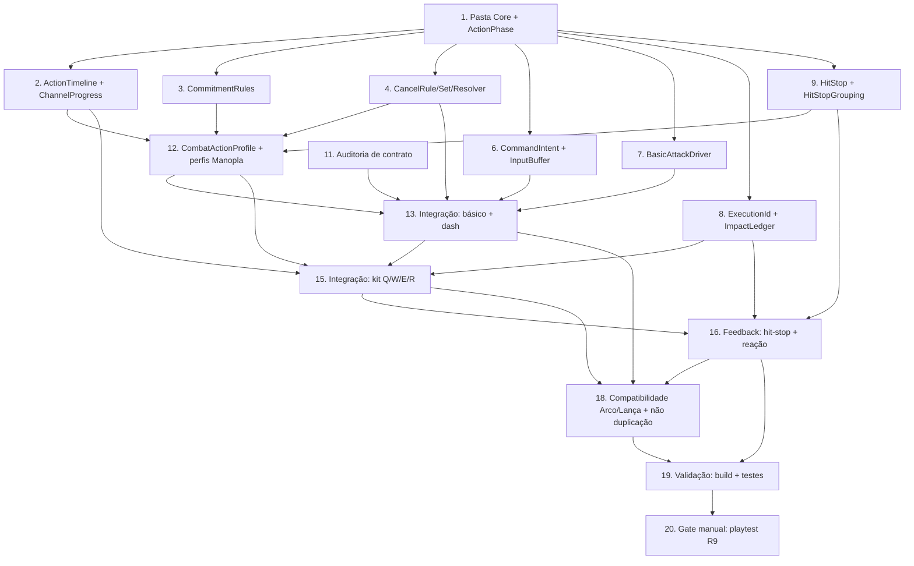

# Implementation Plan: Combat Foundation Rework (Fase 1 — P0)

## Overview

Este plano converte o `design.md` em uma série de passos de codificação incrementais para a **Fase 1 — Combat Foundation**, no padrão **Manopla-first** com um **Núcleo_Compartilhado** reaproveitável. A ordem segue o parecer de implementação (§15) e o escopo Manopla-first do design, entregando **incrementos jogáveis**:

1. Classes puras (sem `MonoBehaviour`) primeiro, cada uma pareada com seu teste EditMode `PropertyCheck`.
2. Auditoria de contrato (R8.3) **antes** de qualquer refactor dos coordenadores.
3. Modelo de dados `CombatActionProfile` autorado nas 5 Ações_Ofensivas da Manopla + dash.
4. Integração do ataque básico + dash da Manopla (primeiro incremento jogável).
5. Integração do kit Q/W/E/R via `ImpactEvent`/`ImpactWindow`.
6. Fundação de feedback de acerto (hit-stop + reação básica).
7. Verificação de compatibilidade (Arco/Lança via fluxo legado ou Adaptador_de_Compatibilidade).
8. Validação/build dos testes.
9. Gate manual de conclusão por playtest (R9).

Convenções do projeto (AGENTS.md): código em `Assets/_Project/Scripts`; classes puras novas em `Assets/_Project/Scripts/Characters/Combat/Core/`; testes EditMode em `Assets/_Project/Scripts/Tests/EditMode/Editor`; testes PlayMode em `Assets/_Project/Scripts/Tests/PlayMode`; harness em `Assets/_Project/Scripts/Tests/Support/PropertyCheck.cs`. Preservar `.meta` e GUIDs; nunca editar GUIDs manualmente. Linguagem: **C# / Unity**.

Cada teste de propriedade segue o padrão de `AdaptiveCadencePropertyTests`: `PropertyCheck.ForAll(...)` com `DefaultCases` (≥100 casos), **uma** propriedade por teste e um comentário no formato `// Feature: combat-foundation-rework, Property N: {texto}`.

## Tasks

- [x] 1. Criar a pasta do Núcleo_Compartilhado e o enum base de fases
  - Criar o diretório `Assets/_Project/Scripts/Characters/Combat/Core/` (a Unity gera os `.meta`; não editar GUIDs).
  - Definir `ActionPhase { Startup, Active, Recovery }` como tipo compartilhado usado por todas as classes puras subsequentes.
  - Garantir que o código novo compila dentro de `Assembly-CSharp` (sem novo asmdef em torno de gameplay).
  - _Requisitos: R2.1, R8.7_

- [x] 2. Implementar `ActionTimeline` e `ChannelProgress` (fases puras) com testes
  - [x] 2.1 Implementar `ActionTimeline` (duração fixa)
    - `struct ActionTimeline` com `StartupEnd`/`ActiveEnd`; construtor clampa `0 <= startupEnd <= activeEnd <= 1`.
    - `PhaseOf(float progress)`: Startup `[0,startupEnd)`, Active `[startupEnd,activeEnd)`, Recovery `[activeEnd,1]`.
    - `static bool Validate(float startupEnd, float activeEnd, out string error)` para validação de editor sem lançar.
    - _Requisitos: R2.1, R2.2, R2.3_
  - [x] 2.2 Implementar `ChannelProgress` (duração variável)
    - `struct ChannelProgress` com `Phase` + `LocalProgress` (clampado a `[0,1]`), sem depender de duração total.
    - _Requisitos: R3.7_
  - [x] 2.3 Escrever `ActionTimelinePropertyTests` (EditMode)
    - **Validates: Propriedade (fases/clamp de R2.2/R2.3)** — monotonicidade de fase e invariante `0 <= StartupEnd <= ActiveEnd <= 1` após construção para quaisquer entradas.
    - _Requisitos: R2.2, R2.3_

- [x] 3. Implementar `CommitmentCategory` + `CommitmentRules` com testes
  - [x] 3.1 Implementar o modelo de compromisso
    - `enum CommitmentCategory { Fluid, Committed, Channel }` e `enum ChannelTerminationMode { Hold, Timed, Condition }`.
    - `CommitmentRules.Resolve(CommitmentCategory? declared, out bool emitWarning)` → declarada quando presente; `Committed` + aviso quando ausente/nula.
    - `CommitmentRules.ClampMovementFraction(float)` → `[0,1]`; sem relações rígidas entre categorias.
    - _Requisitos: R3.1, R3.2, R3.10_
  - [x] 3.2 Escrever `CommitmentRulesPropertyTests` (EditMode)
    - **Propriedade: P16** — devolve a declarada quando presente, `Committed` quando ausente, e emite aviso **se e somente se** ausente.
    - _Requisitos: R3.10_

- [x] 4. Implementar `CancelRule` + `CancelRuleSet` + `CancelResolver` com testes
  - [x] 4.1 Implementar `CancelRule` e `CancelRuleSet`
    - `enum CancelTarget { Dash, Basic, Skill }`; `struct CancelRule` com `Target`/`Start`/`End`; construtor clampa `[0,1]` e força `End >= Start`.
    - `CancelRule.IsOpenAt(progress)` e `static bool Validate(start, end, out error)`.
    - `CancelRuleSet` guarda no máximo uma regra por destino; `TryGet`/`HasRule`; ausência de regra = destino proibido.
    - _Requisitos: R4.1, R4.2, R4.8_
  - [x] 4.2 Implementar `CancelResolver` (único, compartilhado)
    - `delegate bool DestinationAvailability(CancelTarget)`, `enum CancelDecision`, `CancelResolver.Resolve(...)` com a ordenação segura em 4 passos: (1) CancelRule aberta no destino; (2) comando válido; (3) destino disponível; (4) transição viável. Só `Authorized` quando todas passam; `DeniedUnavailable` preserva a ação atual.
    - _Requisitos: R3.3, R4.3, R4.4_
  - [x] 4.3 Escrever `CancelRulePropertyTests` (EditMode)
    - **Propriedade: P5** — para quaisquer `start`/`end`, a regra construída satisfaz `0 <= Start <= End <= 1`, e `Validate` é verdadeiro sse `0 <= start <= end <= 1`.
    - _Requisitos: R4.1, R4.8_
  - [x] 4.4 Escrever `CancelResolverPropertyTests` (EditMode)
    - **Propriedade: P2** — autoriza sse regra existe e aberta, comando válido, destino disponível e transição viável.
    - **Propriedade: P3** — destino sem regra nunca é autorizado para qualquer `progress`.
    - **Propriedade: P4** — regra aberta mas destino indisponível ⇒ `DeniedUnavailable` (ação atual preservada).
    - _Requisitos: R4.2, R4.3, R4.4_

- [x] 5. Checkpoint — garantir que os testes das classes puras de fase/compromisso/cancelamento passam
  - Garantir que todos os testes passam; perguntar ao usuário em caso de dúvidas.

- [x] 6. Implementar `CommandIntent` + `InputBuffer` com testes
  - [x] 6.1 Implementar `CommandIntent`
    - `enum CommandKind { Basic, Dash, Skill1..Skill4 }`; `struct CommandIntent` com `Kind`, `Target` (Actor/null), `Direction`, `IssuedAt`, `Sequence` (desempate determinístico). Alvo/direção capturados no momento da emissão (não re-mira).
    - _Requisitos: R5.2, R5.7_
  - [x] 6.2 Implementar `InputBuffer` (slot único)
    - `BufferDuration` (default `0.120s`; `0` desativa; negativos rejeitados). `Store` substitui o slot (mais recente vence; desempate por `Sequence`). `TryConsume(now, windowOpen, out intent)` dispara no máximo uma vez e descarta expirados (`now - IssuedAt > BufferDuration`). `Expire(now)` para limpeza. `now` é relógio não escalado (não avança em pausa; não consome validade em hit-stop). Não emite rejeição a cada reavaliação.
    - _Requisitos: R5.1, R5.2, R5.3, R5.4, R5.5, R5.6, R5.7, R5.9, R5.10, R5.12_
  - [x] 6.3 Escrever `InputBufferPropertyTests` (EditMode)
    - **Propriedade: P6** — nunca dispara após `now - t0 > BufferDuration`.
    - **Propriedade: P7** — dispara no máximo uma vez e esvazia em seguida.
    - **Propriedade: P8** — retém o mais recente com desempate determinístico por `Sequence`.
    - **Propriedade: P9** — preserva alvo/direção original; nunca re-mira por proximidade.
    - **Propriedade: P10** — comando recusado por recurso/cooldown não fica em espera indefinida.
    - _Requisitos: R5.2, R5.5, R5.6, R5.7, R5.9_

- [x] 7. Implementar `BasicAttackDriver` (sem auto-combate) com testes
  - [x] 7.1 Implementar `BasicAttackDriver`
    - `QueueTap()` (consome em exatamente 1 ataque), `SetHold(bool)`, `TryTakeAttack(now, attackInterval)` (≤1 por tap; a cada intervalo em hold; false sem input), `ReleaseHold()` (sem cortar golpe iniciado), `Clear()` (alvo perdido / Ordem_de_Movimento). A mera existência de alvo não autoriza ataque.
    - _Requisitos: R1.1, R1.3, R1.4, R1.5, R1.6, R1.12_
  - [x] 7.2 Escrever `BasicAttackDriverPropertyTests` (EditMode)
    - **Propriedade: P1** — um único `QueueTap` com `SetHold(false)` e precondições válidas autoriza no máximo um ataque (exatamente um quando a execução conclui).
    - _Requisitos: R1.1, R1.5, R1.6, R1.11, R1.12_

- [x] 8. Implementar `ExecutionId` + `ExecutionImpactLedger` (dedup) com testes
  - [x] 8.1 Implementar identidade e ledger de impacto
    - `struct ExecutionId` (`Value`, `Next()` monotônico por processo); `ExecutionImpactLedger.TryEmit(executionId, eventIndex)` → true apenas na primeira emissão do par, false em repetições.
    - _Requisitos: R8.9_
  - [x] 8.2 Escrever `ExecutionImpactLedgerPropertyTests` (EditMode)
    - **Propriedade: P15** — `TryEmit` é verdadeiro exatamente uma vez por `(ExecutionId, eventIndex)` e falso em qualquer repetição.
    - _Requisitos: R8.9_

- [x] 9. Implementar `HitStop` + `HitStopGrouping` (decisão pura) com testes
  - [x] 9.1 Implementar a decisão de hit-stop
    - `HitStop.ClampDuration(float)` → `[0,1]`; `HitStop.ShouldApply(configuredDuration, enemiesDamaged)` → true sse clampada > 0 **e** `enemiesDamaged >= 1`.
    - `HitStopGrouping.Combine(IReadOnlyList<float>)` → **máximo** clampado, nunca a soma por alvo.
    - _Requisitos: R7.1, R7.2, R7.3, R7.8_
  - [x] 9.2 Escrever `HitStopPropertyTests` (EditMode)
    - **Propriedade: P12** — `ClampDuration` em `[0,1]`; clampada `0` ⇒ `ShouldApply` falso para qualquer `enemiesDamaged`.
    - **Propriedade: P13** — `Combine` segue o máximo clampado, nunca a soma por alvo.
    - **Propriedade: P14** — (preparação) a política de restauração de tempo não fixa incondicionalmente em `1`; o teste de runtime do `HitStopRunner` fica na tarefa 16.
    - _Requisitos: R7.1, R7.2, R7.3, R7.10_

- [x] 10. Checkpoint — garantir que todos os testes de classes puras passam
  - Garantir que todos os testes passam; perguntar ao usuário em caso de dúvidas.

- [x] 11. Auditar e documentar o contrato de eventos/APIs antes de qualquer refactor
  - Auditar emissores e assinantes reais de `BasicAttackPerformed`, `CancelCombo()`, `RequireAttackRelease()`, `AbilityUsed`, `AbilityRejected`, `AttackHitsResolved`, `IsCasting`, `MovementAllowedWhileCasting`, `ReduceCooldowns(float)` e `HookBus.OnBasicHit`, ancorado em `AbilityHolder.cs`, `CharControlScript.cs`, `HookBus` e `BreakerGauntletCombat.cs`.
  - Produzir um registro escrito curto (`.kiro/specs/combat-foundation-rework/contract-audit.md`) com as relações de ordem que os boons realmente usam, para preservar/adaptar explicitamente a semântica observável.
  - _Requisitos: R8.1, R8.2, R8.3, R8.4_

- [x] 12. Adicionar o modelo de dados `CombatActionProfile` e autorar os perfis da Manopla
  - [x] 12.1 Implementar o bloco serializável `CombatActionProfile`
    - `[Serializable]` embutido (sem novo tipo de asset com GUID próprio): `startupEnd`, `activeEnd`, `commitment`, `channelTermination`, `startupMoveFraction`, `activeMoveFraction`, `recoveryMoveFraction`, `cancelRules[]`, `impactEvents[]`, `hitStopProfiles[]`. Modelar `ImpactEvent`/`ImpactWindow` serializáveis referenciando dados existentes (ex.: `AreaHitStep`) por índice/handle, sem duplicar dano/postura/hitbox.
    - `HitStopProfile { duration ([0,1]s); HitStopClass { Intermediate, Finisher, Secondary } }`.
    - _Requisitos: R2.5, R3.1, R4.1, R4.2, R7.2, R7.4, R7.5_
  - [x] 12.2 Expor o perfil nos assets existentes com default retrocompatível
    - `[SerializeField] private CombatActionProfile _combatProfile;` em `Ability` (`Assets/_Project/Scripts/Abilities/Ability.cs`) e `[SerializeField] private CombatActionProfile _basicProfile;` em `WeaponScript` (`Assets/_Project/Scripts/Weapons/WeaponScript.cs`). Preservar GUIDs/`.meta`.
    - `OnValidate` chama `ActionTimeline.Validate` e `CancelRule.Validate`: valores inválidos sinalizados, últimos válidos mantidos (sem mutação silenciosa). Default resolve para `Committed` + aviso.
    - _Requisitos: R2.3, R3.10, R4.8, R8.7_
  - [x] 12.3 Autorar os 5 perfis da Manopla + dash
    - Preencher `CombatActionProfile` do ataque básico e de Q/W/E/R da Manopla + perfil de dash (fronteiras de fase, categoria, `cancelRules`, `impactEvents`, `hitStopProfiles`). Arco/Lança permanecem com perfil default (resolvido `Committed` + aviso).
    - _Requisitos: R2.8, R3.1, R4.1_
  - [x] 12.4 Escrever teste de smoke/exemplo dos perfis (EditMode)
    - Cada perfil autorado da Manopla produz `ActionTimeline`/`CancelRuleSet` válidos; perfil não autorado resolve para `Committed` + aviso; `BufferDuration` default `0.120` e `0` desativa.
    - _Requisitos: R2.8, R3.10, R5.1_

- [x] 13. Integração — ataque básico + dash da Manopla (primeiro incremento jogável)
  - [x] 13.1 Remover o auto-combate persistente em `CharControlScript`
    - Refatorar `FollowTarget()`/`TryAttackTarget()`: `FollowTarget` continua movendo até `EffectiveAttackRange`, mas não dispara ataque sozinho; `TryAttackTarget` só executa `TryBasicAttack` quando `BasicAttackDriver.TryTakeAttack(...)` autoriza e o alvo é alcançável. Alvo perdido ⇒ `BasicAttackDriver.Clear()` + `ClearTarget()`. `Alvo_Interno` apenas para facing/aim.
    - _Requisitos: R1.1, R1.6, R1.7, R1.12_
  - [x] 13.2 Ligar os três comandos e a Zona_Morta_de_Movimento
    - `Ataque_Alvo` (inimigo elegível sob o cursor; no-op total se nenhum, sem seleção por proximidade); `Ataque_Direcional` reutilizando `TryDirectionalBasicAttack` (Shift+ataque, sem auto-aproximação); `Ordem_de_Movimento` via `MoveToPosition` fora da deadzone (`_movementClickDeadZone`, `WorldClickResolver.IsNearPlayer`), substituindo intenção pendente; clique na deadzone preserva a intenção corrente.
    - _Requisitos: R1.2, R1.9, R1.10, R1.11_
  - [x] 13.3 Alimentar tap/hold reaproveitando o hold-tracking existente
    - `QueueTap()` no toque e `SetHold(primaryHeld)` reutilizando o rastreamento de `TrackChargedShot`/`_primaryHeldSeconds`/`_primaryHeldLast`. `ReleaseHold()` ao soltar após Hold (sem cortar golpe iniciado); soltar após Tap preserva a execução. Disparar `BasicAttackPerformed` conforme contrato.
    - _Requisitos: R1.3, R1.4, R1.5, R1.8, R5.11_
  - [x] 13.4 Substituir o bloqueio total de `CheckUse` pelo `CancelResolver`
    - Em `AbilityHolder.CheckUse`, trocar `if (IsCasting || isDashing) return Reject(Busy)` por consulta ao `CancelResolver` contra o `CancelRuleSet` da ação ativa: `Authorized` cancela (`ArsenalCombat.Cancel()`/`BreakerGauntletCombat.FinishForDodge()`) e prossegue; `DeniedUnavailable` mantém a ação sem alterar fase e rejeita uma vez; impedimento temporal ⇒ bufferiza. Preservar valores observáveis de `IsCasting`/`MovementAllowedWhileCasting`.
    - _Requisitos: R4.4, R4.6, R4.7, R5.2, R5.8_
  - [x] 13.5 Rotear `TryUseDash` pelo `CancelResolver`
    - Generalizar `FinishForDodge` para dentro do `CancelResolver`: cooldown/indisponível ⇒ `Reject(4, Cooldown)` **antes** de cancelar a fonte, preservando o cooldown; `Authorized` cancela e inicia dash com meta ≤50 ms a partir de input elegível; temporal ⇒ bufferiza e executa no 1º quadro em que a regra de Dash abrir; fora da janela ⇒ `Reject` uma vez; sucesso ⇒ `AbilityUsed(4)` + `Hooks.RaiseDash()` uma vez. `IframeWindow` independente de `DisplacementDuration`; imunidade cessa em cancel/morte/mudança de sala/fim do deslocamento, sem resíduo.
    - _Requisitos: R6.1, R6.2, R6.3, R6.4, R6.5, R6.6, R6.7, R6.8, R6.9_
  - [x] 13.6 Escrever testes de integração PlayMode para R1
    - Alvo no alcance + sem input ⇒ 0 `BasicAttackPerformed` por N frames; `Ataque_Alvo` ⇒ exatamente 1; Hold ⇒ repetições em `attackInterval`; soltar/alvo perdido cessa e limpa sem cortar golpe iniciado; `Ataque_Direcional` sem aproximar; `Ordem_de_Movimento` fora da deadzone move e limpa, dentro preserva; sem elegível ⇒ no-op.
    - _Requisitos: R1.1, R1.2, R1.3, R1.4, R1.5, R1.9, R1.10, R1.11_
  - [x] 13.7 Escrever testes de integração PlayMode para R4/R6 (dash)
    - Dash atravessa o `CancelResolver`; buffer antes da janela executa no 1º quadro; fora da janela ⇒ `AbilityRejected` 1x sem mudar fase; em cooldown ⇒ `Reject(Cooldown)` 1x com cooldown inalterado; i-frames independentes do deslocamento sem resíduo; sucesso ⇒ `OnDash` 1x; `IsCasting`/`MovementAllowedWhileCasting` preservam semântica.
    - _Requisitos: R4.6, R6.2, R6.3, R6.4, R6.5, R6.6, R6.7, R6.8, R6.9_

- [x] 14. Checkpoint — ataque básico + dash da Manopla jogáveis e testados
  - Garantir que todos os testes passam; perguntar ao usuário em caso de dúvidas.

- [x] 15. Integração — kit Q/W/E/R da Manopla via ImpactEvent/ImpactWindow
  - [x] 15.1 Fonte única de avanço + sincronização de animação
    - Avançar `ActionTimeline`/`ChannelProgress` em uma **única fonte** em `FixedUpdate`; emitir cada `ImpactEvent`/abrir cada `ImpactWindow` em Active dentro de ≤1 Quadro_de_Simulacao; fechar windows e cessar emissões ao entrar em Recovery; devolver controle ao fim de Recovery em ≤1 Quadro_de_Simulacao. Animation Events apenas sinalizam e passam por `ExecutionImpactLedger.TryEmit` (sem duplicar).
    - _Requisitos: R2.4, R2.5, R2.6, R2.7, R8.9_
  - [x] 15.2 Reportar `(ActionPhase, localProgress)` dos executores ao núcleo
    - `ArsenalCombat`/`BreakerGauntletCombat` reportam fase + progresso local ao Núcleo_Compartilhado; ler `CombatActionProfile` da habilidade para montar `ActionTimeline`/`ChannelProgress`, `CancelRuleSet` e `CommitmentCategory` em `TryUseAbility`/tick.
    - _Requisitos: R2.5, R3.1, R3.2, R8.8_
  - [x] 15.3 Terminação de Channel (Hold) e preservação da Rajada Asura
    - Channel Hold sustenta enquanto o controle está pressionado e transiciona para Recovery ao soltar; CancelRule de destino Dash cobrindo Active expressa cancelabilidade por dash sem exceção oculta; preservar o controle atual da Rajada Asura (R).
    - _Requisitos: R3.6, R3.8, R3.9_
  - [x] 15.4 Escrever testes de integração PlayMode para R2/R3 e o kit da Manopla
    - Ao cruzar `startupEnd`, ImpactEvents de Active emitem/abrem windows em ≤1 FixedUpdate; ao cruzar `activeEnd`, fecham e nada futuro emite; Q (avanço+2 socos), W (sequência+finalizador), E (2 impactos), R (rajada+finalizador circular) emitem o esperado; soltar Channel Hold ⇒ Recovery; Rajada Asura preserva controle; dedup lógico+Animation Event.
    - _Requisitos: R2.5, R2.6, R2.7, R2.8, R3.6, R3.9, R8.9_

- [x] 16. Integração — fundação de feedback de acerto (hit-stop + reação básica)
  - [x] 16.1 Implementar `HitStopRunner` (MonoBehaviour fino) e ligá-lo aos ImpactEvents
    - `HitStopRunner.Apply(duration)` em tempo real; `duration == 0` não toca `Time.timeScale`; ao terminar, restaura a escala respeitando pausa e demais modificadores (não fixa em `1`). Ao resolver dano por ImpactEvent (via `TryApplyAreaDamage`/projétil), consultar `HitStop.ShouldApply`/`HitStopGrouping.Combine` e aplicar **uma vez por ImpactEvent/grupo**.
    - _Requisitos: R7.1, R7.2, R7.3, R7.4, R7.5, R7.10_
  - [x] 16.2 Ligar a Reação_de_Acerto_Básica cosmética
    - Reutilizar `HitReactionRequest` com `StanceBreakEffect.None` (como `BuildBasicAttackReaction`): exatamente uma reação por acerto, encerra ao fim da duração serializada, não interrompe a IA, distinta de stagger mecânico; elite/boss não interrompidos por reação básica; sem dano ⇒ sem hit-stop/sem reação; não ampliar nem remover reações de postura existentes (ex.: stun do E).
    - _Requisitos: R7.6, R7.7, R7.8, R7.9, R7.11_
  - [x] 16.3 Escrever testes de integração PlayMode para R7
    - Acerto ⇒ 1 hit-stop por ImpactEvent/grupo independente do nº de inimigos; 1 reação cosmética que não interrompe a IA e encerra no tempo; elite/boss não interrompidos; sem dano ⇒ sem feedback; nenhum knockdown/launch/flash; timescale preservada ao término; `HookBus.OnBasicHit`/`AttackHitsResolved` na granularidade do contrato.
    - _Requisitos: R7.1, R7.3, R7.6, R7.7, R7.8, R7.9, R7.10, R7.11_

- [x] 17. Checkpoint — garantir que básico, dash, kit e feedback passam nos testes
  - Garantir que todos os testes passam; perguntar ao usuário em caso de dúvidas.

- [x] 18. Verificação de compatibilidade de Arco/Lança e não duplicação
  - [x] 18.1 Adaptador_de_Compatibilidade onde o núcleo interage com Arco/Lança
    - Adaptador fino que traduz o estado do executor legado para `(ActionPhase, localProgress)` + `CancelRuleSet` mínimo (ex.: cancelamento por dash durante um cast de Arco), sem forçar migração completa; documentar o adaptador e qualquer mudança do núcleo que afete Arco/Lança (verificação de regressão proporcional).
    - _Requisitos: R2.8, R2.9, R8.8_
  - [x] 18.2 Garantir não duplicação de custos e projétil pós-cancel
    - Reavaliação de buffer/transição por cancelamento marca a execução uma única vez (ledger/consumo), sem duplicar custo, cooldown, geração de energia Asura nem procs; ação cancelada antes de emitir um ImpactEvent não dispara `AttackHitsResolved`/`HookBus.OnBasicHit` desse evento; projétil emitido antes do cancelamento pode acertar depois conforme sua própria vida.
    - _Requisitos: R8.5, R8.6_
  - [x] 18.3 Escrever testes de regressão/compatibilidade (PlayMode)
    - Arco/Lança continuam equipando, movendo, atacando, usando habilidades e dash sem regressão; sem duplicar Asura/procs/cooldowns em transição por cancelamento ou reavaliação de buffer; projétil já lançado ainda acerta após cancel.
    - **Propriedade: P11** — não duplicação de custos por execução (via ledger/consumo).
    - _Requisitos: R2.8, R8.5, R8.6_

- [x] 19. Validação — compilar e rodar os testes EditMode + PlayMode
  - Compilar o projeto e executar a suíte EditMode (classes puras + smoke) e PlayMode (integração) via Unity Test Runner ou CLI (`-runTests -batchmode -testPlatform EditMode|PlayMode`). Limpar quaisquer artefatos temporários criados durante a validação.
  - Se o Unity não puder ser executado neste ambiente, validar por inspeção da estrutura do projeto, busca de referências em `.unity`/`.prefab`/`.asset`/`.meta` e `git diff`, reportando claramente quais testes não foram executados (AGENTS.md).
  - _Requisitos: R8.1, R8.2, R8.7_

- [x] 20. Gate manual de conclusão — playtest da Manopla sem boons (não automatizado)
  - **Verificação manual que NÃO pode ser satisfeita apenas por testes automatizados.** Executar um playtest da Manopla sem boons em sandbox com 3–5 inimigos, acesso a Q/W/E/R e reinício rápido, incluindo múltiplos acertos, uma aproximação a inimigo e um dash durante uma ação, em sessão de ~10 min, com condições e observações **registradas**. Confirmar mana/energia Asura sob as condições atuais com a Rajada Asura (R) alcançável, sem remover mana silenciosamente.
  - Se o projeto apenas compila e os testes passam mas este playtest não foi executado e registrado, a Fase 1 **não** é considerada concluída.
  - _Requisitos: R9.1, R9.2, R9.3, R9.4_

## Notes

- Tarefas marcadas com `*` são testes e podem ser puladas para um MVP mais rápido, mas são fortemente recomendadas (as propriedades P1–P16 do design dependem delas).
- Cada tarefa referencia requisitos específicos (números revisados de `requirements.md`) para rastreabilidade; tarefas de teste referenciam a propriedade de design correspondente.
- As classes puras (tarefas 1–9) são `MonoBehaviour`-free e testáveis sem cena, comprovando a separação de camadas exigida por R8.7.
- A auditoria de contrato (tarefa 11) ocorre **antes** de qualquer refactor dos coordenadores (R8.3).
- Os incrementos jogáveis seguem a ordem do parecer §15: básico+dash (13) → kit Q/W/E/R (15) → feedback (16).
- O gate de playtest (tarefa 20) é manual e obrigatório para concluir a Fase 1 (R9).

## Task Dependency Graph



```json
{
  "waves": [
    { "wave": 1, "tasks": ["1"] },
    { "wave": 2, "tasks": ["2", "3", "4", "6", "7", "8", "9", "11"] },
    { "wave": 3, "tasks": ["12"] },
    { "wave": 4, "tasks": ["13"] },
    { "wave": 5, "tasks": ["15"] },
    { "wave": 6, "tasks": ["16"] },
    { "wave": 7, "tasks": ["18"] },
    { "wave": 8, "tasks": ["19"] },
    { "wave": 9, "tasks": ["20"] }
  ]
}
```

Observações sobre o grafo:
- As classes puras (2, 3, 4, 6, 7, 8, 9) dependem apenas da tarefa 1 e podem ser desenvolvidas **em paralelo**.
- A auditoria de contrato (11) é independente das classes puras e pode correr em paralelo a elas, mas deve preceder qualquer refactor de coordenador (13).
- O modelo de dados (12) depende das classes puras de fase/compromisso/cancelamento/hit-stop.
- Os incrementos de integração (13 → 15 → 16) são **sequenciais** por serem incrementos jogáveis encadeados.
- Compatibilidade (18) e validação (19) seguem a integração; o gate manual (20) encerra a Fase 1.
