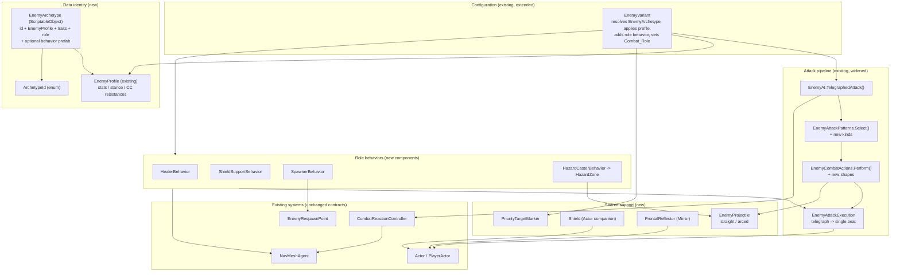

# Design Document

## Overview

This feature adds the **core set of 16 enemy archetypes** for Tech-Guy's swarm combat. The guiding constraint is that we **extend** the existing enemy stack rather than replace it. The current stack already gives us almost everything we need:

- `EnemyAI` — NavMeshAgent perception/chase/patrol plus a single telegraphed attack coroutine.
- `EnemyCombatActions` + `EnemyAttackExecution` — the cancellable telegraph → single damage beat pipeline, projectile travel-over-frames, and runtime effect cleanup.
- `EnemyAttackPatterns` / `EnemyAttackKind` / `EnemyAttackTraits` — the attack-selection extension point.
- `EnemyProfile` (ScriptableObject) + `EnemyVariant` — stat/stance configuration.
- `CombatReactionController` — the Lost Ark stance/stagger/stance-break → Stun/KnockUp/Knockback model.
- `Actor` / `PlayerActor` — health, damage, events.
- `EnemyRespawnPoint` — NavMesh-sampled instantiation.
- `CombatGroundRing` — reusable world-space outline used for every telegraph.

An **archetype** is the tuple *(AI behavior + `EnemyProfile` + one or more telegraphs + one primary `Combat_Role`)*. The design introduces a thin **archetype layer** that sits between `EnemyVariant` and the existing attack pipeline:

1. A **data identity** (`EnemyArchetype` ScriptableObject with an `ArchetypeId`) that `EnemyVariant` resolves at configure time.
2. New **`EnemyAttackKind`** values (aim line, spread cone, arced lob, hook line, hazard placement) plus a widened `EnemyAttackPatterns.Select` so the *attack-shaped* archetypes (Sniper, Spread_Shooter, Bomber, Hooker, Hazard_Caster, Charger) flow through the existing coroutine unchanged.
3. New **behavior components** for the *non-attack* roles that the attack coroutine can't express: `HealerBehavior`, `ShieldSupportBehavior`, `SpawnerBehavior`, plus support types (`HazardZone`, `EnemyProjectile`, `Shield`, `FrontalReflector`, `PriorityTargetMarker`).

Three cross-cutting rules from requirements 2, 20, 21 are enforced structurally, not per-archetype: **telegraph before damage** (all damage flows through `EnemyAttackExecution`, min windup 0.25s), **NavMesh-only locomotion** (all movement through the existing agent; no direct transform writes), and **priority legibility** (a marker component keyed off `Combat_Role`).

### Research notes / key findings

- **`Actor` has no shield and no heal-by-amount API.** It exposes only `RestoreHealthToMax()`, `SetMaxHealth`, and a *multiplicative* `SetDamageTakenMultiplier`. Requirements 13 (Healer) and 14 (Shield_Support) cannot be met with existing APIs: a multiplier can't model an *absorb buffer that is consumed before health* (R14.3), and there is no way to restore a *fixed amount* (R13.3). This design therefore specifies **two additive changes to `Actor`**: a `Heal(float amount)` entry point and a small **`Shield` companion component** that intercepts incoming damage before `Actor.health` is reduced. Rationale and exact shape are in *Components and Interfaces → Actor changes*.
- **The player is NavMeshAgent-driven** (`CharControlScript` point-and-click). The Hooker's pull (R12) therefore cannot just add a Rigidbody force; it needs a small **player-side displacement entry point** that temporarily warps/moves the player agent and returns control within ≤1.5s. Detailed below.
- **`EnemyAttackExecution` already implements every telegraph invariant** we need (min 0.25s windup, color lerp toward white = intensify, per-frame `canAttack()` cancel, single damage beat over the union of areas). New attack shapes reuse it verbatim by supplying different `EnemyAttackArea[]` and `animateWindup` callbacks.
- **`CombatReactionController` control lock stops the agent**, and `EnemyAI.Update` already treats a stopped agent / `IsControlLocked` as "cannot act." Non-attack behaviors get the same interrupt semantics for free by checking `IsControlLocked` before acting.

## Architecture

The archetype layer is additive. Attack-shaped archetypes need **no new MonoBehaviour** — they are pure data (`EnemyArchetype` + `EnemyProfile`) driving widened enum selection. Role behaviors that the attack coroutine cannot express are isolated in dedicated components that reuse `EnemyAttackExecution` for their telegraphs and the existing agent for movement.



### How an archetype is driven at runtime

1. **Spawn** — `EnemyRespawnPoint` instantiates the enemy prefab and (optionally) applies rank, exactly as today.
2. **Configure** — `EnemyVariant.ApplyProfile()` (extended) resolves the assigned `EnemyArchetype`, applies its `EnemyProfile` through the existing paths (`_actor.SetMaxHealth`, `_ai.ConfigureAttack`, `_ai.ConfigureAttackTraits`, `reaction.ConfigureStance`, `agent.speed`), records the `Combat_Role`, ensures the role behavior component exists (attack-shaped archetypes need none), and adds a `PriorityTargetMarker` when the role is a `Priority_Target`.
3. **Act** — for attack-shaped archetypes, `EnemyAI.TelegraphedAttack()` runs unchanged; `Select()` returns the archetype's kind and `Perform()` executes it. For role behaviors, the component runs its own coroutine/timer, gated on `!reaction.IsControlLocked` and on agent validity, and uses `EnemyAttackExecution` for any telegraph.

## Components and Interfaces

### 1. Archetype identity (Requirement 1.5, 1.7)

**Recommendation: an `EnemyArchetype` ScriptableObject keyed by an `ArchetypeId` enum, resolved through a serialized reference on `EnemyVariant` (or the archetype's `EnemyProfile`).** Not a scene lookup, not a registry singleton.

Justification:
- **No `GameObject.Find` / `FindObjectOfType`** (R1.5, AGENTS.md): the archetype asset is a serialized reference on the prefab/profile, resolved with plain field access.
- **No new global state / singleton** (AGENTS.md): each enemy carries its own archetype reference; there is no shared mutable registry.
- **A ScriptableObject bundles the whole tuple** — id + `EnemyProfile` + default `EnemyAttackTraits` + `Combat_Role` + an optional behavior-prefab reference — so authoring one enemy is one asset, matching the "data-plus-behavior unit" phrasing of R1.1.
- **The `ArchetypeId` enum** gives a stable, magic-string-free identifier for logging, safe-default fallback, and switch-based behavior wiring (R1.7).

```csharp
public enum ArchetypeId
{
    Rush, Grunt, Heavy, Charger,               // Melee
    Shooter, SpreadShooter, Sniper, Bomber,    // Ranged
    HazardCaster, Hooker,                       // Control
    Healer, ShieldSupport,                      // Support
    Swarm, Spawner,                             // Swarm
    Fragile, Mirror                             // Special
}

public enum CombatRole
{
    MeleePressure, RangedPressure, TerritoryControl, PlayerDisplacement,
    AllySupport, SwarmFuel, PriorityThreat, ComboFodder, ProjectileDenial
}

[CreateAssetMenu(menuName = "Tech Guy/Enemies/Archetype")]
public sealed class EnemyArchetype : ScriptableObject
{
    [SerializeField] private ArchetypeId _id;
    [SerializeField] private EnemyProfile _profile;
    [SerializeField] private EnemyAttackTraits _traits;
    [SerializeField] private CombatRole _primaryRole;
    [Tooltip("Optional role-behavior component prefab for non-attack roles (Healer, ShieldSupport, Spawner, HazardCaster). Attack-shaped archetypes leave this empty.")]
    [SerializeField] private ArchetypeBehavior _behaviorTemplate;

    public ArchetypeId Id => _id;
    public EnemyProfile Profile => _profile;
    public EnemyAttackTraits Traits => _traits;
    public CombatRole PrimaryRole => _primaryRole;
    public ArchetypeBehavior BehaviorTemplate => _behaviorTemplate;
    public bool IsPriorityTarget =>
        _primaryRole == CombatRole.AllySupport || _primaryRole == CombatRole.PriorityThreat;
}
```

**Resolution & safe default (R1.7):** `EnemyVariant` holds `[SerializeField] private EnemyArchetype _archetype;`. At configure time:
- If `_archetype == null` → log an error naming the enemy and fall back to a **Grunt-equivalent safe default** (baseline profile, `CombatRole.MeleePressure`, no behavior component), never throwing.
- Because the id lives inside a single referenced asset, "resolves to more than one definition" is structurally impossible for a single reference; the guard still validates that a resolved archetype's `Id` matches the expected set and logs + falls back otherwise. If a future project-wide catalog is introduced, the same guard covers duplicate ids.

### 2. Behavior selection

Two mechanisms, chosen by whether the behavior fits the "telegraph → damage beat" shape:

**(a) Attack-shaped → extend `EnemyAttackKind` + `EnemyAttackPatterns.Select`.** New kinds:

```csharp
public enum EnemyAttackKind
{
    Punch, DoublePunch, HeavySlam, Charge, FrostBolt, Shockwave, // existing
    AimedShot,   // Shooter: single straight projectile after >=0.25s telegraph
    SpreadShot,  // Spread_Shooter: >=3 projectiles, equal angular spacing, fixed cone
    SniperShot,  // Sniper: aim-line telegraph >=1.0s, high damage, long interval
    LobShot,     // Bomber: arced projectile + ground impact telegraph
    HookLine,    // Hooker: line telegraph -> pull on connect
    HazardPlace  // Hazard_Caster: placement telegraph -> spawns HazardZone
}
```

`EnemyAttackPatterns.Select` gains an `ArchetypeId` (or a dedicated `EnemyAttackProfile`) parameter so distance/traits still choose the concrete kind, but the archetype narrows the repertoire (e.g. a Sniper only ever returns `SniperShot`). `EngagementRange` is extended per archetype so `EnemyAI` perception opens the attack at the right distance band (long for Sniper, medium for Shooter, melee for Rush/Grunt/Heavy). `EnemyCombatActions.Perform` gains one `case` per new kind, each reusing `EnemyAttackExecution` and, for projectiles, the new `EnemyProjectile`.

**(b) Non-attack role → dedicated behavior component.** Abstract base `ArchetypeBehavior : MonoBehaviour` gives the shared plumbing (dependency validation in `Awake`/`OnValidate`, `IsControlLocked` gate, agent-validity gate, `EnemyAttackExecution` telegraph helper). Concrete: `HealerBehavior`, `ShieldSupportBehavior`, `SpawnerBehavior`, `HazardCasterBehavior`. These are thin MonoBehaviours delegating to plain state/timer logic (AGENTS.md), driven by coroutines/timers, not heavy `Update`.

```csharp
[RequireComponent(typeof(Actor), typeof(EnemyAI))]
public abstract class ArchetypeBehavior : MonoBehaviour
{
    protected Actor Owner { get; private set; }
    protected EnemyAI Ai { get; private set; }
    protected NavMeshAgent Agent { get; private set; }
    protected CombatReactionController Reaction { get; private set; }

    protected virtual void Awake()
    {
        Owner = GetComponent<Actor>();
        Ai = GetComponent<EnemyAI>();
        Agent = GetComponent<NavMeshAgent>();
        Reaction = GetComponent<CombatReactionController>();
        LogMissingDependencies(); // R1.6
    }

    /// <summary>True when the behavior may issue movement / actions this frame (R2.4, R20.2, R20.5).</summary>
    protected bool CanAct =>
        isActiveAndEnabled && Owner && !Owner.IsDead &&
        Agent && Agent.enabled && Agent.isOnNavMesh &&
        (!Reaction || !Reaction.IsControlLocked);

    protected abstract void LogMissingDependencies();
}
```

### 3. Reusable projectile (Requirement 19)

`EnemyProjectile` generalizes the existing `FrostBolt` pattern (travel over frames via `ClipTravel`/`SegmentContains`, single-hit, cleanup of runtime material). It is a plain driver spawned and owned by `EnemyCombatActions` / `HazardCasterBehavior`, not authored per-shot.

```csharp
public sealed class EnemyProjectile : MonoBehaviour
{
    public enum PathKind { Straight, Arced }
    // Configured with: owner Actor, target Actor, damage, speed, range,
    // radius, PathKind, optional groundImpactRadius (arced), color.
    // Straight: moves forward; SegmentContains(target) -> TakeDamage once -> destroy.
    // Arced: parabola to a ground point; on land, single area check over impact radius.
    // Cleanup: destroys its runtime material/effect on destroy (R19.5); owner death/disable
    // marks all in-flight projectiles for destruction (R19.6) via owner.Died / OnDisable.
}
```

Behavior mapping to R19: multi-frame travel (R19.1), single overlap damage + mark-for-destruction (R19.2), range exhaustion cleanup (R19.3), geometry block cleanup (R19.4), same-frame destroy + material release (R19.5), owner-death cascade (R19.6). Straight serves Shooter/Spread_Shooter/Sniper; Arced serves Bomber; the arced ground telegraph reuses `CombatGroundRing` and intensifies over travel (R10.4).

### 4. Actor changes (Requirements 13, 14) — REQUIRED additive change

`Actor` is extended with a **heal-by-amount** entry point and a **shield hook**. This is called out explicitly because it modifies core `Actor`; it is purely additive and preserves existing behavior.

```csharp
// Actor additions:
public void Heal(float amount)            // R13.3: fixed restore, clamped to maxHealth, no-op if dead
// TakeDamage(amount) gains a pre-step: incoming damage is first offered to an attached Shield
// (if any); only the remainder reduces health. Shield is consumed before health (R14.3).
```

**`Shield` companion component** (attached to the ally by `ShieldSupportBehavior`):

```csharp
public sealed class Shield : MonoBehaviour
{
    // capacity + expiry. Absorb(amount) returns leftover damage after the buffer.
    // Depletes on absorb; self-removes at capacity 0 or on expiry (R14.3).
}
```

`Actor.TakeDamage` calls `Shield.Absorb` before reducing `health` when a `Shield` is present. This is the minimal correct approach: a multiplicative `SetDamageTakenMultiplier` cannot model a finite absorb buffer, and intercepting only in `TakeDamage` keeps the shield invisible to every other system. Healing routes through `Heal(amount)` so R13's fixed-amount, clamp-to-max restore is expressible (today only full restore exists).

### 5. Role behaviors

- **`HealerBehavior` (R13):** timer-driven heal every 1.0–3.0s to the most-wounded ally within heal range (4–8m); draws a beam/tether (`LineRenderer`, reused ring/line helper) while channeling; flees from the player within flee range (2–5m, strictly < heal range) by picking a NavMesh-reachable point *away* from the player; stops channel on control lock/stance break (subscribes to `CombatReactionController.StanceBroken` / checks `IsControlLocked`). Ally discovery uses serialized group references or an overlap query filtered to enemy `Actor`s (no `FindObjectOfType`). Priority marker added by `EnemyVariant`.
- **`ShieldSupportBehavior` (R14):** channels ≥0.25s (telegraph via `EnemyAttackExecution`), stays stationary during channel, and on completion grants a `Shield` to each ally within support range (4–10m); interrupted channel grants nothing.
- **`SpawnerBehavior` (R16):** on a spawn-interval timer, spawns Swarm enemies through an `EnemyRespawnPoint`-style NavMesh-sampled instantiation up to a living cap (1–100); tracks living count by subscribing to each spawned Swarm's `Actor.Died`; decrements on death; stops on its own death; NavMesh sample failure skips the attempt and retries next interval. Persistent priority marker while alive.
- **`HazardCasterBehavior` (R11):** on cadence, telegraphs a placement (≥0.25s) then activates a `HazardZone` of the configured variant.

`HazardZone` (fire/electric/slow, periodic damage 0.25–1.0s, slow apply/restore, lifetime 3–15s):

```csharp
public sealed class HazardZone : MonoBehaviour
{
    public enum ZoneKind { Fire, Electric, Slow }
    // Fire/Electric: while PlayerActor inside, damage once per interval; stop on exit.
    // Slow: reduce PlayerActor speed by 20-60% on enter; restore exact pre-slow value on exit.
    // Lifetime timer removes the zone. Trigger volume + interval timer, not heavy Update.
}
```

- **Hooker pull (R12):** `HookLine` telegraphs a line (≥ Grunt melee windup), fires along the locked direction, and if the player is within hook-line tolerance (0.5–1.5m) invokes a **player-side displacement entry point** (`PlayerActor.BeginExternalPull(target, maxDuration)`) that suspends `CharControlScript` agent steering, moves the player agent toward the Hooker over a bounded ≤1.5s, then restores control. Control is also restored if the Hooker becomes control-locked mid-pull. Because the player is agent-driven, the pull uses `agent.Warp`/`Move` steps, never a raw transform write.
- **`FrontalReflector` (Mirror, R18):** holds the protected arc (90–180°). It cooperates with the projectile/damage path: a **player projectile** striking from within the frontal arc has ≤25% of its damage applied; hits from outside the arc and **area** attacks apply full damage. On stance break the reflector disables for the CC duration and re-enables on regaining control (driven by `StanceBroken` + `IsControlLocked`). A persistent visual communicates the arc.
- **`PriorityTargetMarker` (R21):** persistent, tooltip-free indicator added whenever `EnemyArchetype.IsPriorityTarget`. A distinct **role-action cue** (separate from the persistent marker) shows while the priority enemy heals/shields/spawns and ends when the action ends. Both removed within the same frame on death.

## Data Models

### New / extended types

| Type | Kind | Purpose |
|---|---|---|
| `ArchetypeId` | enum | Stable identifier for the 16 archetypes (R1.5). |
| `CombatRole` | enum | The 9 primary roles (R22.1). |
| `EnemyArchetype` | ScriptableObject | id + `EnemyProfile` + traits + primary role + optional behavior template (R1.1). |
| `EnemyAttackKind` (extended) | enum | + `AimedShot, SpreadShot, SniperShot, LobShot, HookLine, HazardPlace`. |
| `EnemyProfile` (existing) | ScriptableObject | One authored asset per archetype (16 assets). |
| `ArchetypeBehavior` | abstract MonoBehaviour | Shared behavior plumbing (deps, control-lock/agent gates). |
| `HealerBehavior`, `ShieldSupportBehavior`, `SpawnerBehavior`, `HazardCasterBehavior` | MonoBehaviour | Non-attack role behaviors. |
| `EnemyProjectile` | MonoBehaviour | Reusable straight/arced projectile (R19). |
| `HazardZone` | MonoBehaviour | Fire/electric/slow persistent zone (R11). |
| `Shield` | MonoBehaviour | Absorb buffer consumed before health (R14). |
| `FrontalReflector` | MonoBehaviour | Mirror frontal-arc reflect/reduce (R18). |
| `PriorityTargetMarker` | MonoBehaviour | Persistent priority indicator + role-action cue (R21). |
| `Actor` (extended) | MonoBehaviour | `Heal(float)`; `TakeDamage` offers damage to `Shield` first. |
| `PlayerActor` (extended) | MonoBehaviour | `BeginExternalPull(...)` bounded displacement (R12). |
| `EnemyVariant` (extended) | MonoBehaviour | Resolves `EnemyArchetype`, wires behavior + marker + role. |

### The 16 archetypes

Profile numbers are **relative to the Grunt baseline of 1.0** unless an absolute value is stated. "Windup" is the `EnemyAttackExecution` telegraph duration.

| Archetype | Id | Role | Profile shape (vs Grunt 1.0) | Attack / behavior | Telegraph |
|---|---|---|---|---|---|
| **Rush** | Rush | Melee-Pressure | movement > 1.0, health < 1.0, staggerRes = 0 | `Punch` via Combat_Actions | < Grunt windup |
| **Grunt** | Grunt | Melee-Pressure | all = 1.0, all CC res = 0 | `Punch` | ≥ 0.4s |
| **Heavy** | Heavy | Melee-Pressure | health > 1.0, movement < 1.0, staggerRes > 0, maxStance > Grunt | `HeavySlam` + ground-pound (`Shockwave`) | ≥ 0.4s ground area |
| **Charger** | Charger | Melee-Pressure | movement ≥ 1.0 (distinct from other melee) | `Charge` (locked dir, single hit) | ≥ 0.4s lane |
| **Shooter** | Shooter | Ranged-Pressure | standoff + firing range band | `AimedShot` (straight `EnemyProjectile`) | ≥ 0.25s |
| **Spread_Shooter** | SpreadShooter | Ranged-Pressure | medium range | `SpreadShot` (≥3 projectiles, fixed cone) | ≥ 0.25s |
| **Sniper** | Sniper | Ranged-Pressure | firing range > Shooter; damage > Grunt; interval > Shooter | `SniperShot` (aim line) | ≥ 1.0s, intensifies |
| **Bomber** | Bomber | Ranged-Pressure | medium/long range | `LobShot` (arced + ground area) | ground area full flight |
| **Hazard_Caster** | HazardCaster | Territory-Control | ranged standoff | `HazardPlace` → `HazardZone` | ≥ 0.25s placement |
| **Hooker** | Hooker | Player-Displacement | medium range | `HookLine` → pull ≤1.5s | ≥ Grunt melee windup, line |
| **Healer** | Healer | Ally-Support (Priority) | maxHealth 0.3–0.7 | `HealerBehavior` (heal + flee) | heal beam while channeling |
| **Shield_Support** | ShieldSupport | Ally-Support (Priority) | fragile-ish | `ShieldSupportBehavior` (grant `Shield`) | ≥ 0.25s channel, stationary |
| **Swarm** | Swarm | Swarm-Fuel | maxHealth ≤ 25% of Grunt | chase; dies to one light hit | melee (minimal) |
| **Spawner** | Spawner | Priority-Threat (Priority) | stationary-ish | `SpawnerBehavior` (cap 1–100) | persistent priority marker |
| **Fragile** | Fragile | Combo-Fodder | maxStance 1–60, knockUpRes = 0 | launches easily, hangs long | inherits attacker telegraph |
| **Mirror** | Mirror | Projectile-Denial | frontal arc 90–180° | `FrontalReflector` | persistent arc visual |

**Per-archetype acceptance-criteria mapping (highlights):**

- **Rush (R3):** profile `movement>1`, `health<1`, `staggerResistance=0`; chase to ≤2.5m then `Punch` with windup < Grunt's; hold when no valid path (R3.6) — `EnemyAI` already patrols/holds when `SetDestination` yields no path, extended to suppress the attack until a path exists.
- **Grunt (R4):** all multipliers 1.0, all CC resistances 0; `Punch` telegraph ≥0.4s; if player leaves melee mid-windup the beat resolves with no damage (existing `EnemyAttackArea.Contains` returns false) and stance is retained (no self-inflicted stance change).
- **Heavy (R5):** slam then ground-pound; each ground-area telegraph ≥0.4s; `maxStance` > Grunt so only full depletion interrupts; break CC scaled by `(1 - resistance)` and immune at resistance 1 — all native to `CombatReactionController`.
- **Charger (R6):** reuses existing `Charge` (locks direction, `SegmentContains` single hit, `ClipTravel` stops at geometry); adds a ≥1.0s recovery on miss/obstruction (a post-charge cooldown before the next attack).
- **Shooter (R7):** fires straight `EnemyProjectile` inside standoff↔firing band with line of sight after ≥0.25s; repositions to restore standoff via NavMesh; cancels on LoS break/control lock during windup (`canAttack()` already checks control lock; add LoS to the predicate).
- **Spread_Shooter (R8):** ≥3 equally spaced projectiles across a fixed forward cone locked at telegraph start; each projectile single-hits; volley cancels on control lock.
- **Sniper (R9):** aim-line telegraph ≥1.0s that intensifies (the `EnemyAttackExecution` color lerp); firing range > Shooter; damage > Grunt; interval > Shooter; fires along the line captured at windup end; cancels on control lock / LoS break.
- **Bomber (R10):** arced `EnemyProjectile` to a ground point with a ground-area impact telegraph shown for the full flight and intensifying; single area check on land; projectile + telegraph removed on land.
- **Hazard_Caster (R11):** fire/electric/slow variants via serialized `HazardZone.ZoneKind`; placement telegraph ≥0.25s; periodic damage 0.25–1.0s while occupied; slow 20–60% apply/restore; lifetime 3–15s.
- **Hooker (R12):** line telegraph ≥ Grunt melee windup; locked direction; pull ≤1.5s via `PlayerActor.BeginExternalPull`; miss when player beyond 0.5–1.5m tolerance; control returned on completion or if Hooker is control-locked mid-pull.
- **Healer (R13):** health mult 0.3–0.7; heal most-wounded ally within 4–8m every 1.0–3.0s, clamped to ally max via new `Actor.Heal`; beam while channeling; no channel when no wounded ally in range; flee within 2–5m; channel stops on control lock/break; persistent priority marker added on spawn, removed on death.
- **Shield_Support (R14):** channel ≥0.25s, stationary; on completion grant `Shield` to allies within 4–10m; shield absorbs before health until capacity or 3–10s expiry; interrupted channel grants nothing; persistent marker.
- **Swarm (R15):** maxHealth ≤25% of Grunt; one light hit kills; retarget player ≤0.5s cadence while in sight; idle/patrol when out of sight; `Actor.Died` fires once; removed within 1s (existing `Death()` destroys the object).
- **Spawner (R16):** spawn a Swarm per interval up to a living cap (1–100) via NavMesh-sampled instantiation; track living via `Died`; stop on own death; skip + retry on NavMesh sample failure; persistent priority marker.
- **Fragile (R17):** `maxStance` 1–60, `knockUpResistance=0` → breaks fast and, because airborne time = `StunDuration*(1-knockUpRes)`, hangs longer than any enemy with nonzero resistance (native `CombatReactionController` math); collisions while airborne not suppressed; returns to grounded control when the launch ends.
- **Mirror (R18):** `FrontalReflector` protects a 90–180° arc; player projectile from within arc ≤25% damage; outside-arc and area attacks full damage; shield disabled during a stance-break CC and re-enabled on regaining control; persistent arc visual.

## Correctness Properties

*A property is a characteristic or behavior that should hold true across all valid executions of a system — essentially, a formal statement about what the system should do. Properties serve as the bridge between human-readable specifications and machine-verifiable correctness guarantees.*

The archetype layer is largely Unity MonoBehaviour coordination, scene/NavMesh interaction, and visual telegraphs — much of it is example/integration testable rather than property testable. However, several pieces are **pure, input-varying logic** with universal invariants that are ideal for property-based testing: the telegraph windup floor, single-hit projectile/beat resolution, the shield absorb buffer, the spawner living-count cap, the frontal-arc reflection math, the control-lock gate, and the hazard slow apply/restore round-trip. These are extracted into plain C# (testable without a live scene) and covered below.

### Property 1: Telegraph windup floor before any damage beat

*For any* archetype attack and any authored windup value, the elapsed telegraph time before the damage beat resolves is at least 0.25 seconds (and control-locking/displacement attacks are at least as long as their non-controlling equivalent).

**Validates: Requirements 2.1, 2.2, 3.4, 7.2, 8.2, 9.3, 11.3, 14.4**

### Property 2: Damage beat is single per telegraphed area

*For any* telegraphed attack, at most one damage beat is applied to a given target per attack across the union of its areas.

**Validates: Requirements 2.5, 4.3, 6.4**

### Property 3: Interrupt cancels telegraph and suppresses the beat

*For any* windup, if the acting enemy becomes control-locked or stance-broken before the beat, no damage is applied and the telegraph is cancelled within the same frame.

**Validates: Requirements 2.4, 7.6, 8.5, 9.6, 13.7, 14.5**

### Property 4: Telegraph intensity is monotonic

*For any* windup fraction advancing from 0 to 1, the telegraph appearance progresses monotonically from initial toward impact appearance and stays continuously visible until completion or cancellation.

**Validates: Requirements 2.3, 2.6, 9.3, 10.4**

### Property 5: Projectile applies damage at most once, then is destroyed

*For any* projectile and any travel path, it applies its configured damage to the player at most once and is marked for destruction on hit, on range exhaustion, or on geometry block, leaving no orphaned runtime material or effect.

**Validates: Requirements 7.4, 7.5, 8.4, 19.2, 19.3, 19.4, 19.5**

### Property 6: Owner death cascades to in-flight projectiles

*For any* set of in-flight projectiles whose owner dies or is disabled, every one of those projectiles is marked for destruction and applies no further damage.

**Validates: Requirements 19.6**

### Property 7: Shield absorbs before health and never increases health

*For any* sequence of incoming damage amounts against an actor with a shield, damage is consumed from the shield buffer before any is applied to health, health never increases as a result of taking damage, and once the buffer reaches zero (or expires) subsequent damage reduces health normally.

**Validates: Requirements 14.3**

### Property 8: Heal clamps to maximum and never exceeds it

*For any* current health and any heal amount, the resulting health equals `min(maxHealth, health + amount)` and never exceeds `maxHealth`.

**Validates: Requirements 13.3**

### Property 9: Spawner living count never exceeds its cap

*For any* interleaving of spawn ticks and produced-Swarm deaths, the spawner's tracked living count stays within `[0, cap]`, no spawn occurs while the count is at the cap, and each produced death decrements the count exactly once.

**Validates: Requirements 16.2, 16.3, 16.4, 16.5**

### Property 10: Hazard periodic damage and slow round-trip

*For any* occupancy interval, a fire/electric zone applies damage exactly once per fixed interval while occupied and stops on exit; and for any slow zone, the player's speed is reduced by the configured factor on enter and restored to exactly its pre-slow value on exit (enter-then-exit is an identity on movement speed).

**Validates: Requirements 11.5, 11.6, 11.7, 11.8**

### Property 11: Control-locked archetype issues no move or attack commands

*For any* archetype whose control is locked, no new NavMesh destination and no attack/behavior command is issued for that frame; likewise when its agent is disabled or off the NavMesh, its movement is skipped with no error and unchanged state.

**Validates: Requirements 20.1, 20.2, 20.4, 20.5**

### Property 12: Mirror frontal-arc reflection

*For any* incoming hit against the Mirror, a player projectile whose approach lies within the frontal arc has at most 25% of its damage applied, a hit from outside the arc applies full damage, and an area attack applies full damage regardless of the arc; while stance-broken the arc is inactive and applies full damage.

**Validates: Requirements 18.3, 18.4, 18.5, 18.6, 18.7**

### Property 13: Priority marker exists exactly for alive priority archetypes

*For any* enemy, a persistent priority indicator is present if and only if the enemy's archetype is a `Priority_Target` and the enemy is alive; the marker and any role-action cue are removed within the same frame on death.

**Validates: Requirements 13.8, 14.6, 16.7, 21.1, 21.2, 21.4**

### Property 14: Hook pull is bounded and returns control

*For any* successful hook, the pull ends within 1.5 seconds and returns movement control to the player; and it also ends early (returning control) if the Hooker becomes control-locked during the pull; a player beyond the hook-line tolerance is not displaced.

**Validates: Requirements 12.3, 12.5, 12.6, 12.7**

### Property 15: Melee profiles are pairwise distinct

*For any* pair of the four melee archetypes, their `EnemyProfile`s differ in at least one defined attribute (no two melee archetypes share an identical profile).

**Validates: Requirements 22.3**

## Error Handling

- **Missing dependencies (R1.6):** `ArchetypeBehavior.Awake` and each concrete behavior's `OnValidate` verify `Actor`, `EnemyAI`, `NavMeshAgent`, and `CombatReactionController`, logging a `Debug.LogError` that names the specific missing dependency and the offending GameObject. `[RequireComponent]` covers the always-required ones.
- **Unresolvable / duplicate archetype id (R1.7):** `EnemyVariant` logs an error naming the id (or "unassigned") and falls back to the safe Grunt-equivalent default without throwing; the enemy remains functional.
- **NavMesh sampling failure (R16.9, R20.4, R20.5):** `SpawnerBehavior` skips the attempt, keeps its living count, and retries next interval; repositioning behaviors leave the archetype at its current destination for the frame; a disabled/off-mesh agent skips movement that frame with no error.
- **Projectile lifecycle (R19.5, R19.6):** every `EnemyProjectile` releases its runtime material/effect on destroy; owner `Died`/`OnDisable` marks all in-flight projectiles for destruction. This mirrors `EnemyCombatActions.ClearEffects` discipline already in the codebase.
- **Channel/action interrupts (R13.7, R14.5, R18.6):** heal/shield/reflect behaviors subscribe to `CombatReactionController.StanceBroken` and check `IsControlLocked`, aborting the in-progress action and granting/applying no effect from it.
- **Player pull safety (R12.6, R12.7):** `PlayerActor.BeginExternalPull` always schedules a control-restore within the bounded duration (via `finally`/coroutine cleanup) so control is never permanently lost even if the Hooker dies mid-pull.

## Testing Strategy

**Dual approach.** Property-based tests cover the pure, input-varying logic; unit and integration tests cover examples, edge cases, and Unity/scene wiring.

**Property-based tests (EditMode, pure logic extracted from MonoBehaviours):**
- Use a .NET property-testing library for C# — **FsCheck** (works with NUnit, the Unity Test Framework's runner) or CsCheck. Do **not** hand-roll property testing.
- Minimum **100 iterations** per property.
- Each test is tagged with a comment: `// Feature: enemy-swarm-core-archetypes, Property {n}: {property text}`.
- One property-based test per correctness property above. Concretely, extract into plain C# classes (no scene needed):
  - Telegraph clock / windup floor (Properties 1, 4).
  - Single-beat resolver over an area union (Property 2).
  - `EnemyProjectile` hit/travel/cleanup state machine over generated paths (Properties 5, 6) with mocked collision.
  - `Shield.Absorb` buffer and `Actor.Heal` clamp math (Properties 7, 8).
  - Spawner living-count model over generated spawn/death interleavings (Property 9).
  - Hazard interval/slow model (Property 10).
  - Control-lock gate predicate (`ArchetypeBehavior.CanAct`) over generated agent/lock states (Property 11).
  - Frontal-arc reflection math (Property 12).
  - Priority-marker presence predicate (Property 13).
  - Hook pull bound/tolerance model (Property 14).
  - Melee profile distinctness over the 4 authored assets (Property 15).

**Unit / example tests:** windup boundary exactly at 0.25s; Grunt player-leaves-melee no-damage case (R4.5); Charger obstruction recovery (R6.6); Sniper vs Shooter range/interval/damage ordering (R9.2/R9.4); Bomber player-outside-impact-area no damage (R10.3); Swarm one-hit death and ≤1s removal (R15.3/R15.6).

**Integration / PlayMode tests (1–3 examples, not property tested — external NavMesh/scene behavior):** an archetype configured through `EnemyVariant` acts through the real attack coroutine; Spawner instantiates on a baked NavMesh and caps concurrency; Hooker pull moves the real player agent and returns control; Priority marker appears in-scene and is removed on death. These verify wiring, not input-varying logic, so they use representative examples rather than 100 iterations.

**Not property tested (rationale):** visual telegraph appearance, marker/beam rendering, and NavMesh pathfinding correctness are Unity-owned or presentational; they get example/integration coverage. Note that if Unity's Test Framework cannot be executed from this environment's CLI, validation falls back to structure inspection, reference searches, and `git diff` per AGENTS.md, and any unrun tests will be reported clearly.

> Note (not a design concern): every new `.cs` file needs its `.meta` created through the Unity Editor so GUIDs stay stable; new archetype/profile assets should be authored as Unity assets, not hand-written.
