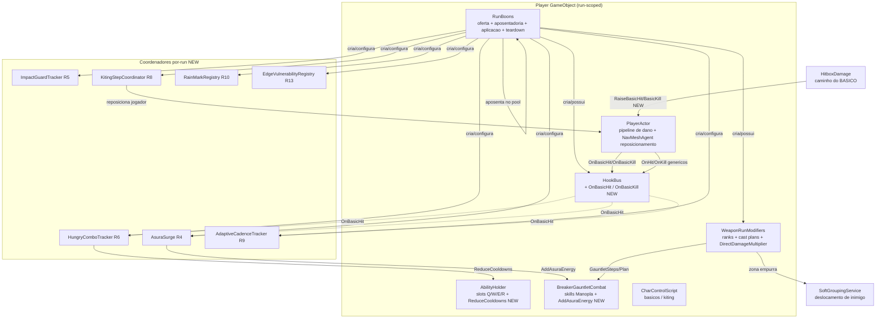

# Documento de Design

## Overview

Esta feature **reformula os conjuntos de boons das três armas** (Manopla, Arco e Lança) no sistema de recompensas por-run do Tech-Guy. A régua é **comportamento e diversão, não números**: cada boon novo deve mudar visivelmente *como* a arma é jogada, e cada aposentadoria deve remover uma escolha que não mudava nada.

O ponto central do design é que esta é uma reforma de **substituição, não de adição**. O catálogo permanece **enxuto**: boons fracos (os genéricos "só-número" e os de família "sem graça") são **aposentados** — removidos da composição de ofertas — e boons impactantes entram no espaço aberto. A contagem de aposentados é maior que a de entrantes (16 aposentados × ~10 novos), então o pool fica menor e com densidade de escolhas significativas maior.

O trabalho **reutiliza os pontos de extensão (seams) existentes e não inventa arquitetura nova**. Toda a infraestrutura já existe no código e já é usada pela spec anterior `impactful-weapon-boons`:

- A tabela de ranks e os snapshots por-cast vivem em `WeaponRunModifiers` (`Catalog`, `Add`, `Plan`, `GauntletSteps`, `DirectDamageMultiplier`), que já documenta imutabilidade de asset, monotonicidade por rank e independência de ordem.
- As ofertas, a aplicação e o teardown por-run vivem em `RunBoons` (`OfferReward`, `Choose`, `OnDestroy`/`ClearRunState`), que já cria coordenadores por-run (padrão `MomentumStacks`/`SplitArrowCoordinator`/`PerfectSpacingFeedback`) e os derruba no fim do run.
- Os eventos de combate reativos vivem no `HookBus` (`RunBoons.Hooks`), isolado de exceções e limpo em `Clear()`.
- O canal de deslocamento de inimigos existe em `SoftGroupingService.ApplyExternalDisplacement`; o reposicionamento do jogador usa o `NavMeshAgent` do jogador.

A **única novidade estrutural** é um canal de **acerto básico** no `HookBus`, porque hoje `HookBus.OnHit`/`OnKill` **não distinguem** se o acerto veio de um Basic_Attack ou de uma skill — ambos passam identicamente por `PlayerActor.DealResolvedAttackDamage`. Os boons da Manopla focados no básico (R4/R5/R6) precisam reagir **só** ao básico, então o design introduz um canal dedicado disparado **somente** pelo caminho de `HitboxDamage`.

Nenhum rebalanceamento numérico está no escopo. Todos os valores abaixo são **pontos de partida ajustáveis**.

### Design goals

- Cada boon novo muda o que a arma *faz* ou como ela *joga*, nunca só um número (R1.7). Nenhum Numeric_Boon novo é introduzido.
- A reforma é **substituição**: aposentar fracos (R2) e colocar impactantes no lugar, mantendo o catálogo enxuto e as três identidades de arma (Arco = kiting/projétil; Lança = espaçamento/alcance/controle; Manopla = agressão/combo).
- Todo comportamento é expresso no snapshot por-cast (`Cast_Plan`/`GauntletSteps`), em `DirectDamageMultiplier`, nas assinaturas do `HookBus`, nos registries por-run, ou em modificadores de stat marcados com `RunBoons` como fonte — **nunca** escrevendo em asset fonte (R1.1).
- Boons de família entram automaticamente pelo gate `definition.Family == WeaponModifiers.Family` em `OfferReward` e são aplicados pelo gate único `WeaponRunModifiers.Add` (R1.5/R1.6).
- Boons reativos assinam o `HookBus` e dependem de `HookBus.Clear()` para teardown; estado com stat modifier depende de `Stats.RemoveModifiersFrom(RunBoons)` (R1.4).
- `MonoBehaviour`s permanecem finos; a lógica de decisão vive em classes C# simples testáveis sem cena (per AGENTS.md).
- Nunca mutar um `ScriptableObject` original de arma/habilidade/status; nunca tocar `.meta`/GUIDs.
- Não redefinir nem duplicar boons preservados (`MomentumStrike`, `Shockwave`, `ComboNova`, `SplitArrow`, `ChargedShot`, `PerfectSpacing`, `ImpalingLine`); expandir, não repetir (R1.8).

### A decisão de seleção: por que ~10 entrantes substituem 16 aposentados

O requirements lista **4 substitutos de Manopla** (R4–R7), mas a aposentadoria de família da Manopla retira só **3** boons (`LongFists`, `StanceCrusher`, `Berserker`). A diferença não é incoerência com "catálogo enxuto": o espaço extra vem da **aposentadoria dos 7 genéricos inline** (`power`, `haste`, `recharge`, `crit`, `brutal`, `bulwark`, `swift`), que também eram ofertados em todo conjunto de recompensas enquanto a Manopla (ou qualquer arma) estava equipada. Removendo 7 genéricos + 9 de família (16 total) e adicionando ~10 impactantes, o pool **encolhe** e fica dominado por escolhas que mudam o estilo de jogo. A tabela de balanço abaixo torna a contagem explícita.

#### Balanço de contagem (aposentados × entrantes)

| Categoria | Aposentados (R2) | Entrantes (R4–R13) |
| --- | --- | --- |
| Genéricos inline (só-número) | `power`, `haste`, `recharge`, `crit`, `brutal`, `bulwark`, `swift` (7) | — |
| Família Manopla | `LongFists`, `StanceCrusher`, `Berserker` (3) | `AsuraFist`, `GuardBreaker`, `HungryCombo`, `SeismicFist` (4) |
| Família Arco | `HeavyBolt`, `Sniper`, `LongRain` (3) | `KitingStep`, `AdaptiveCadence`, `RainMark` (3) |
| Família Lança | `LongReach`, `TripleMoon`, `Affliction` (3) | `SpacingRecoil`, `PikeWall`, `EdgeStrike` (3) |
| **Total** | **16 removidos do pool** | **10 adicionados** |

> **Aposentar ≠ apagar.** Os 9 valores de enum/`Catalog` aposentados **permanecem** no `WeaponRunModifiers.Catalog` (compat com runs/saves que já os adquiriram — R2.5/R2.6). "Aposentar" significa **remover da composição de ofertas** em `OfferReward`: tirar os genéricos do pool inline e pular os 9 de família via um filtro no gate de família.

## Architecture

### System context

O run é de propriedade de `RunBoons` no GameObject do jogador, que já instancia cópias runtime da arma e habilidades, possui a tabela `WeaponRunModifiers` e o `HookBus`, e limpa tudo em `OnDestroy`. Esta feature acrescenta **10 boons impactantes** (enum + `Catalog`, uma família cada), **um canal de acerto básico** no `HookBus`, **um filtro de aposentadoria** na composição de ofertas, e **vários coordenadores por-run** espelhados em `MomentumStacks`/`PerfectSpacingFeedback`.



### O seam de acerto básico (resolve R3, habilita R4/R5/R6)

Hoje o `HookBus` dispara `OnHit`/`OnKill` em **todo** Direct_Hit por `PlayerActor.DealResolvedAttackDamage`, sem conhecer a origem. O caminho do básico é `HitboxDamage.TryDamageActor` → `PlayerActor.DealResolvedAttackDamage`; o caminho das skills é `TryApplyAreaDamage`/`BreakerGauntletCombat` → `DealResolvedAttackDamage`. Como R4/R5/R6 recompensam **só** o básico, é preciso distinguir.

**Decisão (uma só abordagem, justificada):** adicionar um **canal dedicado de básico** ao `HookBus` — `OnBasicHit(Actor, float)` e `OnBasicKill(Actor)` — disparado **exclusivamente** pelo caminho de `HitboxDamage`. É mais limpo que uma flag mutável de "origem" em `PlayerActor` (estado compartilhado atravessando reentrância) porque:

- Mantém `DealResolvedAttackDamage` sem ramificação de origem; a origem é conhecida de forma estática no raise-site (só o hitbox animado é básico).
- Reaproveita o mesmo despacho isolado por try/catch e a mesma dedupe de kill do `HookBus` (um novo `_basicKilled` separado), e é limpo por `HookBus.Clear()` no fim do run (R3.5).
- Preserva `OnHit`/`OnKill` genéricos: `DealResolvedAttackDamage` continua disparando-os para os boons existentes (`MomentumStrike` etc.), e o canal básico é **adicional** (R3.4).

### Where each boon plugs in

| Boon (enum / título PT) | Req | Família | Seam reaproveitado | Código novo |
| --- | --- | --- | --- | --- |
| `AsuraFist` — "Punho de Asura" | R4 | Gauntlet | `HookBus.OnBasicHit` + `BreakerGauntletCombat.AddAsuraEnergy` (NEW) | `AsuraSurge` coordenador |
| `GuardBreaker` — "Guarda partida" | R5 | Gauntlet | `HookBus.OnBasicHit` + `PlayerActor.ApplyHitReactionTo` + `StanceBreakEffect.Knockback` | `ImpactGuardTracker` + `ConsecutiveHitCounter` puro |
| `HungryCombo` — "Combo faminto" | R6 | Gauntlet | `HookBus.OnBasicHit` + `AbilityHolder.ReduceCooldowns` (NEW) | `HungryComboTracker` coordenador |
| `SeismicFist` — "Punho sísmico" | R7 | Gauntlet | `GauntletSteps` + hitbox do básico + `AreaHitStep.breakEffect = Knockback` | opt-in no snapshot por-cast + hitbox |
| `KitingStep` — "Disparo em recuo" | R8 | Bow | básico do Arco + `NavMeshAgent` do jogador | `KitingStepCoordinator` + `KitingImpulse` puro |
| `AdaptiveCadence` — "Cadência adaptativa" | R9 | Bow | `HookBus.OnBasicHit` + `DirectDamageMultiplier`-style stat pipeline run-scoped | `AdaptiveCadenceTracker` (padrão `PerfectSpacingFeedback`) |
| `RainMark` — "Chuva marcadora" | R10 | Bow | `ArsenalCastPlan` (R) + estado de marca por-run | flags no `Cast_Plan` + `RainMarkRegistry` |
| `SpacingRecoil` — "Recuo controlado" | R11 | Spear | `ArsenalCastPlan` (Thrust) + `NavMeshAgent` do jogador | flag no `Cast_Plan` + `SpacingBand` puro |
| `PikeWall` — "Muralha de hastes" | R12 | Spear | `ArsenalCastPlan` (Sweep) + `SoftGroupingService.ApplyExternalDisplacement` | flag de zona no `Cast_Plan` |
| `EdgeStrike` — "Ponto cego" | R13 | Spear | `DirectDamageMultiplier`(distance) + `ApplyHitReactionTo` + `VulnerabilityWindow` | `EdgeVulnerabilityRegistry` + `EdgeBand` puro |

> **Nomes sem colisão:** o enum já contém `TwinShot, Piercing, Ricochet, Homing, HeavyBolt, RapidBurst, WideVolley, LongRain, GuidedRain, Sniper, LongReach, EchoThrust, TripleMoon, Trident, DragonWave, Affliction, SpearTip, Execution, Orbit, Siphon, LongFists, RocketAdvance, FlurryEcho, ShockRing, AsuraEcho, Momentum, AsuraReserve, StanceCrusher, ComboNova, Berserker, PhantomSpear, MoonShard, ReturnWave, ChainThrust, SplitArrow, ChargedShot, PerfectSpacing, ImpalingLine, MomentumStrike, Shockwave`. Os 10 novos identificadores (`AsuraFist, GuardBreaker, HungryCombo, SeismicFist, KitingStep, AdaptiveCadence, RainMark, SpacingRecoil, PikeWall, EdgeStrike`) são todos **inéditos**.

## Components and Interfaces

Todas as assinaturas abaixo são ancoradas no código atual. Membros novos marcados `// NEW`; alterações anotam a edição exata com `// CHANGED`. Cada novo `WeaponBoon` é acrescentado ao enum e ao `Catalog` em `WeaponRunModifiers.cs` (uma família cada, `MaxRank = 3`), então aparece automaticamente em `RunBoons.OfferReward` pelo gate família/rank existente.

### Adições de catálogo (`WeaponRunModifiers.cs`)

```csharp
// CHANGED: valores anexados ao enum WeaponBoon (nomes inéditos; NÃO remover os aposentados — R2.5/R2.6).
public enum WeaponBoon
{
    /* ...todos os existentes, inclusive LongFists/StanceCrusher/Berserker/HeavyBolt/Sniper/LongRain/
       LongReach/TripleMoon/Affliction permanecem para compat de runs/saves antigos... */
    AsuraFist, GuardBreaker, HungryCombo, SeismicFist,       // NEW Gauntlet (R4..R7)
    KitingStep, AdaptiveCadence, RainMark,                   // NEW Bow (R8..R10)
    SpacingRecoil, PikeWall, EdgeStrike                      // NEW Spear (R11..R13)
}
```

```csharp
// NEW: linhas de Definition no Catalog (uma família cada, MaxRank = 3). Títulos/descrições em PT,
// escritas em termos do ESTILO que mudam (R15.4). Valores = pontos de partida ajustáveis.
new Definition(WeaponBoon.AsuraFist,       RunWeaponFamily.Gauntlet, "Punho de Asura",     "Seus básicos carregam o finalizador: cada acerto básico gera +2 de energia Asura por nível."),
new Definition(WeaponBoon.GuardBreaker,    RunWeaponFamily.Gauntlet, "Guarda partida",     "A cada 3 básicos seguidos, o terceiro racha a postura (+50% de dano de postura por nível) e arremessa ao quebrar a guarda."),
new Definition(WeaponBoon.HungryCombo,     RunWeaponFamily.Gauntlet, "Combo faminto",      "Tecer básicos acelera suas skills: cada acerto básico reduz a recarga das habilidades em 0,3s por nível."),
new Definition(WeaponBoon.SeismicFist,     RunWeaponFamily.Gauntlet, "Punho sísmico",      "OPCIONAL: reinstaura o arremesso. Ao quebrar a guarda (básico ou skill), empurra o inimigo, +30% de distância por nível."),
new Definition(WeaponBoon.KitingStep,      RunWeaponFamily.Bow,      "Disparo em recuo",   "Atirar recuando dá um impulso curto de reposicionamento, +25% de distância por nível. O kiting vira ritmo ativo."),
new Definition(WeaponBoon.AdaptiveCadence, RunWeaponFamily.Bow,      "Cadência adaptativa","Manter 6m ou mais acelera seu disparo básico em +15% por nível; aproximar-se do alvo zera o bônus."),
new Definition(WeaponBoon.RainMark,        RunWeaponFamily.Bow,      "Chuva marcadora",    "O R marca e lentifica inimigos sob a chuva; acertos em marcados causam +20% de dano por nível enquanto a marca durar."),
new Definition(WeaponBoon.SpacingRecoil,   RunWeaponFamily.Spear,    "Recuo controlado",   "Uma estocada que conecta recua você até a distância ideal, +20% de recuo por nível, sem sair da banda."),
new Definition(WeaponBoon.PikeWall,        RunWeaponFamily.Spear,    "Muralha de hastes",  "O W cria uma zona de hastes que empurra inimigos para fora do seu alcance de perigo, +30% de empurrão por nível."),
new Definition(WeaponBoon.EdgeStrike,      RunWeaponFamily.Spear,    "Ponto cego",         "Acertar na ponta do alcance racha a postura (+40% por nível) e abre uma janela de vulnerabilidade ao quebrar a guarda.")
```

A monotonicidade por rank (R1.2) e a independência de ordem (R1.3) seguem automaticamente do contrato já documentado em `WeaponRunModifiers`: ranks são guardados por boon em `_ranks` e lidos por `Rank(kind)`, de modo que o resultado depende só do multiset final de ranks, não da ordem de aquisição.

### Aposentadoria na composição de ofertas (`RunBoons.cs`)

A aposentadoria (R2) acontece **só** na montagem do pool em `OfferReward`, por duas edições cirúrgicas, sem apagar nada do `Catalog` nem tocar comportamento de boons preservados (R2.6).

```csharp
// RunBoons.cs — NEW: conjunto único de boons de família aposentados. "Aposentar" é pular na oferta,
// não apagar do Catalog (compat com runs/saves que já os possuem — R2.5/R2.6).
private static readonly HashSet<WeaponBoon> RetiredFamilyBoons = new HashSet<WeaponBoon>
{
    WeaponBoon.LongFists, WeaponBoon.StanceCrusher, WeaponBoon.Berserker,   // Gauntlet (R2.2)
    WeaponBoon.HeavyBolt, WeaponBoon.Sniper,        WeaponBoon.LongRain,    // Bow (R2.2)
    WeaponBoon.LongReach, WeaponBoon.TripleMoon,    WeaponBoon.Affliction   // Spear (R2.2)
};
```

```csharp
// RunBoons.OfferReward — CHANGED (1/2): os genéricos só-número saem do pool inline. As linhas
// new Offer("power"...), ("haste"...), ("recharge"...), ("crit"...), ("brutal"...), ("bulwark"...),
// ("swift"...) são REMOVIDAS da lista `pool` (R2.1). Preservados (vitality/ignite/frost/transform/
// focus/conductor/detonation/reactor/resonance/overflow) permanecem (R2.4).

// RunBoons.OfferReward — CHANGED (2/2): o gate de família pula os aposentados de família (R2.2),
// mantendo a compat de rank/ceiling e o resto do gate inalterado.
foreach (var definition in WeaponRunModifiers.Catalog)
    if (definition.Family == WeaponModifiers.Family
        && !RetiredFamilyBoons.Contains(definition.Kind)                   // NEW: pula aposentados
        && WeaponModifiers.Rank(definition.Kind) < definition.MaxRank)
        pool.Add(new Offer(definition.Id, definition.Title,
            "Nível " + (WeaponModifiers.Rank(definition.Kind) + 1) + "/" + definition.MaxRank + "\n" + definition.Description));
```

O preenchimento restante de `OfferReward` (slot de skill, uma oferta `weapon_` de família, `while (_choices.Count < 3)`) é **inalterado**: quando o pool encolhe (menos genéricos, família filtrada), os laços simplesmente puxam das ofertas remanescentes sem erro (R2.3/R14.5). A contagem de escolhas permanece 3 (R2.3/R14.3). Como ao menos um Impactful_Boon de família abaixo do `MaxRank` sempre entra no slot `weapon_`, todo conjunto com a família equipada inclui ao menos um impactante (R14.1).

### Seam novo no `HookBus.cs` (R3)

```csharp
// NEW: canal dedicado ao Basic_Attack. Direct_Hit básico = acerto resolvido pelo caminho do HitboxDamage.
public event Action<Actor, float> OnBasicHit;   // acerto básico que causou dano (R3.1)
public event Action<Actor> OnBasicKill;          // abate causado por acerto básico (dedupe próprio, R3.2)

private readonly HashSet<Actor> _basicKilled = new HashSet<Actor>(); // NEW: dedupe de abate básico

public void RaiseBasicHit(Actor actor, float damage) => Dispatch(OnBasicHit, actor, damage); // NEW
public void RaiseBasicKill(Actor actor)                                                      // NEW
{
    if (actor == null) return;
    if (!_basicKilled.Add(actor)) return;        // uma vez por inimigo (espelha RaiseKill/_killed) — R3.2
    Dispatch(OnBasicKill, actor);
}

// CHANGED: Clear() também zera OnBasicHit, OnBasicKill e _basicKilled (R3.5).
public void Clear()
{
    /* ...zera OnHit/OnCrit/OnKill/OnFreeze/OnBurn/OnStanceBreak/OnDash/OnExplosion e _killed... */
    OnBasicHit = null; OnBasicKill = null; _basicKilled.Clear();   // NEW
}
```

O despacho reaproveita os helpers `Dispatch` existentes (try/catch por assinante, `Debug.LogException`), então um assinante faltante ou que lança nunca quebra o pipeline de combate.

### Disparo do seam (`PlayerActor.cs` + `HitboxDamage.cs`) (R3)

```csharp
// PlayerActor.cs — NEW: repassa um acerto BÁSICO ao bus. Chamado só pelo caminho do HitboxDamage.
// `dealt` é o dano efetivamente causado (medido pelo chamador). O kill é lido do estado do inimigo
// após o dano. Null-guard do bus (ausente fora do run). NÃO re-dispara OnHit/OnKill genéricos (R3.4).
public void RaiseBasicAttackHit(Actor enemy, float dealt)   // NEW
{
    if (!enemy || dealt <= 0f) return;
    HookBus hooks = Hooks;
    if (hooks == null) return;
    hooks.RaiseBasicHit(enemy, dealt);          // R3.1
    if (enemy.IsDead) hooks.RaiseBasicKill(enemy); // R3.2
}
```

```csharp
// HitboxDamage.TryDamageActor — CHANGED: no ramo do dono-jogador, mede o dano causado e repassa como
// BÁSICO logo após o DealResolvedAttackDamage (que já dispara OnHit/OnKill genéricos — R3.4). O caminho
// de skill (TryApplyAreaDamage/BreakerGauntletCombat) NUNCA passa por aqui, então nunca dispara o canal
// básico (R3.3). Vale para QUALQUER arma; os boons que consomem OnBasicHit aqui são da Manopla (R4/R5/R6).
if (owner is PlayerActor attacker)
{
    float before = actor.health;                     // disponível no fluxo atual
    attacker.DealResolvedAttackDamage(actor, finalDamage);
    attacker.RaiseBasicAttackHit(actor, before - actor.health); // NEW: canal básico
}
else actor.TakeDamage(finalDamage);
```

---

### R4 — `AsuraFist` / "Punho de Asura" (básicos geram Asura)

Precisa somar energia Asura de fora do pipeline de skills. `AsuraMomentum.AddEnergy(int)` já clampa a `[0, Maximum]`, mas é privado a `BreakerGauntletCombat`. Adiciona-se um ponto de entrada público fino:

```csharp
// BreakerGauntletCombat.cs — NEW: soma energia Asura de uma fonte externa (ex.: boon de básico),
// delegando ao _momentum.AddEnergy que já clampa a [0, Maximum]. Thin: só o delegate (R4.2).
public void AddAsuraEnergy(int amount) => _momentum.AddEnergy(amount);
```

Coordenador por-run espelhado em `MomentumStacks`:

```csharp
// NEW: AsuraSurge (MonoBehaviour por-run, adicionado por RunBoons quando o boon é escolhido).
public sealed class AsuraSurge : MonoBehaviour
{
    private const int EnergyPerRankPerHit = 2;   // R4.1 (ponto de partida)
    private PlayerActor _player;
    private HookBus _hooks;
    private BreakerGauntletCombat _combat;
    private int _rank;

    // Reconfigurável em cada pick (rank sobe); re-assina idempotente (padrão MomentumStacks).
    public void Configure(PlayerActor player, HookBus hooks, BreakerGauntletCombat combat, int rank)
    {
        Unsubscribe();
        _player = player; _hooks = hooks; _combat = combat; _rank = Mathf.Max(0, rank);
        Subscribe();
    }

    private void Subscribe()   { if (_hooks != null) _hooks.OnBasicHit += OnBasicHit; }   // R4.3: só básico
    private void Unsubscribe() { if (_hooks != null) _hooks.OnBasicHit -= OnBasicHit; }

    // R4.1/R4.2: +2*rank por acerto básico; AddAsuraEnergy delega ao AddEnergy que clampa ao Maximum.
    private void OnBasicHit(Actor victim, float damage)
    {
        if (_rank <= 0 || !_combat) return;
        _combat.AddAsuraEnergy(EnergyPerRankPerHit * _rank);
    }

    private void OnDestroy() => Unsubscribe();   // + HookBus.Clear() derruba a assinatura no fim do run (R4.4)
}
```

- **Só básico (R4.3):** assina `OnBasicHit`, não `OnHit`; nenhum acerto de skill chega aqui.
- **Clamp (R4.2):** `AddAsuraEnergy` → `AsuraMomentum.AddEnergy`, que faz `Min(Maximum, ...)`.
- **Teardown (R4.4):** `HookBus.Clear()` solta a assinatura; `OnDestroy` desassina ao destruir o objeto.
- **Só Gauntlet (R4.5):** catalogado `Family = Gauntlet, MaxRank = 3`.

### R5 — `GuardBreaker` / "Guarda partida" (3 básicos → quebra de postura + knockback)

Conta básicos consecutivos pelo `HookBus.OnBasicHit` (gate estrito de básico, R5.3) e aplica dano de postura e, na quebra, um `StanceBreakEffect.Knockback` deliberado via `PlayerActor.ApplyHitReactionTo` (entrada de reação do caminho do básico). A decisão de contagem vive numa classe C# **pura**, testável sem cena.

```csharp
// NEW: ConsecutiveHitCounter — classe C# pura (sem tipos Unity), testável sem cena.
public sealed class ConsecutiveHitCounter
{
    private readonly int _threshold;
    public int Count { get; private set; }
    public ConsecutiveHitCounter(int threshold) => _threshold = System.Math.Max(1, threshold);
    // R5.1: devolve true quando ESTE acerto completa a sequência (e zera para a próxima).
    public bool RegisterBasicHit() { Count++; if (Count >= _threshold) { Count = 0; return true; } return false; }
    // R5.3: qualquer interrupção (skill, frame sem básico) zera a contagem.
    public void Reset() => Count = 0;
    // R5.1: multiplicador de dano de postura do terceiro golpe = 1 + 0.5*rank.
    public static float StanceMultiplier(int rank) => 1f + 0.5f * System.Math.Max(0, rank);
}
```

```csharp
// NEW: ImpactGuardTracker (MonoBehaviour por-run). Conta 3 básicos consecutivos e, no terceiro,
// pede dano de postura extra + knockback na quebra. Observa também skills para resetar a sequência.
public sealed class ImpactGuardTracker : MonoBehaviour
{
    private const int HitsToBreak = 3;             // R5.1
    private const float BaseStanceOnThird = 24f;   // ponto de partida (ajustável)
    private const float KnockbackDistance = 4f;    // ponto de partida (ajustável)
    private readonly ConsecutiveHitCounter _counter = new ConsecutiveHitCounter(HitsToBreak);
    private PlayerActor _player;
    private HookBus _hooks;
    private AbilityHolder _holder;
    private int _rank;

    public int Streak => _counter.Count;           // exposto p/ HUD/tests (R5.4)
    public event Action<int> StreakChanged;        // cosmético (R5.4)

    public void Configure(PlayerActor player, HookBus hooks, AbilityHolder holder, int rank)
    {
        Unsubscribe();
        _player = player; _hooks = hooks; _holder = holder; _rank = Mathf.Max(0, rank);
        Subscribe();
        _counter.Reset(); StreakChanged?.Invoke(0);
    }

    private void Subscribe()
    {
        if (_hooks != null) _hooks.OnBasicHit += OnBasicHit;         // R5.3: só básico incrementa
        if (_holder) _holder.AbilityUsed += OnAbilityUsed;           // R5.3: skill reseta
    }
    private void Unsubscribe()
    {
        if (_hooks != null) _hooks.OnBasicHit -= OnBasicHit;
        if (_holder) _holder.AbilityUsed -= OnAbilityUsed;
    }

    // R5.1/R5.2: no terceiro básico, aplica postura extra + pede Knockback na quebra via caminho do básico.
    private void OnBasicHit(Actor victim, float damage)
    {
        if (_rank <= 0 || !_player) return;
        bool breaks = _counter.RegisterBasicHit();
        StreakChanged?.Invoke(_counter.Count);
        if (!breaks || !victim) return;
        float stance = BaseStanceOnThird * ConsecutiveHitCounter.StanceMultiplier(_rank); // R5.1
        _player.ApplyHitReactionTo(victim, HitReactionType.Stagger, HitStrength.Heavy,
            stance, StanceBreakEffect.Knockback, 0f);                 // R5.2: Knockback deliberado
    }

    private void OnAbilityUsed(int slot) { _counter.Reset(); StreakChanged?.Invoke(0); } // R5.3

    private void OnDestroy() => Unsubscribe();   // + HookBus.Clear() no fim do run
}
```

- **Postura no terceiro (R5.1):** `ApplyHitReactionTo(..., stance = 24 * (1 + 0.5*R), ...)`.
- **Knockback na quebra (R5.2):** o `breakEffect` passado é `StanceBreakEffect.Knockback` — `CombatReactionController.TriggerStanceBreak` resolve o knockback pela locomoção do inimigo (`ApplyPush`), nunca através de cenário.
- **Reset (R5.3):** `OnBasicHit` só é disparado pelo canal básico; qualquer skill reseta via `AbilityHolder.AbilityUsed`. Nenhum acerto não-básico incrementa.
- **Feedback (R5.4):** `StreakChanged` empurra a pressão crescente para o HUD (ex. `PlayerHUD.ShowGuardBreakStreak(int)`); zera no reset.
- **Isolamento (R5.5):** só os canais básico/resolvido e `ApplyHitReactionTo`; nenhum valor de postura é escrito em asset.

### R6 — `HungryCombo` / "Combo faminto" (básicos reduzem recarga das skills)

A redução age sobre os `cooldownTimers` **vivos** (run-scoped) de `AbilityHolder`, **nunca** sobre `ability.cooldownTime` (asset). Adiciona-se um método novo:

```csharp
// AbilityHolder.cs — NEW: reduz a recarga RESTANTE dos slots em `seconds`, clampado a >= 0. Nunca
// toca ability.cooldownTime (asset). Só afeta slots em Cooldown; slots Ready/Active são ignorados (R6.3).
public void ReduceCooldowns(float seconds)
{
    if (seconds <= 0f) return;                                    // R6.1 (sem efeito p/ nada)
    for (int i = 0; i < cooldownTimers.Length; i++)
    {
        if (states[i] != AbilityState.Cooldown) continue;         // R6.3: só o que está em recarga
        cooldownTimers[i] = Mathf.Max(0f, cooldownTimers[i] - seconds); // R6.2: nunca abaixo de zero
    }
}
```

Coordenador por-run:

```csharp
// NEW: HungryComboTracker (MonoBehaviour por-run). Cada acerto básico reduz a recarga das skills.
public sealed class HungryComboTracker : MonoBehaviour
{
    private const float SecondsPerRank = 0.3f;   // R6.1
    private PlayerActor _player;
    private HookBus _hooks;
    private AbilityHolder _holder;
    private int _rank;

    public void Configure(PlayerActor player, HookBus hooks, AbilityHolder holder, int rank)
    {
        Unsubscribe();
        _player = player; _hooks = hooks; _holder = holder; _rank = Mathf.Max(0, rank);
        Subscribe();
    }

    private void Subscribe()   { if (_hooks != null) _hooks.OnBasicHit += OnBasicHit; }   // R6: só básico
    private void Unsubscribe() { if (_hooks != null) _hooks.OnBasicHit -= OnBasicHit; }

    // R6.1: -0.3*rank s de recarga restante por acerto básico; ReduceCooldowns clampa e ignora o que não está em recarga.
    private void OnBasicHit(Actor victim, float damage)
    {
        if (_rank <= 0 || !_holder) return;
        _holder.ReduceCooldowns(SecondsPerRank * _rank);
    }

    private void OnDestroy() => Unsubscribe();   // + HookBus.Clear() no fim do run (R6.4)
}
```

- **Run-scoped (R6.2):** só `cooldownTimers`/`states`; o asset nunca é tocado.
- **Sem recarga → sem efeito (R6.3):** o loop pula slots que não estão em `Cooldown`.
- **Teardown (R6.4):** `HookBus.Clear()` + `OnDestroy`.

### R7 — `SeismicFist` / "Punho sísmico" (knockback deliberado opt-in, básico + skills)

A Manopla hoje **zera** `pushDistance` em todos os golpes (`BreakerGauntletCombat.Execute` zera o passo; `PlayerActor.ConfigureHitbox` chama `hbDamage.SetPushDistance(0f)` no básico). O único canal de deslocamento forte remanescente é `StanceBreakEffect.Knockback`. Este boon o reintroduz **apenas** quando escolhido, no snapshot por-cast (skills) e no hitbox do básico.

```csharp
// WeaponRunModifiers.GauntletSteps — CHANGED: quando SeismicFist está ativo, declara Knockback como o
// breakEffect do passo clonado (opt-in), com knockbackDistance escalando por rank. Mantém pushDistance
// por-golpe zerado (BreakerGauntletCombat continua zerando); o deslocamento forte vem SÓ do Stance_Break.
int seismic = Rank(WeaponBoon.SeismicFist);
if (seismic > 0)
{
    step.breakEffect = StanceBreakEffect.Knockback;        // R7.1: opt-in deliberado (skills)
    step.knockbackDistance *= 1f + 0.3f * seismic;         // R7.1: +30% por nível (monotônico)
}
// (quando seismic == 0, nenhuma dessas linhas roda: comportamento sem-empurrão padrão intacto — R7.3)
```

Para o **básico** (R7.1 cobre "Basic_Attack ou skill"), o hitbox do básico passa a declarar `breakEffect = Knockback` quando o boon está ativo, mantendo `pushDistance` por-golpe zerado:

```csharp
// HitboxDamage.cs — NEW: configura o breakEffect da quebra do básico (não o push por-golpe).
public void SetStanceBreakEffect(StanceBreakEffect effect) => breakEffect = effect;   // NEW

// RunBoons.Choose (case weapon_SeismicFist) — NEW: ao escolher, se o hitbox do básico existe, declara
// Knockback na quebra enquanto o boon estiver ativo. Básico continua com pushDistance zerado (sem shove
// por-golpe); o arremesso forte só acontece na QUEBRA de postura. O asset nunca é tocado (R7.4).
```

- **Só na quebra, escalado (R7.1):** o knockback é aplicado por `CombatReactionController` quando a guarda quebra; `GauntletSteps` escala `knockbackDistance` por `(1 + 0.3*R)`.
- **Pela locomoção, sem teleporte (R7.2):** resolvido por `ApplyPush`/locomoção do inimigo, igual a um `Knockback` de skill; nunca através de cenário sólido.
- **Opt-in (R7.3):** com `SeismicFist` rank 0, nenhum ramo executa e o `pushDistance` continua zerado (sem-empurrão padrão).
- **Isolamento (R7.4):** tudo no clone `AreaHitStep` por-cast (JsonUtility deep clone) e no hitbox runtime; o asset nunca é mutado.

### R8 — `KitingStep` / "Disparo em recuo" (kiting com reposicionamento)

Reposiciona o **jogador** (não inimigos) via o `NavMeshAgent` do jogador. A decisão (afastando-se? direção? distância?) vive numa classe pura; o coordenador observa o básico do Arco e aplica o impulso respeitando `_agent.Raycast` para nunca atravessar cenário.

```csharp
// NEW: KitingImpulse — decisão pura (sem tipos Unity), testável sem cena.
public static class KitingImpulse
{
    private const float BaseDistance = 1.5f;    // ponto de partida (ajustável)
    public const float Cooldown = 0.4f;         // R8.2: janela entre impulsos
    // R8.1/R8.4: só concede impulso se o jogador está se MOVENDO para LONGE do inimigo mais próximo.
    public static bool ShouldReposition(Vector3 moveDir, Vector3 toNearestEnemy)
        => moveDir.sqrMagnitude > 1e-4f && Vector3.Dot(moveDir.normalized, toNearestEnemy.normalized) < 0f;
    // R8.2: distância escala por (1 + 0.25*R).
    public static float Distance(int rank) => BaseDistance * (1f + 0.25f * System.Math.Max(0, rank));
}
```

```csharp
// NEW: KitingStepCoordinator (MonoBehaviour por-run). Observa o básico do Arco e aplica o recuo.
public sealed class KitingStepCoordinator : MonoBehaviour
{
    private PlayerActor _player;
    private CharControlScript _controls;    // expõe o básico performado + direção de movimento
    private NavMeshAgent _agent;            // agente do JOGADOR (reposiciona o jogador — R8.3)
    private int _rank;
    private float _nextImpulseAt;           // R8.2: cooldown por-impulso

    public void Configure(PlayerActor player, CharControlScript controls, NavMeshAgent agent, int rank)
    {
        Unsubscribe();
        _player = player; _controls = controls; _agent = agent; _rank = Mathf.Max(0, rank);
        Subscribe();
    }

    // CharControlScript.BasicAttackPerformed já existe; só o básico do Arco entra aqui porque
    // o coordenador só é criado WHILE a família é Bow (R8.5).
    private void Subscribe()   { if (_controls) _controls.BasicAttackPerformed += OnBasicAttack; }
    private void Unsubscribe() { if (_controls) _controls.BasicAttackPerformed -= OnBasicAttack; }

    private void OnBasicAttack()
    {
        if (_rank <= 0 || !_player || Time.time < _nextImpulseAt) return;   // R8.2 cooldown
        Vector3 moveDir = _controls ? _controls.CurrentMoveDirection : Vector3.zero;
        Actor nearest = /* busca o inimigo mais próximo (padrão OverlapSphere do projeto) */ null;
        if (!nearest) return;
        Vector3 toEnemy = nearest.transform.position - _player.transform.position;
        if (!KitingImpulse.ShouldReposition(moveDir, toEnemy)) return;      // R8.1/R8.4
        _nextImpulseAt = Time.time + KitingImpulse.Cooldown;
        Vector3 dest = _player.transform.position + moveDir.normalized * KitingImpulse.Distance(_rank);
        if (_agent && _agent.enabled && _agent.isOnNavMesh)
        {
            if (_agent.Raycast(dest, out NavMeshHit edge)) dest = edge.position; // R8.3: respeita navmesh
            _agent.Move(dest - _player.transform.position);
        }
    }

    private void OnDestroy() => Unsubscribe();
}
```

> `CurrentMoveDirection` é um getter fino novo em `CharControlScript` que expõe a direção de locomoção já computada (R8.1/R8.4); nenhuma lógica de movimento nova é introduzida — o deslocamento é via o `NavMeshAgent` existente do jogador (R8.3), espelhando o `_agent.Raycast`/`_agent.Move` já usados em `BreakerGauntletCombat`.

- **Só afastando (R8.1/R8.4):** `KitingImpulse.ShouldReposition` exige movimento com produto escalar negativo em relação ao inimigo; parado ou aproximando-se → sem impulso.
- **Escala + cooldown (R8.2):** distância `*(1 + 0.25*R)`; `_nextImpulseAt` impede encadear por frame.
- **Navegável (R8.3):** `_agent.Raycast` corta no limite navegável; nunca atravessa cenário.
- **Só Bow (R8.5):** catalogado `Family = Bow, MaxRank = 3`; coordenador só criado WHILE Bow.

### R9 — `AdaptiveCadence` / "Cadência adaptativa" (ritmo por distância)

Espelha `PerfectSpacingFeedback` (reage ao canal de acerto, mede distância), mas aqui o bônus é **funcional**: aplica um modificador de stat run-scoped em `AttackSpeedMultiplier` enquanto o jogador mantém acertos básicos a ≥6m, e zera ao acertar <6m. O modificador é marcado com `RunBoons` como fonte (teardown por `RemoveModifiersFrom`).

```csharp
// NEW: AdaptiveCadenceTracker (MonoBehaviour por-run). Mantém um stat modifier de cadência enquanto
// os básicos conectam a >= 6m; zera ao acertar < 6m. Padrão idêntico ao MomentumStacks (stat run-scoped).
public sealed class AdaptiveCadenceTracker : MonoBehaviour
{
    public const float KitingBand = 6f;          // R9.1/R9.2
    private const float PercentPerRank = 15f;    // R9.1 (+15% por nível)
    private PlayerActor _player;
    private HookBus _hooks;
    private Object _statSource;                  // o RunBoons, p/ RemoveModifiersFrom (R9.4)
    private int _rank;
    private bool _active;
    private PlayerStatModifier _mod;

    public void Configure(PlayerActor player, HookBus hooks, int rank, Object statSource)
    {
        Unsubscribe();
        _player = player; _hooks = hooks; _rank = Mathf.Max(0, rank); _statSource = statSource;
        Subscribe();
    }

    private void Subscribe()   { if (_hooks != null) _hooks.OnBasicHit += OnBasicHit; }  // R9: só básico
    private void Unsubscribe() { if (_hooks != null) _hooks.OnBasicHit -= OnBasicHit; RemoveMod(); }

    private void OnBasicHit(Actor victim, float damage)
    {
        if (_rank <= 0 || !_player || !victim) return;
        float dist = Vector3.Distance(_player.transform.position, victim.transform.position);
        bool inBand = dist >= KitingBand;         // R9.1: >=6m acelera; R9.2: <6m zera
        SetActive(inBand);
    }

    // R9.1: liga um stat modifier de +15%*rank em AttackSpeedMultiplier (IncreasedPercent); R9.2: desliga.
    private void SetActive(bool on)
    {
        if (on == _active) return;
        _active = on;
        RemoveMod();
        if (_active)
            _mod = _player.Stats.AddModifier(new PlayerStatModifier(PlayerStatType.AttackSpeedMultiplier,
                PlayerStatModifierMode.IncreasedPercent, PercentPerRank * _rank, _statSource), _statSource);
        /* PushHud(_active) — R9.3 cosmético */
    }

    private void RemoveMod() { if (_mod != null && _player) { _player.Stats.RemoveModifier(_mod); _mod = null; } }
    private void OnDestroy() => Unsubscribe();    // + RunBoons.OnDestroy RemoveModifiersFrom(this) (R9.4)
}
```

- **Ritmo por distância (R9.1):** stat modifier `AttackSpeedMultiplier +15%*R` enquanto ≥6m.
- **Reset ao aproximar (R9.2):** acerto <6m remove o modifier.
- **Feedback (R9.3):** `PushHud` cosmético reflete o estado da cadência; zera no reset.
- **Teardown (R9.4):** `RemoveMod` em `OnDestroy` + `RemoveModifiersFrom(RunBoons)` em `RunBoons.OnDestroy` (modifier marcado com a fonte `RunBoons`).

### R10 — `RainMark` / "Chuva marcadora" (R marca + amplifica + lentifica)

O R do Arco é a chuva pulsante (`ArsenalSkillKind.Rain`, slot R). O boon acrescenta **flags value-type ao `ArsenalCastPlan`** (preserva a invariante de imutabilidade) lidas em `Plan`, e um registro de marca por-run que aplica amplificação e lentidão.

```csharp
// ArsenalCastPlan — NEW: value types, preservando a invariante de imutabilidade (nenhuma referência
// aliasa um asset). Lidos em WeaponRunModifiers.Plan a partir do rank de RainMark.
public bool MarkOnPulse;      // R10.1: cada pulso do R marca o inimigo
public float MarkAmplify;     // R10.2: multiplicador extra em marcados (0 = off)
public float MarkSlow;        // R10.3: fração de lentidão aplicada enquanto marcado (0 = off)
```

```csharp
// WeaponRunModifiers.Plan — ramo do Arco, slot 3 (Rain). Non-decreasing com rank; snapshot por-cast só (R10.4).
if (slot == 3)
{
    /* ...TrackCursor/LongRain existentes (LongRain está aposentado da OFERTA, mas sua escala no Plan
       permanece inofensiva pois nunca é adquirido — R2.5/R2.6)... */
    int mark = Rank(WeaponBoon.RainMark);
    plan.MarkOnPulse = mark > 0;              // R10.1
    plan.MarkAmplify = 0.2f * mark;           // R10.2: +20% por nível
    plan.MarkSlow    = mark > 0 ? 0.4f : 0f;  // R10.3: lentidão enquanto marcado
}
```

```csharp
// NEW: RainMarkRegistry (MonoBehaviour por-run). Guarda marcas com expiração e aplica/retira a lentidão;
// a amplificação é consultada pelo pipeline de dano direto. Teardown no fim do run.
public sealed class RainMarkRegistry : MonoBehaviour
{
    private const float Duration = 4f;            // ponto de partida (ajustável), R10.1
    private readonly Dictionary<Actor, float> _expireAt = new Dictionary<Actor, float>();
    private float _amplify, _slow;

    public void Configure(float amplify, float slow) { _amplify = amplify; _slow = slow; } // dos flags do Plan

    public void Mark(Actor enemy)                 // chamado por pulso resolvido do R (R10.1)
    {
        if (!enemy || enemy.IsDead) return;
        _expireAt[enemy] = Time.time + Duration;
        /* aplica lentidão via o canal de status/locomoção já usado por ChillStatus (R10.3) */
    }

    // R10.2: multiplicador extra para acertos diretos em marcados ativos; 1 fora da marca.
    public float AmplifierFor(Actor enemy)
        => enemy && _expireAt.TryGetValue(enemy, out float t) && Time.time < t ? 1f + _amplify : 1f;

    private void Update() { /* expira marcas; R10.3: restaura o movimento normal ao expirar */ }
    private void OnDestroy() { /* limpa o dicionário e restaura qualquer lentidão pendente */ }
}
```

A amplificação entra no pipeline de dano direto consultando o registro (sem escrever asset). O caminho natural é `DealResolvedAttackDamage` multiplicar por `RainMarkRegistry.AmplifierFor(enemy)` quando o registro existe, espelhando como `DirectDamageMultiplier` já compõe multiplicadores run-scoped.

- **Marca por pulso (R10.1):** `plan.MarkOnPulse` faz cada pulso resolvido chamar `RainMarkRegistry.Mark`.
- **Amplifica (R10.2):** `AmplifierFor` devolve `1 + 0.2*R` enquanto a marca dura.
- **Lentidão/zoning (R10.3):** aplica lentidão pelo canal de status/locomoção já existente; restaura ao expirar.
- **Isolamento (R10.4):** flags no `Cast_Plan` por-cast + estado run-scoped; o asset do R nunca é mutado.
- **Só Bow (R10.5):** `Family = Bow, MaxRank = 3`.

### R11 — `SpacingRecoil` / "Recuo controlado" (estocada recua pra banda ideal)

A estocada da Lança (`ArsenalSkillKind.Thrust`) executa em `ArsenalCombat` lendo o `ArsenalCastPlan`. O boon acrescenta uma flag ao `Cast_Plan` lida em `Plan`; ao conectar, `ArsenalCombat` recua o **jogador** via o `NavMeshAgent` dele até assentar na banda ideal. A banda vive numa classe pura.

```csharp
// NEW: SpacingBand — decisão pura (sem tipos Unity), reaproveita a banda [3.5, 6.5] de PerfectSpacing.
public static class SpacingBand
{
    public const float Min = 3.5f, Max = 6.5f;   // banda ideal (igual a PerfectSpacing)
    // R11.2: recuo escala por (1 + 0.2*R), mas o destino é clampado à banda (R11.1/R11.2).
    public static float StepBack(float currentDistance, int rank)
    {
        float desired = (currentDistance) * (0.2f * System.Math.Max(0, rank)); // deslocamento pretendido
        float target = System.Math.Min(Max, currentDistance + desired);
        return System.Math.Max(0f, target - currentDistance);                   // nunca ultrapassa a banda
    }
}
```

```csharp
// ArsenalCastPlan — NEW: value type. Lido em Plan a partir do rank de SpacingRecoil.
public bool SpacingRecoil;    // R11.1: recua o jogador quando a estocada conecta

// WeaponRunModifiers.Plan — ramo Spear/Thrust: plan.SpacingRecoil = Rank(WeaponBoon.SpacingRecoil) > 0;
// ArsenalCombat — após resolver os primaryHits da estocada: se SpacingRecoil e primaryHits > 0,
// recua o jogador via NavMeshAgent (Raycast p/ respeitar navmesh) até a banda (R11.1/R11.2/R11.3);
// se primaryHits == 0, nenhum recuo (R11.4).
```

- **Recua ao conectar (R11.1):** só quando `primaryHits > 0`.
- **Escala, clampa à banda (R11.2):** `SpacingBand.StepBack` nunca ultrapassa `Max`.
- **Navegável (R11.3):** `_agent.Raycast`/`_agent.Move` do jogador; nunca atravessa cenário.
- **Sem acerto, sem recuo (R11.4):** `primaryHits == 0` → no-op.
- **Isolamento/Spear (R11.5/R11.6):** flag no `Cast_Plan` + estado run-scoped; `Family = Spear, MaxRank = 3`.

### R12 — `PikeWall` / "Muralha de hastes" (zona de controle que empurra pra fora)

O W da Lança (`ArsenalSkillKind.Sweep`) executa em `ArsenalCombat`, que já usa `SoftGroupingService` (`ApplySweepDisplacement`) para deslocamento limitado. O boon acrescenta uma flag de **zona** ao `Cast_Plan`; durante o sweep, inimigos capturados são empurrados **para fora** pela mesma locomoção de `SoftGroupingService.ApplyExternalDisplacement` (nunca teleporte).

```csharp
// ArsenalCastPlan — NEW: value types. Lidos em Plan a partir do rank de PikeWall.
public bool ControlZone;      // R12.1: W cria zona de controle pela duração do sweep
public float ZonePush;        // R12.2: empurrão para FORA, escalado por rank (0 = off)

// WeaponRunModifiers.Plan — ramo Spear/slot 1 (Sweep):
//   int wall = Rank(WeaponBoon.PikeWall);
//   plan.ControlZone = wall > 0;            // R12.1
//   plan.ZonePush    = 0.3f * wall;         // R12.2: +30% por nível (deslocamento para fora)
```

```csharp
// ArsenalCombat — NEW: enquanto o sweep (W) roda e plan.ControlZone, empurra cada inimigo capturado
// para FORA do centro da zona, via SoftGroupingService.ApplyExternalDisplacement (R12.3), escalando
// a magnitude por plan.ZonePush. Reaproveita o mesmo padrão de ApplySweepDisplacement, invertendo a
// direção (para fora, não ao longo da varredura). Inimigos sem SoftGroupingService não são empurrados.
```

- **Zona pela duração (R12.1):** `plan.ControlZone` liga a lógica durante o sweep.
- **Empurra pra fora, escalado (R12.2):** magnitude `*(1 + 0.3*R)` ao longo do vetor centro→inimigo.
- **Pela locomoção (R12.3):** `ApplyExternalDisplacement` (NavMeshAgent/CharacterController do inimigo); nunca atravessa cenário.
- **Isolamento/Spear (R12.4/R12.5):** flags no `Cast_Plan` por-cast; `Family = Spear, MaxRank = 3`.

### R13 — `EdgeStrike` / "Ponto cego" (acerto na borda → +postura + vulnerabilidade)

`DirectDamageMultiplier(distance, ...)` já conhece a distância ao alvo. O boon adiciona dano de postura na borda do alcance (20% mais externos) e, na quebra, abre uma janela de vulnerabilidade via `VulnerabilityWindow` (já existente). A banda de borda vive numa classe pura.

```csharp
// NEW: EdgeBand — decisão pura (sem tipos Unity).
public static class EdgeBand
{
    // R13.1: "borda" = os 20% mais externos do alcance da estocada.
    public static bool IsEdge(float hitDistance, float thrustRange)
        => thrustRange > 0f && hitDistance >= thrustRange * 0.8f;
    // R13.1: dano de postura extra = (1 + 0.4*R).
    public static float StanceMultiplier(int rank) => 1f + 0.4f * System.Math.Max(0, rank);
}
```

```csharp
// NEW: EdgeVulnerabilityRegistry (MonoBehaviour por-run). No acerto de borda, pede postura extra via
// ApplyHitReactionTo; na quebra, abre uma VulnerabilityWindow no inimigo que amplifica acertos diretos.
// Reage ao canal de acerto resolvido (AbilityHolder.AttackHitsResolved) + distância; pura decisão em EdgeBand.
public sealed class EdgeVulnerabilityRegistry : MonoBehaviour
{
    private PlayerActor _player;
    private AbilityHolder _holder;
    private int _rank;
    private readonly Dictionary<Actor, VulnerabilityWindow> _windows = new Dictionary<Actor, VulnerabilityWindow>();

    public void Configure(PlayerActor player, AbilityHolder holder, int rank) { /* re-assina idempotente */ }

    // R13.1/R13.3: só na borda; mais perto que a borda → sem bônus/vulnerabilidade.
    // R13.2: ao quebrar a guarda, abre a janela de vulnerabilidade.
    private void OnResolved(PlayerActor owner, IReadOnlyList<Actor> targets) { /* EdgeBand.IsEdge + reação */ }

    // R13.2: amplificador consultado pelo pipeline de dano direto enquanto a janela estiver aberta.
    public float AmplifierFor(Actor enemy) { /* 1 + bônus se janela aberta, senão 1 */ return 1f; }
    private void OnDestroy() { /* limpa janelas */ }
}
```

- **Postura na borda (R13.1):** `EdgeBand.IsEdge` + `ApplyHitReactionTo(..., stance * (1 + 0.4*R), ...)`.
- **Janela de vulnerabilidade (R13.2):** na quebra, abre uma `VulnerabilityWindow`; o dano direto consulta `AmplifierFor`.
- **Só na borda (R13.3):** acertos mais internos → `IsEdge == false` → sem bônus.
- **Isolamento (R13.4):** caminho de dano direto + estado run-scoped; nenhum asset escrito.
- **Spear (R13.5):** `Family = Spear, MaxRank = 3`.

### Aplicação em `RunBoons.Choose` (R15.1 — oferta/aplicação)

Todos os 10 são `WeaponBoon` catalogados, então entram no pool pelo gate de família (menos os aposentados) e são aplicados pelo gate único `WeaponModifiers.Add`. Os que têm estado reativo também criam seu coordenador por-run uma vez e `Configure(...)` em cada pick (padrão `MomentumStacks`/`PerfectSpacingFeedback`); os que são puramente de snapshot (`SeismicFist` nas skills, `RainMark`/`SpacingRecoil`/`PikeWall` no `Cast_Plan`) só passam pelo `Add`, com `SeismicFist` também configurando o hitbox do básico e `RainMark`/`EdgeStrike` configurando seus registries.

```csharp
// RunBoons.cs — NEW: campos dos coordenadores por-run (criados uma vez, reconfigurados por pick).
private AsuraSurge _asuraSurge;                 // R4
private ImpactGuardTracker _impactGuard;        // R5
private HungryComboTracker _hungryCombo;        // R6
private KitingStepCoordinator _kitingStep;      // R8
private AdaptiveCadenceTracker _adaptiveCadence;// R9
private RainMarkRegistry _rainMark;             // R10
private EdgeVulnerabilityRegistry _edgeVuln;    // R13

// CHANGED: cases em Choose espelhando o padrão de weapon_SplitArrow/weapon_MomentumStrike existentes:
//   case "weapon_AsuraFist":  Add(def); if(!_asuraSurge) _asuraSurge = AddComponent<AsuraSurge>();
//       _asuraSurge.Configure(_player, Hooks, _breakerCombat, WeaponModifiers.Rank(WeaponBoon.AsuraFist)); break;
//   (análogo para GuardBreaker, HungryCombo, KitingStep, AdaptiveCadence, RainMark, EdgeStrike)
//   case "weapon_SeismicFist": Add(def); configura o breakEffect do hitbox do básico; break; (resto é snapshot)
//   SpacingRecoil / PikeWall: só Add(def) (puramente Cast_Plan, como StanceCrusher).
```

### Apresentação (`RunModifierPresentation.cs`) (R15)

Os novos boons já ganham a estilização de família (ARCO/LANÇA/MANOPLAS) via `For`, que deriva categoria/accent do `Catalog`. Duas edições pequenas:

```csharp
// RunModifierPresentation.ScopeFor — CHANGED: casos para os 10 novos (escopo em termos do estilo — R15.2/R15.4).
//   AsuraFist, GuardBreaker, HungryCombo, SeismicFist  -> "ATAQUE BÁSICO" (ou "BÁSICOS + SKILLS" p/ SeismicFist)
//   KitingStep, AdaptiveCadence                        -> "BÁSICOS" / "KITING"
//   RainMark                                           -> "R"
//   SpacingRecoil                                      -> "ESTOCADAS"
//   PikeWall                                           -> "W"
//   EdgeStrike                                         -> "ESTOCADAS"

// RunModifierPresentation.Hint — CHANGED: dicas de combinação (R15.3), ex.:
//   weapon_AsuraFist + (qualquer skill de Asura): "COMBINE · básicos enchem o Asura mais rápido."
//   weapon_HungryCombo + weapon_FlurryEcho: "COMBINE · básicos trazem as skills de volta."
//   weapon_RainMark + weapon_GuidedRain: "COMBINE · a nuvem persegue e marca."
//   weapon_PikeWall + weapon_Orbit: "COMBINE · a zona segura o espaço à frente."
```

> Os aposentados saem da apresentação **naturalmente**: não são mais ofertados, então `For`/`Hint` nunca são chamados para eles. Nenhum caso de apresentação precisa ser removido (R2.6).

## Data Models

### `WeaponBoon` enum + `Catalog` (estendido)

| Boon | Família | MaxRank | Natureza |
| --- | --- | --- | --- |
| `AsuraFist` | Gauntlet | 3 | Reativo (`OnBasicHit` → Asura) |
| `GuardBreaker` | Gauntlet | 3 | Reativo (`OnBasicHit` → postura/knockback) |
| `HungryCombo` | Gauntlet | 3 | Reativo (`OnBasicHit` → recarga) |
| `SeismicFist` | Gauntlet | 3 | Snapshot (`GauntletSteps` + hitbox básico) |
| `KitingStep` | Bow | 3 | Reativo (básico Arco → reposiciona jogador) |
| `AdaptiveCadence` | Bow | 3 | Reativo (`OnBasicHit` → stat run-scoped) |
| `RainMark` | Bow | 3 | Snapshot (`Cast_Plan` R) + registry |
| `SpacingRecoil` | Spear | 3 | Snapshot (`Cast_Plan` Thrust) + reposiciona jogador |
| `PikeWall` | Spear | 3 | Snapshot (`Cast_Plan` Sweep) + deslocamento inimigo |
| `EdgeStrike` | Spear | 3 | Dano direto + registry de vulnerabilidade |

> Aposentados (`LongFists`, `StanceCrusher`, `Berserker`, `HeavyBolt`, `Sniper`, `LongRain`, `LongReach`, `TripleMoon`, `Affliction`) permanecem no enum/`Catalog`; só saem da composição de ofertas (R2.5/R2.6).

### `ArsenalCastPlan` (estendido)

Novos campos **value-type** (preservam a invariante de imutabilidade — nenhuma referência aliasa asset):

| Campo | Tipo | Boon | Req |
| --- | --- | --- | --- |
| `MarkOnPulse` | `bool` | RainMark | R10.1 |
| `MarkAmplify` | `float` | RainMark | R10.2 |
| `MarkSlow` | `float` | RainMark | R10.3 |
| `SpacingRecoil` | `bool` | SpacingRecoil | R11.1 |
| `ControlZone` | `bool` | PikeWall | R12.1 |
| `ZonePush` | `float` | PikeWall | R12.2 |

### Estado run-scoped (coordenadores/registries)

| Holder | Vida | Teardown |
| --- | --- | --- |
| `AsuraSurge` | criado ao escolher `AsuraFist` | `HookBus.Clear()` solta `OnBasicHit` |
| `ImpactGuardTracker` | criado ao escolher `GuardBreaker` | `HookBus.Clear()` + `AbilityHolder.AbilityUsed` solto em `OnDestroy` |
| `HungryComboTracker` | criado ao escolher `HungryCombo` | `HookBus.Clear()` solta `OnBasicHit` |
| `KitingStepCoordinator` | criado ao escolher `KitingStep` | `OnDestroy` solta `BasicAttackPerformed` |
| `AdaptiveCadenceTracker` | criado ao escolher `AdaptiveCadence` | `HookBus.Clear()` + `RemoveModifiersFrom(RunBoons)` remove o stat |
| `RainMarkRegistry` | criado ao escolher `RainMark` | `OnDestroy` limpa marcas e restaura lentidão |
| `EdgeVulnerabilityRegistry` | criado ao escolher `EdgeStrike` | `OnDestroy` limpa janelas |
| `_basicKilled` (no `HookBus`) | por-run | `HookBus.Clear()` zera |
| filtro `RetiredFamilyBoons` | estático | — (não é estado por-run) |

## Error Handling

- **Família/catálogo/rank inválidos:** `WeaponRunModifiers.Add` já recusa e loga (`LogWarning`) qualquer boon fora da família ou do intervalo `[1, MaxRank]`, como no-op (não toca `_ranks`). Os 10 novos herdam esse gate sem código extra (R1.6).
- **Pool encolhido pela aposentadoria:** `OfferReward` compõe de forma defensiva — o slot de skill, a oferta `weapon_` e `while (_choices.Count < 3 && pool.Count > 0)` já lidam com um pool menor sem lançar. Remover genéricos e filtrar família só reduz candidatos; nenhum laço assume contagem mínima (R2.3/R14.5).
- **Aposentado adquirido antes da feature:** como as entradas do `Catalog` permanecem, um rank herdado é válido; `OfferReward` simplesmente nunca re-oferta (filtro) e o run continua (R2.5).
- **Assinantes nulos / que lançam:** `HookBus` envolve cada despacho (inclusive `OnBasicHit`/`OnBasicKill`) em try/catch com `Debug.LogException`, então um coordenador faltante ou que lança nunca quebra o pipeline de combate.
- **Bus ausente fora do run:** `PlayerActor.RaiseBasicAttackHit` e os raises em `DealResolvedAttackDamage` fazem null-guard de `Hooks` (ausente fora do run).
- **NavMeshAgent ausente/fora da malha:** `KitingStepCoordinator` e o recuo de `SpacingRecoil` guardam `_agent && _agent.enabled && _agent.isOnNavMesh` e usam `_agent.Raycast` antes de mover; sem agente válido, o reposicionamento é no-op (nunca teleporta).
- **Inimigo sem `SoftGroupingService`:** a zona de `PikeWall` pula inimigos sem locomoção (sem impulso rígido), igual aos deslocamentos existentes de Flurry/Asura/Sweep.
- **Clamp de recurso/energia:** `AsuraMomentum.AddEnergy`, `Actor.Heal`, `PlayerActor.RestoreMana` já clampam; os coordenadores só delegam.
- **HUD ausente:** indicadores de streak/cadência/marca fazem null-guard do HUD; o gameplay é inalterado em cenas headless/teste.

## Correctness Properties

*Uma propriedade é uma característica ou comportamento que deve valer para todas as execuções válidas de um sistema — essencialmente, uma afirmação formal sobre o que o sistema deve fazer. Propriedades são a ponte entre especificações legíveis por humanos e garantias de correção verificáveis por máquina.*

Critérios puramente de apresentação, estilo de código e processo (1.5, 1.6, 1.7, 1.8, 2.4, 5.4, 9.3, 14.4, 15.1, 15.2, 15.3, 15.4, e os subitens `x.5` de "só família X") são cobertos por testes de exemplo/integração na Testing Strategy, não por propriedades.

### Property 1: Isolamento de asset

*For any* aplicação de qualquer boon novo em qualquer rank (e qualquer ato de aposentadoria), todo `ScriptableObject` original de arma, habilidade e status SHALL permanecer inalterado, e o `Catalog` SHALL continuar contendo as entradas aposentadas.

**Validates: Requirements 1.1, 2.6, 5.5, 6.2, 7.4, 10.4, 11.5, 12.4, 13.4**

### Property 2: Monotonicidade por rank

*For any* boon novo e quaisquer dois ranks `a < b` em `[1, MaxRank]`, a quantidade nomeada do boon (energia, multiplicador de postura, segundos de recarga, distância de knockback/recuo/impulso, empurrão, amplificação) em `b` SHALL ser maior ou igual à de `a`.

**Validates: Requirements 1.2, 5.1, 6.1, 7.1, 8.2, 9.1, 10.2, 11.2, 12.2, 13.1**

### Property 3: Independência de ordem

*For any* duas ordenações de aquisição que resultem no mesmo multiset de ranks, a saída de `Plan`/`GauntletSteps`/`DirectDamageMultiplier` SHALL ser byte-idêntica.

**Validates: Requirements 1.3**

### Property 4: Fim do run não deixa estado residual

*For any* combinação de boons novos escolhidos, quando o run termina todo estado por-run SHALL ser limpo (assinaturas do `HookBus` incluindo o canal básico, modificadores de stat marcados com `RunBoons`, coordenadores/registries, dedupe `_basicKilled`), de modo que nenhum efeito do run encerrado dispare em um run posterior.

**Validates: Requirements 1.4, 3.5, 4.4, 6.4, 9.4**

### Property 5: Roteamento do canal de acerto básico

*For any* acerto que causou dano, o canal básico (`OnBasicHit`/`OnBasicKill`) SHALL disparar se e somente se o acerto veio do caminho de `HitboxDamage` (Basic_Attack) — `OnBasicHit` com o inimigo e o dano causado, `OnBasicKill` no máximo uma vez por morte — e um acerto de skill NUNCA SHALL disparar o canal básico; em todos os casos, `OnHit`/`OnKill` genéricos SHALL continuar disparando no acerto básico.

**Validates: Requirements 3.1, 3.2, 3.3, 3.4, 4.3, 8.4**

### Property 6: Aposentados nunca ofertados

*For any* conjunto de recompensas montado em qualquer estado de run e família equipada, nenhuma oferta SHALL ter um id em `{power, haste, recharge, crit, brutal, bulwark, swift}` nem em `RetiredFamilyBoons` (`LongFists`, `StanceCrusher`, `Berserker`, `HeavyBolt`, `Sniper`, `LongRain`, `LongReach`, `TripleMoon`, `Affliction`).

**Validates: Requirements 2.1, 2.2, 14.2**

### Property 7: Composição de ofertas robusta

*For any* estado de run (inclusive quando um aposentado teria sido sorteado, e quando todos os boons não-aposentados da família equipada estão no `MaxRank`), `OfferReward` SHALL produzir a mesma quantidade de escolhas sem lançar exceção.

**Validates: Requirements 2.3, 14.3, 14.5**

### Property 8: Compatibilidade com aposentado herdado

*For any* rank pré-adquirido de um boon aposentado, `OfferReward`/`Choose` SHALL continuar o run sem erro e sem re-ofertar aquele aposentado.

**Validates: Requirements 2.5**

### Property 9: Variedade impactante por família

*For any* estado de run com uma Run_Family equipada e ao menos um Impactful_Boon dessa família abaixo do `MaxRank`, o conjunto de recompensas SHALL incluir ao menos uma oferta de Impactful_Boon dessa família.

**Validates: Requirements 14.1**

### Property 10: Punho de Asura adiciona energia limitada só do básico

*For any* acerto básico com rank `R` e energia inicial `e`, a energia Asura resultante SHALL ser `min(Maximum, e + 2R)`, e nenhum acerto de skill SHALL conceder energia por este boon.

**Validates: Requirements 4.1, 4.2**

### Property 11: Guarda partida ao terceiro básico

*For any* sequência de acertos básicos, cada terceiro acerto consecutivo SHALL completar a sequência (aplicando dano de postura escalado por `1 + 0.5R` e solicitando `StanceBreakEffect.Knockback` na quebra) e qualquer interrupção por skill ou por um frame sem acerto básico antes do terceiro SHALL zerar o contador.

**Validates: Requirements 5.1, 5.2, 5.3**

### Property 12: Combo faminto reduz só recargas ativas, clampado

*For any* conjunto de timers/estados de slot e rank `R`, um acerto básico SHALL reduzir em `0.3R` segundos a recarga restante apenas dos slots em `Cooldown`, nunca abaixo de zero, e SHALL não alterar slots `Ready`/`Active`.

**Validates: Requirements 6.1, 6.3**

### Property 13: Punho sísmico é opt-in

*For any* rank `R ≥ 1`, os passos de `GauntletSteps` (e o hitbox do básico) SHALL declarar `StanceBreakEffect.Knockback` com `knockbackDistance` escalado por `1 + 0.3R`; com rank 0, SHALL manter o comportamento sem-empurrão padrão (passos e hitbox inalterados em relação à baseline).

**Validates: Requirements 7.1, 7.3**

### Property 14: Disparo em recuo só ao afastar-se

*For any* direção de movimento e inimigo mais próximo, o impulso de reposicionamento SHALL ser concedido se e somente se o jogador estiver se movendo para longe do inimigo (produto escalar negativo), com distância `base × (1 + 0.25R)`, respeitando o cooldown por impulso.

**Validates: Requirements 8.1, 8.2, 8.4**

### Property 15: Cadência adaptativa por banda

*For any* acerto básico com rank `R`, o modificador de cadência (`AttackSpeedMultiplier +15R%`, via pipeline de stat run-scoped) SHALL estar ativo se e somente se o acerto ocorreu a 6m ou mais, e um acerto a menos de 6m SHALL removê-lo.

**Validates: Requirements 9.1, 9.2**

### Property 16: Chuva marcadora marca, amplifica e lentifica

*For any* inimigo marcado por um pulso do R com rank `R`, enquanto a marca estiver ativa o amplificador de acerto direto SHALL ser `1 + 0.2R` (e exatamente `1` fora da marca), e a lentidão aplicada ao marcar SHALL ser restaurada quando a marca expira.

**Validates: Requirements 10.1, 10.2, 10.3**

### Property 17: Recuo controlado assenta na banda

*For any* distância corrente e rank `R`, quando a estocada conecta o recuo SHALL mover o jogador de modo que a distância resultante não ultrapasse a borda superior da banda ideal (clampada), crescendo com `R`; quando a estocada não conecta nenhum inimigo, nenhum recuo SHALL ser aplicado.

**Validates: Requirements 11.1, 11.2, 11.4**

### Property 18: Muralha de hastes empurra para fora

*For any* cast do W com rank `R ≥ 1`, o `Cast_Plan` SHALL declarar a zona de controle, e cada inimigo capturado SHALL ser deslocado para fora do centro da zona por uma magnitude escalada por `1 + 0.3R`, pela locomoção do inimigo (nunca através de cenário sólido).

**Validates: Requirements 12.1, 12.2**

### Property 19: Ponto cego recompensa a borda

*For any* acerto direto com rank `R`, se a distância do acerto estiver nos 20% mais externos do alcance da estocada (`≥ 0.8 × range`) SHALL aplicar dano de postura extra `1 + 0.4R` e, ao quebrar a guarda, abrir uma janela de vulnerabilidade que amplifica acertos diretos subsequentes; um acerto mais interno que a borda SHALL não aplicar bônus nem vulnerabilidade.

**Validates: Requirements 13.1, 13.2, 13.3**

## Testing Strategy

Os testes seguem as convenções das specs `impactful-weapon-boons` e `modifier-synergies-theme17`: EditMode NUnit + uma biblioteca .NET de property-based testing (FsCheck/CsCheck) para as propriedades (≥100 casos gerados cada, marcados `Feature: gauntlet-boon-playstyle-overhaul, Property {n}: {texto}`), e PlayMode para comportamento dependente de física/NavMesh. As subtarefas de teste são opcionais no plano.

PBT **se aplica** aqui porque a maior parte da lógica é pura ou de entrada/saída clara: classes puras (`ConsecutiveHitCounter`, `KitingImpulse`, `SpacingBand`, `EdgeBand`), funções de snapshot (`Plan`/`GauntletSteps`/`DirectDamageMultiplier`), o gate `Add`, a composição de `OfferReward` e os roteamentos do `HookBus` — todos variam significativamente com o input e têm propriedades universais (monotonicidade, round-trip de marca/lentidão, invariância de ordem, isolamento). O deslocamento físico real (knockback/recuo/empurrão via NavMeshAgent/SoftGrouping) **não** é propriedade — é comportamento de sistemas existentes e vai para testes de integração.

### Property-based tests

- **P1 Isolamento de asset** (EditMode): snapshot do estado serializado de cada asset fonte; aplicar cada boon em ranks 1..3 e cada aposentadoria; assert inalterado + `Catalog` ainda contém aposentados. Estende `AssetIsolationTests`.
- **P2 Monotonicidade** (EditMode): para cada boon, construir `Plan`/`GauntletSteps`/multiplicador em ranks 1..3; assert quantidade nomeada não-decrescente.
- **P3 Independência de ordem** (EditMode): permutar aquisições; assert `Plan`/`GauntletSteps` byte-idêntico. Estende os testes de ordem existentes.
- **P4 Teardown** (EditMode): após `RunBoons.OnDestroy`, assinaturas do `HookBus` (incl. canal básico), stat modifiers e registries limpos; efeito não dispara em run seguinte.
- **P5 Canal básico** (EditMode): acerto básico dispara `OnBasicHit`/`OnBasicKill` (dedupe) e `OnHit` genérico; acerto de skill nunca dispara o canal básico.
- **P6 Aposentados fora da oferta** (EditMode): gerar `OfferReward` em muitos estados/famílias; assert nenhum id aposentado nas choices.
- **P7 Composição robusta** (EditMode): gerar `OfferReward` incluindo o caso "tudo no MaxRank"; assert count estável e sem throw.
- **P8 Compat herdada** (EditMode): pré-popular ranks de aposentados; assert sem throw e sem re-oferta.
- **P9 Variedade impactante** (EditMode): estados com impactante de família elegível; assert ≥1 impactante de família no conjunto.
- **P10 Punho de Asura** (EditMode): energia inicial e rank variados; assert `min(Maximum, e + 2R)`; skill não concede.
- **P11 Guarda partida** (EditMode, `ConsecutiveHitCounter` puro + tracker com espião de reação): break a cada 3; `StanceMultiplier(R)=1+0.5R`; reset por skill/interrupção.
- **P12 Combo faminto** (EditMode): `ReduceCooldowns` em arrays variados; só `Cooldown` reduz, clamp ≥0, asset intacto.
- **P13 Punho sísmico** (EditMode): `GauntletSteps`/hitbox em ranks 0..3; rank>0 ⇒ Knockback escalado; rank 0 ⇒ baseline.
- **P14 Disparo em recuo** (EditMode, `KitingImpulse` puro): `ShouldReposition` por vetores; `Distance(R)` monotônico; cooldown bloqueia encadeamento.
- **P15 Cadência adaptativa** (EditMode): acertos a distâncias variadas; modifier presente/ausente conforme ≥6m / <6m.
- **P16 Chuva marcadora** (EditMode): `AmplifierFor` com marca ativa/expirada; round-trip aplica/restaura lentidão.
- **P17 Recuo controlado** (EditMode, `SpacingBand` puro): `StepBack` cresce com R mas clampa à banda; sem acerto ⇒ no-op.
- **P18 Muralha de hastes** (EditMode): direção de empurrão para fora; magnitude escala com R; snapshot só.
- **P19 Ponto cego** (EditMode, `EdgeBand` puro): `IsEdge`/`StanceMultiplier`; `AmplifierFor` com janela aberta/expirada.

### Testes de exemplo / integração

- **Estrutura de catálogo** (EditMode): cada novo `WeaponBoon` aparece 1x no `Catalog` na família esperada, `MaxRank = 3`; nomes novos não colidem; preservados intactos (R1.5, R1.6, R1.8, R4.5/R5.6/R6.5/R7.5/R8.5/R9.5/R10.5/R11.6/R12.5/R13.5).
- **Preservados ofertáveis** (EditMode): cada Preserved_Boon permanece elegível/ofertável (R2.4, R14.4).
- **Roteamento por Add** (EditMode): cada case novo em `Choose` sobe o rank via `Add` (R1.6).
- **Deslocamento físico** (PlayMode, 1–2 exemplos cada): knockback de `SeismicFist`/`GuardBreaker` move pela locomoção sem atravessar cenário (R7.2); impulso de `KitingStep` e recuo de `SpacingRecoil` respeitam o navmesh (R8.3/R11.3); zona de `PikeWall` empurra via `SoftGroupingService` (R12.3).
- **Apresentação** (EditMode): `For`/`ScopeFor` devolvem categoria/escopo/descrição PT no formato `"Nível X/Y"` (R15.2); `Hint` devolve combinação nos casos esperados (R15.3); legibilidade do estilo por revisão (R15.4). Aposentados saem naturalmente (não ofertados).
- **Feedback cosmético** (PlayMode smoke): streak de `GuardBreaker` (R5.4) e estado de cadência de `AdaptiveCadence` (R9.3) atualizam e zeram.
- **Impactful, nenhum Numeric novo** (revisão de design): R1.7 verificado por revisão.

## Requirements traceability

| Requisito | Elemento de design |
| --- | --- |
| R1.1 isolamento de asset | `Cast_Plan`/`GauntletSteps`/`DirectDamageMultiplier` + stat-mods marcados `RunBoons`; Property 1 |
| R1.2 monotonicidade | contrato de `WeaponRunModifiers` (ranks por `Rank(kind)`); Property 2 |
| R1.3 independência de ordem | `_ranks` keyed por boon; Property 3 |
| R1.4 teardown por-run | `HookBus.Clear()` + `RemoveModifiersFrom(RunBoons)` + `OnDestroy` dos coordenadores; Property 4 |
| R1.5 uma família por boon | linhas de `Catalog` (uma `Definition`/família); teste de estrutura |
| R1.6 roteado por `Add` | cases em `Choose` chamam `WeaponModifiers.Add`; teste de roteamento |
| R1.7 todos Impactful, nenhum Numeric | seção Design goals + descrições; revisão |
| R1.8 não redefinir preservados | nomes de enum inéditos; teste de estrutura/regressão |
| R2.1 genéricos fora da oferta | `OfferReward` CHANGED (1/2) remove `power/haste/recharge/crit/brutal/bulwark/swift`; Property 6 |
| R2.2 família aposentada fora | `RetiredFamilyBoons` + filtro no gate de família; Property 6 |
| R2.3 slot preenchido sem erro | laços defensivos de `OfferReward`; Property 7 |
| R2.4 preservados ofertáveis | pool inline + gate de família inalterados p/ preservados; teste de exemplo |
| R2.5 compat com aposentado herdado | `Catalog` mantém entradas; filtro só na oferta; Property 8 |
| R2.6 aposentar não altera preservado | sem mutar `Catalog`/asset; Property 1 |
| R3.1 `OnBasicHit` no básico | `HitboxDamage.TryDamageActor` → `PlayerActor.RaiseBasicAttackHit`; Property 5 |
| R3.2 `OnBasicKill` dedupe | `HookBus.RaiseBasicKill` + `_basicKilled`; Property 5 |
| R3.3 skill não dispara básico | só o caminho de hitbox chama `RaiseBasicAttackHit`; Property 5 |
| R3.4 preserva `OnHit`/`OnKill` | `DealResolvedAttackDamage` inalterado; Property 5 |
| R3.5 `Clear()` limpa canal básico | `HookBus.Clear()` CHANGED; Property 4 |
| R4.1/4.2 Asura +2R, clamp | `AsuraSurge` + `BreakerGauntletCombat.AddAsuraEnergy`; Property 10 |
| R4.3 só básico | `AsuraSurge` assina `OnBasicHit`; Property 5/10 |
| R4.4 teardown | `HookBus.Clear()` + `OnDestroy`; Property 4 |
| R4.5 só Gauntlet, MaxRank 3 | `Catalog`; teste de estrutura |
| R5.1 postura no 3º | `ConsecutiveHitCounter.StanceMultiplier` + `ImpactGuardTracker`; Property 11 |
| R5.2 Knockback na quebra | `ApplyHitReactionTo(..., StanceBreakEffect.Knockback)`; Property 11 + integração |
| R5.3 reset na interrupção | `ConsecutiveHitCounter.Reset` + `AbilityUsed`; Property 11 |
| R5.4 feedback | `StreakChanged`/`PlayerHUD`; smoke |
| R5.5 isolamento | Property 1 |
| R5.6 só Gauntlet | teste de estrutura |
| R6.1 -0.3R s | `HungryComboTracker` + `AbilityHolder.ReduceCooldowns`; Property 12 |
| R6.2 clamp ≥0, não toca asset | `ReduceCooldowns` + Property 1; Property 12 |
| R6.3 só slots em cooldown | loop `states[i] == Cooldown`; Property 12 |
| R6.4 teardown | Property 4 |
| R6.5 só Gauntlet | teste de estrutura |
| R7.1 Knockback escalado | `GauntletSteps` CHANGED + hitbox do básico; Property 13 |
| R7.2 pela locomoção | `CombatReactionController` existente; integração |
| R7.3 opt-in (rank 0 inativo) | ramo não roda em rank 0; Property 13 |
| R7.4 isolamento | clone `AreaHitStep`; Property 1 |
| R7.5 só Gauntlet | teste de estrutura |
| R8.1/8.4 só afastando | `KitingImpulse.ShouldReposition`; Property 14 |
| R8.2 escala + cooldown | `KitingImpulse.Distance` + `_nextImpulseAt`; Property 14 |
| R8.3 via NavMeshAgent | `_agent.Raycast`/`_agent.Move`; integração |
| R8.5 só Bow | teste de estrutura |
| R9.1 cadência +15R% | `AdaptiveCadenceTracker` stat-mod `AttackSpeedMultiplier`; Property 15 |
| R9.2 reset <6m | `SetActive(false)` ao acertar <6m; Property 15 |
| R9.3 feedback | HUD cosmético; smoke |
| R9.4 teardown | `RemoveModifiersFrom(RunBoons)`; Property 4 |
| R9.5 só Bow | teste de estrutura |
| R10.1 marca por pulso | `plan.MarkOnPulse` + `RainMarkRegistry.Mark`; Property 16 |
| R10.2 amplifica | `RainMarkRegistry.AmplifierFor`; Property 16 |
| R10.3 lentidão/restaura | lentidão via canal de status; Property 16 |
| R10.4 snapshot só | flags value-type no `Cast_Plan`; Property 1 |
| R10.5 só Bow | teste de estrutura |
| R11.1 recua ao conectar | `plan.SpacingRecoil` + recuo em `ArsenalCombat`; Property 17 |
| R11.2 escala clampada | `SpacingBand.StepBack`; Property 17 |
| R11.3 via NavMeshAgent | `_agent` do jogador; integração |
| R11.4 sem acerto, sem recuo | guarda `primaryHits > 0`; Property 17 |
| R11.5 snapshot só | flag no `Cast_Plan`; Property 1 |
| R11.6 só Spear | teste de estrutura |
| R12.1 zona pela duração | `plan.ControlZone`; Property 18 |
| R12.2 empurra pra fora | `plan.ZonePush` + `ApplyExternalDisplacement`; Property 18 |
| R12.3 pela locomoção | `SoftGroupingService`; integração |
| R12.4 snapshot só | flags no `Cast_Plan`; Property 1 |
| R12.5 só Spear | teste de estrutura |
| R13.1 postura na borda | `EdgeBand.IsEdge`/`StanceMultiplier`; Property 19 |
| R13.2 janela de vulnerabilidade | `VulnerabilityWindow` + `EdgeVulnerabilityRegistry`; Property 19 |
| R13.3 só na borda | `EdgeBand.IsEdge == false` interno; Property 19 |
| R13.4 isolamento | caminho de dano direto + estado run-scoped; Property 1 |
| R13.5 só Spear | teste de estrutura |
| R14.1 ≥1 impactante da família | slot `weapon_` + gate; Property 9 |
| R14.2 via gate não-aposentado | filtro `RetiredFamilyBoons`; Property 6 |
| R14.3 contagem inalterada | `while (_choices.Count < 3)` inalterado; Property 7 |
| R14.4 preservados no pool | pool inline/gate inalterados; teste de exemplo |
| R14.5 fallback sem erro | laços defensivos; Property 7 |
| R15.1 elegíveis via gate | gate família/rank em `OfferReward`; teste de oferta |
| R15.2 cartão PT + ScopeFor + "Nível X/Y" | `RunModifierPresentation.For`/`ScopeFor`; teste de apresentação |
| R15.3 Hint de combinação | `RunModifierPresentation.Hint` CHANGED; teste de apresentação |
| R15.4 descrição por estilo | descrições do `Catalog`; revisão |
