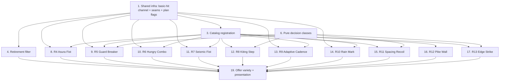

# Implementation Plan: Gauntlet Boon Playstyle Overhaul

## Overview

This plan reforms the three weapons' boon sets by **retiring weak boons and adding ten impactful substitutes**, grounded in the design document. It reuses the existing seams (`WeaponRunModifiers.Catalog`/`Plan`/`GauntletSteps`/`DirectDamageMultiplier`, `RunBoons.OfferReward`/`Choose`, `HookBus`, `AbilityHolder`, `BreakerGauntletCombat`, `SoftGroupingService`, `NavMeshAgent`) and invents no new architecture. Work is ordered so the shared plumbing lands first — the new basic-hit channel, the small seam methods, the `Cast_Plan` flags, and the retirement filter — then each boon is built on pure, tested logic before the `MonoBehaviour` integration that consumes it, so the project always compiles and no code is left orphaned.

Language: C# for Unity (the design is grounded in the existing C#/Unity codebase; no pseudocode).

Conventions applied throughout: preserve `.meta` files on any asset move/rename/create; no `FindObjectOfType`/`GameObject.Find`/magic strings in gameplay code; keep `MonoBehaviour`s thin and put decision logic in plain C# classes; apply all modifiers to runtime copies / per-cast snapshots only and never mutate source `ScriptableObject` assets; player/enemy displacement is NavMesh-only (never teleport through scenery).

Property tests reference the numbered Correctness Properties in `design.md`. Test sub-tasks are marked optional with `*`. Property-based tests use the project's `PropertyCheck.ForAll` harness in EditMode (asmdef/namespace `TechGuy.Tests.EditMode`, NUnit `[Test]`), running at least 100 generated cases each and carrying a `Feature: gauntlet-boon-playstyle-overhaul, Property {n}` comment (FsCheck/CsCheck are not available on this machine). Example/edge tests live in `*ExampleTests.cs`. Behavior that depends on NavMesh/physics goes to PlayMode (asmdef `TechGuy.Tests.PlayMode`).

## Tasks

- [x] 1. Shared infrastructure: basic-hit channel, seam methods, and `Cast_Plan` flags
  - [x] 1.1 Add the basic-hit channel to `HookBus`
    - In `Assets/_Project/Scripts/Core/HookBus.cs` add `event Action<Actor, float> OnBasicHit`, `event Action<Actor> OnBasicKill`, a `_basicKilled` `HashSet<Actor>` dedup set, `RaiseBasicHit(Actor, float)` and `RaiseBasicKill(Actor)` (dedup via `_basicKilled`, mirroring `RaiseKill`/`_killed`), dispatched through the existing isolated `Dispatch` helpers
    - Extend `Clear()` to null `OnBasicHit`/`OnBasicKill` and clear `_basicKilled`
    - _Requirements: 3.1, 3.2, 3.5_

  - [x] 1.2 Fire the basic-hit channel from the hitbox path
    - In `Assets/_Project/Scripts/Characters/Player/PlayerActor.cs` add `RaiseBasicAttackHit(Actor enemy, float dealt)`: null-guard `enemy`/`dealt <= 0`/`Hooks`, call `Hooks.RaiseBasicHit`, and call `Hooks.RaiseBasicKill` when `enemy.IsDead`; do NOT re-raise generic `OnHit`/`OnKill`
    - In `Assets/_Project/Scripts/Characters/Player/HitboxDamage.cs` (`TryDamageActor`), in the player-owner branch measure dealt damage (`before - actor.health`) around `DealResolvedAttackDamage` and call `attacker.RaiseBasicAttackHit(actor, dealt)` so only the hitbox path raises the basic channel
    - _Requirements: 3.1, 3.2, 3.3, 3.4_

  - [x] 1.3 Write property test for the basic-hit channel routing
    - **Property 5: Roteamento do canal de acerto básico** - the basic channel fires iff the hit came through the `HitboxDamage` path; a skill hit never fires it; generic `OnHit`/`OnKill` still fire on a basic hit; `OnBasicKill` at most once per death
    - **Validates: Requirements 3.1, 3.2, 3.3, 3.4, 4.3, 8.4**
    - EditMode test in `Assets/_Project/Tests/EditMode/BasicHitChannelPropertyTests.cs`

  - [x] 1.4 Add `AbilityHolder.ReduceCooldowns`
    - In `Assets/_Project/Scripts/Abilities/AbilityHolder.cs` add `ReduceCooldowns(float seconds)`: no-op when `seconds <= 0`, iterate slots, only touch slots with `states[i] == AbilityState.Cooldown`, set `cooldownTimers[i] = Mathf.Max(0f, cooldownTimers[i] - seconds)`; never read or write `ability.cooldownTime`
    - _Requirements: 6.1, 6.2, 6.3_

  - [x] 1.5 Write property test for `ReduceCooldowns`
    - **Property 12: Combo faminto reduz só recargas ativas, clampado** - a reduction lowers only `Cooldown` slots by the given seconds, never below zero, and leaves `Ready`/`Active` slots and the source asset untouched
    - **Validates: Requirements 6.1, 6.3**
    - EditMode test in `Assets/_Project/Tests/EditMode/ReduceCooldownsPropertyTests.cs`

  - [x] 1.6 Add `BreakerGauntletCombat.AddAsuraEnergy` and `HitboxDamage.SetStanceBreakEffect`
    - In `Assets/_Project/Scripts/Abilities/Weapon/BreakerGauntletCombat.cs` add `AddAsuraEnergy(int amount) => _momentum.AddEnergy(amount)` (thin delegate; `AddEnergy` already clamps to `[0, Maximum]`)
    - In `Assets/_Project/Scripts/Characters/Player/HitboxDamage.cs` add `SetStanceBreakEffect(StanceBreakEffect effect) => breakEffect = effect` (configures the basic's break effect, not per-hit `pushDistance`)
    - _Requirements: 4.1, 4.2, 7.1, 7.4_

  - [x] 1.7 Add the value-type flags to `ArsenalCastPlan`
    - In `Assets/_Project/Scripts/Weapons/WeaponRunModifiers.cs` add value-type fields to `ArsenalCastPlan` (preserving the immutability invariant): `bool MarkOnPulse`, `float MarkAmplify`, `float MarkSlow` (RainMark); `bool SpacingRecoil` (SpacingRecoil); `bool ControlZone`, `float ZonePush` (PikeWall)
    - _Requirements: 10.1, 10.2, 10.3, 11.1, 12.1, 12.2_

- [x] 2. Checkpoint - Ensure the project compiles and shared-infra tests pass
  - Ensure all tests pass, ask the user if questions arise.

- [x] 3. Catalog registration for the ten new boons
  - Append the ten new `WeaponBoon` enum values in `Assets/_Project/Scripts/Weapons/WeaponRunModifiers.cs` (unused, inédito names): `AsuraFist`, `GuardBreaker`, `HungryCombo`, `SeismicFist` (Gauntlet); `KitingStep`, `AdaptiveCadence`, `RainMark` (Bow); `SpacingRecoil`, `PikeWall`, `EdgeStrike` (Spear) - do NOT remove any retired enum values
  - Add a `Definition` row for each in the `Catalog` with its `RunWeaponFamily`, Portuguese title/description (phrased in terms of the playstyle it changes), and `MaxRank = 3`, following the existing catalog style
  - _Requirements: 1.5, 1.6, 1.8, 4.5, 5.6, 6.5, 7.5, 8.5, 9.5, 10.5, 11.6, 12.5, 13.5_

  - [x] 3.1 Write example tests for catalog structure
    - Each new `WeaponBoon` appears exactly once in the `Catalog` in the expected family with `MaxRank = 3`; the ten new names do not collide with existing enum values; preserved boons remain intact
    - _Requirements: 1.5, 1.8, 4.5, 5.6, 6.5, 7.5, 8.5, 9.5, 10.5, 11.6, 12.5, 13.5_
    - EditMode test in `Assets/_Project/Tests/EditMode/GauntletOverhaulCatalogExampleTests.cs`

  - [x] 3.2 Write property tests for asset isolation, monotonicity, and order independence
    - **Property 1: Isolamento de asset** - applying any new boon at any rank (and any retirement) leaves every source weapon/ability/status asset unchanged, and the `Catalog` still contains the retired entries (extends `AssetIsolationTests`)
    - **Property 2: Monotonicidade por rank** - each new boon's named quantity is non-decreasing across ranks 1..3
    - **Property 3: Independência de ordem** - equal rank multisets produce byte-identical `Plan`/`GauntletSteps`/`DirectDamageMultiplier` output (extends the order-determinism tests)
    - **Validates: Requirements 1.1, 1.2, 1.3, 2.6, 5.5, 6.2, 7.4, 10.4, 11.5, 12.4, 13.4**
    - EditMode test in `Assets/_Project/Tests/EditMode/GauntletOverhaulInvariantPropertyTests.cs`

- [x] 4. Retirement filter in the offer composition
  - In `Assets/_Project/Scripts/Core/RunBoons.cs` add the static `RetiredFamilyBoons` `HashSet<WeaponBoon>` containing `LongFists`, `StanceCrusher`, `Berserker` (Gauntlet); `HeavyBolt`, `Sniper`, `LongRain` (Bow); `LongReach`, `TripleMoon`, `Affliction` (Spear)
  - In `OfferReward`, remove the inline numeric offers `power`, `haste`, `recharge`, `crit`, `brutal`, `bulwark`, `swift` from the `pool` list; keep every preserved inline gameplay boon (`vitality`, `ignite`, `frost`, `transform`, `focus`, `conductor`, `detonation`, `reactor`, `resonance`, `overflow`)
  - In the family-offer gate loop, add `&& !RetiredFamilyBoons.Contains(definition.Kind)` so retired family boons are skipped while leaving the rank/ceiling gate and the choice-count loops unchanged
  - _Requirements: 2.1, 2.2, 2.3, 2.4, 2.5, 2.6, 14.2, 14.3, 14.4, 14.5_

  - [x] 4.1 Write property tests for the retirement and offer composition
    - **Property 6: Aposentados nunca ofertados** - no offer in any reward set has an id in the retired numeric set or in `RetiredFamilyBoons`
    - **Property 7: Composição de ofertas robusta** - `OfferReward` yields the same number of choices without throwing in any run state, including when all non-retired family boons are at `MaxRank`
    - **Property 8: Compatibilidade com aposentado herdado** - a pre-acquired retired-boon rank lets the run continue without error and without re-offering it
    - **Validates: Requirements 2.1, 2.2, 2.3, 2.5, 14.2, 14.3, 14.5**
    - EditMode test in `Assets/_Project/Tests/EditMode/RetirementOfferPropertyTests.cs`

  - [x] 4.2 Write example tests for preserved boons staying offerable
    - Each Preserved_Boon (inline gameplay boons and the preserved family boons per weapon) remains eligible/offerable after retirement
    - _Requirements: 2.4, 14.4_
    - EditMode test in `Assets/_Project/Tests/EditMode/PreservedBoonOfferExampleTests.cs`

- [x] 5. Checkpoint - Ensure the project compiles and catalog/retirement tests pass
  - Ensure all tests pass, ask the user if questions arise.

- [x] 6. Pure decision classes with property tests
  - [x] 6.1 Add `ConsecutiveHitCounter`
    - Add the pure class `Assets/_Project/Scripts/Core/ConsecutiveHitCounter.cs` (no Unity types): threshold ctor, `Count`, `RegisterBasicHit()` returning true and resetting on the Nth hit, `Reset()`, and static `StanceMultiplier(int rank) => 1 + 0.5 * rank`
    - _Requirements: 5.1, 5.3_

  - [x] 6.2 Write property test for the consecutive-hit counter
    - **Property 11: Guarda partida ao terceiro básico** - every third consecutive basic hit completes the run (stance multiplier `1 + 0.5R`) and any interruption resets the counter
    - **Validates: Requirements 5.1, 5.3**
    - EditMode test in `Assets/_Project/Tests/EditMode/ConsecutiveHitCounterPropertyTests.cs`

  - [x] 6.3 Add `KitingImpulse`
    - Add the pure static class `Assets/_Project/Scripts/Core/KitingImpulse.cs`: `Cooldown` constant, `ShouldReposition(Vector3 moveDir, Vector3 toNearestEnemy)` (true iff moving and dot < 0), `Distance(int rank)` scaled by `1 + 0.25 * rank`
    - _Requirements: 8.1, 8.2, 8.4_

  - [x] 6.4 Write property test for the kiting impulse decision
    - **Property 14: Disparo em recuo só ao afastar-se** - the impulse is granted iff moving away (negative dot), distance = `base × (1 + 0.25R)`, respecting the per-impulse cooldown
    - **Validates: Requirements 8.1, 8.2, 8.4**
    - EditMode test in `Assets/_Project/Tests/EditMode/KitingImpulsePropertyTests.cs`

  - [x] 6.5 Add `SpacingBand`
    - Add the pure static class `Assets/_Project/Scripts/Core/SpacingBand.cs`: `Min = 3.5f`, `Max = 6.5f`, `StepBack(float currentDistance, int rank)` scaled by `0.2 * rank` and clamped so the result never passes `Max`
    - _Requirements: 11.1, 11.2_

  - [x] 6.6 Write property test for the spacing band
    - **Property 17: Recuo controlado assenta na banda** - the step-back grows with R but the resulting distance never exceeds the band's upper edge; no connect ⇒ no-op
    - **Validates: Requirements 11.1, 11.2, 11.4**
    - EditMode test in `Assets/_Project/Tests/EditMode/SpacingBandPropertyTests.cs`

  - [x] 6.7 Add `EdgeBand`
    - Add the pure static class `Assets/_Project/Scripts/Core/EdgeBand.cs`: `IsEdge(float hitDistance, float thrustRange)` (`hitDistance >= 0.8 * thrustRange`), static `StanceMultiplier(int rank) => 1 + 0.4 * rank`
    - _Requirements: 13.1, 13.3_

  - [x] 6.8 Write property test for the edge band
    - **Property 19: Ponto cego recompensa a borda** (pure part) - `IsEdge` true only in the outer 20% of range; `StanceMultiplier` = `1 + 0.4R`
    - **Validates: Requirements 13.1, 13.3**
    - EditMode test in `Assets/_Project/Tests/EditMode/EdgeBandPropertyTests.cs`

- [x] 7. Checkpoint - Ensure the project compiles and pure-class tests pass
  - Ensure all tests pass, ask the user if questions arise.

- [x] 8. R4 - Asura Fist (gauntlet, basics charge Asura)
  - Add `Assets/_Project/Scripts/Core/AsuraSurge.cs` (per-run `MonoBehaviour`) with `Configure(PlayerActor, HookBus, BreakerGauntletCombat, int rank)`, mirroring `MomentumStacks`: subscribes to `HookBus.OnBasicHit`, adds `2 × rank` Asura via `AddAsuraEnergy` per basic hit, unsubscribes in `OnDestroy`
  - Add the field and a `case "weapon_AsuraFist"` in `RunBoons.Choose` (`Assets/_Project/Scripts/Core/RunBoons.cs`): `Add(def)`, create the component once, call `Configure` with the current rank
  - _Requirements: 4.1, 4.2, 4.3, 4.4_

  - [x] 8.1 Write property test for Asura generation
    - **Property 10: Punho de Asura adiciona energia limitada só do básico** - a basic hit yields `min(Maximum, e + 2R)`; a skill hit grants nothing from this boon
    - **Validates: Requirements 4.1, 4.2**
    - EditMode test in `Assets/_Project/Tests/EditMode/AsuraFistPropertyTests.cs`

- [x] 9. R5 - Guard Breaker (gauntlet, 3 basics break stance + knockback)
  - Add `Assets/_Project/Scripts/Core/ImpactGuardTracker.cs` (per-run `MonoBehaviour`) with `Configure(PlayerActor, HookBus, AbilityHolder, int rank)`: drives a `ConsecutiveHitCounter`, subscribes to `HookBus.OnBasicHit` (count) and `AbilityHolder.AbilityUsed` (reset), on the third hit calls `PlayerActor.ApplyHitReactionTo(victim, Stagger, Heavy, stance × StanceMultiplier(rank), StanceBreakEffect.Knockback, 0f)`, exposes `StreakChanged` for the HUD, unsubscribes in `OnDestroy`
  - Add the field and a `case "weapon_GuardBreaker"` in `RunBoons.Choose` mirroring task 8
  - _Requirements: 5.1, 5.2, 5.3, 5.4, 5.5_

  - [x] 9.1 Write property test for the guard-break streak
    - **Property 11: Guarda partida ao terceiro básico** (tracker + reaction spy) - break on every third basic hit; reset on skill/interruption; stance scaled by `1 + 0.5R`
    - **Validates: Requirements 5.1, 5.2, 5.3**
    - EditMode test in `Assets/_Project/Tests/EditMode/GuardBreakerPropertyTests.cs`

  - [x] 9.2 Write a PlayMode integration test for the knockback displacement
    - The stance-break knockback moves the enemy through its locomotion channel and never through solid scenery
    - _Requirements: 5.2_
    - PlayMode test in `Assets/_Project/Tests/PlayMode/GuardBreakerKnockbackPlayModeTests.cs`

- [x] 10. R6 - Hungry Combo (gauntlet, basics cut skill cooldowns)
  - Add `Assets/_Project/Scripts/Core/HungryComboTracker.cs` (per-run `MonoBehaviour`) with `Configure(PlayerActor, HookBus, AbilityHolder, int rank)`: subscribes to `HookBus.OnBasicHit`, calls `AbilityHolder.ReduceCooldowns(0.3f × rank)` per basic hit, unsubscribes in `OnDestroy`
  - Add the field and a `case "weapon_HungryCombo"` in `RunBoons.Choose` mirroring task 8
  - _Requirements: 6.1, 6.3, 6.4_

  - [x] 10.1 Write example tests for the hungry-combo wiring
    - A basic hit reduces live cooldowns by `0.3 × rank`; a skill hit does not trigger the reduction; teardown drops the subscription
    - _Requirements: 6.1, 6.4_
    - EditMode test in `Assets/_Project/Tests/EditMode/HungryComboExampleTests.cs`

- [x] 11. R7 - Seismic Fist (gauntlet, opt-in deliberate knockback)
  - In `Assets/_Project/Scripts/Weapons/WeaponRunModifiers.cs` `GauntletSteps`, after the clone loop, when `Rank(SeismicFist) > 0` set the cloned step's `breakEffect = StanceBreakEffect.Knockback` and `knockbackDistance *= 1 + 0.3 × rank`; leave per-hit `pushDistance` zeroed and the rank-0 baseline untouched
  - Add a `case "weapon_SeismicFist"` in `RunBoons.Choose`: `Add(def)` and, when the basic hitbox exists, call `HitboxDamage.SetStanceBreakEffect(StanceBreakEffect.Knockback)`; the rest is snapshot-only
  - _Requirements: 7.1, 7.2, 7.3, 7.4_

  - [x] 11.1 Write property test for the opt-in knockback
    - **Property 13: Punho sísmico é opt-in** - rank ≥ 1 ⇒ steps/hitbox declare `Knockback` with distance scaled by `1 + 0.3R`; rank 0 ⇒ baseline no-push behavior unchanged
    - **Validates: Requirements 7.1, 7.3**
    - EditMode test in `Assets/_Project/Tests/EditMode/SeismicFistPropertyTests.cs`

- [x] 12. R8 - Kiting Step (bow, fire-while-retreating reposition)
  - Add `Assets/_Project/Scripts/Core/KitingStepCoordinator.cs` (per-run `MonoBehaviour`) with `Configure(PlayerActor, CharControlScript, NavMeshAgent, int rank)`: subscribes to `CharControlScript.BasicAttackPerformed`, uses `KitingImpulse.ShouldReposition`/`Distance`, respects `_nextImpulseAt` cooldown, and moves the player via `_agent.Raycast`/`_agent.Move` guarded by `_agent.enabled && _agent.isOnNavMesh`; unsubscribes in `OnDestroy`
  - Add the thin `CurrentMoveDirection` getter to `Assets/_Project/Scripts/Characters/Player/CharControlScript.cs` exposing the already-computed locomotion direction (no new movement logic)
  - Add the field and a `case "weapon_KitingStep"` in `RunBoons.Choose` mirroring task 8
  - _Requirements: 8.1, 8.2, 8.3, 8.4_

  - [x] 12.1 Write a PlayMode integration test for the reposition impulse
    - Firing while moving away grants a navmesh-routed backward impulse that never crosses scenery; moving toward / standing still grants none
    - _Requirements: 8.1, 8.3, 8.4_
    - PlayMode test in `Assets/_Project/Tests/PlayMode/KitingStepPlayModeTests.cs`

- [x] 13. R9 - Adaptive Cadence (bow, distance-driven firing cadence)
  - Add `Assets/_Project/Scripts/Core/AdaptiveCadenceTracker.cs` (per-run `MonoBehaviour`) with `Configure(PlayerActor, HookBus, int rank, Object statSource)`, mirroring `PerfectSpacingFeedback`/`MomentumStacks`: on `HookBus.OnBasicHit`, measures distance and toggles a run-scoped `PlayerStatModifier(AttackSpeedMultiplier, IncreasedPercent, 15 × rank, RunBoons)` on at ≥6m / off at <6m; removes the modifier in `OnDestroy`
  - Add the field and a `case "weapon_AdaptiveCadence"` in `RunBoons.Choose` passing `this` as the stat source
  - _Requirements: 9.1, 9.2, 9.4_

  - [x] 13.1 Write property test for the adaptive cadence band
    - **Property 15: Cadência adaptativa por banda** - the cadence modifier is active iff the basic hit landed at ≥6m; a hit <6m removes it
    - **Validates: Requirements 9.1, 9.2**
    - EditMode test in `Assets/_Project/Tests/EditMode/AdaptiveCadencePropertyTests.cs`

- [x] 14. R10 - Rain Mark (bow, ultimate marks + amplifies + slows)
  - In `Assets/_Project/Scripts/Weapons/WeaponRunModifiers.cs` `Plan` (Bow slot R), set `plan.MarkOnPulse = Rank(RainMark) > 0`, `plan.MarkAmplify = 0.2f × Rank(RainMark)`, `plan.MarkSlow = Rank(RainMark) > 0 ? 0.4f : 0f`
  - Add `Assets/_Project/Scripts/Core/RainMarkRegistry.cs` (per-run `MonoBehaviour`): `Configure(float amplify, float slow)`, `Mark(Actor)` with expiry (applies slow via the existing status/locomotion channel), `AmplifierFor(Actor)` returning `1 + amplify` while marked else `1`, `Update()` expiring marks and restoring movement, `OnDestroy()` clearing and restoring
  - Have the rain pulse resolution call `RainMarkRegistry.Mark` when `plan.MarkOnPulse`, and multiply `PlayerActor.DealResolvedAttackDamage` by `RainMarkRegistry.AmplifierFor(enemy)` when the registry exists; add the field and `case "weapon_RainMark"` in `RunBoons.Choose`
  - _Requirements: 10.1, 10.2, 10.3, 10.4_

  - [x] 14.1 Write property test for the mark amplifier and slow round-trip
    - **Property 16: Chuva marcadora marca, amplifica e lentifica** - while marked `AmplifierFor` = `1 + 0.2R` (exactly `1` outside the mark); the slow applied on mark is restored when the mark expires
    - **Validates: Requirements 10.1, 10.2, 10.3**
    - EditMode test in `Assets/_Project/Tests/EditMode/RainMarkPropertyTests.cs`

- [x] 15. R11 - Spacing Recoil (spear, thrust settles into the ideal band)
  - In `Assets/_Project/Scripts/Weapons/WeaponRunModifiers.cs` `Plan` (Spear thrust branch), set `plan.SpacingRecoil = Rank(SpacingRecoil) > 0`
  - In `Assets/_Project/Scripts/Abilities/Weapon/ArsenalCombat.cs`, after resolving the thrust `primaryHits`, when `plan.SpacingRecoil && primaryHits > 0` step the player back by `SpacingBand.StepBack(distance, rank)` via the player's `NavMeshAgent` (`_agent.Raycast`/`_agent.Move`); no step-back when `primaryHits == 0`
  - Add a `case "weapon_SpacingRecoil"` in `RunBoons.Choose` (`Add(def)` only; snapshot-driven)
  - _Requirements: 11.1, 11.2, 11.3, 11.4, 11.5_

  - [x] 15.1 Write a PlayMode integration test for the step-back
    - A connecting thrust steps the player back inside the band via the navmesh without crossing scenery; a whiff applies no step-back
    - _Requirements: 11.1, 11.3, 11.4_
    - PlayMode test in `Assets/_Project/Tests/PlayMode/SpacingRecoilPlayModeTests.cs`

- [x] 16. R12 - Pike Wall (spear, sweep control zone pushes enemies out)
  - In `Assets/_Project/Scripts/Weapons/WeaponRunModifiers.cs` `Plan` (Spear slot W/Sweep), set `plan.ControlZone = Rank(PikeWall) > 0` and `plan.ZonePush = 0.3f × Rank(PikeWall)`
  - In `Assets/_Project/Scripts/Abilities/Weapon/ArsenalCombat.cs`, while the sweep runs and `plan.ControlZone`, push each caught enemy outward from the zone center via `SoftGroupingService.ApplyExternalDisplacement` scaled by `plan.ZonePush` (reusing the `ApplySweepDisplacement` pattern, direction inverted); skip enemies without `SoftGroupingService`
  - Add a `case "weapon_PikeWall"` in `RunBoons.Choose` (`Add(def)` only; snapshot-driven)
  - _Requirements: 12.1, 12.2, 12.3, 12.4_

  - [x] 16.1 Write property test for the outward push
    - **Property 18: Muralha de hastes empurra para fora** - rank ≥ 1 ⇒ the `Cast_Plan` declares the zone and each caught enemy is displaced outward from the center by a magnitude scaled by `1 + 0.3R` (snapshot-only)
    - **Validates: Requirements 12.1, 12.2**
    - EditMode test in `Assets/_Project/Tests/EditMode/PikeWallPropertyTests.cs`

  - [x] 16.2 Write a PlayMode integration test for the displacement channel
    - Caught enemies are pushed outward through `SoftGroupingService` locomotion and never through solid scenery
    - _Requirements: 12.3_
    - PlayMode test in `Assets/_Project/Tests/PlayMode/PikeWallPlayModeTests.cs`

- [x] 17. R13 - Edge Strike (spear, edge-of-reach reward)
  - Add `Assets/_Project/Scripts/Core/EdgeVulnerabilityRegistry.cs` (per-run `MonoBehaviour`) with `Configure(PlayerActor, AbilityHolder, int rank)`: subscribes to the resolved-hit channel (`AbilityHolder.AttackHitsResolved`), uses `EdgeBand.IsEdge`/`StanceMultiplier`, requests extra stance via `ApplyHitReactionTo` on edge hits, opens a `VulnerabilityWindow` on stance break, exposes `AmplifierFor(Actor)`, clears windows in `OnDestroy`
  - Multiply `PlayerActor.DealResolvedAttackDamage` by `EdgeVulnerabilityRegistry.AmplifierFor(enemy)` when the registry exists; add the field and `case "weapon_EdgeStrike"` in `RunBoons.Choose`
  - _Requirements: 13.1, 13.2, 13.3, 13.4_

  - [x] 17.1 Write property test for the vulnerability window
    - **Property 19: Ponto cego recompensa a borda** (registry part) - an edge hit opens a window whose `AmplifierFor` amplifies subsequent direct hits while open and returns to `1` when it expires; an inner hit opens none
    - **Validates: Requirements 13.1, 13.2, 13.3**
    - EditMode test in `Assets/_Project/Tests/EditMode/EdgeStrikePropertyTests.cs`

- [x] 18. Checkpoint - Ensure the project compiles and all boon tests pass
  - Ensure all tests pass, ask the user if questions arise.

- [x] 19. Offer variety and presentation
  - Extend `RunModifierPresentation.ScopeFor` in `Assets/_Project/Scripts/UI/RunModifierPresentation.cs` with the ten new `WeaponBoon` values, scoping each in terms of the playstyle it changes (e.g. `ATAQUE BÁSICO`, `KITING`, `R`, `ESTOCADAS`, `W`)
  - Add combination hints in `RunModifierPresentation.Hint` for the new boons (e.g. `weapon_AsuraFist` + Asura skills, `weapon_HungryCombo` + `weapon_FlurryEcho`, `weapon_RainMark` + `weapon_GuidedRain`, `weapon_PikeWall` + `weapon_Orbit`)
  - _Requirements: 15.1, 15.2, 15.3, 15.4, 14.1_

  - [x] 19.1 Write property test for impactful family variety
    - **Property 9: Variedade impactante por família** - with a family equipped and at least one of its impactful boons below `MaxRank`, every reward set includes at least one impactful offer for that family
    - **Validates: Requirements 14.1**
    - EditMode test in `Assets/_Project/Tests/EditMode/ImpactfulVarietyPropertyTests.cs`

  - [x] 19.2 Write example tests for presentation
    - `For`/`ScopeFor` return the Portuguese category/scope/description in the `"Nível X/Y"` format for the new boons; `Hint` surfaces combinations in the expected cases; the per-set choice count stays unchanged
    - _Requirements: 15.2, 15.3, 14.3_
    - EditMode test in `Assets/_Project/Tests/EditMode/GauntletOverhaulPresentationExampleTests.cs`

- [x] 20. Final checkpoint - Ensure the project compiles and run `TechGuy.Tests.EditMode`
  - [x] 20.1 Write property test for run-end teardown
    - **Property 4: Fim do run não deixa estado residual** - after `RunBoons.OnDestroy`, every new boon's run-scoped state (basic-channel subscriptions, `RunBoons`-tagged stat modifiers, coordinators/registries, `_basicKilled`) is cleared so no effect fires in a later run
    - **Validates: Requirements 1.4, 3.5, 4.4, 6.4, 9.4**
    - EditMode test in `Assets/_Project/Tests/EditMode/GauntletOverhaulTeardownPropertyTests.cs`

  - [x] 20.2 Ensure all tests pass, ask the user if questions arise.
    - Run the `TechGuy.Tests.EditMode` suite (and the PlayMode knockback/navmesh/displacement tests); if Unity cannot run from the CLI, validate through reference searches and `git diff` and report what was not run

## Task Dependency Graph

```json
{
  "waves": [
    { "id": 0, "tasks": ["1.1", "1.4", "1.6", "1.7"] },
    { "id": 1, "tasks": ["1.2", "1.3", "1.5", "3", "6.1", "6.3", "6.5", "6.7"] },
    { "id": 2, "tasks": ["3.1", "3.2", "4", "6.2", "6.4", "6.6", "6.8"] },
    { "id": 3, "tasks": ["4.1", "4.2", "8", "9", "10", "11", "14", "15", "16", "17"] },
    { "id": 4, "tasks": ["8.1", "9.1", "9.2", "10.1", "11.1", "13", "14.1", "15.1", "16.1", "16.2", "17.1"] },
    { "id": 5, "tasks": ["12", "13.1", "19"] },
    { "id": 6, "tasks": ["12.1", "19.1", "19.2", "20.1"] }
  ]
}
```

### Visual overview



Task 1 (shared infrastructure: the basic-hit channel, `ReduceCooldowns`, `AddAsuraEnergy`/`SetStanceBreakEffect`, and the `Cast_Plan` flags) and task 3 (catalog registration) are the foundation every boon attaches to; task 4 (retirement filter) is independent of the boons but gates the offer-variety work. Task 6 (pure decision classes) is tested in isolation before the coordinators in tasks 9/12/15/17 consume it, so the pure logic is proven correct before any `MonoBehaviour` integration. Tasks 8-17 are one boon each and are independent of one another once their shared seams exist. Task 19 (offer variety + presentation) comes last because its variety and presentation checks exercise the fully registered catalog and all wired boons.

## Notes

- Tasks marked with `*` are optional (tests) and can be skipped for a faster MVP; core implementation tasks are never optional.
- **Pure logic first**: `ConsecutiveHitCounter`, `KitingImpulse`, `SpacingBand`, and `EdgeBand` are plain C# classes tested with property tests before the coordinators consume them, so the project always compiles and nothing is orphaned.
- **Runtime-copy isolation**: every boon mutates only a per-cast `ArsenalCastPlan`/cloned `AreaHitStep` snapshot, a run-scoped `PlayerStatModifier` tagged with `RunBoons`, or a run-scoped coordinator/registry (`HookBus`, `RainMarkRegistry`, `EdgeVulnerabilityRegistry`). No source `ScriptableObject` is ever written, and no `.meta`/GUID is touched.
- **Retire ≠ delete**: the nine retired family enum/`Catalog` entries stay in `WeaponRunModifiers.Catalog` for compatibility with runs/saves that already acquired them; retirement only removes them from the `OfferReward` composition.
- **Teardown is already centralized**: `RunBoons.OnDestroy`/`ClearRunState` clears stat modifiers (`RemoveModifiersFrom`), and `HookBus.Clear` drops the basic-channel subscriptions and `_basicKilled`. New run-scoped state hooks into one of these channels rather than introducing a parallel lifecycle.
- **Test harness**: property tests use the project's `PropertyCheck.ForAll` (≥100 cases) in EditMode (`TechGuy.Tests.EditMode`); FsCheck/CsCheck are not available on this machine. Example/edge tests live in `*ExampleTests.cs`. NavMesh/physics-dependent behavior (knockback, step-back, outward push) goes to PlayMode (`TechGuy.Tests.PlayMode`).
- **Verification**: if Unity can run from the CLI, run the EditMode suite (and PlayMode for the knockback/navmesh/displacement tests). Otherwise validate through project structure inspection, reference searches, and `git diff`, and report what was not run.
- **Presentation/process criteria** (1.7, 5.4, 9.3, 15.1, 15.2, 15.3, 15.4) are covered by example/integration/smoke tests rather than Correctness Properties, per the design's Testing Strategy.
