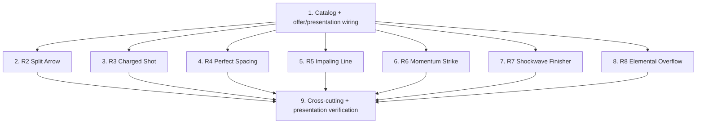

# Implementation Plan: Impactful Weapon Boons

## Overview

This plan implements seven playstyle-changing weapon boons in incremental, integrated steps grounded in the design document. Each boon plugs into an existing seam (`WeaponRunModifiers.Catalog`/`Plan`/`GauntletSteps`, `HookBus`, `PlayerOnHitEffects`, `RunSynergyEffects`, `PlayerArpgStats`), so work is ordered so the shared plumbing (catalog + offer/presentation wiring) lands first, then each boon is built and verified end-to-end.

Language: C# for Unity (the design is grounded in the existing C#/Unity codebase; no pseudocode).

Conventions applied throughout: preserve `.meta` files on any asset move/rename/create; no `FindObjectOfType`/`GameObject.Find`/magic strings in gameplay code; keep `MonoBehaviour`s thin and put decision logic in plain C# classes; apply all modifiers to runtime copies / per-cast snapshots only and never mutate source `ScriptableObject` assets.

Property tests reference the numbered Correctness Properties in `design.md`. Test sub-tasks are marked optional with `*`. Property-based tests use a .NET PBT library compatible with the Unity test runner (FsCheck via NUnit EditMode, or CsCheck); each property test runs at least 100 generated cases and carries a `Feature: impactful-weapon-boons, Property {n}` comment.

## Tasks

- [x] 1. Catalog + offer/presentation wiring for all new boons
  - Append the new `WeaponBoon` values to the enum in `WeaponRunModifiers.cs`: `SplitArrow`, `ChargedShot` (Bow); `PerfectSpacing`, `ImpalingLine` (Spear); `MomentumStrike`, `Shockwave` (Gauntlet) - use `MomentumStrike` to avoid colliding with the existing `Momentum` boon
  - Add a `Definition` row for each in the `Catalog` with its `RunWeaponFamily`, Portuguese title/description, and `MaxRank = 3`, following the existing catalog style
  - Add the cross-family `overflow` offer to the inline pool list in `RunBoons.OfferReward` (next to `conductor`/`reactor`) with a Portuguese title/description, and a `Choose` case that calls `_player.OnHitEffects.EnableElementalOverflow()`
  - Extend `RunModifierPresentation.ScopeFor` with the new `WeaponBoon` values and add an inline `For` case for the `overflow` id (category `ELEMENTO`, scope `ACERTOS`)
  - Verify each family boon is offered only while its family is equipped (family/rank gate) and that the choice count stays at 3
  - _Requirements: 1.5, 5.5, 2.5, 3.5, 4.5, 6.6, 7.5, 8.5, 9.1, 9.2, 9.4_


- [x] 2. R2 - Split Arrow (bow, on kill)
  - Add a `SplitArrowCoordinator` component with `Configure(PlayerActor owner, HookBus hooks, int rank)` that subscribes to `HookBus.OnKill`; add it (and call `Configure`) from `RunBoons.Choose` when SplitArrow is chosen
  - On kill, spawn exactly `rank` arrows from the victim's position on distinct headings via `ArsenalProjectile.Fire`, each at a fixed `.5f` damage multiplier (50% of the killing arrow)
  - Guard against chaining: a `_spawning` re-entrancy flag makes `OnKill` a no-op while spawning, so a split arrow's kill cannot produce further splits (one generation)
  - Bound spawns per frame to the cascade ceiling (`_spawnedThisFrame + rank <= 32`) so a mass kill cannot explode the projectile count
  - No-op when the owner is dead or the equipped weapon is not a bow (`FiresArrows`)
  - _Requirements: 2.1, 2.2, 2.3, 2.4, 1.4_

  - [x] 2.1* Write property test for split generation bound
    - **Property 5: Split Arrow generation bound** - a split arrow's kill spawns no further splits; per-frame spawns never exceed `MaxSecondaryHits`
    - **Validates: Requirements 2.3, 2.4**
    - PlayMode test with generated enemy layouts (physics spawn required)

  - [x] 2.2* Write property test for split count and damage
    - **Property 6: Split arrow count and damage** - rank r kill spawns exactly r arrows on distinct headings at 50% damage
    - **Validates: Requirements 2.1, 2.2**

- [x] 3. R3 - Charged Shot (bow, hold-to-overpower)
  - Add the pure helper `ChargedShot` with `ChargeTime = .6f`, `IsCharged(float heldSeconds)`, and `DamageMultiplier(int rank) => 1 + .75 * rank` (no Unity types, testable scene-free)
  - In `CharControlScript`, track how long the primary attack input has been held (`_primaryHeldSeconds`) while the boon is active and the weapon fires arrows
  - When a bow basic resolves into an arrow, choose charged vs normal: charged applies `DamageMultiplier(rank)` and piercing; a release before `ChargeTime` fires the normal (multiplier 1, non-piercing) arrow
  - Push the charge ratio (`_primaryHeldSeconds / ChargeTime`, clamped 0..1) to the existing `_playerHUD` each frame while holding; reaches full exactly at `ChargeTime`; null-guard the HUD
  - _Requirements: 3.1, 3.2, 3.3, 3.4_

  - [x] 3.1* Write property test for the charge threshold
    - **Property 7: Charged Shot threshold** - charged (damage × (1 + 0.75r), piercing) iff held ≥ 0.6s; normal otherwise
    - **Validates: Requirements 3.1, 3.2, 3.3**
    - EditMode test on the pure `ChargedShot` helper

- [x] 4. R4 - Perfect Spacing (spear, distance-band reward)
  - Add one term to `WeaponRunModifiers.DirectDamageMultiplier`: when `distance >= 3.5f && distance <= 6.5f`, multiply by `1 + .35 * Rank(WeaponBoon.PerfectSpacing)`
  - Keep the term pure and rank-keyed so it multiplies cleanly with `Sniper`/`SpearTip` and never writes back to any source asset
  - Add a small cosmetic feedback component that subscribes to the resolved-hit notification (`NotifyAttackHits`/`OnAfterAttackHits`), escalates as consecutive in-band direct hits land, and resets on an out-of-band hit; the visual never gates the damage term
  - _Requirements: 4.1, 4.2, 4.3, 4.4_

  - [x] 4.1* Write property test for the spacing band
    - **Property 8: Perfect Spacing band** - multiplier = (1 + 0.35r) when 3.5 ≤ d ≤ 6.5, exactly 1 outside
    - **Validates: Requirements 4.1, 4.2**
    - EditMode test on `DirectDamageMultiplier` across distances and ranks

- [x] 5. R5 - Impaling Line (spear, pierce-and-pull thrust)
  - Add value-type fields `bool ImpaleLine` and `float ImpalePull` to `ArsenalCastPlan` (preserving the immutability invariant: value types only)
  - In `WeaponRunModifiers.Plan` thrust branch (alongside EchoThrust/Phantom/Chain), set `plan.ImpaleLine = Rank(ImpalingLine) > 0` and `plan.ImpalePull = .75 * Rank(ImpalingLine)`
  - In `ArsenalCombat`, when `ImpaleLine` is true keep the thrust box length at the full `plan.Range` so `TryApplyAreaDamage` damages every enemy along the line (unchanged when false)
  - Add `ApplyImpalePull` (modeled on `GlideSweptEnemy`): for each connected enemy with a `SoftGroupingService`, glide it toward the player by up to `plan.ImpalePull` meters via `ApplyExternalDisplacement`; skip enemies without locomotion (no hard impulse, no teleport through scenery)
  - Drive everything from the per-cast `plan` snapshot; never write the source ability asset
  - _Requirements: 5.1, 5.2, 5.3, 5.4_

  - [x] 5.1* Write property test for pierce and pull
    - **Property 9: Impaling Line pierce and pull** - every enemy on the line is damaged; each connected enemy with locomotion is pulled ≤ 0.75r m, never through scenery
    - **Validates: Requirements 5.1, 5.2, 5.3**
    - PlayMode test with a generated line of enemies (physics + locomotion required)


- [x] 6. R6 - Momentum Strike (gauntlet, aggression stacks)
  - Add a `MomentumStacks` component with `MaxStacks = 10` and `Configure(PlayerActor player, HookBus hooks, int rank)`; add it from `RunBoons.Choose` when MomentumStrike is chosen
  - On each Direct_Hit, add one stack (clamped to `MaxStacks`); on taking damage, reset stacks to 0 - driven via `HookBus` and the player's damage-taken path (or `PlayerActor.HealthChanged` going down)
  - Represent the bonus as a single run-scoped `PlayerStatModifier(IncreasedDamagePercent, IncreasedPercent, 2 * rank * stacks)` tagged with `RunBoons` as source; on each stack change remove the old modifier and add a fresh one so `GetStat` reflects the current count
  - Push the stack count to the player HUD; clear to zero when stacks are lost; null-guard the HUD
  - Confirm teardown: `RunBoons.OnDestroy` already calls `Stats.RemoveModifiersFrom(this)`, which removes the momentum modifier (same source tag)
  - _Requirements: 6.1, 6.2, 6.3, 6.4, 6.5_

  - [x] 6.1* Write property test for stack and damage
    - **Property 10: Momentum stack and damage** - each hit adds a stack up to 10; bonus = (2·r·stacks)%; taking damage resets to zero
    - **Validates: Requirements 6.1, 6.2, 6.3**
    - EditMode test simulating hit/damage events

- [x] 7. R7 - Shockwave Finisher (gauntlet, combo end burst)
  - In `WeaponRunModifiers.GauntletSteps`, after the existing clone loop, when `Rank(Shockwave) > 0` and steps exist, append one JsonUtility deep-cloned `AreaHitStep` built from the final authored step
  - Set the clone to `hitShape = Sphere`, `sphereRadius = 3 * (1 + .2 * shock)`, centered on the player (`localOffset`/`rangeOverride` like ShockRing), `damageMultiplier *= .6`, and a small added `delay`
  - Keep the inherited `stanceDamage`/`pushDistance` so the shockwave applies stance and outward push through the same `AreaHitStep` channel (interacts with StanceCrusher/ShockRing with no special casing)
  - Confirm every step is a deep clone so the source ability's authored steps are never mutated
  - _Requirements: 7.1, 7.2, 7.3, 7.4_

  - [x] 7.1* Write property test for the shockwave append
    - **Property 11: Shockwave append** - exactly one sphere step appended with radius 3·(1+0.2r); source steps unchanged
    - **Validates: Requirements 7.1, 7.2, 7.4**
    - EditMode test on `GauntletSteps`

- [x] 8. R8 - Elemental Overflow (cross-family, spend status for a burst)
  - Add `_overflowRank` + `EnableElementalOverflow()` to `PlayerOnHitEffects` (increment per pick)
  - Add `TryElementalOverflow(Actor enemy, float damageDealt)` called from `ApplyTo` on a direct hit (`damageDealt > 0`): when `_overflowRank > 0` and the enemy carries an active `BurnStatus` or `ChillStatus`, deal `damageDealt * .5 * _overflowRank`
  - Route the burst through `RunSynergyEffects.ReportImpact` (falling back to `TakeDamage` when no Resonance) so it is bounded by `MaxSecondaryHits` and Resonance-eligible, and never removes the underlying status
  - No-op when the enemy carries neither status; confirm it composes with Thermal Shock (two distinct bounded impacts under one budget)
  - _Requirements: 8.1, 8.2, 8.3, 8.4_

  - [x] 8.1* Write property test for the overflow gate
    - **Property 12: Elemental Overflow gate** - burst of 0.5r·d triggers iff an active status is present; status remains; counts against the cascade budget
    - **Validates: Requirements 8.1, 8.2, 8.3, 8.4**
    - EditMode test using `ReportImpact`

- [x] 9. Cross-cutting guarantees and offer/presentation verification
  - Add combination hints in `RunModifierPresentation.Hint` for the new boons (`weapon_ChargedShot` + piercing/sniper, `weapon_SplitArrow` + `weapon_TwinShot`, `weapon_MomentumStrike` + bulwark/vitality, `overflow` + ignite/frost)
  - Verify cards render with the correct family category/accent and the `Nível X/Y` format, and that adding candidates does not change the 3-choice cap
  - _Requirements: 9.1, 9.2, 9.3, 9.4_

  - [x] 9.1* Write property tests for the cross-cutting guarantees
    - **Property 1: Asset isolation** - applying any new boon at any rank leaves every source asset unchanged (extends `AssetIsolationTests`)
    - **Property 2: Monotonicity with rank** - each family boon's named quantity is non-decreasing across ranks 1..3
    - **Property 3: Order independence** - equal rank multisets produce byte-identical plan/step output (extends order-determinism tests)
    - **Property 4: Run-end leaves no residual state** - after `RunBoons.OnDestroy`, Hook subs, momentum stat mod, and overflow rank are cleared
    - **Property 13: Cascade bounds invariant** - Split Arrow + Overflow never exceed `MaxSecondaryHits` in a frame
    - **Validates: Requirements 1.1, 1.2, 1.3, 1.4, 6.5, 2.4, 8.3**


## Task Dependency Graph

```json
{
  "waves": [
    { "id": 0, "tasks": ["1"] },
    { "id": 1, "tasks": ["2", "3", "4", "5", "6", "7", "8"] },
    { "id": 2, "tasks": ["2.1", "2.2", "3.1", "4.1", "5.1", "6.1", "7.1", "8.1"] },
    { "id": 3, "tasks": ["9"] },
    { "id": 4, "tasks": ["9.1"] }
  ]
}
```

### Visual overview



Task 1 (catalog + wiring) is the foundation: it registers every new `WeaponBoon` and the `overflow` offer so the per-boon tasks have something to attach behavior to. Tasks 2-8 are independent of one another and can be done in any order (or in parallel) once task 1 lands. Task 9 (cross-cutting guarantees + combination hints + full-suite verification) comes last because its asset-isolation, monotonicity, order-independence, run-end-cleanup, and cascade-bound properties exercise all the boons together.

## Notes

- **Runtime-copy isolation**: every boon mutates only a per-cast `ArsenalCastPlan`/cloned `AreaHitStep` snapshot, a run-scoped `PlayerStatModifier` tagged with `RunBoons`, or a run-scoped registry (`PlayerOnHitEffects`, `HookBus`). No source `ScriptableObject` is ever written.
- **Teardown is already centralized**: `RunBoons.OnDestroy`/`ClearRunState` clears stat modifiers (`RemoveModifiersFrom`), the element registry (`PlayerOnHitEffects.Clear`, which resets `_overflowRank`), and the event bus (`HookBus.Clear`, which drops SplitArrow/Momentum subscriptions). New run-scoped state must hook into one of these channels rather than introducing a parallel lifecycle.
- **Naming**: the Gauntlet catalog already has a `Momentum` boon (Asura energy). The new aggression-stack boon is `MomentumStrike`; the new area finisher is `Shockwave` (distinct from the existing `ShockRing`).
- **Verification**: if Unity can run from the CLI, run the EditMode suite (and PlayMode for the Split Arrow/Impaling Line projectile/locomotion tests). Otherwise validate through project structure inspection, reference searches, and `git diff`, and report what was not run.
- **Presentation/process criteria** (3.4, 4.4, 6.4, 9.1, 9.2, 9.3, 9.4) are covered by example/integration/smoke tests rather than Correctness Properties, per the design's Testing Strategy.
