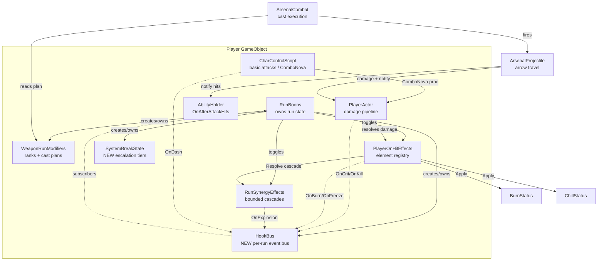
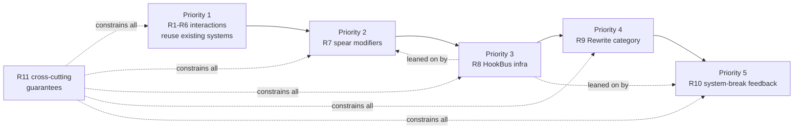
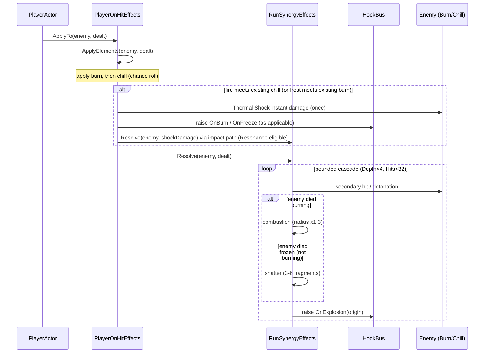

# Design Document

## Overview

This feature realizes the modifier-and-synergy roadmap from `Docs/Tech-Guy_Modificadores_e_Sinergias.md` (section 17 priorities), making Tech-Guy's per-run rewards *converse* with one another. The work is layered so that **Priority 1 interactions (Requirements 1–6)** are the foundational, near-term slice that reuses the systems already in the codebase, and later priorities build on top: spear behavior modifiers (R7), a generic combat-event Hook bus (R8), a formal Rewrite category (R9), "system breaking" feedback (R10), and cross-cutting guarantees (R11).

The design deliberately reuses the existing runtime-copy isolation (`RunBoons` instantiates copies of the weapon, abilities, and now nothing writes to source assets) and the existing bounded-cascade engine (`RunSynergyEffects` with `MaxDepth = 4` and `MaxSecondaryHits = 32`). No numeric rebalancing is in scope: the goal is behavior, visibility, and eliminating accidental anti-synergies.

### Design goals

- Make each Priority 1 pair produce a visible, reinforcing interaction rather than a cancellation (R1–R6).
- Keep every new effect inside the existing cascade bounds and runtime-copy isolation (R11).
- Introduce the `HookBus` as shared, per-run, exception-isolated infrastructure that later modifiers can lean on (R8), owned alongside `RunBoons`.
- Keep `MonoBehaviour`s thin; put decision logic in plain C# classes (`HookBus`, `WeaponRunModifiers`, `SystemBreakState`) per project rules.
- Never mutate an original weapon/ability/status `ScriptableObject`; never touch `.meta`/GUIDs.

### Guiding principle from the design doc (section 15)

> Two interesting modifiers should work together, produce a special interaction, or at minimum not invalidate each other.

The clearest offender today is *Piercing vs Ricochet* — the ricochet branch in `ArsenalProjectile.Update` executes and `return`s before the piercing `continue`, so an arrow with both never pierces. Fixing the branch order (pierce first, ricochet only when nothing remains in-line) is the anchor of Requirement 1.

## Architecture

### System context

The run is owned by `RunBoons` (on the player GameObject). It already instantiates runtime copies of the weapon and abilities, tracks acquired offers, and cleans up on `OnDestroy`. This feature adds three run-scoped, `RunBoons`-owned collaborators and extends four existing combat scripts.



### Priority layering



The Hook bus (P3) is drawn as infrastructure that P2 and P5 can lean on: spear chain/return effects and system-break feedback can subscribe to `OnKill`, `OnStanceBreak`, etc. rather than threading bespoke callbacks.

### Element/cascade interaction flow (R2, R3)



## Components and Interfaces

All signatures below are grounded in the current code. New members are marked `// NEW`; changed members note the exact edit.

### R1 — `ArsenalProjectile` (pierce-first, then ricochet)

The fix reorders the hit-resolution block inside `Update`. Today the ricochet branch runs and `return`s before `if (_piercing) continue;`. The corrected order evaluates piercing continuation first (an un-hit live enemy on the current straight-line heading means keep going straight), and only enters the ricochet redirect when nothing remains in-line.

```csharp
// ArsenalProjectile.Update — hit resolution, revised order (R1)
if (actor)
{
    if (actor == _owner || actor.IsDead || !_hit.Add(actor)) continue;
    if (_owner.TryApplyDamage(actor, _damage, _multiplier, 0f) &&
        _owner.TryGetComponent(out AbilityHolder holder))
        holder.NotifyAttackHits(_owner, new[] { actor });

    // R1.1/R1.4: pierce every un-hit enemy on the current straight-line heading first.
    if (_piercing && HasInlineTarget()) continue; // travels straight, no bounce consumed

    // R1.2/R1.4: only ricochet once nothing remains in-line.
    if (_bounces > 0)
    {
        Actor next = FindNextTarget(hit.point, 6f, false);
        if (next)
        {
            _bounces--; _multiplier *= .75f;              // R1.3
            Vector3 aim = (next.transform.position + Vector3.up - hit.point).normalized;
            transform.SetPositionAndRotation(hit.point + aim * .15f, Quaternion.LookRotation(aim));
            _remaining -= hit.distance;
            return;
        }
    }

    if (_piercing) continue; // R1.1 fallback: pierce even when no ricochet target is available
}
```

```csharp
// NEW helper: is there an un-hit live enemy on the current straight-line heading?
private bool HasInlineTarget()
{
    RaycastHit[] ahead = Physics.SphereCastAll(transform.position, .12f, transform.forward,
        _remaining, Physics.DefaultRaycastLayers, QueryTriggerInteraction.Collide);
    foreach (RaycastHit h in ahead)
    {
        if (h.collider.transform.IsChildOf(_owner.transform)) continue;
        Actor a = h.collider.GetComponentInParent<Actor>();
        if (a && a != _owner && !a.IsDead && !_hit.Contains(a)) return true;
        if (!a && !h.collider.isTrigger) return false; // solid scenery blocks the line
    }
    return false;
}
```

Behavior notes:
- R1.5: when `_bounces == 0` and `_piercing` is false after a hit, the existing `Destroy(gameObject)` path runs (unchanged).
- R1.6: the existing `_hit.Add(actor)` guard already prevents a second hit on the same enemy; kept as the single source of truth.
- Scenery still blocks (the non-`Actor`, non-trigger branch already destroys the arrow).

### R2 — `PlayerOnHitEffects` (Thermal Shock)

`ApplyElements` is extended to coordinate the two elements it already applies. It samples pre-existing status presence, applies burn/chill as before, then — if a *newly applied/refreshed* element meets a pre-existing opposite element — triggers Thermal Shock exactly once and routes the burst through the impact path so Resonance can amplify it.

```csharp
// PlayerOnHitEffects — configurable Thermal Shock (R2)
[SerializeField] private float _thermalShockMultiplier = 1.5f; // > 0; runtime-tunable, never on a shared asset
public void ConfigureThermalShock(float multiplier) => _thermalShockMultiplier = Mathf.Max(0f, multiplier);

public void ApplyElements(Actor enemy, float damageDealt)
{
    if (!enemy || enemy.IsDead || enemy is PlayerActor) return;

    bool hadBurn  = enemy.GetComponent<BurnStatus>();
    bool hadChill = ChillActive(enemy); // remaining duration > 0

    bool appliedFire = false, appliedFrost = false;
    if (_burnEnabled && _burnDps > 0f)
    {
        BurnStatus.Apply(enemy, _burnDps + damageDealt * (_synergies ? _synergies.BurnScaling : 0f), _burnDuration);
        appliedFire = true;
        _hooks?.RaiseBurn(enemy);        // R8.5
    }
    if (_chillEnabled && _chillSlow > 0f && Random.value <= _chillChance)
    {
        ChillStatus.Apply(enemy, _chillSlow, _chillDuration);
        appliedFrost = true;
        if (_chillSlow >= ChillStatus.FreezeThreshold) _hooks?.RaiseFreeze(enemy); // R8.4
    }

    // R2.1/R2.2/R2.3/R2.7: fire onto existing chill, or frost onto existing burn -> at most one shock.
    bool shock = (appliedFire && hadChill) || (appliedFrost && hadBurn);
    if (shock && _thermalShockMultiplier > 0f && damageDealt > 0f)
        TriggerThermalShock(enemy, damageDealt * _thermalShockMultiplier);
}

private void TriggerThermalShock(Actor enemy, float amount)
{
    float before = enemy.health;
    enemy.TakeDamage(amount);                        // R2.4 instantaneous, does not touch DoT timers
    float dealt = before - enemy.health;             // R2.5 statuses left intact
    if (dealt > 0f && _synergies)                    // R2.6 route through the Resonance-amplified impact path
        _synergies.ReportImpact(enemy, dealt, this);
}
```

- R2.5: Thermal Shock never calls `BurnStatus`/`ChillStatus` removal; both remain with unchanged durations.
- R2.6: `ReportImpact` is a thin entry into the same amplification math already inside `RunSynergyEffects.Resolve` (see below), so the burst is eligible for Resonance without re-implementing amplification.
- R2.7: the `shock` boolean fires at most one `TriggerThermalShock` per `ApplyElements` call.
- A guard flag prevents re-entrancy: cascade-driven `ApplyElements` calls (from `RunSynergyEffects.Resolve`) do not recursively trigger new shocks beyond the single per-call rule.

`ChillStatus.FreezeThreshold` is promoted from `private const` to `internal const` (or exposed via a static getter) so the freeze/shock checks can read it without a magic number.

### R2/R3 — `RunSynergyEffects` (Resonance-eligible impacts, combustion, shatter)

A small `ReportImpact` entry point lets Thermal Shock feed the amplified impact path. `Resolve` is extended at the death-explosion branch to distinguish combustion vs shatter.

```csharp
// RunSynergyEffects — NEW: single amplified impact for Thermal Shock (R2.6)
public void ReportImpact(Actor target, float damage, PlayerOnHitEffects elements)
{
    if (_resolving || !target || damage <= 0f || Rank(RunSynergy.Resonance) == 0) return;
    int statuses = (target.GetComponent<BurnStatus>() ? 1 : 0) + (target.GetComponent<ChillStatus>() ? 1 : 0);
    // Amplification uses the same 1 + .4*Resonance*statuses rule; no new cascade is started.
    // Emitted as a bounded single hit so it cannot exceed MaxSecondaryHits.
}
```

```csharp
// RunSynergyEffects.Resolve — detonation branch, extended (R3)
bool explode = impact.Target.IsDead && detonation > 0;
if (explode)
{
    bool burning = impact.Target.GetComponent<BurnStatus>();
    bool frozen  = impact.Target.GetComponent<ChillStatus>();
    float radius = 3f + .5f * detonation;
    if (frozen)                         // R3.2/R3.3: shatter takes precedence, applied once
        radius = ShatterExplosion(origin, radius, detonation); // emits 3-6 fragments, distinct VFX
    else if (burning)                   // R3.1: combustion
        radius *= 1.3f;
    _hooks?.RaiseExplosion(origin);     // R8.8
}
```

- R3.4: the existing `while (_pending.Count > 0 && LastSecondaryHits < MaxSecondaryHits)` loop and `impact.Depth >= MaxDepth` guard are untouched; combustion/shatter only change radius/fragment presentation, and every fragment hit still increments `LastSecondaryHits` and is subject to `_visited`/one-hit-per-target.
- R3.3: shatter is chosen when both statuses are present, and applied once per death (guarded by `_visited.Add`).
- R3.5: Reactor amplification stays in `BurnScaling` (`PlayerOnHitEffects.ApplyElements` already scales burn DPS by `_synergies.BurnScaling`); no separate DoT is created.
- R3.6: isolated burn ticks call `Host.TakeDamage` in `BurnStatus.Tick`, which does not run through `RunSynergyEffects.Resolve`, so they never initiate a detonation. This is preserved by *not* wiring burn ticks to the cascade.

### R4 — `ArsenalProjectile` + `ArsenalCombat` (Homing + WideVolley fan-then-home)

WideVolley already sets `plan.Arrows += 4 * Rank(WideVolley)` and `ArsenalCombat` fires each along a fan heading. Homing already sets `_homing`. Two adjustments make the fan-then-home behavior explicit:

```csharp
// ArsenalProjectile — homing seek, refined (R4)
private const float SeekInterval = .1f;   // R4.2
private const float SeekRadius   = 7f;    // R4.2
private const float SeekConeDeg  = 50f;   // R4.2 half-angle via FindNextTarget forwardOnly
private const float TurnRateDeg  = 180f;  // R4.2 max turn rate

// R4.1: no correction on the launch frame — first seek is scheduled one interval out.
private void OnFirstUpdate() => _nextSeek = Time.time + SeekInterval;
```

- R4.1: `_nextSeek` is initialized to `Time.time + SeekInterval` at spawn, so the launch frame applies zero homing correction and the initial heading equals the fan heading assigned in `FireSingle`/`ArsenalCombat`.
- R4.2: `FindNextTarget(transform.position, 7f, true)` already enforces the 7-unit radius and 50° forward cone; `RotateTowards(..., 180 * Time.deltaTime)` enforces the turn-rate cap.
- R4.3: when `FindNextTarget` returns null, the arrow keeps its heading (existing behavior — the rotation block is skipped).
- R4.4: each arrow calls `FindNextTarget` from its own `transform.position`/`transform.forward`, so arrows seek independently.
- R4.5: the sweep uses `SphereCastAll` (radius `.12f`); the existing non-`Actor` non-trigger branch destroys the arrow at scenery, preventing wall pass-through.
- R4.6: TwinShot multiplication happens in `ArsenalProjectile.Fire` (loop over `count`), and each spawned arrow runs its own `Update`/seek, so fan-then-home applies to every multiplied arrow.

No shared asset is written; all values are constants or read from `WeaponRunModifiers` ranks.

### R5 — `WeaponRunModifiers.Plan` + `RunModifierPresentation` (TripleMoon + Orbit)

The plan already implements the combined math for spear slot 1; the design formalizes each branch and confirms the hint.

```csharp
// WeaponRunModifiers.Plan — spear slot 1 (R5), per-cast snapshot only
if (slot == 1)
{
    plan.Hits  += 2 * Rank(WeaponBoon.TripleMoon);       // R5.1/R5.2 base + 2 per TripleMoon rank
    plan.Width *= 1 + .25f * Rank(WeaponBoon.Orbit);     // R5.1/R5.3 width x(1 + .25/rank)
    plan.Travel = Rank(WeaponBoon.Orbit) > 0;            // R5.1/R5.3 outward travel enabled by Orbit
}
```

- R5.1: both active → `Hits = base + 2*TripleMoon`, `Travel = true` (1.5 m/pulse consumed in `ArsenalCombat`: `center += direction * (i * 1.5f)`), width scaled.
- R5.2: only TripleMoon → hits increased, `Travel = false` (Orbit rank 0), width unchanged (`1 + .25*0 = 1`).
- R5.3: only Orbit → travel enabled, width scaled, hits unchanged (TripleMoon rank 0).
- R5.4: `RunModifierPresentation.Hint("weapon_Orbit")` already returns "COMBINAÇÃO ATIVA · luas avançam a cada pulso." when TripleMoon is owned; extended to also fire when both appear together in the same offer set.
- R5.5: `Plan` builds a fresh `ArsenalCastPlan` each cast from ability getters; it never assigns back to the `ArsenalAbility`/`WeaponScript`. Confirmed by reading `Plan` and `ArsenalCastPlan` ctor.

### R6 — `CharControlScript` + `WeaponRunModifiers` (Haste feeds ComboNova)

This interaction is emergent and already present; the design documents and hardens it. `PerformAttack` increments `_runBasicCount` and fires a nova on `_runBasicCount % 3 == 0` when `ComboNova` rank > 0; the basic interval already divides by `AttackSpeedMultiplier` via `PlayerActor.GetAttackInterval`.

```csharp
// CharControlScript.PerformAttack — ComboNova proc (R6), unchanged semantics
_runBasicCount++;
int nova = playerActor.RunModifiers?.Rank(WeaponBoon.ComboNova) ?? 0;
if (nova > 0 && _runBasicCount % 3 == 0)
    playerActor.TryApplyAreaDamage(transform.position + Vector3.up * (1f - 2.5f), transform.forward,
        .01f, Vector3.one, AreaHitShape.Sphere, 2.5f, attackLayers, weapon.attackDamage, .6f * nova, 0f, null);
```

- R6.1: nova radius 2.5 m, damage `0.6 * nova * weaponDamage`, on every third basic (`% 3 == 0`).
- R6.2: `attackInterval = base / AttackSpeedMultiplier`; Haste adds 0.25 per rank to that multiplier, so basics-per-window (and thus nova procs per window) scale proportionally.
- R6.3: proc gate is purely `_runBasicCount % 3 == 0`; changing attack speed (≥ 0.01, floored in `PlayerArpgStats.AttackSpeedMultiplier`) only changes frequency, never which basic fires the nova.
- R6.4: `RunModifierPresentation.Hint` gains a `haste`/`weapon_ComboNova` case that states Haste accelerates ComboNova only when both are owned or both appear in the same offer.
- R6.5: rank-0 ComboNova (`nova == 0`) skips the nova and leaves the basic outcome otherwise unchanged.

### R7 — New spear behavior modifiers (Priority 2)

Add 2–4 new `WeaponBoon` values with catalog `Definition`s (family = Spear), consumed by `WeaponRunModifiers.Plan` and `ArsenalCombat`. The design specifies all four; the delivered set is any 2–4 of them.

```csharp
// WeaponRunModifiers — new enum members (R7)
public enum WeaponBoon
{
    /* existing... */,
    PhantomSpear, MoonShard, ReturnWave, ChainThrust // NEW spear behaviors
}

// Catalog additions (family = Spear, offered only for equipped Spear via existing Family gate)
new Definition(WeaponBoon.PhantomSpear, RunWeaponFamily.Spear, "Lança fantasma", "Estocadas repetem com uma cópia espectral após um instante.", 1),
new Definition(WeaponBoon.MoonShard,    RunWeaponFamily.Spear, "Lua partida",    "Varreduras lançam projéteis a partir das extremidades."),
new Definition(WeaponBoon.ReturnWave,   RunWeaponFamily.Spear, "Retorno de pacote", "Ondas retornam ao jogador ao atingir o alcance."),
new Definition(WeaponBoon.ChainThrust,  RunWeaponFamily.Spear, "Encadeamento",   "Estocadas encadeiam uma estocada curta a um inimigo próximo."),
```

Consumption in the plan and cast:

```csharp
// WeaponRunModifiers.Plan — spear additions (R7)
if (ability.Kind == ArsenalSkillKind.Thrust)
{
    plan.PhantomDelay = Rank(WeaponBoon.PhantomSpear) > 0 ? .35f : 0f;   // R7.2 within 0.2-0.5s
    plan.ChainThrust  = Rank(WeaponBoon.ChainThrust) > 0;                // R7.5/R7.6
}
if (ability.Kind == ArsenalSkillKind.Sweep)
    plan.ShardCount = Mathf.Clamp(2 * Rank(WeaponBoon.MoonShard), 0, 6); // R7.3 between 2 and 6
if (slot == 3)
    plan.ReturnWave = Rank(WeaponBoon.ReturnWave) > 0;                   // R7.4
```

- R7.1/R7.7: each new entry has title, description, family = Spear, max rank, a presentation scope via `RunModifierPresentation.ScopeFor`, and inherits offer eligibility from the existing `definition.Family == WeaponModifiers.Family` gate in `RunBoons.OfferReward`.
- R7.2: PhantomSpear schedules a delayed spectral repeat of the thrust in `ArsenalCombat` after `plan.PhantomDelay` (0.2–0.5 s).
- R7.3: MoonShard fires `plan.ShardCount` (2–6) projectiles from sweep extremities via `ArsenalProjectile.Fire`.
- R7.4: ReturnWave reverses a `DragonWave`-style wave at max range (a projectile flag that flips heading toward the player).
- R7.5/R7.6: ChainThrust, on a thrust hit, searches within 6 m for a *different* enemy and creates exactly one short chain thrust; if none exists, it creates nothing.
- R7.8: applied to runtime copies only — the plan is a per-cast snapshot; no asset writes.
- R7.9: chain thrusts, shard projectiles, and phantom repeats that produce secondary hits route through the same damage/cascade path and stay within `MaxDepth`/`MaxSecondaryHits`.

### R8 — `HookBus` (generic combat-event infrastructure, Priority 3)

A plain C# class owned by `RunBoons`, exposing named events with zero-or-more subscribers, exception isolation, and a `Clear()` for run end. It is *not* a `MonoBehaviour`; combat scripts get a reference to it via `RunBoons` (serialized/explicit resolution, never `FindObjectOfType`).

```csharp
// NEW: Assets/_Project/Scripts/Core/HookBus.cs
public enum CombatHook { Crit, Kill, Freeze, Burn, StanceBreak, Dash, Explosion }

public sealed class HookBus
{
    public event Action<Actor, float> OnCrit;      // R8.2 enemy + resolved damage, after applied
    public event Action<Actor> OnKill;             // R8.3 once per enemy
    public event Action<Actor> OnFreeze;           // R8.4 after frozen applied
    public event Action<Actor> OnBurn;             // R8.5 after burn applied/refreshed
    public event Action<Actor> OnStanceBreak;      // R8.6 after stance-broken
    public event Action OnDash;                    // R8.7 once per dash
    public event Action<Vector3> OnExplosion;      // R8.8 explosion origin

    private readonly HashSet<Actor> _killed = new HashSet<Actor>(); // R8.3 dedupe

    public void RaiseCrit(Actor e, float dmg) => Safe(() => OnCrit?.Invoke(e, dmg));
    public void RaiseKill(Actor e) { if (e && _killed.Add(e)) Safe(() => OnKill?.Invoke(e)); }
    public void RaiseFreeze(Actor e) => Safe(() => OnFreeze?.Invoke(e));
    public void RaiseBurn(Actor e) => Safe(() => OnBurn?.Invoke(e));
    public void RaiseStanceBreak(Actor e) => Safe(() => OnStanceBreak?.Invoke(e));
    public void RaiseDash() => Safe(() => OnDash?.Invoke());
    public void RaiseExplosion(Vector3 origin) => Safe(() => OnExplosion?.Invoke(origin));

    // R8.10: invoke every subscriber; swallow exceptions per-subscriber, never re-raise.
    private static void Safe(Action raise)
    {
        Delegate[] list = /* GetInvocationList of the underlying event */;
        foreach (Delegate d in list)
            try { d.DynamicInvoke(/* args */); }
            catch (Exception ex) { Debug.LogException(ex); }
    }

    // R8.9: drop every subscription so the ended run's subscribers never fire again.
    public void Clear()
    {
        OnCrit = null; OnKill = null; OnFreeze = null; OnBurn = null;
        OnStanceBreak = null; OnDash = null; OnExplosion = null;
        _killed.Clear();
    }
}
```

Implementation note: to satisfy per-subscriber isolation (R8.10), each hook is invoked by iterating `GetInvocationList()` on its backing delegate and wrapping each call in try/catch, rather than a single `?.Invoke`. The snippet's `Safe` is illustrative; the concrete code has one iterate-and-catch helper per event signature.

Raise-site wiring (grounded in existing signals):

| Hook | Raise site | Grounding |
| --- | --- | --- |
| OnCrit (R8.2) | `PlayerActor.DealResolvedAttackDamage` after `TakeDamage`, using `RollAttackDamage(...).IsCritical` | `AttackDamageRoll.IsCritical` exists but is currently discarded |
| OnKill (R8.3) | `PlayerActor.DealResolvedAttackDamage` when `enemy.IsDead` after damage; deduped in `HookBus` | `Actor.Died` also available as a backstop |
| OnFreeze (R8.4) | `PlayerOnHitEffects.ApplyElements` when chill applied at/above `FreezeThreshold` | `ChillStatus` freeze logic |
| OnBurn (R8.5) | `PlayerOnHitEffects.ApplyElements` when burn applied/refreshed | `BurnStatus.Apply` |
| OnStanceBreak (R8.6) | subscribe to `CombatReactionController.StanceBroken` for player-caused breaks | existing `StanceBroken` event is `Action<Vector3>` (break point); resolve the owning `Actor` from the controller's GameObject before raising `OnStanceBreak(Actor)` |
| OnDash (R8.7) | `AbilityHolder.TryUseDash` success / `CharControlScript` dash start | dash pathway |
| OnExplosion (R8.8) | `RunSynergyEffects.Resolve` detonation branch | explosion origin |

- R8.1: each event supports 0..n subscribers (standard multicast delegate).
- R8.9: `RunBoons.OnDestroy` calls `HookBus.Clear()`; a subscriber from a previous run cannot receive notifications in a later run because the bus is recreated per run and cleared.
- R8.11: hook subscribers that trigger secondary hits route them through `RunSynergyEffects` (or the same bounded impact path), so total secondary hits stay within the cascade limits.

`DealResolvedAttackDamage` change to capture crit and kill:

```csharp
// PlayerActor.DealResolvedAttackDamage — capture crit/kill for hooks (R8.2/R8.3)
AttackDamageRoll roll = RollAttackDamage(weaponDamage, skillMultiplier, addedDamage); // reused amount
// ... apply roll.Amount * modifiers, compute dealt ...
if (dealt > 0f && _hooks != null)
{
    if (roll.IsCritical) _hooks.RaiseCrit(enemy, dealt);
    if (enemy.IsDead)    _hooks.RaiseKill(enemy);
}
```

### R9 — Rewrite category (Priority 4)

Formalize ability-replacing modifiers as a `Rewrite` category with distinct presentation and offer rules. The existing `transform` reward is the first member.

```csharp
// RunModifierPresentation — Rewrite category flag (R9)
public bool IsRewrite;          // NEW
// For "transform": Category = "REWRITE" (reuses the "TRANSFORMAÇÃO" accent/label), IsRewrite = true.
```

```csharp
// RunBoons.OfferReward — Rewrite offer rules (R9.3/R9.5/R9.6)
// - At most one Rewrite per offer set.
// - Rewrite appears with probability <= 20% per offer set (roll gate before adding).
// - Rewrite excluded if no valid target ability exists (R9.5) and after taken in the run (R9.6).
```

- R9.1: a small registry/predicate classifies ability-replacing ids (currently `transform`) as `Rewrite`.
- R9.2: presentation reuses the `TRANSFORMAÇÃO` label/accent already in `RunModifierPresentation.For`.
- R9.3: offer construction includes at most one Rewrite and gates it behind a ≤ 20% roll per offer set.
- R9.4: granting still creates a runtime `ArsenalAbility` copy via `ConfigureRunTransformation` (existing path); no asset mutation.
- R9.5: if the target slot/ability is absent, the Rewrite is not offered.
- R9.6: single-use handling stays via `IsSingleUse("transform")` and the acquired-exclusion in `OfferReward`.

### R10 — `SystemBreakState` ("system breaking" feedback, Priority 5)

A plain C# state object owned by `RunBoons`, driven by the count of accumulated *interacting* modifiers, presenting cosmetic feedback in tiers. It subscribes to `RunBoons.RewardChosen` to recompute the count.

```csharp
// NEW: Assets/_Project/Scripts/UI/SystemBreakState.cs
public sealed class SystemBreakState
{
    private static readonly int[] Thresholds = { 3, 6, 9 };  // R10.1
    public int Tier { get; private set; }                    // 0..3

    public void Evaluate(int interactingCount) { /* set Tier from Thresholds, present on crossing */ } // R10.2/R10.3
    public void Reset() { Tier = 0; }                        // R10.5
}
```

- R10.1: tiers keyed to interacting-modifier count with thresholds 3/6/9.
- R10.2: crossing a threshold presents feedback drawn from {glitch visuals, weapon comments, fake system messages}.
- R10.3: higher tiers present at greater intensity/frequency and use a defined ordering when items fire together.
- R10.4: cosmetic only — never touches damage, cascade limits, or reward rules (no writes into `RunSynergyEffects`/`RunBoons` state).
- R10.5: `RunBoons.OnDestroy` calls `Reset()`.
- R10.6: gameplay-critical UI stays legible over the noise (feedback rendered on a non-blocking overlay layer).
- R10.7: a missing tier asset is skipped without throwing (null-guarded presentation).

### R11 — Cross-cutting guarantees

- R11.1/R11.2/R11.4: reuse `RunBoons`' runtime-copy model; all new modifiers write only to `WeaponRunModifiers` ranks, per-cast `ArsenalCastPlan` snapshots, runtime `PlayerOnHitEffects`/`RunSynergyEffects` state, and the `HookBus`. An editor validation check (extending `ArsenalValidation`) asserts no code path assigns into a source `ScriptableObject`.
- R11.3: `MaxDepth = 4`, `MaxSecondaryHits = 32` remain `const` in `RunSynergyEffects`; combustion/shatter/chain/shard hits all pass through the bounded loop.
- R11.4: `RunBoons.OnDestroy` clears `PlayerOnHitEffects`, `RunSynergyEffects`, `HookBus`, and `SystemBreakState`.
- R11.5: dependencies resolved via serialized references / `TryGetComponent` / `RunBoons` ownership — no `FindObjectOfType`, `GameObject.Find`, or magic strings.
- R11.6: no assets are renamed/moved by this feature; `.meta`/GUIDs untouched.

## Data Models

### New/changed enums and structs

```csharp
public enum CombatHook { Crit, Kill, Freeze, Burn, StanceBreak, Dash, Explosion } // R8

// WeaponRunModifiers.WeaponBoon gains: PhantomSpear, MoonShard, ReturnWave, ChainThrust (R7)
```

### `ArsenalCastPlan` additions (R5 confirmed, R7 new fields)

```csharp
public sealed class ArsenalCastPlan
{
    // existing: Windup, Interval, Range, Width, Damage, WaveMultiplier, Hits, Arrows, Directions, TrackCursor, Travel
    public float PhantomDelay;   // NEW R7.2 (0 = off; 0.2-0.5 when PhantomSpear active)
    public int   ShardCount;     // NEW R7.3 (0 = off; 2-6 when MoonShard active)
    public bool  ReturnWave;     // NEW R7.4
    public bool  ChainThrust;    // NEW R7.5
}
```

### `ArsenalProjectile` state (R1/R4 — existing fields reused)

`_hit` (HashSet<Actor>), `_piercing`, `_bounces`, `_homing`, `_multiplier`, `_remaining`, `_nextSeek`, `_seekTarget` — all already present; R1 adds the `HasInlineTarget()` helper, R4 adds constants and launch-frame seek scheduling. R7 (ReturnWave) adds a `_returning` bool.

### `HookBus` state

Seven multicast delegates plus a `HashSet<Actor> _killed` for OnKill dedupe. Owned by `RunBoons`; recreated per run; cleared on run end.

### `SystemBreakState` state

`Tier` (0..3) and the static `Thresholds` array. Interacting-modifier count derived from `RunBoons.Acquired` (read-only).

## Correctness Properties

*A property is a characteristic or behavior that should hold true across all valid executions of a system — essentially, a formal statement about what the system should do. Properties serve as the bridge between human-readable specifications and machine-verifiable correctness guarantees.*

The properties below were derived from the prework analysis, after eliminating redundant criteria. Purely presentational, code-style, and process criteria (5.4, 6.4, 6.5, 7.1, 7.2, 7.4, 7.7, 8.1, 8.2, 8.4–8.8, 9.1, 9.2, 9.5, 9.6, 10.2, 10.4, 10.6, 10.7, 11.2, 11.5, 11.6, 1.5) are covered by example/integration/smoke tests in the Testing Strategy, not by properties.

### Property 1: Pierce-first ordering

*For any* arrow with piercing enabled and any number of remaining ricochet bounces, and *for any* arrangement of un-hit live enemies, while at least one un-hit live enemy lies on the arrow's current straight-line heading the arrow SHALL damage it and continue straight without consuming a bounce, and the arrow SHALL only redirect (consuming exactly one bounce) once no un-hit live enemy remains in-line.

**Validates: Requirements 1.1, 1.2, 1.4**

### Property 2: Ricochet damage decay

*For all* arrows, after performing k ricochet redirects the arrow's damage multiplier SHALL equal its initial multiplier times 0.75 raised to the power k.

**Validates: Requirements 1.3**

### Property 3: No double hit per projectile

*For any* enemy layout and any combination of piercing and ricochet, a single projectile SHALL apply damage to each enemy at most once (the `_hit` set is the sole authority).

**Validates: Requirements 1.6**

### Property 4: Opposite element triggers at most one Thermal Shock

*For any* single `ApplyElements` call, when fire is applied to an enemy already carrying active chill, or frost is applied to an enemy already carrying active burn, Thermal Shock SHALL trigger exactly once; across every such call the number of Thermal Shock triggers SHALL be at most one.

**Validates: Requirements 2.1, 2.2, 2.7**

### Property 5: No shock without an active opposite element

*For any* element application that does not result in that element becoming active on the enemy (e.g., the chill chance roll fails and no ChillStatus is added or refreshed), Thermal Shock SHALL NOT trigger for that application.

**Validates: Requirements 2.3**

### Property 6: Thermal Shock burst magnitude

*For any* triggering hit of damage d > 0 and configured multiplier m > 0, Thermal Shock SHALL apply exactly one additional instantaneous damage instance of magnitude d·m (> 0), distinct from ongoing burn/chill status damage.

**Validates: Requirements 2.4**

### Property 7: Thermal Shock preserves both statuses

*For any* Thermal Shock trigger, both BurnStatus and ChillStatus SHALL remain present on the enemy afterward with their remaining durations unchanged by the trigger.

**Validates: Requirements 2.5**

### Property 8: Thermal Shock is Resonance-amplified

*For any* Resonance rank r ≥ 1 and any status count s on the target, the Thermal Shock burst reported through the impact path SHALL be amplified by the factor 1 + 0.4·r·s, as a single bounded impact.

**Validates: Requirements 2.6**

### Property 9: Element-death detonation classification

*For any* enemy that dies under Detonation: if it is burning and not frozen, a combustion explosion of radius (base · 1.3) SHALL occur; if it is frozen and not burning, a shatter effect emitting between 3 and 6 fragments SHALL occur; if it is both burning and frozen, only the shatter effect SHALL occur, exactly once.

**Validates: Requirements 3.1, 3.2, 3.3**

### Property 10: Cascade bounds invariant

*For any* enemy density, modifier combination, hook subscriber, or new spear/element effect, a single cascade resolution SHALL produce at most `MaxSecondaryHits` (32) secondary hits, reach a depth of at most `MaxDepth` (4), and apply at most one secondary hit per target per original hit.

**Validates: Requirements 3.4, 7.9, 8.11, 11.3**

### Property 11: Reactor scales burn without a new DoT

*For any* Reactor rank, applying elements to an enemy SHALL leave exactly one BurnStatus component on that enemy (its DPS scaled by the burn-scaling rule) and SHALL NOT create any additional damage-over-time effect.

**Validates: Requirements 3.5**

### Property 12: Isolated burn ticks do not detonate

*For any* enemy killed solely by a burn tick (no qualifying impact death event), no detonation cascade SHALL be initiated (`LastSecondaryHits` unchanged by the tick).

**Validates: Requirements 3.6**

### Property 13: Homing steering constraints

*For any* homing arrow, on the launch frame it SHALL apply zero correction (heading equals its fan heading); at each re-seek it SHALL only select a target within the 7-unit radius and 50° forward half-angle; when no such target exists it SHALL keep its current heading; and per frame it SHALL rotate by at most 180°·Δt toward its target.

**Validates: Requirements 4.1, 4.2, 4.3**

### Property 14: Independent per-arrow seeking

*For any* volley of two or more homing arrows (including TwinShot multiplication), each arrow SHALL compute its target from its own position and forward cone, so that when two or more distinct qualifying enemies exist the arrows may lock onto different enemies.

**Validates: Requirements 4.4, 4.6**

### Property 15: No scenery pass-through

*For any* homing arrow whose swept path (sphere cast, radius 0.12) intersects non-Enemy solid scenery before reaching an enemy, the arrow SHALL be destroyed at the impact point and SHALL NOT damage an enemy beyond the scenery.

**Validates: Requirements 4.5**

### Property 16: Spear plan correctness and isolation

*For any* TripleMoon rank tm ∈ [0,3] and Orbit rank o ∈ [0,3], the slot-1 cast plan SHALL have `Hits` = base + 2·tm, `Width` = base·(1 + 0.25·o), and `Travel` = (o > 0); and generating the plan any number of times SHALL leave the source spear ability and weapon assets unchanged.

**Validates: Requirements 5.1, 5.2, 5.3, 5.5**

### Property 17: ComboNova proc gate

*For any* ComboNova rank ≥ 1 and any attack-speed multiplier ≥ 0.01, a nova (radius 2.5, damage 0.6·rank·weaponDamage) SHALL fire on exactly those basic attacks whose running count is a multiple of 3, and on no others.

**Validates: Requirements 6.1, 6.3**

### Property 18: Haste scales proc frequency proportionally

*For any* attack-speed multiplier m ≥ 0.01, the basic-attack interval SHALL equal base/m, so that basics completed per fixed time window (and therefore ComboNova procs per window) scale in the same proportion as m.

**Validates: Requirements 6.2**

### Property 19: MoonShard fragment bound

*For any* MoonShard rank ≥ 1, a sweep SHALL launch a shard count within [2,6], originating from the sweep extremities.

**Validates: Requirements 7.3**

### Property 20: ChainThrust conditional

*For any* thrust hit, if at least one other enemy exists within the 6-meter search radius the system SHALL create exactly one chain thrust toward a different enemy; if no other enemy exists within that radius the system SHALL create no chain thrust.

**Validates: Requirements 7.5, 7.6**

### Property 21: OnKill fires once per enemy

*For any* sequence of kill notifications (including repeats for the same enemy), the HookBus SHALL invoke OnKill exactly once per distinct enemy.

**Validates: Requirements 8.3**

### Property 22: Hook exception isolation

*For any* set of subscribers on any hook event, with any subset that throws, raising the event SHALL invoke every subscriber and SHALL NOT propagate any exception to the code that raised the hook.

**Validates: Requirements 8.10**

### Property 23: Rewrite offer constraint

*For any* generated offer set, it SHALL contain at most one Rewrite-category modifier, and across many offer sets the empirical appearance frequency of a Rewrite SHALL not exceed 20% (within statistical tolerance).

**Validates: Requirements 9.3**

### Property 24: Escalation tier mapping and monotonicity

*For any* accumulated interacting-modifier count c, the escalation tier SHALL equal the number of thresholds in {3,6,9} not exceeding c; and for any two tiers a < b, the presented intensity and frequency at b SHALL be greater than or equal to those at a.

**Validates: Requirements 10.1, 10.3**

### Property 25: Asset isolation

*For any* application of any new or modified reward, every original weapon, ability, and status `ScriptableObject` SHALL remain unchanged.

**Validates: Requirements 11.1**

### Property 26: Run-end leaves no residual state

*For any* combination of applied modifiers, hook subscriptions, and escalation state, when the run ends all run-scoped state SHALL be cleared: element registry emptied, cascade ranks zeroed, HookBus subscriptions removed, and escalation tier reset to 0, such that no subscriber from the ended run fires in any subsequent run.

**Validates: Requirements 8.9, 10.5, 11.4**

## Error Handling

- **Projectile edge cases (R1/R4):** `ArsenalProjectile.Update` already guards on `!_owner`, `_owner.IsDead`, weapon swap, and `_remaining <= 0`, destroying the arrow. `HasInlineTarget()` returns false on solid scenery so the arrow does not pierce through walls. Null/zero-direction fires are rejected in `Fire`.
- **Element coordination (R2):** `ApplyElements` guards `!enemy || enemy.IsDead || enemy is PlayerActor`. Thermal Shock only fires when `damageDealt > 0` and `_thermalShockMultiplier > 0`; a re-entrancy guard prevents cascade-driven applications from spawning additional shocks beyond the per-call rule.
- **Cascade safety (R3/R11):** the `_resolving` flag prevents re-entrant `Resolve`; the bounded `while` loop and `_visited` set cap hits and depth. Combustion/shatter only alter radius/fragment presentation and cannot bypass `MaxSecondaryHits`.
- **HookBus (R8):** each event is raised by iterating its invocation list and wrapping each subscriber call in try/catch (`Debug.LogException` on failure), so one bad subscriber never blocks the rest and never re-raises to the raiser. `Clear()` nulls every delegate and clears the kill-dedupe set on run end.
- **Rewrite offers (R9):** if no valid target ability exists, the Rewrite is filtered out before the offer roll, avoiding a granted-but-inapplicable reward.
- **System-break feedback (R10):** a missing tier asset is null-checked and skipped without throwing; feedback never writes into gameplay state.
- **Dependency resolution (R11.5):** all new dependencies are obtained via `RunBoons` ownership, serialized references, or `TryGetComponent`; no `FindObjectOfType`/`GameObject.Find`/magic strings.

## Testing Strategy

PBT is appropriate here because the core logic is pure/deterministic with clear input/output behavior and universal invariants over large input spaces (projectile ordering, cascade bounds, plan computation, hook dedupe/isolation, run-end cleanup). UI legibility (10.6), code style (11.5), and `.meta` preservation (11.6) are validated by review/smoke checks, not PBT.

### Dual approach

- **Property tests** verify the universal properties above across randomized inputs.
- **Unit/example tests** cover specific wiring and presentation: hint text (5.4, 6.4), rank-0 ComboNova (6.5), catalog membership/metadata (7.1, 7.2, 7.4, 7.7), hook wiring (8.1, 8.2, 8.4–8.8), Rewrite classification/presentation/target-gating/single-use (9.1, 9.2, 9.5, 9.6), feedback presentation and missing-asset skip (10.2, 10.4, 10.7), terminal destroy (1.5).
- **Integration/smoke tests** cover end-to-end detonation-with-elements, a full fan-then-home volley, and editor asset-isolation validation (11.2), plus manual legibility review (10.6).

### Property-based testing configuration

- **Library:** use a .NET property-based testing library compatible with the Unity test runner (e.g., FsCheck via the NUnit-based EditMode tests, or CsCheck). Do NOT hand-roll a PBT engine.
- **Iterations:** each property test runs a minimum of 100 generated cases.
- **One test per property:** each of Properties 1–26 is implemented by a single property-based test.
- **Tagging:** each property test carries a comment in the form **Feature: modifier-synergies-theme17, Property {number}: {property_text}**.
- **Determinism:** RNG-dependent logic (chill roll in R2.3, crit in R8.2) is driven through injectable/seedable randomness so generators control outcomes; physics-dependent properties (R1, R4) run in EditMode against lightweight test doubles or a minimal scene so enemy layouts are generated rather than authored.
- **Test placement:** EditMode tests for pure logic (`WeaponRunModifiers.Plan`, `HookBus`, `SystemBreakState`, cascade bounds against a seam over `RunSynergyEffects`); PlayMode tests only where physics sweeps are unavoidable (projectile scenery/pass-through).

### Notes on running under Unity

Unity cannot always be driven headless from this CLI environment. Where the batch-mode test runner is unavailable, validation falls back to structural inspection, reference searches, and `git diff` review, and any tests not executed are reported explicitly (per project rules).

## Requirements Traceability

| Requirement | Design element(s) | Property / Test |
| --- | --- | --- |
| R1.1–R1.4 | `ArsenalProjectile.Update` reorder + `HasInlineTarget()` | Property 1 |
| R1.3 | ricochet `_multiplier *= .75f` | Property 2 |
| R1.5 | existing terminal `Destroy` path | Example test |
| R1.6 | `_hit` HashSet guard | Property 3 |
| R2.1/2.2/2.7 | `PlayerOnHitEffects.ApplyElements` + `TriggerThermalShock` | Property 4 |
| R2.3 | element-active check before shock | Property 5 |
| R2.4 | instantaneous `TakeDamage(d·m)` | Property 6 |
| R2.5 | no status removal in shock | Property 7 |
| R2.6 | `RunSynergyEffects.ReportImpact` | Property 8 |
| R3.1/3.2/3.3 | `Resolve` detonation branch (combustion/shatter) | Property 9 |
| R3.4 | bounded `Resolve` loop + `_visited` | Property 10 |
| R3.5 | `BurnScaling` in `ApplyElements` | Property 11 |
| R3.6 | burn ticks not wired to cascade | Property 12 |
| R4.1–4.3 | homing seek constants + launch-frame `_nextSeek` | Property 13 |
| R4.4/4.6 | per-arrow `FindNextTarget`; `Fire` loop | Property 14 |
| R4.5 | sphere cast scenery destroy branch | Property 15 |
| R5.1–5.3/5.5 | `WeaponRunModifiers.Plan` slot-1; per-cast snapshot | Property 16 |
| R5.4 | `RunModifierPresentation.Hint("weapon_Orbit")` | Example test |
| R6.1/6.3 | `CharControlScript.PerformAttack` nova gate | Property 17 |
| R6.2 | `GetAttackInterval` = base / AttackSpeedMultiplier | Property 18 |
| R6.4/6.5 | Hint case; rank-0 skip | Example tests |
| R7.1/7.2/7.4/7.7 | new `WeaponBoon`s + catalog `Definition`s | Example tests |
| R7.3 | `plan.ShardCount` clamp [2,6] | Property 19 |
| R7.5/7.6 | ChainThrust search in `Plan`/`ArsenalCombat` | Property 20 |
| R7.8/7.9 | runtime copies; bounded cascade | Properties 25, 10 |
| R8.1/8.2/8.4–8.8 | `HookBus` events + raise sites | Example tests |
| R8.3 | `HookBus._killed` dedupe | Property 21 |
| R8.9 | `HookBus.Clear()` on run end | Property 26 |
| R8.10 | per-subscriber try/catch in `Safe` | Property 22 |
| R8.11 | hook secondaries via cascade | Property 10 |
| R9.1/9.2/9.5/9.6 | Rewrite classification + presentation + offer gating | Example tests |
| R9.3 | offer count/frequency rule in `OfferReward` | Property 23 |
| R9.4 | runtime `ArsenalAbility` copy | Property 25 |
| R10.1/10.3 | `SystemBreakState` tiers | Property 24 |
| R10.2/10.4/10.6/10.7 | feedback presentation | Example/smoke tests |
| R10.5 | `SystemBreakState.Reset()` | Property 26 |
| R11.1 | runtime-copy model | Property 25 |
| R11.2 | editor asset-isolation validation | Example test |
| R11.3 | `const` cascade bounds | Property 10 |
| R11.4 | `RunBoons.OnDestroy` cleanup | Property 26 |
| R11.5 | serialized/explicit dependency resolution | Smoke/review |
| R11.6 | no asset moves in this feature | Review |

