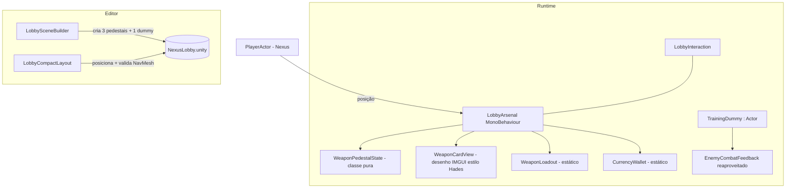
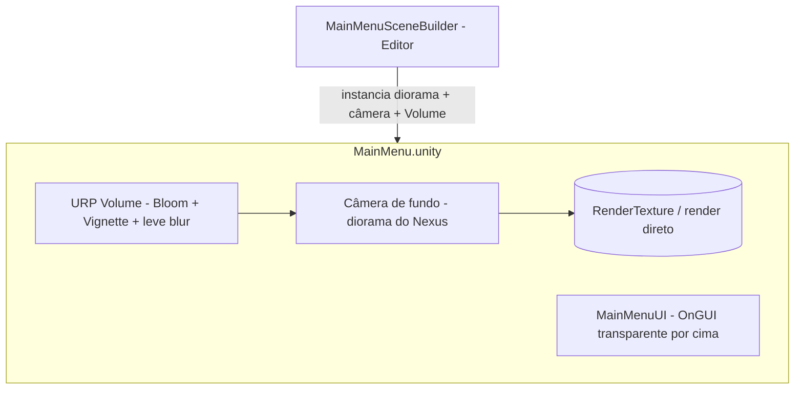

# Design Document

## Overview

Esta feature reestrutura dois espaços de interface do Tech Guy, reaproveitando os sistemas que já
existem no repositório em vez de introduzir arquitetura nova:

- **Nexus Lobby** — a seleção de arma deixa de ser um painel único central (`DrawArsenal` em
  `LobbyInteraction`) e passa a ser três **pedestais físicos** distribuídos pelo salão, no estilo
  do hub de Hades. Ao se aproximar de um pedestal, o jogador vê um **cartão de arma ancorado ao
  pedestal** (estilo Hades) com nome, família e habilidades, e pode equipar/desbloquear ali mesmo
  com a tecla de interação já existente. Um único **Training Dummy** próximo permite testar as
  habilidades da arma equipada. (Requisitos 1, 2, 3, 4, 5)
- **Menu Inicial** — o fundo procedural abstrato (`DrawBackdrop`) é substituído por uma **câmera
  renderizando o Nexus ao vivo, desfocado** (estilo Portal 2), com a lista de opções à esquerda e
  realce forte no item em foco. O menu continua desenhado em IMGUI (`OnGUI`). (Requisitos 6, 7)

Princípios que guiam o design, alinhados ao AGENTS.md do projeto:

- O layout do lobby continua **gerado por scripts de Editor** (`LobbySceneBuilder`,
  `LobbyCompactLayout`); o runtime apenas consome referências serializadas.
- A lógica de decisão (estado do pedestal, proximidade, conteúdo do cartão) vive em **classes C#
  puras e testáveis**; os `MonoBehaviour` ficam finos.
- Nada de `FindObjectOfType`/`GameObject.Find`/magic strings em gameplay: os pedestais recebem
  suas referências do builder; o player é injetado como hoje.
- Cena e prefab preservam seus **GUIDs**; `.meta` nunca é editado manualmente (Requisito 5.5).
- O painel único `ARSENAL / ARMAS` é **removido** (sem fallback); os builders/validadores de
  Editor que o assumiam são ajustados.

## Architecture

### Lobby — componentes em runtime

O ponto central é um novo componente **`LobbyArsenal`** (runtime, fino) que substitui o modo
`weaponSelection` de `LobbyInteraction`. Ele conhece:

- a referência do `PlayerActor` do lobby (injetada pelo builder, como hoje);
- a lista de **pedestais** — cada um com um índice de arma do `WeaponLoadout`, uma `Transform`
  âncora e um raio de proximidade;
- a `Camera` do lobby, para projetar a âncora do pedestal em coordenadas de tela e ancorar o
  cartão (estilo Hades).

`LobbyInteraction` continua responsável pelas **estações informativas e portais** (arquivo,
incursão, etc.) e pelo botão "Menu inicial"; a responsabilidade de **armas** migra inteira para
`LobbyArsenal`. Os dois coexistem na cena sem sobrepor painéis (Requisito 7.3): o cartão de arma
só aparece por proximidade de um pedestal e é suprimido enquanto a pausa estiver ativa
(`PauseMenuUI.BlocksInput`) ou um painel de estação estiver aberto (`LobbyInteraction.IsPanelOpen`).

### Lobby — geração pelo Editor

- `LobbySceneBuilder.BuildWorkshop` deixa de criar a bancada única com `weaponSelection`. No lugar,
  um novo `BuildArsenal(...)` cria **três pedestais** (Manopla, Arco, Lança), cada um com modelo
  decorativo, rótulo, um filho `"Interaction point"` (âncora) e um marcador de arma, e adiciona um
  componente `LobbyArsenal` configurado com os três pedestais. Também cria **um Training Dummy**
  próximo à área dos pedestais.
- `LobbyCompactLayout.ApplyEnvironment` ganha as posições absolutas dos três pedestais e do dummy,
  dispostos no estilo Hades: chegada ao sul, pedestais alinhados numa lateral, centro livre, saída
  (portal de incursão) destacada. `ValidatePaths` passa a validar o **novo conjunto** de âncoras
  (as três âncoras dos pedestais, o dummy e os três portais) em vez de exigir exatamente cinco;
  todas devem ser alcançáveis pelo NavMesh a partir do spawn (Requisito 5.3).
- `ArsenalBuilder`/`ArsenalValidation` (Editor) são ajustados: como o painel único é removido, eles
  passam a configurar/validar os **pedestais** (existência de três pedestais com índices 0/1/2 e
  âncoras alcançáveis) em vez da flag `weaponSelection`.

### Menu Inicial — fundo ao vivo

O `DrawBackdrop` procedural é removido. Em vez dele, `MainMenuSceneBuilder` instancia na cena
`MainMenu.unity` um **diorama do Nexus** (um recorte do `NexusEnvironment.prefab` ou uma câmera
posicionada sobre uma cópia do ambiente) renderizado por uma câmera dedicada, com um `Volume` URP
aplicando Bloom/Vignette e um leve desfoque para o efeito Portal 2. O `MainMenuUI` continua
desenhando a lista de opções e as páginas em IMGUI **por cima**, agora com fundo transparente
(sem preencher a tela com a cor sólida `Ink` nem com o grid), preservando a lista à esquerda e o
realce já existente em `Button(rect, text, highlighted)`.

## Components and Interfaces

### `WeaponPedestalState` (classe C# pura, testável)

Encapsula, sem tipos Unity, o estado derivado de um índice de arma do `WeaponLoadout`:

- `int WeaponIndex` — 0 Manopla, 1 Arco, 2 Lança.
- `bool IsUnlocked` — `WeaponLoadout.IsUnlocked(WeaponIndex)`.
- `bool IsEquipped(int equippedIndex)` — se o índice equipado é este pedestal.
- `int UnlockCost` — `WeaponLoadout.GetCost(WeaponIndex)`.
- `PedestalAction Resolve(bool canAfford)` — decide a ação ao interagir: `Equip` (desbloqueada),
  `Unlock` (bloqueada e pode pagar) ou `Denied` (bloqueada e sem moedas). (Requisito 3.1–3.3)

Essa classe concentra a regra "bloqueada/desbloqueada/equipada -> ação", tornando-a verificável em
EditMode sem cena.

### `LobbyArsenal` (MonoBehaviour fino, runtime)

Substitui o modo de seleção de arma de `LobbyInteraction`.

- Serializa: `PlayerActor _player`, `Camera _camera`, e um array `Pedestal[] _pedestals` onde cada
  `Pedestal` tem `Transform anchor`, `int weaponIndex`, `float proximityRange`.
- `Update()`: encontra o pedestal mais próximo dentro do raio; se o jogador acionar
  `GameControl.Skill3` (a mesma tecla do lobby, Requisito 3.6), resolve a ação via
  `WeaponPedestalState`:
  - `Equip` -> `WeaponLoadout.Select(_player, index)`;
  - `Unlock` -> `WeaponLoadout.TryUnlock(index)` e, em sucesso, `Select`;
  - `Denied` -> apenas comunica a falta de moedas (nenhuma mudança de estado). (Requisito 3.2/3.3)
  - Após equipar, chama `AbilityHolder.RefreshLoadout()` no player (via `TryGetComponent`) para que
    HUD e Training Dummy reflitam a nova arma (Requisito 3.5), e o estado de todos os pedestais é
    recomputado na próxima frame a partir do `WeaponLoadout` (Requisito 3.4).
- `OnGUI()`: quando há um pedestal no raio, projeta `anchor.position` para a tela com
  `_camera.WorldToScreenPoint` e desenha o **cartão de arma ancorado** ali (Requisito 2.3),
  delegando o conteúdo a `WeaponCardView`. Suprime o cartão se a pausa estiver ativa ou um painel
  de estação de `LobbyInteraction` estiver aberto (Requisito 7.3). Usa a mesma escala por
  resolução já adotada no lobby (`Mathf.Min(Screen.width/1280f, Screen.height/720f)`) (Requisito 7.1).
- `bool BlocksAbilityInput(KeyCode)`: como hoje em `LobbyInteraction`, evita que a interação de
  Skill3 perto de um pedestal seja consumida como habilidade.

O cartão **aparece por proximidade** (sem tecla) e **não bloqueia o movimento** (Requisito 2.7);
apenas a ação de equipar/desbloquear usa a tecla.

### `WeaponCardView` (desenho IMGUI, estilo Hades)

Função de desenho pura sobre `Rect`/`GUIStyle` (sem estado de gameplay) que recebe:

- `WeaponScript weapon`, `RunWeaponFamily family` (via `WeaponRunModifiers.Identify`), o estado
  (bloqueada/equipada/custo) e a posição de tela da âncora.
- Renderiza: nome da arma, rótulo de família/estilo, e a lista de habilidades — para cada
  `Ability`: `DisplayName`, `ManaCost`, `cooldownTime` e, quando `ArsenalAbility`, a `Description`
  (Requisito 2.1/2.2). Um rótulo de rodapé mostra "EQUIPADA", "[tecla] Equipar" ou
  "LIBERAR · N moedas / Moedas insuficientes" conforme o estado (Requisitos 2.5/2.6/3.x).
- O layout é um cartão compacto ancorado ao lado do pedestal (deslocado da âncora projetada), não
  um painel central — a diferença estética que caracteriza o estilo Hades (Requisito 2.3).

### `TrainingDummy` (Actor passivo)

Um `Actor` de treino, criado pelo builder perto dos pedestais (Requisito 4.1).

- **Não** possui `EnemyAI`, então nunca persegue nem ataca o jogador (Requisito 4.5).
- Sobrescreve `protected override void Death()` para, em vez de `Destroy`, chamar
  `RestoreHealthToMax()` (e reabilitar `IsDead`), de modo que o dummy volta a ser alvo utilizável
  logo após "cair" (Requisito 4.3). Alternativamente, mantém a vida efetivamente muito alta e
  regenera; o override de `Death` é a via preferida por reaproveitar o fluxo existente.
- Suprime o drop de moedas: `Actor.Awake` adiciona `CoinDrop` automaticamente, então o
  `TrainingDummy` remove/desabilita esse componente no seu próprio `Awake` (após `base.Awake()`),
  garantindo que atingir ou "derrotar" o dummy não gere recompensa (Requisito 4.4).
- Reaproveita o `EnemyCombatFeedback` que o `Actor.Awake` já adiciona, exibindo número de dano e
  barra ao ser atingido (Requisito 4.2).
- Como o dano do player é resolvido contra qualquer `Actor` (áreas/projéteis/hitbox), o dummy só
  precisa de um collider na layer apropriada e vida alta; troca de arma não afeta sua utilidade
  (Requisito 4.6).

### `MainMenuUI` (ajuste, mantém IMGUI)

- Remove `DrawBackdrop` (grid/anel) e o preenchimento de tela com a cor sólida `Ink`; o `OnGUI`
  passa a desenhar apenas os elementos de UI sobre o fundo renderizado pela câmera de cena.
- Mantém `DrawHome` (lista à esquerda), `Button(rect, text, highlighted)` (realce), páginas
  Home/Settings/Controls/Quit, `StartJourney`, navegação por setas/enter e mouse — tudo preservado
  (Requisitos 6.4/6.5/6.6). O realce ganha um contraste mais forte no item em foco para aproximar
  do Portal 2 (Requisito 6.3), sem mudar a lógica de foco.

### `MainMenuSceneBuilder` (Editor, ajuste)

- Passa a instanciar, além da câmera de UI e do `MainMenuUI`, um **diorama do Nexus** e uma
  **câmera de fundo** com `Volume` URP (Bloom + Vignette + leve desfoque), posicionada para uma
  vista cinematográfica do ambiente (Requisito 6.2). Reaproveita `NexusEnvironment.prefab` (ou um
  recorte) e o mesmo perfil de atmosfera usado no lobby (`SetupLighting` de `LobbySceneBuilder`).
- Preserva `MainMenu.unity` como cena de entrada nas Build Settings.

## Data Models

- **Pedestal de arma (dados serializados no `LobbyArsenal`)**: `{ Transform anchor; int
  weaponIndex; float proximityRange }`. Três instâncias (0/1/2), criadas pelo builder.
- **`WeaponPedestalState` (runtime puro)**: derivado de `WeaponLoadout` — `WeaponIndex`,
  `IsUnlocked`, `UnlockCost`, `IsEquipped(equippedIndex)`, `Resolve(canAfford) -> PedestalAction`.
- **`PedestalAction` (enum)**: `Equip | Unlock | Denied`.
- **Persistência**: inalterada — `WeaponLoadout` continua gravando índice/desbloqueios em
  `PlayerPrefs`; `CurrencyWallet` mantém o saldo (Requisitos 1.5, 3.1–3.3).
- **`LobbyInteraction.Station`**: as estações de **arma** deixam de existir como Station com
  `weaponSelection`; as estações informativas e portais permanecem inalteradas (Requisito 5.4).

## Error Handling

- **Câmera ausente ao projetar o cartão**: se `_camera` for nulo, `LobbyArsenal` faz fallback para
  `Camera.main`; se ainda assim não houver câmera, o cartão não é desenhado (nunca lança).
- **Referências faltando**: `LobbyArsenal` valida `_player` e `_pedestals` em `Awake`; se faltarem,
  registra `Debug.LogError` e desabilita o componente (mesmo padrão de `LobbyInteraction`), sem
  quebrar o resto do lobby.
- **Equipar/desbloquear inválido**: `WeaponLoadout.Select`/`TryUnlock` já retornam `false` em caso
  inválido (arma bloqueada, sem moedas, player morto, casting). `LobbyArsenal` respeita o retorno e
  apenas comunica falha (sem alterar estado) — em particular, sem moedas não desbloqueia
  (Requisito 3.3).
- **NavMesh/geração**: os builders de Editor lançam exceção clara se um pedestal, o dummy ou um
  portal ficar inalcançável no bake (estende a validação atual de `LobbyCompactLayout`), impedindo
  salvar um layout quebrado (Requisito 5.3).
- **Training Dummy "morto"**: o override de `Death` restaura a vida em vez de destruir, então o
  dummy nunca deixa um `GameObject` destruído para trás; qualquer referência a ele continua válida
  (Requisito 4.3).
- **Fundo do menu**: se o diorama/câmera de fundo não puder ser renderizado (ex.: sem GPU em
  headless), o `MainMenuUI` ainda desenha a UI legível sobre a cor de fundo da câmera; o menu
  permanece utilizável.

## Correctness Properties

Propriedades verificáveis (base para testes EditMode/PlayMode). Cada uma cita o requisito que
sustenta.

### Property 1: Resolução de ação do pedestal

Para todo índice de arma e todo estado, `WeaponPedestalState.Resolve(canAfford)` retorna `Equip`
se e somente se a arma está desbloqueada; `Unlock` se está bloqueada e `canAfford`; `Denied` se
está bloqueada e não pode pagar. Nunca desbloqueia sem moedas suficientes.
**Validates: Requirements 3.1, 3.2, 3.3**

### Property 2: Estado "equipada" exclusivo

Dado um índice equipado, exatamente um pedestal reporta `IsEquipped == true`, e os demais `false`.
**Validates: Requirements 2.5, 3.4**

### Property 3: Seleção por proximidade determinística

Dada a posição do jogador e as âncoras, o pedestal escolhido é o de menor distância dentro do seu
raio; se o jogador está fora de todos os raios, nenhum pedestal é escolhido (cartão oculto).
**Validates: Requirements 2.1, 2.4**

### Property 4: Conteúdo do cartão completo

Para uma arma com N habilidades, o cartão produz uma linha por habilidade contendo `DisplayName`,
`ManaCost` e `cooldownTime` (e `Description` quando `ArsenalAbility`), além do nome e da família da
arma. **Validates: Requirements 2.2**

### Property 5: Dummy indestrutível e sem recompensa

Aplicar dano ao `TrainingDummy` até a vida chegar a zero resulta em vida restaurada (dummy segue
atacável) e em nenhuma moeda concedida; o dummy nunca é destruído.
**Validates: Requirements 4.3, 4.4**

### Property 6: Dummy passivo

O `TrainingDummy` não possui `EnemyAI`, logo não persegue nem ataca o jogador em nenhum estado.
**Validates: Requirements 4.5**

### Property 7: Alcançabilidade das estações

Após a geração/aplicação de layout, existe um caminho NavMesh completo do spawn do jogador até cada
um dos três pedestais, o dummy e cada portal. **Validates: Requirements 5.3**

### Property 8: Preservação de estações não-arma

Os portais e estações informativas existentes permanecem presentes e funcionais após a
reestruturação. **Validates: Requirements 5.4**

### Property 9: Preservação de GUID

Regenerar/aplicar o layout não altera os GUIDs da cena `NexusLobby.unity` nem do prefab
`NexusEnvironment.prefab`. **Validates: Requirements 5.5**

### Property 10: Foco do menu consistente

Em qualquer navegação por teclado ou mouse, exatamente uma opção do menu está em foco e sua
ativação dispara a mesma ação da opção em foco (paridade com o comportamento atual).
**Validates: Requirements 6.3, 6.5**
## Testing Strategy

Alinhado aos padrões do repositório (validações de Editor + testes EditMode/PlayMode com o harness
`PropertyCheck`/NUnit em `Assets/_Project/Scripts/Tests`).

### Automatizável

- **EditMode (lógica pura)**:
  - `WeaponPedestalState`: para cada índice 0/1/2 e cada combinação (bloqueada/desbloqueada,
    equipada/não, pode pagar/não), `Resolve` retorna a ação correta (`Equip`/`Unlock`/`Denied`) e
    `IsEquipped` reflete o índice equipado (Requisitos 2.5, 3.1–3.3).
  - Matemática de proximidade: dado um conjunto de âncoras e uma posição do jogador, a seleção do
    pedestal "mais próximo dentro do raio" é determinística e nula fora de todos os raios
    (Requisitos 2.1, 2.4).
  - Conteúdo do cartão: a montagem da lista de linhas (nome/família/skills com
    DisplayName/ManaCost/cooldown/Description) a partir de um `WeaponScript` produz o texto esperado
    (Requisito 2.2).
- **Validação de Editor** (estende o padrão de `LobbySceneBuilder`/`LobbyCompactLayout`):
  - A cena gerada contém exatamente três pedestais (índices 0/1/2) e um Training Dummy.
  - Bake do NavMesh e caminhos completos do spawn até cada pedestal, o dummy e cada portal
    (Requisito 5.3); a nova validação substitui a checagem fixa de "cinco estações".
  - GUIDs de cena e prefab preservados após regenerar/aplicar layout (Requisito 5.5).
  - Ajuste de `ArsenalValidation` para validar os pedestais em vez da flag `weaponSelection`.
- **PlayMode**:
  - `TrainingDummy`: ao receber dano até zero, restaura a vida e continua atacável; não instancia
    `CoinDrop`/moedas; não possui `EnemyAI` (Requisitos 4.2–4.5).
  - Interação por proximidade: aproximar o player de um pedestal desbloqueado e acionar Skill3
    equipa a arma (`PlayerActor.CurrentWeapon` muda e `RefreshLoadout` é chamado); em pedestal
    bloqueado sem moedas, não desbloqueia (Requisitos 3.1–3.5).
- **Compilação**: `refresh_unity` + console sem erros após cada bloco de mudança.

### Verificação manual

- Aparência do **cartão estilo Hades** ancorado ao pedestal e sua legibilidade em diferentes
  resoluções (Requisitos 2.3, 7.1).
- Efeito visual do **fundo ao vivo desfocado** do menu (blur/vinheta/enquadramento) e o realce
  estilo Portal 2 do item em foco (Requisitos 6.2, 6.3).
- Sensação geral de circulação no lobby (centro livre, disposição estilo Hades) (Requisito 5.1).

