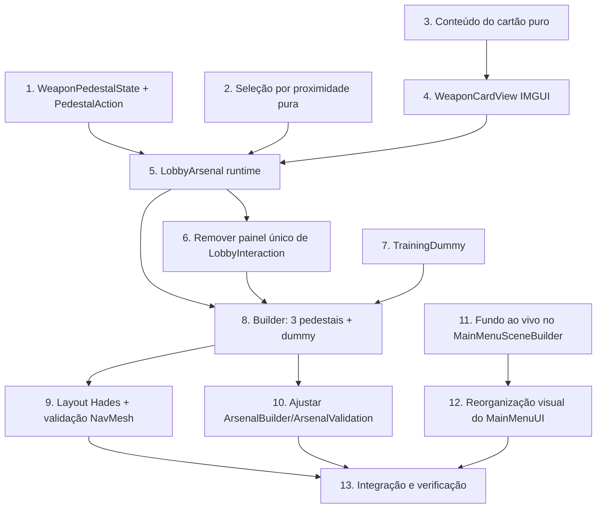

# Implementation Plan: Nexus Lobby & Menu Restructure

## Overview

Este plano implementa a reestruturação do Nexus Lobby (armas como pedestais físicos estilo Hades,
cartão de proximidade, equipar/desbloquear no pedestal e um Training Dummy) e do Menu Inicial
(fundo ao vivo do Nexus desfocado, estilo Portal 2, mantendo IMGUI), conforme o `design.md`. O
trabalho é ordenado para que a lógica pura e os componentes de runtime venham primeiro, depois a
geração/validação pelo Editor, e por fim o menu — cada bloco integrado e verificável ponta a ponta.

Linguagem: C# para Unity (o design é baseado no código C#/Unity existente; sem pseudocódigo).

Convenções aplicadas em tudo: preservar arquivos `.meta` em qualquer move/rename/create de asset;
nada de `FindObjectOfType`/`GameObject.Find`/magic strings em código de gameplay; `MonoBehaviour`
finos com a lógica de decisão em classes C# puras; nunca mutar `ScriptableObject` de origem; não
editar GUIDs manualmente e preservar os GUIDs de cena/prefab existentes.

Os testes de propriedade referenciam as Correctness Properties numeradas no `design.md`. Subtarefas
de teste são marcadas como opcionais com `*`. Testes de propriedade usam o harness `PropertyCheck`
(EditMode) ou NUnit/`[UnityTest]` (PlayMode) já usados no repositório, com ao menos 100 casos
gerados quando aplicável e um comentário `Feature: nexus-lobby-menu-restructure, Property {n}`.

## Tasks

- [x] 1. Estado puro do pedestal e ação de interação
  - Criar `PedestalAction` (enum `Equip | Unlock | Denied`) e a classe C# pura `WeaponPedestalState`
    em `Assets/_Project/Scripts/UI` (ou `Weapons`), sem tipos Unity, derivando de `WeaponLoadout`:
    `WeaponIndex`, `IsUnlocked` (`WeaponLoadout.IsUnlocked`), `UnlockCost` (`WeaponLoadout.GetCost`),
    `IsEquipped(int equippedIndex)` e `Resolve(bool canAfford)` retornando `Equip` (desbloqueada),
    `Unlock` (bloqueada e `canAfford`) ou `Denied` (bloqueada e sem moedas)
  - Garantir que `Resolve` nunca retorne `Unlock` sem moedas suficientes (mapeia direto para o gate
    de desbloqueio)
  - _Requirements: 3.1, 3.2, 3.3, 2.5_

  - [x] 1.1* Escrever teste de propriedade para a resolução de ação do pedestal
    - **Property 1: Resolução de ação do pedestal** — `Resolve` retorna `Equip` sse desbloqueada;
      `Unlock` se bloqueada e pode pagar; `Denied` se bloqueada e sem moedas; nunca desbloqueia sem
      moedas
    - **Validates: Requirements 3.1, 3.2, 3.3**
    - EditMode, harness `PropertyCheck`, sobre todos os índices 0/1/2 e combinações de estado

  - [x] 1.2* Escrever teste de propriedade para o estado "equipada" exclusivo
    - **Property 2: Estado "equipada" exclusivo** — dado um índice equipado, exatamente um pedestal
      reporta `IsEquipped == true`
    - **Validates: Requirements 2.5, 3.4**
    - EditMode sobre os três índices

- [x] 2. Seleção por proximidade (lógica pura)
  - Adicionar uma função pura de seleção do pedestal mais próximo dentro do raio (recebe posição do
    jogador e uma lista de âncoras+raios; retorna o índice do mais próximo dentro do raio, ou nenhum
    quando fora de todos os raios). Manter em classe C# pura/estática para ser testável sem cena
  - _Requirements: 2.1, 2.4_

  - [x] 2.1* Escrever teste de propriedade para a seleção por proximidade
    - **Property 3: Seleção por proximidade determinística** — escolhe o de menor distância dentro
      do raio; nenhum quando o jogador está fora de todos os raios
    - **Validates: Requirements 2.1, 2.4**
    - EditMode, harness `PropertyCheck`

- [x] 3. Conteúdo do cartão de arma (montagem de texto pura)
  - Criar a montagem pura das linhas do cartão a partir de um `WeaponScript`: nome da arma, família
    (`WeaponRunModifiers.Identify`) e uma linha por `Ability` com `DisplayName`, `ManaCost`,
    `cooldownTime` e `Description` quando `ArsenalAbility`; mais o rótulo de estado
    (equipada / [tecla] equipar / liberar · N moedas / moedas insuficientes)
  - Manter a montagem de texto separada do desenho IMGUI para permitir teste sem cena
  - _Requirements: 2.1, 2.2, 2.5, 2.6_

  - [x] 3.1* Escrever teste de propriedade para o conteúdo do cartão
    - **Property 4: Conteúdo do cartão completo** — para uma arma com N habilidades, gera uma linha
      por habilidade com `DisplayName`/`ManaCost`/`cooldownTime` (+ `Description` quando aplicável),
      além de nome e família
    - **Validates: Requirements 2.2**
    - EditMode montando as linhas a partir de um `WeaponScript` de teste

- [x] 4. Desenho do cartão estilo Hades (`WeaponCardView`, IMGUI)
  - Criar `WeaponCardView` com uma função de desenho sobre `Rect`/`GUIStyle` que renderiza o
    conteúdo montado na tarefa 3 como um cartão compacto ancorado ao lado de uma posição de tela
    (deslocado da âncora projetada), no estilo Hades — não um painel central
  - Aplicar a mesma escala por resolução usada no lobby (`Mathf.Min(Screen.width/1280f,
    Screen.height/720f)`)
  - _Requirements: 2.3, 7.1_

- [x] 5. Componente de runtime `LobbyArsenal` (pedestais, cartão e equipar/desbloquear)
  - Criar `LobbyArsenal` (MonoBehaviour fino) em `Assets/_Project/Scripts/UI` com campos serializados
    `PlayerActor _player`, `Camera _camera` e `Pedestal[] _pedestals` (`Transform anchor`, `int
    weaponIndex`, `float proximityRange`)
  - `Update`: usar a seleção da tarefa 2 para achar o pedestal no raio; ao acionar `GameControl.Skill3`,
    resolver via `WeaponPedestalState` — `Equip` chama `WeaponLoadout.Select`; `Unlock` chama
    `WeaponLoadout.TryUnlock` e, em sucesso, `Select`; `Denied` comunica falta de moedas sem alterar
    estado. Após equipar, chamar `AbilityHolder.RefreshLoadout()` no player (via `TryGetComponent`)
  - `OnGUI`: quando há pedestal no raio, projetar `anchor.position` com `_camera.WorldToScreenPoint`
    e desenhar o cartão (tarefa 4). Suprimir o cartão quando a pausa estiver ativa
    (`PauseMenuUI.BlocksInput`) ou um painel de estação estiver aberto (`LobbyInteraction.IsPanelOpen`).
    Fallback de câmera para `Camera.main`; se não houver câmera, não desenhar (nunca lançar)
  - `BlocksAbilityInput(KeyCode)`: impedir que a interação de Skill3 perto de um pedestal seja
    consumida como habilidade (mesmo padrão de `LobbyInteraction`)
  - Validar `_player`/`_pedestals` em `Awake`; se faltarem, `Debug.LogError` e desabilitar o
    componente sem quebrar o resto do lobby
  - _Requirements: 1.4, 2.3, 2.4, 2.6, 3.1, 3.2, 3.3, 3.4, 3.5, 3.6, 7.1, 7.3_

- [x] 6. Remover o painel único de seleção de arma de `LobbyInteraction`
  - Remover o modo `weaponSelection`/`DrawArsenal` de `LobbyInteraction` (o painel `ARSENAL / ARMAS`
    é substituído pelos pedestais; sem fallback). Manter as estações informativas, os portais, o
    botão "Menu inicial" e `IsPanelOpen`/`BlocksAbilityInput` para as estações restantes
  - Ajustar `Station` para não carregar mais o campo/flag de seleção de arma (ou deixá-la sem uso e
    remover a referência), sem quebrar a serialização das estações restantes
  - _Requirements: 5.4_

- [x] 7. Training Dummy passivo (`TrainingDummy : Actor`)
  - Criar `TrainingDummy` herdando de `Actor` em `Assets/_Project/Scripts/Characters`; sobrescrever
    `Death()` para chamar `RestoreHealthToMax()` em vez de `Destroy` (dummy volta a ser alvo)
  - No `Awake` (após `base.Awake()`), remover/desabilitar o `CoinDrop` que `Actor.Awake` adiciona,
    para não conceder moedas; manter o `EnemyCombatFeedback` que `Actor.Awake` adiciona (feedback de
    dano)
  - Não adicionar `EnemyAI` (dummy passivo: não persegue nem ataca); garantir collider na layer
    apropriada e vida alta para uso contínuo, independente da arma equipada
  - _Requirements: 4.2, 4.3, 4.4, 4.5, 4.6_

  - [x] 7.1* Escrever teste PlayMode para o Training Dummy
    - **Property 5: Dummy indestrutível e sem recompensa** — dano até zero restaura a vida e não
      concede moedas; o dummy nunca é destruído
    - **Property 6: Dummy passivo** — sem `EnemyAI`, não persegue nem ataca
    - **Validates: Requirements 4.3, 4.4, 4.5**
    - PlayMode aplicando dano ao dummy e verificando vida restaurada, ausência de `CoinDrop`/moedas e
      ausência de `EnemyAI`

- [x] 8. Geração: três pedestais + Training Dummy no `LobbySceneBuilder`
  - Substituir `BuildWorkshop` (bancada única) por `BuildArsenal(...)` que cria três pedestais
    (índices 0 Manopla, 1 Arco, 2 Lança), cada um com modelo/marcador decorativo, rótulo e um filho
    `"Interaction point"` (âncora); adicionar e configurar um `LobbyArsenal` com os três pedestais,
    o player e a câmera do lobby
  - Criar exatamente um `TrainingDummy` próximo à área dos pedestais, alcançável pelo jogador
  - Preservar os portais e demais estações existentes e a identidade visual do Nexus (materiais,
    rótulos, cores); salvar cena e prefab preservando GUIDs
  - _Requirements: 1.1, 1.3, 1.4, 4.1, 5.2, 5.4, 5.5_

- [x] 9. Layout estilo Hades e validação de navegação no `LobbyCompactLayout`
  - Adicionar em `ApplyEnvironment` as posições absolutas dos três pedestais e do dummy, dispostos
    no estilo Hades (chegada ao sul, pedestais numa lateral, centro livre, portal de incursão
    destacado); manter a área central navegável e livre
  - Atualizar `ValidatePaths` para validar o novo conjunto de estações (as três âncoras dos
    pedestais, o dummy e os três portais) alcançáveis por NavMesh a partir do spawn, substituindo a
    checagem fixa de "exatamente cinco estações"
  - Re-bake e salvar o NavMesh; preservar GUIDs de cena e prefab
  - _Requirements: 1.2, 5.1, 5.3, 5.5_

  - [x] 9.1* Validação de Editor para o layout do lobby
    - **Property 7: Alcançabilidade das estações** — caminho NavMesh completo do spawn até cada
      pedestal, o dummy e cada portal
    - **Property 8: Preservação de estações não-arma** — portais/estações informativas continuam
      presentes e funcionais
    - **Property 9: Preservação de GUID** — GUIDs de `NexusLobby.unity` e `NexusEnvironment.prefab`
      inalterados
    - **Validates: Requirements 5.3, 5.4, 5.5**
    - Validação executada pelo builder (contagem de três pedestais + um dummy, caminhos completos,
      GUIDs preservados), no padrão de `LobbyCompactLayout`/`LobbySceneBuilder`

- [x] 10. Ajustar `ArsenalBuilder`/`ArsenalValidation` para os pedestais
  - Atualizar `ArsenalBuilder` para configurar os três pedestais (índices 0/1/2 + âncoras) em vez de
    setar a flag `weaponSelection` na bancada única
  - Atualizar `ArsenalValidation` para validar a existência dos três pedestais com âncoras
    alcançáveis (em vez de validar uma estação com `weaponSelection`), refletindo a remoção do painel
  - _Requirements: 1.1, 5.4_

- [x] 11. Fundo ao vivo do Nexus no menu (`MainMenuSceneBuilder`, estilo Portal 2)
  - Em `MainMenuSceneBuilder`, além da câmera de UI e do `MainMenuUI`, instanciar um diorama do Nexus
    (recorte do `NexusEnvironment.prefab` ou cópia) e uma câmera de fundo dedicada, posicionada para
    uma vista cinematográfica; aplicar um `Volume` URP com Bloom + Vignette + leve desfoque
    (reaproveitando o perfil de atmosfera do lobby)
  - Preservar `MainMenu.unity` como cena de entrada nas Build Settings; preservar GUIDs
  - _Requirements: 6.2_

- [x] 12. Reorganização visual do `MainMenuUI` (mantendo IMGUI)
  - Remover `DrawBackdrop` (grid/anel) e o preenchimento de tela com a cor sólida `Ink`; o `OnGUI`
    passa a desenhar apenas a UI sobre o fundo renderizado pela câmera (fundo transparente)
  - Manter a lista de opções à esquerda (`DrawHome`), as páginas Home/Settings/Controls/Quit,
    `StartJourney` e a navegação por setas/enter e mouse; reforçar o realce do item em foco em
    `Button(rect, text, highlighted)` para aproximar do Portal 2, sem alterar a lógica de foco
  - Garantir legibilidade e alinhamento em diferentes resoluções; fallback legível caso o fundo não
    renderize (headless/sem GPU)
  - _Requirements: 6.1, 6.3, 6.4, 6.5, 6.6, 7.2_

  - [x] 12.1* Escrever teste de propriedade para o foco do menu
    - **Property 10: Foco do menu consistente** — em qualquer navegação por teclado/mouse, exatamente
      uma opção está em foco e sua ativação dispara a ação daquela opção (paridade com o atual)
    - **Validates: Requirements 6.3, 6.5**
    - EditMode sobre a lógica de foco/ativação (sem depender do desenho)

- [x] 13. Integração final e verificação
  - Regenerar/aplicar o layout do lobby e a cena do menu; confirmar compilação limpa
    (`refresh_unity` + console sem erros) após as mudanças
  - Verificar ponta a ponta: aproximar de cada pedestal mostra o cartão correto; equipar/desbloquear
    funciona e atualiza HUD/pedestais; o Training Dummy recebe dano, dá feedback e se restaura; o
    menu mostra o fundo do Nexus com a lista à esquerda e o realce em foco
  - Registrar itens de verificação manual (aparência do cartão, blur do fundo, circulação no lobby)
  - _Requirements: 1.5, 3.4, 3.5, 4.6, 5.1, 6.1, 7.1, 7.2, 7.3_

## Task Dependency Graph

```json
{
  "waves": [
    { "id": 0, "tasks": ["1", "2", "3", "7", "11"] },
    { "id": 1, "tasks": ["1.1", "1.2", "2.1", "3.1", "4", "7.1", "12"] },
    { "id": 2, "tasks": ["5", "12.1"] },
    { "id": 3, "tasks": ["6"] },
    { "id": 4, "tasks": ["8"] },
    { "id": 5, "tasks": ["9", "10"] },
    { "id": 6, "tasks": ["9.1", "13"] }
  ]
}
```

### Visual overview



As tarefas de lógica pura (1, 2, 3), o Training Dummy (7) e o fundo do menu (11) não têm
dependências entre si e abrem o trabalho. O `LobbyArsenal` (5) depende do estado do pedestal (1), da
seleção por proximidade (2) e do cartão (4, que depende de 3). A geração pelo Editor (8) depende do
componente runtime (5), da remoção do painel único (6) e do dummy (7); layout/validação (9) e o
ajuste de builder/validação (10) vêm logo após. O menu visual (12) depende do fundo (11). A
integração final (13) fecha após a validação de Editor (9/10) e o menu (12).

## Notes

- As subtarefas marcadas com `*` são testes opcionais; cada uma cita a Correctness Property e os
  requisitos que valida. Testes EditMode usam o harness `PropertyCheck`; testes de dummy e de
  interação por proximidade são PlayMode.
- Toda a lógica de decisão (estado do pedestal, proximidade, montagem do cartão, foco do menu) fica
  em classes puras para permitir testes sem cena; os `MonoBehaviour` apenas orquestram e desenham.
- A geração do lobby e do menu é feita por scripts de Editor; cena e prefab preservam GUIDs e os
  `.meta` não são editados manualmente.
- O painel `ARSENAL / ARMAS` é removido sem fallback; `ArsenalBuilder`/`ArsenalValidation` passam a
  operar sobre os pedestais.
- Verificação: se o Unity puder rodar via CLI, executar as suítes EditMode/PlayMode; caso contrário,
  validar por inspeção de estrutura, buscas de referência e `git diff`, relatando o que não foi
  executado (padrão do AGENTS.md).
- Itens de verificação manual (aparência do cartão estilo Hades, blur/enquadramento do fundo do
  menu, circulação no lobby) estão consolidados na tarefa 13.
