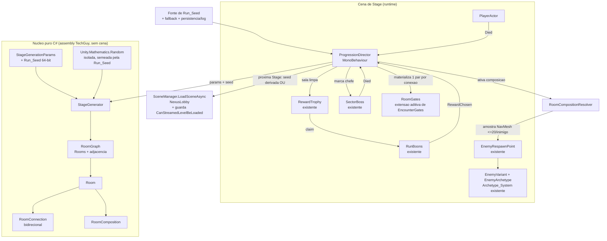

# Design Document

## Overview

Esta feature transforma a direção de run **linear e autorada** do `FirstSectorDirector` em uma direção **dirigida por grafo e por semente (seed)**, gerando proceduralmente uma **Stage** (fase) composta por um `Room_Graph` no estilo *Binding of Isaac*: uma `Start_Room`, de 1 a 20 `Combat_Rooms`, exatamente uma `Boss_Room` e, probabilisticamente, uma `Treasure_Room` e/ou uma `Secret_Room`. O jogador percorre o grafo em ambos os sentidos (backtracking), limpa salas de combate para receber bênçãos, e derrotar o chefe libera a próxima Stage (ou conclui a run e retorna ao Nexus).

O design **estende** os sistemas existentes em vez de substituí-los. O ponto central é separar a **lógica pura de geração** (um núcleo em C# testável, sem cena) da **orquestração de cena** (um `MonoBehaviour` que reencarna os mecanismos já existentes do `FirstSectorDirector`).

### Mapa de subsistemas → requisitos

| Subsistema (nome no glossário) | Tipo | Responsabilidade | Requisitos atendidos |
| --- | --- | --- | --- |
| `StageGenerator` (Stage_Generator) | classe C# pura, testável | Gera o `Room_Graph` a partir de `StageGenerationParams` + `Run_Seed`: layout, tipos de sala, conexões, composições, spawn points; aborta sem parcial em falha | 1, 2 (determinismo/isolamento), 4, 5 (composição/densidade/variedade), 7.1–7.2 |
| `ProgressionDirector` (Progression_Director) | `MonoBehaviour` | Orquestra a run: adquire seed, materializa o grafo na cena, ativa salas, sela/abre portas, dropa troféu, chama RunBoons, gerencia chefe, transição de Stage e retorno ao Nexus; valida dependências | 1.8, 2.1–2.2, 2.6, 3, 4.9–4.11, 5.4, 6, 7.3–7.6, 8, 9 |
| `RoomGates` (extensão aditiva de `EncounterGates`) | `MonoBehaviour` | Portas selavéis/aberturas; nova API para N portas direcionais (uma por `Room_Connection`) preservando o modelo de 2 portas usado pelo `FirstSectorDirector` | 1.5, 3.1, 3.2, 3.4, 3.6, 4.8–4.9, 6.5–6.7 |
| `RoomComposition` + `RoomCompositionResolver` | dado + serviço | Especifica e resolve os inimigos de uma `Combat_Room` (quais `ArchetypeId`, quantidade, atribuição a spawn points via amostragem NavMesh) | 5.1–5.9 |
| Integração de spawn via `EnemyRespawnPoint` + `Archetype_System` | reuso | Instanciação de inimigos por arquétipo | 5.4, 5.6–5.9, 10.3 |
| Reuso `RewardTrophy` + `RunBoons` | reuso | Recompensa por sala limpa e por Treasure_Room | 6, 4.11 |
| Gating por `SectorBoss` | reuso | Marca o chefe; derrota libera transição | 7.1–7.4 |
| Fluxo de retorno de cena (`ScenePortal` / `SceneManager` → `NexusLobby`) | reuso | Fim de run e morte do jogador | 7.6, 8 |
| Fluxo de verificação `Unity_MCP` + testes EditMode/PlayMode | processo | Autoria/validação in-Editor e execução de testes | 10 |

### Decisões de design principais

- **Núcleo puro separado da cena (R2, R10.5).** `StageGenerator` recebe parâmetros + seed e devolve um modelo `RoomGraph` de dados puros (sem `GameObject`, sem `MonoBehaviour`). Isso torna determinismo, conectividade, limites e não-sobreposição testáveis em EditMode sem abrir uma cena, e mantém a aleatoriedade isolada da RNG global (R2.5).
- **Extensão aditiva do `EncounterGates` (R1.5, R3).** O modelo atual entrada(−Z)/saída(+Z) é preservado; adicionamos uma API por direção para suportar até 4 vizinhos por sala, reusando a abordagem de `NavMeshObstacle carving`.
- **Reuso máximo dos mecanismos do `FirstSectorDirector`.** Selagem na entrada, `FindReachableSpot`-style para troféu/inimigos, assinatura de `Actor.Died`, `RunBoons.OfferReward`/`RewardChosen`, guarda `Application.CanStreamedLevelBeLoaded` — tudo migra para o `ProgressionDirector` generalizado.
- **Determinismo por `Unity.Mathematics.Random` derivado só da `Run_Seed` de 64 bits** e derivação determinística da próxima seed (R7.5), mantendo compatibilidade com o seam já existente do `RunBoons` (`_rewriteRoll`).

## Architecture

O `ProgressionDirector` (cena) delega toda a geração ao `StageGenerator` (puro) e, com o `RoomGraph` resultante, materializa `RoomGates`, `EnemyRespawnPoint`s e o chefe, e conduz o loop de run reusando `RewardTrophy`/`RunBoons`/`SectorBoss` e o fluxo de retorno de cena.



### Camadas e fronteiras

1. **Camada de dados puros** (`RoomGraph`, `Room`, `RoomConnection`, `RoomComposition`, `StageGenerationParams`) — sem dependência de UnityEngine além de tipos de valor (`Vector2`/`Vector3`/`int2` opcionais). Serializável e comparável para os testes de igualdade de grafo (R2.3).
2. **Camada de geração** (`StageGenerator`, `RoomCompositionPlanner`) — funções puras que consomem apenas a RNG isolada. Nenhum `GameObject.Find`/`FindObjectOfType` (não há cena aqui).
3. **Camada de orquestração** (`ProgressionDirector`, `RoomCompositionResolver`, `RoomGates`) — a única que toca `GameObject`s, NavMesh e componentes existentes, sempre por referências serializadas ou componentes resolvidos explicitamente (R1.8, R9.4).

## Components and Interfaces

Todos os novos scripts seguem o AGENTS.md: PascalCase para tipos/métodos/propriedades públicas; `_camelCase` para campos privados serializados com `[SerializeField] private`; validação de dependências em `Awake`/`OnValidate`; sem `GameObject.Find`/`FindObjectOfType`/strings mágicas na lógica de gameplay.

### Organização de arquivos (novo domínio)

Novo domínio **`Stages`** sob `Assets/_Project/Scripts/`, para não misturar com `Core`:

```
Assets/_Project/Scripts/Stages/
  StageGenerator.cs              // núcleo puro
  StageGenerationParams.cs       // parâmetros + seed
  Model/
    RoomGraph.cs
    Room.cs
    RoomConnection.cs
    RoomType.cs                  // enum
    RoomComposition.cs
    Direction.cs                 // enum (North/South/East/West) para portas
  RoomCompositionPlanner.cs      // núcleo puro: monta composições
  ProgressionDirector.cs         // MonoBehaviour de orquestração
  RoomCompositionResolver.cs     // amostragem NavMesh + spawn via EnemyRespawnPoint
  RoomGates.cs                   // extensão aditiva (ver abaixo)
```

Preservação de `.meta`: qualquer arquivo movido/renomeado leva seu `.meta` junto (R10.6). Novos arquivos geram novos `.meta` normalmente pela Unity. `EncounterGates.cs` **não** é movido nem renomeado (mudança apenas aditiva no mesmo arquivo, para não invalidar GUID nem quebrar o `FirstSectorDirector`).

### StageGenerator (núcleo puro, testável)

```csharp
public sealed class StageGenerator
{
    // Determinístico: mesma seed + mesmos params => mesmo RoomGraph (R1.3, R2.3).
    // Lança/retorna falha sem produzir grafo parcial em caso de aborto (R1.7, R7.2).
    public StageGenerationResult Generate(StageGenerationParams parameters, ulong runSeed);
}

public readonly struct StageGenerationResult
{
    public bool Success { get; }
    public RoomGraph Graph { get; }          // válido apenas quando Success
    public string FailureReason { get; }     // motivo para log de erro quando !Success
}
```

`StageGenerator` **não** instancia nada de cena; devolve o modelo. Toda aleatoriedade vem de uma `Unity.Mathematics.Random` local semeada por `runSeed` (R2.5). O `ProgressionDirector` é quem loga o erro e aborta (R1.7, R7.2) — o núcleo apenas sinaliza `Success=false` + `FailureReason`.

### StageGenerationParams

```csharp
[Serializable]
public sealed class StageGenerationParams
{
    [SerializeField, Min(1)] private int _minCombatRooms = 1;   // R1.1
    [SerializeField] private int _maxCombatRooms = 20;          // R1.1 (clamp <=20)
    [SerializeField, Range(4,30)] private int _densityBudgetMin = 4;   // R5.2
    [SerializeField, Range(4,30)] private int _densityBudgetMax = 30;  // R5.2
    [SerializeField, Range(2,6)] private int _varietyTarget = 3;       // R5.3
    [SerializeField, Range(0.05f,0.95f)] private float _treasureProbability = 0.35f; // R4.3
    [SerializeField, Range(0.05f,0.95f)] private float _secretProbability = 0.25f;   // R4.3
    [SerializeField, Min(1)] private int _generationRetryLimit = 50;   // R1.7
    // Propriedades somente leitura + OnValidate faz clamp de todos os intervalos.
}
```

### Modelo de portas: RoomGates como extensão aditiva de EncounterGates

O `EncounterGates` atual expõe um par entrada(−Z)/saída(+Z) via `Configure(center,size)`, `OpenEntrance()`, `Seal()`, `OpenExit()`, `ExitLocked`. O grafo procedural precisa de **uma porta por `Room_Connection`**, e uma sala pode ter até 4 vizinhos. Para **não quebrar o `FirstSectorDirector`** (que segue usando o modelo de 2 portas), a extensão é **aditiva** dentro do próprio `EncounterGates.cs`:

```csharp
public sealed class EncounterGates : MonoBehaviour
{
    // ----- API legada (INALTERADA; FirstSectorDirector continua usando) -----
    public bool ExitLocked { get; }
    public void Configure(Vector3 center, Vector2 size);
    public void OpenEntrance();
    public void Seal();
    public void OpenExit();

    // ----- API aditiva por direção (nova; usada pelo ProgressionDirector) -----
    // Cria/garante uma porta na borda indicada, reusando o mesmo Door() interno
    // (Cube + NavMeshObstacle carving). Idempotente por direção.
    public void ConfigureDirectional(Vector3 center, Vector2 size);
    public void AddDoor(Direction side);          // materializa uma porta na borda
    public void SealDoor(Direction side);         // ativa (fecha) a porta
    public void OpenDoor(Direction side);         // desativa (abre) a porta
    public bool IsDoorSealed(Direction side);
    public void SealAll();                        // fecha todas as portas direcionais
}
```

Notas de implementação (reuso, sem duplicação):
- O método privado `Door(title,position,width)` já existente é reaproveitado; a posição por direção deriva de `center ± eixo * size * 0.5` (N/S no eixo Z, E/W no eixo X), exatamente como as portas legadas fazem no eixo Z.
- As portas direcionais ficam num dicionário/array indexado por `Direction`, separado dos campos `_entrance`/`_exit` legados, de modo que os dois modelos coexistem no mesmo componente sem interferência (R3.4 continua valendo para o modo legado).
- O `NavMeshObstacle carving=true` é mantido (carva a navegação baixada) — é o mesmo mecanismo do modelo atual, garantindo que uma porta fechada bloqueie a passagem em ambos os sentidos (R3.1: quando aberta, a mesma porta permite passagem nos dois sentidos; ela não tem lado).

> Alternativa considerada e descartada: criar um `RoomGates.cs` novo herdando/compondo `EncounterGates`. Rejeitada porque `EncounterGates` é `sealed` e a herança traria dois materiais/hierarquias; a extensão aditiva no mesmo arquivo é mais simples e cumpre R10.6 (nenhum `.meta` alterado).

### ProgressionDirector (MonoBehaviour de orquestração)

Generaliza o `FirstSectorDirector`. Referências serializadas explícitas (R1.8, R9.4); estado exposto só-leitura (R9.5).

```csharp
public sealed class ProgressionDirector : MonoBehaviour
{
    [SerializeField] private PlayerActor _player;
    [SerializeField] private StageGenerationParams _generationParams;
    [SerializeField] private RunSeedSource _seedSource;        // fonte de seed configurável (R2.1)
    [SerializeField] private GameObject _enemyPrefab;          // prefab base p/ EnemyRespawnPoint (R9.1)
    [SerializeField] private EnemyArchetype[] _archetypeCatalog; // os 16 arquétipos (R5.1)
    [SerializeField] private string _returnScene = "NexusLobby"; // (R7.6, R8)
    [SerializeField] private TMP_Text _objective;

    // Estado só-leitura (R9.5)
    public int CurrentStageIndex { get; }
    public int ClearedRooms { get; }
    public bool IsRunComplete { get; }

    private void Awake();      // valida deps; enabled=false se faltar (R9.1–9.3)
    private void OnValidate(); // loga uma msg nomeando cada dep ausente (R9.1)
}
```

### RoomCompositionResolver (orquestração de spawn)

Ponte entre a `RoomComposition` (dados) e o `EnemyRespawnPoint` (instanciação existente). Reusa a lógica estilo `FindReachableSpot` para amostrar NavMesh (≤20 tentativas por inimigo — R5.6/R5.7).

```csharp
public sealed class RoomCompositionResolver
{
    // Para cada inimigo da composição: amostra até 20 posições NavMesh dentro dos limites da sala;
    // instancia via EnemyRespawnPoint aplicando o ArchetypeId; descarta com aviso quando não achar
    // ponto (R5.7) e avisa quando o total posicionado < mínimo do budget (R5.8) ou sem spawn point (R5.9).
    public RoomActivationResult Activate(Room room, IReadOnlyList<EnemyRespawnPoint> spawnPoints, ...);
}
```

Integração com `EnemyRespawnPoint`/`Archetype_System` (APIs reais lidas do código):
- `EnemyRespawnPoint.SpawnEnemy()` instancia `enemyPrefab`, resolve `Actor`, alinha ao NavMesh e retorna o `Actor`.
- Aplicação de arquétipo: obter `EnemyVariant` no objeto instanciado (`GetComponent`/`AddComponent`) e chamar `variant.Configure(EnemyArchetype)` — o `EnemyVariant` já adota o `EnemyProfile` do arquétipo e aplica papel/traits (fallback Grunt seguro se inválido). O `ArchetypeId` atribuído na composição seleciona o `EnemyArchetype` correspondente do `_archetypeCatalog`.
- O chefe (R7.1) é marcado adicionando/obtendo `SectorBoss` no inimigo principal da `Boss_Room` e chamando `boss.Configure(_player)`, idêntico ao `FirstSectorDirector`.

## Data Models

```csharp
public enum RoomType { Start, Combat, Boss, Treasure, Secret }   // R4.1
public enum Direction { North, South, East, West }

public sealed class Room
{
    public int Id { get; }                         // Room ID estável (R1.3/R2.3)
    public RoomType Type { get; }
    public Vector2 Center { get; }                 // posição central no plano XZ
    public Vector2 Size { get; }                   // Room_Size (limites)
    public int Depth { get; }                      // distância (nº de conexões) da Start_Room (R5.5)
    public List<RoomConnection> Connections { get; }
    public RoomComposition Composition { get; }    // null p/ Start/Boss/Treasure/Secret sem combate
    // Flags de estado de runtime (não fazem parte da igualdade de grafo):
    public bool Visited { get; set; }
    public bool Cleared { get; set; }
    public bool Revealed { get; set; }             // p/ Secret_Room (R4.8/4.9)
}

public sealed class RoomConnection
{
    public int RoomAId { get; }
    public int RoomBId { get; }
    public Direction SideFromA { get; }            // borda de A onde nasce a porta
    public bool Hidden { get; }                    // conexão oculta de Secret_Room (R4.8)
    public bool Open { get; set; }                 // estado de runtime da passagem
    // Referência ao par de portas materializado (resolvido no runtime, não no núcleo):
    // um único par RoomGates por conexão (R1.5).
}

public sealed class RoomGraph
{
    public IReadOnlyList<Room> Rooms { get; }
    public IReadOnlyList<RoomConnection> Connections { get; }
    public int StartRoomId { get; }
    public int BossRoomId { get; }
    // Igualdade de grafo p/ R2.3: nº de Rooms, Room IDs, Connections, Room_Types, Room_Composition.
    public bool StructurallyEquals(RoomGraph other);
}

public sealed class RoomComposition
{
    // Lista de (ArchetypeId, count) + atribuições resolvidas (assignments) por spawn point.
    public IReadOnlyList<ArchetypeSlot> Slots { get; }   // ArchetypeId + quantidade
    public int TargetDensity { get; }                    // dentro de [min,max] do budget, escalado por Depth
    public int DistinctArchetypes { get; }               // >= Variety_Target (limitado à disponibilidade)
}
```

### Determinismo e semente

- `Run_Seed` é `ulong` (64 bits, R2.1). Toda decisão de geração vem de uma `Unity.Mathematics.Random` (ou `System.Random` derivado) **isolada**, semeada só pela `Run_Seed` (R2.5). Nenhuma chamada a `UnityEngine.Random` global no núcleo.
- **Derivação da próxima seed (R7.5):** função pura determinística, ex. um passo de *splitmix64* sobre a `Run_Seed` atual: `nextSeed = SplitMix64(currentSeed)`. Mesma seed atual ⇒ sempre a mesma próxima seed.
- **Compat com o seam do `RunBoons`:** o `RunBoons` já expõe `_rewriteRoll` (via reflection nos testes) para tornar seu sorteio reprodutível; o design mantém esse seam intacto e não introduz RNG concorrente no fluxo de bênção — a geração de Stage e a oferta de bênção usam RNGs separadas e ambas reprodutíveis por seed.

## Algoritmo de geração

`StageGenerator.Generate(params, seed)` executa, com a RNG isolada:

1. **Sorteio de contagem e especiais.** Sorteia `combatCount ∈ [minCombat, min(maxCombat,20)]` (R1.1). Sorteia presença de `Treasure_Room` e `Secret_Room` por *rolls* ponderados no intervalo [5%,95%] (R4.3–R4.5): no máximo uma de cada (R4.5).
2. **Construção do grafo conexo (crescimento semeado).** Começa na `Start_Room` (depth 0) e cresce por *graph-walk*: a cada passo escolhe uma sala existente e uma `Direction` livre, posiciona a nova sala adjacente com **separação mínima 0** (bordas podem se tocar, nunca se interpenetrar — R1.4), cria a `RoomConnection` (uma por par adjacente). A `Boss_Room` é anexada ao final de um dos ramos mais profundos, garantindo um caminho `Start → Boss` (R1.2). `Depth` de cada sala = nº de conexões no caminho mais curto até a `Start_Room` (R5.5).
3. **Verificação de posicionamento.** Antes de aceitar cada sala, valida não-sobreposição contra todas as já colocadas (AABB no plano XZ, folga ≥0). Se não houver posição livre para uma sala obrigatória, incrementa a tentativa.
4. **Retentativas e aborto (R1.7).** Se, após **até 50 tentativas**, não produzir um grafo conexo ligando `Start → Boss`, retorna `Success=false` com `FailureReason` — **sem grafo parcial**. O `ProgressionDirector` loga o erro e não instancia nenhuma sala.
5. **Atribuição de tipos (R4.1–R4.2).** Exatamente 1 `Start`, exatamente 1 `Boss`; as demais viram `Combat`. `Treasure`/`Secret` (quando sorteadas) ocupam nós-folha adequados.
6. **Treasure conectada e acessível (R4.6–R4.7).** A `Treasure_Room` recebe ≥1 `RoomConnection` acessível a partir da `Start_Room`. Se não for possível posicionar conexão acessível, a `Treasure_Room` é **descartada** (as demais salas são preservadas) e a falha é registrada.
7. **Secret oculta (R4.8).** A `Secret_Room` é gerada com sua `RoomConnection` marcada `Hidden=true` e fechada; permanece oculta até a `Discovery_Action`.
8. **Composição por Combat_Room (R5).** Para cada `Combat_Room`:
   - `TargetDensity` = valor no intervalo `[budgetMin, budgetMax]` (4–30), **escalado monotonicamente pela `Depth`** (R5.5): salas mais profundas têm budget ≥ o de salas mais rasas, respeitando o teto 30.
   - Seleciona `DistinctArchetypes ≥ Variety_Target` (2–6) dentre os 16 `ArchetypeId`, limitado à disponibilidade (R5.3), e distribui `TargetDensity` inimigos entre eles.
   - Coloca ≥1 `EnemyRespawnPoint` dentro dos limites da sala (R1.6); o posicionamento efetivo de cada inimigo (amostragem NavMesh ≤20 tentativas) ocorre na **ativação** em runtime (R5.6), não na geração pura.
9. **Chefe (R7.1–R7.2).** Marca exatamente um inimigo principal da `Boss_Room` para receber `SectorBoss`. Se a `Boss_Room` não tiver inimigo elegível, **aborta a Stage**, preserva o estado anterior e loga erro (R7.2).

## Runtime flow

```mermaid
sequenceDiagram
    participant PD as ProgressionDirector
    participant SG as StageGenerator
    participant P as PlayerActor
    participant RG as RoomGates
    participant RB as RunBoons
    participant SB as SectorBoss

    Note over PD: Awake: valida deps (R9). Se faltar -> enabled=false
    PD->>PD: adquire Run_Seed (fallback + persiste/loga) (R2.1,2.2,2.6)
    PD->>SG: Generate(params, seed)
    alt Success=false
        SG-->>PD: FailureReason
        PD->>PD: loga erro, aborta (sem parcial) (R1.7,7.2)
    else Success=true
        SG-->>PD: RoomGraph
        PD->>RG: materializa 1 par por RoomConnection (R1.5)
        PD->>P: posiciona na Start_Room; abre saidas da Start
    end

    loop Traversal bidirecional (R3)
        P->>PD: entra em Combat_Room nao limpa
        PD->>RG: Seal (portas da sala) (R3.4)
        PD->>PD: ativa Room_Composition -> spawn (R3.5,5.4)
        P->>PD: inimigos vivos == 0
        PD->>PD: marca Cleared (<=1s) (R6.1)
        PD->>PD: dropa RewardTrophy em NavMesh alcancavel (R6.2,6.3)
        P->>RB: claim (<=2m) -> OfferReward (R6.4)
        RB-->>PD: RewardChosen
        PD->>RG: abre conexoes elegiveis p/ salas nao visitadas (<=1s) (R6.7,3.2)
        P->>PD: retorna a sala ja limpa
        PD->>PD: mantem Cleared, NAO reinstancia (idempotente) (R3.3)
    end

    P->>PD: entra na Treasure_Room
    PD->>RB: concede recompensa sem combate (R4.11)

    P->>PD: Discovery_Action adjacente a Secret oculta
    PD->>RG: revela + abre conexao (<=1s) + indicador visual (R4.9)

    P->>SB: derrota o chefe
    SB-->>PD: Died
    alt existe proxima Stage
        PD->>PD: libera transicao (<=1s); gera proxima com seed derivada (R7.4,7.5)
    else nao existe proxima
        PD->>PD: conclui run -> LoadSceneAsync(NexusLobby) (R7.6)
    end

    P->>PD: morre durante a Stage
    PD->>PD: encerra run (<=0.5s), bloqueia spawns/transicoes (R8.1)
    PD->>PD: LoadSceneAsync(NexusLobby) (<=1s) c/ guarda + 1 retry (R8.2,8.4,8.5)
```

Pontos-chave do fluxo:
- **Aquisição de seed (R2.1–2.2, 2.6):** lê `RunSeedSource`; se ausente/ inválida para 64 bits, loga erro e gera seed de fallback (ex. `System.DateTime.UtcNow.Ticks` combinado com `Guid`), depois **persiste e loga** a seed usada para reprodutibilidade.
- **Abertura ≤0,5 s (R3.2/3.6) e ≤1 s (R4.9/6.7/7.4):** conduzido por corrotinas/timers do `ProgressionDirector`, evitando lógica pesada em `Update` (AGENTS.md).
- **Idempotência de backtracking (R3.3):** o `Room.Cleared` só é setado uma vez; reentrada não reativa composição.
- **Bênção não escolhida (R6.6):** enquanto `RunBoons.IsChoosing` ou seleção cancelada, as saídas da sala recém-limpa permanecem seladas (R6.5); só abrem em `RewardChosen` (R6.7).

## Error Handling

| Situação | Tratamento | Requisito |
| --- | --- | --- |
| Grafo não conexo após 50 tentativas | `Success=false`; `ProgressionDirector` loga erro e **não instancia nenhuma sala parcial** | 1.7 |
| Fonte de seed ausente/ inválida | Loga erro; gera seed de fallback de 64 bits antes de gerar | 2.2 |
| Treasure sem conexão acessível | Descarta a Treasure, loga falha, preserva demais salas | 4.7 |
| Discovery_Action fora de sala adjacente a Secret | Mantém tudo oculto; não abre conexão | 4.10 |
| Inimigo sem ponto NavMesh após 20 tentativas | Descarta o inimigo; aviso com sala e nº descartado | 5.7 |
| Total posicionado < mínimo do budget (4) | Aviso com sala, alvo e efetivo | 5.8 |
| Combat_Room sem `EnemyRespawnPoint` válido | Composição sem inimigos; aviso com a sala | 5.9 |
| Sem posição de troféu alcançável após 5 tentativas | Posiciona no ponto NavMesh alcançável mais próximo do centro; registra diagnóstico; sala segue limpa | 6.3 |
| Boss_Room sem inimigo elegível | Aborta Stage, preserva estado anterior, loga erro | 7.2 |
| `NexusLobby` ausente de Build Settings | Loga erro; interrompe transição; run segue encerrada; **não** carrega outra cena (guarda `CanStreamedLevelBeLoaded`) | 8.4 |
| Falha no carregamento do Nexus | Loga erro; **1** nova tentativa; depois interrompe | 8.5 |
| Dependência obrigatória ausente em `Awake`/`OnValidate` | Loga **uma** msg nomeando cada dep ausente; `enabled=false`; não inicia geração | 9.1–9.3 |

## Testing Strategy

O núcleo `StageGenerator`/`RoomCompositionPlanner` é **C# puro**, o que permite testes EditMode determinísticos sem abrir cena. O projeto **não** resolve FsCheck/CsCheck nesta máquina; o padrão já estabelecido (ver `SoftGroupingBoundsPropertyTests`) é usar o harness semeado `PropertyCheck.ForAll` (≥100/128 casos por propriedade, reportando o contraexemplo exato). Novos testes ficam em `Assets/_Project/Scripts/Tests/EditMode/Editor/` (assembly `TechGuy.Tests.EditMode`, que já referencia `TechGuy`), com tag no formato do projeto.

**Abordagem dupla:**
- **Testes de propriedade (EditMode, núcleo puro):** determinismo, conectividade, limites, não-sobreposição, contagens de tipo, probabilidade de especiais, derivação de seed. Configuração: ≥100 iterações; cada teste anota `// Feature: procedural-stage-room-generation, Property N: {texto}` e `// Validates: Requirements X.Y`.
- **Testes de exemplo/edge (EditMode):** casos concretos como "0 disponibilidade de arquétipos < Variety_Target", "combatCount no limite 20", "Treasure descartada quando sem conexão".
- **Testes de integração (PlayMode):** ativação de sala real (spawn via `EnemyRespawnPoint`, selagem de portas, drop de troféu, `RunBoons`), morte do jogador → retorno ao Nexus. Poucos exemplos, pois envolvem NavMesh/cena e não variam com muitos inputs.

### Fluxo de verificação via Unity_MCP (Requisito 10)

Usando o servidor `unity-mcp` dentro do Editor:
- **Autoria de cena/prefab (R10.1–10.2):** criar/posicionar `Room`s, `RoomGates` e `EnemyRespawnPoint`s via ferramentas de GameObject/prefab; adicionar e **conectar por referências serializadas** os componentes `ProgressionDirector`/`StageGenerator` (sem `GameObject.Find`/`FindObjectOfType`/strings mágicas).
- **Validação de composição (R10.3):** instanciar e conferir inimigos por arquétipo usando os prefabs de arquétipo e os `EnemyRespawnPoint` da `Combat_Room` no Editor.
- **Validação de grafo (R10.4):** inspecionar a hierarquia da cena, **capturar screenshot** do layout gerado e **ler o console** para confirmar as mensagens de aviso/erro definidas nos Requisitos 1, 5 e 7.
- **Execução de testes (R10.5):** rodar EditMode e PlayMode pelas ferramentas de teste do Editor e reportar cada resultado.
- **Preservação de `.meta` (R10.6)** e **bloqueio de violações do AGENTS.md (R10.7)**; se o `unity-mcp` estiver indisponível, reportar e **não** marcar autoria in-Editor como verificada (R10.8).
- O projeto já tem setup compatível com PBT/Roslyn (`Assets/Plugins/Roslyn`) e a pasta de testes `Assets/_Project/Scripts/Tests` (EditMode/PlayMode/Support).

## Correctness Properties

*Uma propriedade é uma característica ou comportamento que deve valer para todas as execuções válidas do sistema — uma afirmação formal sobre o que o sistema deve fazer. Propriedades são a ponte entre a especificação legível por humanos e garantias de correção verificáveis por máquina.*

Análise de testabilidade (prework) por critério de aceitação:

### Property 1: Determinismo da geração

*Para toda* `Run_Seed` de 64 bits e todo `StageGenerationParams`, gerar duas vezes produz `RoomGraph`s estruturalmente idênticos (mesmo nº de Rooms, mesmos Room IDs, mesmas Room_Connections, mesmos Room_Types e mesma Room_Composition).

**Validates: Requirements 1.3, 2.3**

### Property 2: Seeds diferentes divergem

*Para todo* par de `Run_Seed`s distintas com os mesmos parâmetros, os `RoomGraph`s divergem em pelo menos um valor mensurável (nº de Rooms, conjunto de Connections, conjunto de Room_Types, ou conjunto de Special_Rooms).

**Validates: Requirements 2.4**

### Property 3: Conectividade Start → Boss

*Para todo* `RoomGraph` gerado com sucesso, existe pelo menos um caminho de `Room_Connections` da `Start_Room` até a `Boss_Room`.

**Validates: Requirements 1.2**

### Property 4: Limites de contagem de salas

*Para todo* `RoomGraph` gerado com sucesso, há exatamente 1 `Start_Room`, exatamente 1 `Boss_Room` e entre 1 e 20 `Combat_Rooms`.

**Validates: Requirements 1.1, 4.2**

### Property 5: Tipo único por sala

*Para toda* `Room` de um `RoomGraph` gerado, ela tem exatamente um `Room_Type`.

**Validates: Requirements 4.1**

### Property 6: No máximo uma Treasure e uma Secret

*Para todo* `RoomGraph` gerado, há no máximo uma `Treasure_Room` e no máximo uma `Secret_Room`.

**Validates: Requirements 4.5**

### Property 7: Probabilidade de especiais dentro de [5%, 95%] e reprodutível

*Para todo* `StageGenerationParams`, a probabilidade efetiva de aparição de cada `Special_Room` fica em [5%, 95%], e a mesma `Run_Seed` sempre produz o mesmo resultado de sorteio.

**Validates: Requirements 4.3**

### Property 8: Treasure acessível ou descartada

*Para todo* `RoomGraph` gerado, se uma `Treasure_Room` está presente, então ela tem ≥1 `Room_Connection` acessível a partir da `Start_Room`; caso não seja possível conectá-la, ela não está presente no grafo e as demais salas permanecem.

**Validates: Requirements 4.6, 4.7**

### Property 9: Não-sobreposição de salas

*Para todo* par de `Room`s do mesmo `RoomGraph`, seus limites (`Room_Size`) têm separação ≥0 (as bordas podem se tocar, mas nunca se interpenetram).

**Validates: Requirements 1.4**

### Property 10: Um par de portas por conexão

*Para todo* `RoomGraph` gerado, o número de pares de `Room_Gates` a materializar é igual ao número de `Room_Connections` (exatamente um par por conexão).

**Validates: Requirements 1.5**

### Property 11: Cada Combat_Room tem spawn point

*Para toda* `Combat_Room` gerada, existe pelo menos 1 `EnemyRespawnPoint` dentro dos seus limites (`Room_Size`).

**Validates: Requirements 1.6**

### Property 12: Densidade dentro do orçamento

*Para toda* `Combat_Room` gerada, o `TargetDensity` da sua `Room_Composition` está no intervalo [4, 30].

**Validates: Requirements 5.2**

### Property 13: Densidade monótona por profundidade

*Para todo* par de `Combat_Room`s A e B do mesmo `RoomGraph` com `Depth(A) > Depth(B)`, o `Density_Budget` de A é ≥ o de B (respeitando o teto 30).

**Validates: Requirements 5.5**

### Property 14: Variedade satisfeita

*Para toda* `Combat_Room` gerada, o número de `ArchetypeId`s distintos na `Room_Composition` é ≥ `Variety_Target` (2–6), ou igual à quantidade de arquétipos disponíveis quando esta for menor que o `Variety_Target`.

**Validates: Requirements 5.3**

### Property 15: Chefe único e elegível

*Para todo* `RoomGraph` gerado com sucesso, exatamente um inimigo principal da `Boss_Room` é marcado para `SectorBoss`; se não houver inimigo elegível, a geração falha sem produzir grafo (aborto).

**Validates: Requirements 7.1, 7.2**

### Property 16: Idempotência de reentrada

*Para toda* `Combat_Room` já marcada como limpa, reentrar nela mantém `Cleared` verdadeiro e não reinstancia sua `Room_Composition`.

**Validates: Requirements 3.3**

### Property 17: Determinismo da próxima seed

*Para toda* `Run_Seed` atual, a derivação da próxima `Run_Seed` é determinística: a mesma seed atual sempre produz a mesma próxima seed.

**Validates: Requirements 7.5**

### Property 18: Aleatoriedade isolada da RNG global

*Para toda* geração, todas as decisões aleatórias derivam de uma RNG semeada exclusivamente pela `Run_Seed`, sem consumir fontes de aleatoriedade global compartilhada (verificável: alterar a semente global entre duas gerações com a mesma `Run_Seed` não altera o `RoomGraph`).

**Validates: Requirements 2.5**

## Iteração e revisão

Se, durante o design, forem identificadas lacunas nos requisitos (por exemplo, ambiguidade na `Discovery_Action` ou na definição de "profundidade"), o design oferece retornar à fase de requisitos antes de prosseguir para tasks.
