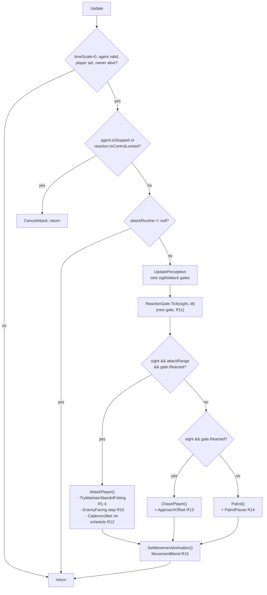
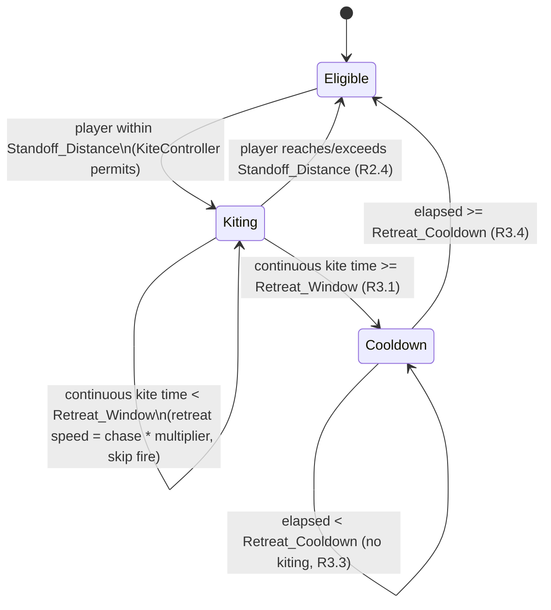
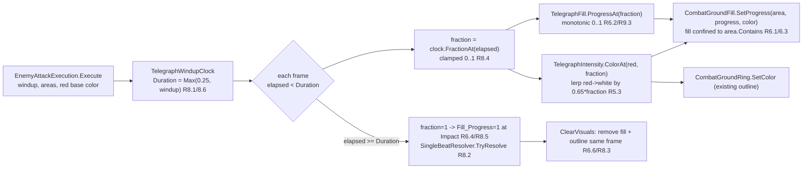

# Design Document

## Overview

This feature improves three aspects of enemy combat as an **extension** of the existing systems, not a re-architecture. It follows the project's established separation: `MonoBehaviour` coordinates Unity/scene behavior, while all decision/math lives in pure, seeded C# classes that mirror `PreferredDistanceResolver` and `TelegraphBeat`. Movement stays NavMesh-only, `.meta` files are preserved, serialized fields are `[SerializeField] private`, and dependencies are validated/clamped in `Awake`/`OnValidate`.

The three scopes:

1. **Fairer ranged kiting/standoff (R1–R4).** Keep ranged enemies at distance but slow and bound their retreat so melee can close in. New pure types resolve retreat-speed multiplier, standoff fraction/margin, and a retreat window/cooldown state machine. These hook into the existing `EnemyAI.TryMaintainStandoff()` path and `EnemyVariant` speed storage, without touching the non-standoff attack/movement path (R4.4).

2. **Consistent red, growing attack telegraphs (R5–R8).** Every attack routed through `EnemyAttackExecution.Execute` draws a **red** telegraph that **fills** its `EnemyAttackArea` during windup until impact, in addition to the existing outline. The single-beat rule, min-windup floor, cancellability, and projectile approach telegraph are all preserved. New pure fill/color types extend `TelegraphBeat.cs`; a new thin `CombatGroundFill` helper renders the filled surface as a sibling to the untouched `CombatGroundRing`.

3. **More natural, less robotic enemy behavior (R10–R15).** Smoothed turning, a perception reaction delay, attack-cadence jitter, bounded chase-approach variation, patrol idle pauses, and speed-based animation blending — each driven by a pure, seeded `Behavior_Logic` class and applied as an additional gate/transform inside the existing `EnemyAI` flow, preserving every existing perception gate and the attack-animation guard.

Scopes 1 and 3 are improvements of `EnemyAI`; scope 2 is an improvement of the Telegraph_System. All new pure logic is separable and property-testable (R9, R16).

### Design Principles (from existing architecture)

- **Pure resolvers + thin layers.** Every numeric/decision rule is a `static` method or `readonly struct` with explicit inputs (including an explicit RNG seed where randomness is involved, per R16.2). The MonoBehaviour only feeds live state in and applies the result.
- **No new globals/singletons.** All new state is per-enemy or per-attack, resolved via serialized references or `GetComponent` in `Awake` (mirroring `PreferredDistanceLayer`).
- **NavMesh-only movement.** Every destination goes through `NavMesh.SamplePosition` → `agent.SetDestination`; Transform position is never written directly (R4.3, R13.5).
- **Clamp on load.** All serialized config is clamped in `OnValidate` and defensively re-clamped inside the pure resolver (R1.3/R1.5, R10.2, R11.2, R12.2, R13.2/R13.3, R16.6).
- **Preserve existing gates.** New gates are additive; existing sight/attack-range/engagement/melee/control-lock/death checks and the attack-skip-while-repositioning rule are untouched (R4, R11.7).

---

## Architecture

### How new pieces attach without re-architecting

| Existing site | New piece | Requirements |
|---|---|---|
| `EnemyAI.Update()` perception → chase/attack gate | `ReactionGate` (pure) consulted before chase/attack begins | R11, R16 |
| `EnemyAI.FacePlayer()` (instant snap) | `EnemyFacing.StepTowards(...)` (pure) replaces the `Quaternion.LookRotation` snap with a bounded step | R10, R16 |
| `EnemyAI.ChasePlayer()` (`SetDestination(player.position)`) | `ApproachOffset` (pure) displaces the destination; sampled via NavMesh | R13, R16 |
| `EnemyAI.Patrol()` reached-point branch | `PatrolPause` (pure) inserts an idle timer before next walk point | R14, R16 |
| `EnemyAI.TelegraphedAttack()` cadence line | `CadenceJitter.Effective(...)` (pure) replaces `Max(_attackRecovery, timeBetweenAttacks)` | R12, R16 |
| `EnemyAI.SetMovementAnimation()` binary Idle/Walk | `MovementBlend.Normalize(...)` (pure) + animator blend param, with binary fallback | R15, R16 |
| `EnemyAI.TryMaintainStandoff()` | `KiteController` (pure window/cooldown) + `RetreatCadence`/standoff math; `EnemyVariant` chase-speed storage | R1, R2, R3, R4, R9 |
| `EnemyAttackExecution.Execute(...)` outline loop | `CombatGroundFill` sibling fill + `TelegraphFill`/red base color (pure, extends `TelegraphBeat.cs`); `showWarning` forced true | R5, R6, R7, R8, R9 |
| `EnemyProjectile.StepArced` approach telegraph | recolor base to shared red; keep intensifying-toward-impact lerp | R5, R7.3 |

No existing public signatures are removed. `EnemyAI` gains serialized config and private pure-logic state; `EnemyAttackExecution` gains a fill alongside its outline. `StandoffFraction`/`StandoffMargin`, currently `private const` in `EnemyAI`, become serialized fields read by the pure standoff resolver (R2.6).

### Diagram 1 — `EnemyAI.Update()` decision flow with the new reaction-delay gate



The reaction gate sits **after** `UpdatePerception()` (so all existing gates still compute) and **before** chase/attack dispatch; when `Reacted` is false the enemy holds its pre-detection behavior (patrol/idle), satisfying R11.1/R11.3/R11.7. With `Reaction_Delay = 0` the gate reports `Reacted` on the same frame sight begins (R11.6).

### Diagram 2 — Kiting state machine (retreat window + cooldown)



While `Cooldown` is active the enemy does not kite (R3.3) and `TryMaintainStandoff` returns `false` so the existing attack path runs normally. Entering/leaving `Kiting` toggles the agent speed between retreat and chase speed (R1.1/R1.2/R1.4) and always skips firing that frame while kiting (R2.5/R4.2).

### Diagram 3 — Telegraph windup → fill pipeline



---

## Components and Interfaces

All new pure classes live under `Assets/_Project/Scripts/Characters/Enemy` (behavior) and extend `TelegraphBeat.cs` (telegraph) in-place; the fill renderer lives under `Assets/_Project/Scripts/Effects` beside `CombatGroundRing`. Namespaces follow the existing files (global namespace, matching `EnemyAI`/`CombatGroundRing`/`TelegraphBeat`). Each pure class is driven by the `EnemyAI` MonoBehaviour (behavior) or `EnemyAttackExecution`/`CombatGroundFill` (telegraph).

### Kiting / standoff (R1, R2, R3, R4, R9)

#### `KiteController` (pure) — retreat window/cooldown state machine (R3, R9.1, R9.4)

A per-enemy class holding only the retreat timers; a pure function of elapsed time and config (R9.4).

```csharp
public sealed class KiteController
{
    public enum Phase { Eligible, Kiting, Cooldown }
    public Phase Current { get; }

    // Advances the state machine for this frame. wantsToKite = player is within Standoff_Distance.
    // Returns true when kiting is permitted this frame (Eligible/Kiting and window not exhausted).
    // Deterministic: identical (wantsToKite, dt, window, cooldown, prior state) => identical result (R9.4).
    public bool Tick(bool wantsToKite, float dt, float retreatWindow, float retreatCooldown);

    public void Reset();
}
```

- Enters `Kiting` when `wantsToKite` and `Eligible`; accumulates continuous kite time; at `>= retreatWindow` transitions to `Cooldown` and returns `false` (R3.1/R3.2). In `Cooldown`, returns `false` until elapsed `>= retreatCooldown`, then `Eligible` (R3.3/R3.4). Leaving the standoff band (`wantsToKite == false`) returns to `Eligible` and zeroes the kite timer.
- **Driven by:** `EnemyAI.TryMaintainStandoff()` — consulted before issuing a retreat destination.

#### `RetreatCadence` (pure) — speed multiplier + standoff resolution (R1, R2, R9.1)

```csharp
public static class RetreatCadence
{
    public const float MinRetreatMultiplier = 0.1f;   // R1.3/R1.5
    public const float MaxRetreatMultiplier = 0.9f;

    // Clamp the configured multiplier to [0.1, 0.9] (R1.3/R1.5).
    public static float ClampRetreatMultiplier(float configured);

    // Retreat agent speed while kiting (R1.1); chaseSpeed when not kiting is applied by the layer (R1.4).
    public static float RetreatSpeed(float chaseSpeed, float retreatMultiplier);

    // Standoff distance = engagementBand * clamp01(fraction) (R2.1). Fraction < 1 keeps it reachable.
    public static float StandoffDistance(float engagementBand, float standoffFraction);

    // Reposition target distance = standoffDistance * clamp(margin, 1, 2) (R2.2/R2.3).
    public static float RepositionTarget(float standoffDistance, float standoffMargin);
}
```

- **Driven by:** `EnemyAI.TryMaintainStandoff()` computes `engagementBand` exactly as today, derives `standoff`/`repositionTarget` from these pure functions (replacing the `private const StandoffFraction/StandoffMargin` and inline `StandoffDistance`), and the destination point along the player→enemy vector (R4.1). `EnemyVariant` stores the chase speed so the layer can set `agent.speed = RetreatSpeed(chase, mult)` on entering `Kiting` and restore `agent.speed = chase` within one frame on exit (R1.2/R1.4).

Kiting continues to be gated to ranged archetypes exactly as today (Shooter and the ranged set); non-ranged archetypes report no standoff and keep identical behavior (R4.4). NavMesh sampling failure retains position and skips firing (R4.5); unavailable agent falls through to existing behavior (R4.6).

### Natural behavior (R10–R16)

#### `EnemyFacing` (pure) — bounded turn step (R10, R16.3)

```csharp
public static class EnemyFacing
{
    public const float MinAngularSpeed = 90f;    // R10.2
    public const float MaxAngularSpeed = 1440f;
    public const float FacingEpsilonDegrees = 0.5f; // R10.3/R10.4

    public static float ClampAngularSpeed(float configured);

    // Next forward direction from current forward toward targetDir, limited to angularSpeed*dt degrees,
    // converging without overshoot (R10.1/R10.3/R16.3). If targetDir.sqrMagnitude <= Epsilon, returns
    // currentForward unchanged (R10.5).
    public static Vector3 StepTowards(Vector3 currentForward, Vector3 targetDir, float angularSpeed, float dt);

    // True once the remaining signed angle <= FacingEpsilonDegrees (R10.3/R10.4).
    public static bool IsFacing(Vector3 currentForward, Vector3 targetDir);
}
```

- Uses `Vector3.RotateTowards`/`Mathf.MoveTowardsAngle`-style clamping so the step never exceeds the remaining angle (no overshoot, no sign flip — R16.3).
- **Driven by:** `EnemyAI.FacePlayer()` replaces `transform.rotation = Quaternion.LookRotation(direction)` with `transform.rotation = Quaternion.LookRotation(EnemyFacing.StepTowards(transform.forward, direction, angularSpeed, Time.deltaTime))`. Facing-gated actions (attack init, standoff reposition) proceed once `IsFacing` is true, exactly as the instant-snap behavior allowed (R10.4).

#### `ReactionGate` (pure) — reaction delay + sight-loss reset (R11, R16)

```csharp
public sealed class ReactionGate
{
    public bool Reacted { get; }   // true once the delay has elapsed while continuously in sight

    public const float MinReactionDelay = 0f;      // R11.2
    public const float MaxReactionDelay = 2f;
    public const float MinSightLossReset = 0f;     // R11.5
    public const float MaxSightLossReset = 10f;

    // Advance one frame. Returns Reacted. inSight true accrues reaction time; continuous out-of-sight
    // for >= sightLossReset re-arms the delay (R11.1/R11.4/R11.5). reactionDelay==0 => reacts same frame (R11.6).
    public bool Tick(bool inSight, float dt, float reactionDelay, float sightLossReset);

    public void Reset();
}
```

- **Driven by:** `EnemyAI.Update()` ticks the gate right after `UpdatePerception()`; chase/attack dispatch is additionally gated on `Reacted` (R11.3/R11.7). All existing perception gates remain unchanged.

#### `CadenceJitter` (pure) — jittered attack interval (R12, R16.4)

```csharp
public static class CadenceJitter
{
    public const float MinJitter = 0f;    // R12.2
    public const float MaxJitter = 0.5f;

    public static float ClampJitter(float configured);

    // Effective interval uniformly in [base*(1-j), base*(1+j)], floored at max(floor, Epsilon),
    // always > 0 (R12.3/R12.4/R16.4). jitter==0 => returns baseInterval exactly (R12.5).
    public static float Effective(float baseInterval, float jitterFraction, float floor, System.Random rng);
}
```

- **Driven by:** `EnemyAI.TelegraphedAttack()` sets `nextAttackTime = Time.time + CadenceJitter.Effective(Mathf.Max(_attackRecovery, timeBetweenAttacks), jitter, Mathf.Max(_attackRecovery, timeBetweenAttacks), _rng)`. The floor preserves the existing `Max(_attackRecovery, timeBetweenAttacks)` guarantee (R12.4). The per-enemy `System.Random` is seeded in `Awake` (R16.2).

#### `ApproachOffset` (pure) — bounded chase displacement (R13, R16)

```csharp
public sealed class ApproachOffset
{
    public const float MinMagnitude = 0f;   // R13.2
    public const float MaxMagnitude = 4f;
    public const float MinRefresh = 0.1f;    // R13.3
    public const float MaxRefresh = 10f;

    // Returns the current bounded offset vector (ground plane). Refreshes to a new seeded sample when
    // the refresh interval elapses, otherwise holds the prior sample fixed (R13.3). magnitude==0 =>
    // Vector3.zero (R13.8). Suppressed externally while kiting/standoff (R13.7).
    public Vector3 Tick(float dt, float magnitude, float refreshInterval, System.Random rng);

    public void Reset();
}
```

- **Driven by:** `EnemyAI.ChasePlayer()` computes `Vector3 desired = player.position + ApproachOffset.Tick(...)`; samples via `NavMesh.SamplePosition`, falling back to `player.position` if off-mesh (R13.6); `agent.SetDestination(hit.position)` (NavMesh-only, R13.5). The offset is **not** applied while the enemy is kiting/repositioning (R13.7) — `ChasePlayer()` is only reached when `TryMaintainStandoff` returned false, and the offset is additionally suppressed if the kite controller is active that frame. Because the offset is bounded, the enemy still closes to attack range (R13.4).

#### `PatrolPause` (pure) — idle timer between walk points (R14, R16)

```csharp
public sealed class PatrolPause
{
    public bool IsPaused { get; }

    // Begin a pause with a uniform duration in [min, max] (clamped: min>=0, max>=min) (R14.2).
    public void Begin(float minSeconds, float maxSeconds, System.Random rng);

    // Advance; returns true while still pausing, false once elapsed (R14.1/R14.3/R14.4).
    // max==0 => never pauses (R14.6).
    public bool Tick(float dt);

    public void Clear(); // exit immediately, e.g. player entered sight (R14.5)
}
```

- **Driven by:** `EnemyAI.Patrol()` — on reaching a walk point, `Begin(...)` then holds position while `Tick` is true (R14.1/R14.3); on elapse, selects the next walk point via the existing random/ground-check path unchanged (R14.4). If the player enters sight, `Update`'s dispatch leaves patrol and `Clear()` is called (R14.5).

#### `MovementBlend` (pure) — speed→blend normalization (R15, R16.5)

```csharp
public static class MovementBlend
{
    // currentSpeed / maxSpeed clamped to [0,1]; maxSpeed<=0 => 0 (R15.2/R15.6/R16.5).
    public static float Normalize(float currentSpeed, float maxSpeed);
}
```

- **Driven by:** `EnemyAI.SetMovementAnimation()` — preserves the existing attack-animation guard (returns while `_attackRoutine != null` or `alreadyAttacked && Time.time < nextAttackTime`, R15.3); otherwise sets the animator blend parameter to `MovementBlend.Normalize(agent.velocity.magnitude, agent.speed)`. If the animator lacks the blend parameter, falls back to the existing `animator.Play(sqrMagnitude<=Epsilon?"Idle":"Walk")` (R15.4). Null animator/agent skips the update (R15.5).

### Telegraph (R5, R6, R7, R8, R9)

#### `TelegraphFill` (pure, extends `TelegraphBeat.cs`) — fill progress + red base (R6, R8, R9.2/R9.3)

Added to the existing `TelegraphBeat.cs` file beside `TelegraphWindupClock`/`TelegraphIntensity` so the same property-test style applies.

```csharp
public readonly struct TelegraphFill
{
    // Shared predefined red base color for every attack telegraph (R5.1/R5.2).
    public static readonly Color RedBase = new Color(0.9f, 0.1f, 0.1f, 1f);

    // Fill 0..1 from the windup fraction: clamps input to [0,1] (R9.5/R8.4), monotonically
    // non-decreasing, == fraction so it reaches 1 at impact (R6.2/R6.4/R8.5/R9.3).
    public static float ProgressAt(float fraction);
}
```

- Zero/non-positive windup is handled by the existing `TelegraphWindupClock` (Duration floored to 0.25; `FractionAt` returns 1 when Duration<=0), so a degenerate windup renders at `Fill_Progress = 1` for a single frame before removal (R6.5).
- Red-intensity reuses the existing `TelegraphIntensity.ColorAt(TelegraphFill.RedBase, fraction)` (lerp red→white by `0.65*fraction`, R5.3). Single-beat resolution reuses the existing `SingleBeatResolver` (R8.2).

#### `CombatGroundFill` (thin MonoBehaviour helper) — filled surface renderer (R6)

A sibling to `CombatGroundRing`, created the same way (`CombatGroundFill.Create(parent, label, color)`), rendering a procedural triangle-fan/mesh beneath the ring with a URP/Unlit transparent material.

```csharp
public sealed class CombatGroundFill : MonoBehaviour
{
    public static CombatGroundFill Create(Transform parent, string label, Color color);

    // Build the filled mesh for the area's shape from EnemyAttackArea.Outline() points
    // (Lane rect, Cone fan incl. apex, Circle/Ring segments) scaled by progress 0..1 (R6.1/R6.3).
    public void SetArea(in EnemyAttackArea area, float progress);

    public void SetColor(Color color);  // R5.3 lerped color per frame
    public void Clear();                // remove within same frame (R6.6)
}
```

- Fill geometry is generated from `EnemyAttackArea.Outline()` so every filled vertex lies on/inside the shape; confinement is guaranteed because the fill boundary is the area boundary, and the authoritative `area.Contains(point)` test is used to validate sampled points (R6.3). At `progress == 1` the fill matches the exact shape parameters used by the damage test at impact (R6.4).
- **Driven by:** `EnemyAttackExecution.Execute(...)` creates one `CombatGroundFill` per telegraphed area alongside each `CombatGroundRing`, and in the windup loop calls `SetArea(area, TelegraphFill.ProgressAt(fraction))` and `SetColor(TelegraphIntensity.ColorAt(TelegraphFill.RedBase, fraction))`. `ClearVisuals()` clears both ring and fill in the same frame (R6.6/R8.3). `showWarning` is forced effectively true so previously-suppressed attacks (e.g. straight shot) now render (R7.1/R7.2); if no valid `EnemyAttackArea` resolves, telegraph rendering is skipped and the attack proceeds (R7.4). `EnemyProjectile.StepArced` keeps its intensify-to-impact lerp with its base recolored to `TelegraphFill.RedBase` (R7.3).

---

## Data Models

### New serialized config on `EnemyAI` (grouped `[Serializable]` structs)

To keep the Inspector tidy and `EnemyAI` cohesive, config is grouped into two `[Serializable]` structs with `[SerializeField] private` instances, each clamped in `OnValidate` and re-clamped inside the pure resolvers. Defaults and ranges match the requirements exactly.

```csharp
[Serializable]
public struct KitingConfig
{
    [Range(0.1f, 0.9f)] public float RetreatSpeedMultiplier; // default 0.5 (R1.3)
    [Range(0f, 1f)]     public float StandoffFraction;       // default 0.45 (R2.1)
    [Range(1f, 2f)]     public float StandoffMargin;         // default 1.15 (R2.2)
    [Range(0.5f, 30f)]  public float RetreatWindow;          // default 3   (R3.1/R3.5)
    [Range(0.1f, 30f)]  public float RetreatCooldown;        // default 2   (R3.2/R3.5)
}

[Serializable]
public struct NaturalBehaviorConfig
{
    [Range(90f, 1440f)] public float AngularSpeed;      // default 540 (R10.2)
    [Range(0f, 2f)]     public float ReactionDelay;     // default 0.3 (R11.2)
    [Range(0f, 10f)]    public float SightLossReset;    // default 1.0 (R11.5)
    [Range(0f, 0.5f)]   public float CadenceJitter;     // default 0.15 (R12.2)
    [Range(0f, 4f)]     public float ApproachOffset;    // default 1.5 (R13.2)
    [Range(0.1f, 10f)]  public float ApproachRefresh;   // default 1.0 (R13.3)
    [Min(0f)]           public float PatrolPauseMin;    // default 0.5 (R14.2)
    [Min(0f)]           public float PatrolPauseMax;    // default 1.5 (R14.2, clamped >= min)
}
```

- `StandoffFraction`/`StandoffMargin` replace the current `private const StandoffFraction = 0.45f` / `StandoffMargin = 1.15f` in `EnemyAI`, so designers tune them without code changes to the attack path (R2.6).
- `OnValidate` clamps each field (and enforces `PatrolPauseMax >= PatrolPauseMin`, R14.2); the pure resolvers defensively clamp again (R16.6).

### Telegraph config

- `TelegraphFill.RedBase` — the single shared red base color constant (R5.1/R5.2), referenced by every attack type and the projectile telegraph. Non-telegraph visuals (frost boundaries, protection auras, chilled-player rings) are untouched (R5.4).
- `EnemyAttackExecution` effectively forces warning rendering on for all routed attacks; a serialized `[SerializeField] private bool _showFill = true` toggle (default on) allows disabling the filled surface for debugging without affecting the outline (R6.1/R7.2).

### Per-enemy runtime state (not serialized)

`EnemyAI` holds instances: `KiteController _kite`, `ReactionGate _reaction` (perception reaction, distinct from `CombatReactionController`), `ApproachOffset _approach`, `PatrolPause _patrolPause`, and `System.Random _rng` seeded in `Awake` from a stable per-instance seed (e.g. `GetInstanceID()`), so jitter/offset/pause are deterministic and repeatable per enemy (R16.2). `EnemyVariant` stores the resolved chase speed (`_chaseSpeed`) set in `ApplyProfile` so the kiting layer can restore it (R1.2/R1.4).

---

## Error Handling

- **NavMesh sample failure (R4.5, R13.6).** Kiting: if `NavMesh.SamplePosition` fails, retain current position (no `SetDestination`) and skip firing that frame. Chase: fall back to `player.position` for that refresh.
- **Agent unavailable (R4.6, R15.5).** Guarded exactly as the existing `Update()` prologue (`agent == null || !enabled || !isOnNavMesh`); kiting/standoff falls through to existing non-standoff behavior; movement animation is skipped. No exception interrupts the combat loop.
- **Missing animator blend parameter (R15.4).** `SetMovementAnimation` checks the animator for the blend parameter once (cached bool); if absent, uses the existing `Idle`/`Walk` binary via `agent.velocity.sqrMagnitude > Epsilon`.
- **Input clamping (R1.5, R10.2, R11.2, R12.2, R13.2/13.3, R16.5/16.6).** Every pure resolver clamps its inputs to the documented bounds before computing, so out-of-range serialized values can never produce out-of-range output.
- **Degenerate zero windup (R6.5).** Handled by the existing `TelegraphWindupClock` (Duration floored to 0.25, `FractionAt`→1 when Duration<=0), rendering fill at 1.0 for a single frame before removal.
- **Zero-magnitude facing direction (R10.5).** `EnemyFacing.StepTowards` returns the current forward unchanged when `targetDir.sqrMagnitude <= Mathf.Epsilon`.
- **Missing config logging.** Any missing/degenerate config (e.g. unresolved engagement band, missing blend parameter) is logged **once per enemy** via a cached bool with a stable identifier and `this` context, mirroring `PreferredDistanceLayer._loggedMissingConfig`, never spamming per frame.
- **No valid Attack_Area (R7.4).** `EnemyAttackExecution` skips telegraph rendering and lets the attack proceed.

---

## Testing Strategy

**Property-based testing applies** to this feature: all new logic is pure, deterministic, and seeded (R9, R16), with clear universal properties (clamping, monotonicity, convergence-without-overshoot, bounded intervals, shape confinement). Property tests use the project's seeded `PropertyCheck` harness (`PropertyCheck.ForAll((rng, i) => { ... PropertyCheck.That(cond, msg); })`, ≥100 deterministic cases, counterexample reporting) because FsCheck/CsCheck are not resolvable on this machine.

- **Location/convention:** `Assets/_Project/Scripts/Tests/EditMode/Editor`, asmdef `TechGuy.Tests.EditMode`, namespace `TechGuy.Tests.EditMode`, NUnit `[Test]`. Property files named `*PropertyTests.cs`; example/edge files `*ExampleTests.cs` / `*Tests.cs`.
- **Dual approach:** property tests cover the universal invariants below; a few example/edge tests cover concrete scenarios (reaction-delay==0 same-frame react, jitter==0 deterministic cadence, patrol max==0 no pause, approach magnitude==0 beeline, zero-windup single-frame fill). `CombatGroundFill`'s visual rendering is validated by an **example** test (building a mesh for each shape and asserting vertex count/bounds), not a property test, since rendering is a side effect.
- **Tagging:** each property test carries a comment `// Feature: ranged-kiting-and-attack-telegraph-overhaul, Property {n}: {text}` and `// Validates: Requirements X.Y`, and runs with `PropertyCheck.DefaultCases` (≥100) per the harness.
- **PlayMode smoke (optional, warranted):** a single PlayMode smoke test may verify the kiting layer sets/restores `agent.speed` and that a telegraphed attack creates then clears both ring and fill — these touch live `NavMeshAgent`/scene objects not suited to pure property tests. Any test not run (e.g. if Unity cannot run from CLI) will be reported clearly.

## Correctness Properties

*A property is a characteristic or behavior that should hold true across all valid executions of a system — essentially, a formal statement about what the system should do. Properties serve as the bridge between human-readable specifications and machine-verifiable correctness guarantees.*

### Property 1: Facing converges without overshoot

*For any* current forward direction, target direction (non-degenerate), angular speed in [90,1440], and dt > 0, `EnemyFacing.StepTowards` produces a forward whose signed angle to the target has absolute value less than or equal to the prior angle and never changes sign; and when the remaining angle ≤ 0.5°, `IsFacing` is true.

**Validates: Requirements 10.1, 10.3, 10.4, 10.6, 16.3**

### Property 2: Reaction gate blocks until delay, then opens, and re-arms after sight-loss-reset

*For any* sequence of in-sight/out-of-sight frames and dt > 0 with `reactionDelay` in [0,2] and `sightLossReset` in [0,10], `ReactionGate` reports `Reacted == false` until the player has been continuously in sight for `reactionDelay`, then `true` while continuously in sight; after the player is continuously out of sight for `sightLossReset`, the next detection again blocks for `reactionDelay`. With `reactionDelay == 0`, `Reacted` is true on the first in-sight frame.

**Validates: Requirements 11.1, 11.3, 11.4, 11.5, 11.6, 16.1, 16.2**

### Property 3: Cadence jitter stays in band, respects floor, is positive, and is deterministic per seed

*For any* base interval > 0, jitter fraction in [0,0.5], floor ≥ 0, and seed, `CadenceJitter.Effective` returns a value in `[base*(1-jitter), base*(1+jitter)]`, never below `max(floor, Epsilon)`, strictly greater than 0; equal to `base` when jitter == 0; and identical for identical (inputs, seed).

**Validates: Requirements 12.2, 12.3, 12.4, 12.5, 16.2, 16.4**

### Property 4: Approach offset is bounded, holds between refreshes, suppressed at zero, and NavMesh-sampled

*For any* magnitude in [0,4], refresh in [0.1,10], dt > 0, and seed, `ApproachOffset.Tick` returns a vector whose magnitude ≤ configured magnitude, stays fixed between refresh intervals, equals `Vector3.zero` when magnitude == 0, and is deterministic per seed. (Off-mesh fallback to player position is covered by an example test on the `ChasePlayer` integration.)

**Validates: Requirements 13.2, 13.3, 13.6, 13.8, 16.2**

### Property 5: Patrol pause duration lies within the configured range and exits on demand

*For any* min ≥ 0, max ≥ min, and seed, a begun `PatrolPause` lasts a duration within `[min, max]`, reports `IsPaused` until that duration elapses, never pauses when max == 0, and `Clear()` ends the pause immediately.

**Validates: Requirements 14.1, 14.2, 14.3, 14.5, 14.6, 16.2**

### Property 6: Movement blend is in [0,1]

*For any* non-negative current speed and positive max speed, `MovementBlend.Normalize` returns a value in [0,1]; max speed ≤ 0 returns 0.

**Validates: Requirements 15.2, 15.6, 16.5**

### Property 7: Retreat window bounds continuous kiting and cooldown blocks then re-arms

*For any* sequence of wants-to-kite frames with dt > 0, `retreatWindow` in [0.5,30], and `retreatCooldown` in [0.1,30], `KiteController.Tick` permits kiting only while continuous kite time < `retreatWindow`; upon reaching the window it enters cooldown and denies kiting for `retreatCooldown`, then becomes eligible again; leaving the standoff band resets to eligible.

**Validates: Requirements 3.1, 3.2, 3.3, 3.4, 9.4**

### Property 8: Retreat speed multiplier is clamped and applied only while kiting

*For any* configured multiplier and chase speed ≥ 0, `RetreatCadence.ClampRetreatMultiplier` yields a value in [0.1,0.9], and `RetreatSpeed(chase, mult) == chase * clampedMult ≤ chase`; the non-kiting speed equals the unmodified chase speed.

**Validates: Requirements 1.1, 1.3, 1.4, 1.5**

### Property 9: Standoff distance stays inside the engagement band and the reposition target scales by margin

*For any* engagement band > 0, fraction in [0,1], and margin in [1,2], `RetreatCadence.StandoffDistance == band * clamp01(fraction) ≤ band`, and `RepositionTarget == standoff * clamp(margin,1,2)`.

**Validates: Requirements 2.1, 2.2, 2.3**

### Property 10: Fill progress is monotonic in [0,1], reaches 1 at impact, and clamps out-of-range input

*For any* non-decreasing sequence of windup fractions (including values outside [0,1]), `TelegraphFill.ProgressAt` returns values in [0,1] that are non-decreasing, equal to the clamped fraction, and equal to 1 when the fraction ≥ 1.

**Validates: Requirements 6.2, 6.4, 8.4, 8.5, 9.3, 9.5**

### Property 11: Telegraph red base is applied for every attack type, with the single-beat rule and min-windup floor preserved

*For any* windup fraction, `TelegraphIntensity.ColorAt(TelegraphFill.RedBase, fraction)` lerps from the shared red base toward white by `0.65*clamp01(fraction)` (never a non-red base); `TelegraphWindupClock(authored).Duration == max(0.25, authored)`; and `SingleBeatResolver` resolves at most one beat across the union of areas.

**Validates: Requirements 5.1, 5.2, 5.3, 8.1, 8.2, 8.6**

### Property 12: Filled telegraph is confined to the attack area

*For any* resolved `EnemyAttackArea` (Circle, Ring, Cone) and progress in [0,1], every generated fill boundary/sampled interior point returns true from `EnemyAttackArea.Contains`, and no filled point lies outside the shape; at progress 1 the filled extent matches the area's shape parameters.

**Validates: Requirements 6.1, 6.3, 6.4, 7.1**

### Property 13: Determinism of all pure logic for identical inputs and seeds

*For any* inputs and seed, every `Behavior_Logic`/telegraph pure function (`EnemyFacing`, `ReactionGate`, `CadenceJitter`, `ApproachOffset`, `PatrolPause`, `KiteController`, `RetreatCadence`, `TelegraphFill`) produces identical outputs across repeated evaluations.

**Validates: Requirements 9.4, 16.1, 16.2**

---

## Requirements Coverage Map

| Requirement | Design element |
|---|---|
| R1 | `RetreatCadence.ClampRetreatMultiplier`/`RetreatSpeed`; `EnemyVariant` chase-speed storage; kiting enter/exit speed swap (Diagram 2) |
| R2 | `RetreatCadence.StandoffDistance`/`RepositionTarget`; serialized `StandoffFraction`/`StandoffMargin` (replaces private const) |
| R3 | `KiteController` window/cooldown state machine; serialized `RetreatWindow`/`RetreatCooldown` |
| R4 | `TryMaintainStandoff` destination along player→enemy vector; NavMesh-only; attack-skip-while-kiting; non-standoff archetypes untouched; sample-fail/agent-unavailable guards |
| R5 | `TelegraphFill.RedBase`; `TelegraphIntensity.ColorAt`; non-telegraph visuals untouched |
| R6 | `CombatGroundFill` + `TelegraphFill.ProgressAt`; outline-via-`EnemyAttackArea.Outline`; `Contains` confinement; clear-on-end |
| R7 | Forced warning rendering; projectile telegraph recolor + intensify; no-area skip |
| R8 | `TelegraphWindupClock` floor; `SingleBeatResolver`; clamped fraction→fill/intensity |
| R9 | `KiteController`/`RetreatCadence`/`TelegraphFill` pure, deterministic, separable |
| R10 | `EnemyFacing.StepTowards`/`IsFacing`; serialized `AngularSpeed` |
| R11 | `ReactionGate`; serialized `ReactionDelay`/`SightLossReset`; additive gate preserving existing gates |
| R12 | `CadenceJitter.Effective`; serialized `CadenceJitter`; floor preserves recovery |
| R13 | `ApproachOffset.Tick`; serialized magnitude/refresh; NavMesh-only; off-mesh fallback; suppressed while kiting |
| R14 | `PatrolPause`; serialized min/max; exit-on-sight |
| R15 | `MovementBlend.Normalize`; animator blend param with Idle/Walk fallback; attack-animation guard preserved |
| R16 | All behavior logic pure, seeded, deterministic, input-clamping |
