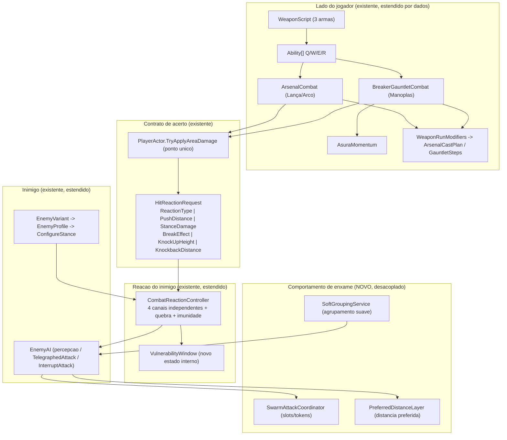

# Design Document

## Overview

Esta funcionalidade reformula a **direção de gameplay das três armas** de Tech-Guy — Manoplas, Lança e Arco — de modo que cada uma resolva o mesmo enxame de um jeito próprio e reconhecível. O princípio central do design, ditado pelo Requisito 1, é **estender a infraestrutura existente, nunca recriá-la**. A inspeção do projeto (feita antes deste documento, ver *Research notes*) confirma que quase todo o sistema alvo já existe:

- `CombatReactionController` — controlador de postura/stagger/quebra ao estilo Lost Ark, com os quatro canais (dano à vida via `Actor`, reação imediata, dano de postura, quebra de postura) e a janela de imunidade pós-quebra (`breakImmunityDuration`).
- `HitReactionRequest` + `HitReactionType` (None/Push/Stagger) + `StanceBreakEffect` (None/Stun/KnockUp/Knockback) + `HitStrength` (Light/Medium/Heavy/Breaker) — o contrato de acerto que já carrega `PushDistance`, `KnockUpHeight` e `KnockbackDistance`.
- `EnemyRank` (Normal/Elite/Legendary/Boss) + `EnemyProfile` (postura + resistências por dado) + `EnemyVariant` (pipeline que aplica o perfil via `ConfigureStance`).
- `ArsenalAbility`/`ArsenalCombat`/`ArsenalSkillKind` (Thrust/Sweep/Arrow/Volley/Rain) + `AreaHitStep` para Lança/Arco; `BreakerGauntletAbility`/`BreakerGauntletCombat` + `AsuraMomentum` para as Manoplas.
- `WeaponRunModifiers` + `WeaponBoon` + `ArsenalCastPlan` + `GauntletSteps` — modificadores de run já catalogados, aplicados a snapshots por conjuração sem tocar nos assets de origem.
- `WeaponScript` (`FiresArrows`, `RunWeaponFamily`) + `WeaponLoadout` (três armas, índice 0 grátis) + `PlayerActor.TryApplyAreaDamage` (ponto único de dano em área).
- `ArchetypeId` (16 arquétipos) + `CombatRole` + `EnemyAI` (percepção, `EngagementRange`/`StandoffDistance`, `TelegraphedAttack`, `InterruptAttack`) + `PriorityTargetMarker` (legibilidade de alvo prioritário).

O que **não existe** e precisa ser adicionado de forma **desacoplada e configurável por dados**: um sistema de **slots de ataque** do enxame (R5), **distância preferida** por arquétipo (R6) e **agrupamento suave** (R7). A busca por referências (`AttackSlot|PreferredDistance|SoftGroup|...`) não retornou nenhuma ocorrência, então esses são os únicos sistemas realmente novos — e mesmo assim são construídos como camadas finas sobre `EnemyAI`/`NavMeshAgent`, sem duplicar percepção nem locomoção.

A reformulação, portanto, é majoritariamente **configuração de dados** (assets de habilidade, `AreaHitStep`, perfis por raridade, mapas de distância preferida e a matriz Arma × Inimigo) apoiada em **pequenas extensões pontuais** de código compartilhado.

### Research notes / principais achados

- **O Unity_MCP está instalado mas não expõe nenhuma ferramenta** (o power `kiro-unity-accelerator` lista "No tools available"). Portanto, conforme R1.2 e R1.7, a inspeção foi feita pela **via de fallback**: análise de estrutura de projeto e busca de referências nos arquivos `.cs`, com registro dos arquivos inspecionados (listados em *Overview* e no Requisito 1). O processo de implementação deve **relatar explicitamente** que a inspeção via Unity_MCP e a validação de referências em cena/prefab/`.asset` não puderam ser executadas por essa via, sem marcar como validadas.
- **Os quatro canais de reação já são independentes no `CombatReactionController.ApplyReaction`**: o `switch` sobre `ReactionType` trata Push/Stagger; `ApplyStanceDamage` só roda quando `StanceDamage > 0`; a quebra (`TriggerStanceBreak`) só dispara quando a reserva chega a 0. Nenhum canal lê o estado do outro. A reformulação preserva essa separação e a torna verificável (ver Correctness Properties).
- **A janela de imunidade pós-quebra já existe** (`breakImmuneUntil`/`breakImmunityDuration`, default 1,5s, `[Min(0f)]`). R2.6 pede o intervalo 0,1–10,0s: isso é uma **restrição de configuração de asset/inspetor**, não uma mudança de código — o campo já é serializado e clampado a ≥0.
- **`EnemyProfile` já carrega postura + resistências**, e `EnemyVariant.ApplyStanceProfile` já as injeta via `ConfigureStance`. A diferenciação por raridade (R3) é, na maior parte, escolher os números certos por `EnemyRank`/`EnemyProfile`; a única lógica nova é a **janela de vulnerabilidade** pós-quebra (R3.3/R3.4/R3.5), adicionada como um estado temporário no `CombatReactionController` que reduz a raridade *efetiva* durante o intervalo.
- **`ArsenalCombat` e `BreakerGauntletCombat` já montam os efeitos a partir de `ArsenalCastPlan`/`GauntletSteps`**, que são snapshots por conjuração. `WeaponRunModifiers.Plan` e `GauntletSteps` clonam os dados (o segundo via round-trip `JsonUtility`) e **nunca** escrevem no asset. R12 é, portanto, majoritariamente **preservação** de um contrato que já vale, mais garantias de ordenação determinística e monotonicidade.
- **O HUD já condiciona a exibição de Asura a `BreakerGauntletCombat.IsEquipped`** (`PlayerHUD`/`BreakerGauntletHUD`), satisfazendo R13.5/R13.6 sem mudança. `WeaponLoadout` já fixa exatamente três armas com quatro habilidades cada (R13.1).
- **Locomoção é sempre via `NavMeshAgent`**: `EnemyAI` e `BreakerGauntletCombat` (Avanço Relâmpago) já clampam movimento à NavMesh (`agent.Raycast`/`NavMesh.SamplePosition`). Os sistemas de enxame novos herdam esse contrato.

## Architecture

A arquitetura é **aditiva e em camadas**. Nenhuma responsabilidade existente é duplicada. As três armas continuam sendo dados (`WeaponScript` + `Ability[]`) executados pelos combatentes existentes; a reformulação injeta comportamento por **configuração** e por **três novos serviços de enxame desacoplados**.



### Fluxo de um acerto (canais independentes)

```mermaid
sequenceDiagram
    participant Skill as Habilidade (Arsenal/Gauntlet)
    participant Plan as CastPlan / GauntletSteps
    participant Dmg as PlayerActor.TryApplyAreaDamage
    participant Req as HitReactionRequest
    participant RC as CombatReactionController
    participant Actor as Actor (vida)

    Skill->>Plan: snapshot por conjuracao (mods aplicados)
    Plan->>Dmg: origem, forma, area, HitReactionRequest?
    Dmg->>Actor: canal 1 - dano a vida
    Dmg->>RC: ApplyReaction(request)
    RC->>RC: canal 2 - ReactionType (None/Push/Stagger, <=0.5m, <=15 graus)
    RC->>RC: canal 3 - StanceDamage * multiplicador (>0)
    alt reserva chega a 0 e fora da imunidade
        RC->>RC: canal 4 - BreakEffect (gated por resistencias)
        RC->>RC: abre VulnerabilityWindow, reseta reserva, arma imunidade
    end
```

### Princípio "estender, não recriar" (mapeamento por componente)

| Necessidade (Requisito) | Componente existente | Ação de design |
|---|---|---|
| 4 canais de reação (R2) | `CombatReactionController.ApplyReaction` | Estender: preservar separação; adicionar clamps de legibilidade (≤0,5m / ≤15°) e a `VulnerabilityWindow`. |
| Diferenciação por raridade (R3) | `EnemyRank`, `EnemyProfile`, `ConfigureStance` | Configurar dados + adicionar estado `VulnerabilityWindow` que reduz a raridade efetiva. |
| Níveis de deslocamento (R4) | `HitReactionRequest` (campos) + `AreaHitStep` | Configurar por dado; validar faixas; sem canal paralelo. |
| Slots de ataque (R5) | *não existe* | **Novo** `SwarmAttackCoordinator`, desacoplado de cada arma. |
| Distância preferida (R6) | `EnemyAI.EngagementRange`/`StandoffDistance` | Estender com `PreferredDistanceLayer` + `PreferredDistanceProfile` (dado). |
| Agrupamento/interrupção (R7) | `EnemyAI.InterruptAttack`, `CombatReactionController` | **Novo** `SoftGroupingService` (deslocamento limitado) + reuso da interrupção existente. |
| Manoplas (R8) | `BreakerGauntletCombat`, `AsuraMomentum` | Configurar `AreaHitStep`; reusar Avanço/Flurry/Asura já implementados. |
| Lança (R9) | `ArsenalCombat`, `ArsenalSkillKind.Thrust/Sweep` | Configurar; adicionar `SweetSpot` + `SpearFlow` (recurso opcional). |
| Arco (R10) | `ArsenalCombat`, `WeaponScript.FiresArrows` | Configurar; adicionar mecânica de `Mark` reusando `PriorityTargetMarker`. |
| Matriz Arma × Inimigo (R11) | dados de habilidade + reação | **Novo** asset `WeaponEnemyMatrix` (só dados/fallback). |
| Modificadores de run (R12) | `WeaponRunModifiers`, `ArsenalCastPlan`, `GauntletSteps` | Preservar imutabilidade; garantir ordem determinística + monotonicidade. |
| Preservação (R13) | `WeaponLoadout`, `PlayerHUD`, `.meta`/GUID | Preservar; validar por diff/referências. |

## Components and Interfaces

### Componentes existentes (contratos preservados)

- **`CombatReactionController`** — permanece o único ponto que aplica reação, dano de postura, quebra e controle. Extensões: (a) clamp de legibilidade na reação imediata; (b) `VulnerabilityWindow`; (c) leitura de um limiar de acúmulo de stagger por raridade (R7.8). Métodos públicos preservados: `ApplyReaction`, `ConfigureRank`, `ConfigureStance`, `IsControlLocked`, `StanceRatio`, evento `StanceBroken`.
- **`HitReactionRequest`** — struct imutável preservada. Todos os níveis de deslocamento (R4) são expressos pelos campos existentes; **nenhum campo novo** e nenhum canal paralelo.
- **`ArsenalCombat` / `BreakerGauntletCombat`** — coordenadores `MonoBehaviour` das conjurações; continuam montando efeitos a partir de `ArsenalCastPlan` / `GauntletSteps`. Recebem os cálculos novos (Sweet Spot, Mark, Flow) como **classes C# planas** injetadas, mantendo o `MonoBehaviour` fino (regra do AGENTS.md).
- **`WeaponRunModifiers`** — `Plan` e `GauntletSteps` seguem como fábrica de snapshots imutáveis. A reformulação **não introduz catálogo paralelo** (R12.6); as regras novas de reação/deslocamento/agrupamento leem do mesmo catálogo.
- **`PriorityTargetMarker`** — reaproveitado como base visual/legível da Marca do Arco (R10.2/R10.3), evitando um novo indicador.

### Extensões de código (pontuais, compartilhadas)

- **`VulnerabilityWindow`** (classe plana, dentro de `Characters/Combat`) — estado por inimigo: `bool IsOpen`, `float OpensUntil`, `EnemyRank EffectiveRank`. Aberta em `TriggerStanceBreak`, fecha por tempo. Enquanto aberta, o `CombatReactionController` trata o inimigo como uma raridade inferior (Elite→Normal etc.), atendendo R3.3/R3.4/R3.5. Pura e testável sem cena.
- **`DisplacementTier`** (classe estática, `Characters/Combat`) — função pura que classifica/valida um `HitReactionRequest` em `Micro`/`Push`/`Launch` a partir de `PushDistance`/`KnockUpHeight`/`KnockbackDistance` (R4). Retorna o tier válido ou rebaixa para `Micro` sinalizando erro (R4.6). Ponto único compartilhado por todas as armas (R1.4).
- **`SweetSpot`** (classe plana, `Abilities/Weapon`) — dado o ponto de acerto e a geometria da estocada, decide se caiu na região da ponta e devolve os multiplicadores de bônus de postura/recurso (R9.2). Pura.
- **`SpearFlow`** (classe plana) — recurso opcional da Lança; acumula por acerto no Sweet Spot e por alternância estocada↔varredura, **sem** alterar dano/custo/recarga de quem não acumula (R9.7).
- **`WeaponMark`** (classe plana, `Abilities/Weapon`) — estado da Marca do Arco: alvo atual + validade; reforça homing/ricochete/prioridade de Heavy Bolt quando presente (R10.2/R10.3) e é no-op quando ausente (R10.8). Reusa `PriorityTargetMarker` para a legibilidade.

### Serviços de enxame (novos, desacoplados)

- **`SwarmAttackCoordinator`** (`MonoBehaviour` por sala/encontro, `Characters/Enemy`) — mantém um pool de tokens de ataque corpo a corpo (limite configurável > 0). `EnemyAI` pede um token antes de iniciar `TelegraphedAttack`; sem token, o inimigo permanece em posicionamento de espera (R5.2). Tokens são devolvidos em interrupção/stun/quebra (R5.3) via os hooks de `InterruptAttack`/`CombatReactionController`. Sem token elegível, o slot fica livre (R5.5). Estado e fila vivem numa classe plana `AttackSlotPool` (testável).
- **`PreferredDistanceLayer`** (componente leve em `EnemyAI` ou serviço consultado por ele) — lê um `PreferredDistanceProfile` por arquétipo; quando o inimigo não está atacando, tende à distância preferida mantendo separação de colisão (R6.2). Sem valor declarado, usa o default do `CombatRole` e registra ausência (R6.4). Reaproveita `EnemyAI.EngagementRange`/`StandoffDistance` como base numérica.
- **`SoftGroupingService`** (classe plana + `MonoBehaviour` fino) — aplica deslocamento suave limitado (≤1,0 m/s, raio 3,0 m, ≤0,5 m por aplicação) rumo ao centro do grupo (R7.1). Reaplicado pelo Flurry das Manoplas (R7.2), pela atração de Asura (R7.3) e pela varredura da Lança (R7.4). É **no-op quando a arma equipada é o Arco** (R7.5). Todo o movimento é feito pelos meios de locomoção existentes (`NavMeshAgent`/`CharacterController`), como o `CombatReactionController` já faz em `MoveStep`.

### Matriz Arma × Inimigo (dados)

- **`WeaponEnemyMatrix`** (`ScriptableObject`, `_Project/ScriptableObjects`) — mapeia (`ArchetypeId` × `RunWeaponFamily`) para uma **referência de resposta** (qual habilidade/`AreaHitStep`/config de reação é a ferramenta pretendida), não para código. Quando um par não tem resposta, resolve a resposta padrão da arma para o `CombatRole` e registra cobertura ausente (R11.7). Nenhuma ramificação por par arma-inimigo no código (R11.6).

## Data Models

Todos os modelos abaixo são **assets/dados** ou structs imutáveis; assets são a única fonte de valores ajustáveis (dano, tempo, alcance, raio permanecem editáveis).

### Reação e raridade

- `EnemyProfile` (existente) — já contém `maxStance`, `stanceDamageMultiplier` (0–5,0 por R2.4; hoje `[Min(0f)]`, a faixa é validada na configuração), `stanceRecoveryPerSecond`, `stanceRecoveryDelay` (0–10,0s, R2.7), e as quatro resistências `stagger/stun/knockUp/knockback` (0–1,0). **Sem novo campo obrigatório.**
- `RankReactionDefaults` (novo `ScriptableObject` opcional, ou tabela estática análoga a `ApplyRankDefaults`) — defaults por `EnemyRank` usados quando não há `EnemyProfile` (R3.6/R3.7). Campos: por raridade, os mesmos parâmetros de postura/resistência + `vulnerabilityWindowSeconds` (> 0, R3.3) + `breakImmunitySeconds` (0,1–10,0s, R2.6).
- `VulnerabilityWindow` (struct/estado interno) — `bool IsOpen`, `float ClosesAt`, `EnemyRank EffectiveRank`.

### Deslocamento (expresso só por campos existentes)

| Tier | Campos do `HitReactionRequest` | Faixa (R4) |
|---|---|---|
| `Micro` | `ReactionType` leve, `PushDistance` | 0–0,3; `KnockUpHeight`=0; `KnockbackDistance`=0 |
| `Push` | `ReactionType`, `PushDistance` | 0,31–2,0; `KnockUpHeight`=0; `KnockbackDistance`=0 |
| `Launch` (empurrão) | `BreakEffect`=Knockback, `KnockbackDistance` | 2,01–8,0 |
| `Launch` (vertical) | `BreakEffect`=KnockUp, `KnockUpHeight` | 0,5–4,0 |

`DisplacementTier` é a função pura que valida essas faixas e rebaixa para `Micro` em declaração inválida (R4.6).

### Enxame

- `PreferredDistanceProfile` (`ScriptableObject`) — por `ArchetypeId`: `preferredDistance` (> 0), `separationRadius`. Fallback por `CombatRole` (R6.4).
- `AttackSlotConfig` — `int maxConcurrentMelee` (> 0), política de fila. Consumido por `AttackSlotPool`.
- `SoftGroupingConfig` — `maxSpeed`, `radius`, `maxDisplacementPerApplication`, com os tetos de R7.1–R7.4 fixados por constantes de validação.

### Armas

- `SweetSpotConfig` (por habilidade de estocada) — região relativa à ponta + multiplicadores de bônus (estritamente > 1 quando dentro, R9.2).
- `MarkConfig` — validade da Marca; flags de reforço (homing/ricochete/HeavyBolt).
- `WeaponEnemyMatrix` — array de `(ArchetypeId, RunWeaponFamily) -> ResponseRef`.

### Run modifiers (imutabilidade preservada)

- `ArsenalCastPlan` / `GauntletSteps` (existentes) — snapshots mutáveis por conjuração; os assets `ArsenalAbility`/`BreakerGauntletAbility`/`WeaponScript` permanecem inalterados após a aplicação (R12.1/R12.5). A ordem de aplicação dos modificadores é determinística (iteração fixa do `Catalog` + `slot`), independente da ordem de aquisição (R12.7).

## Correctness Properties

*Uma propriedade é uma característica ou comportamento que deve ser verdadeiro em todas as execuções válidas do sistema — essencialmente, uma afirmação formal sobre o que o sistema deve fazer. Propriedades servem de ponte entre a especificação legível por humanos e as garantias de correção verificáveis por máquina.*

As propriedades abaixo derivam do prework de análise de critérios. Cada uma é universalmente quantificada e será implementada por um único teste baseado em propriedades. Critérios classificados como EXAMPLE/EDGE_CASE/INTEGRATION/SMOKE não geram propriedades e são cobertos pela Testing Strategy.

### Property 1: Independência dos quatro canais de reação

*Para todo* `HitReactionRequest` e todo inimigo, neutralizar exatamente um canal (definir `ReactionType`=None, ou `StanceDamage`=0, ou `BreakEffect`=None) não altera o resultado observável dos demais canais (dano à vida, reação imediata, dano de postura e quebra). Em particular, um canal em None não produz deslocamento, rotação nem interrupção atribuíveis a ele.

**Validates: Requirements 2.1, 2.3**

### Property 2: Limite de legibilidade da reação imediata

*Para toda* reação imediata Push ou Stagger com `PushDistance` arbitrário, o deslocamento resultante em um único acerto é no máximo 0,5 metro e a rotação resultante é no máximo 15 graus.

**Validates: Requirements 2.2**

### Property 3: Subtração de postura limitada e não-negativa

*Para todo* valor de postura atual, `StanceDamage` e multiplicador de postura no intervalo [0,0; 5,0], a nova reserva de postura é igual a `max(0, atual − StanceDamage × multiplicador)`, nunca ficando abaixo de 0.

**Validates: Requirements 2.4**

### Property 4: Quebra de postura no mesmo quadro em que a reserva zera

*Para todo* inimigo fora da janela de imunidade cujo acúmulo de dano de postura leva a reserva a 0, a quebra é resolvida no mesmo passo de simulação, aplicando o `BreakEffect` do acerto sujeito às resistências.

**Validates: Requirements 2.5**

### Property 5: Imunidade pós-quebra ignora dano de postura adicional

*Para todo* acerto com dano de postura aplicado durante a janela de imunidade pós-quebra, a reserva de postura do inimigo permanece inalterada por esse acerto.

**Validates: Requirements 2.6**

### Property 6: Quebra restaura postura ao máximo e adia a recuperação

*Para toda* quebra de postura, a reserva é restaurada ao máximo do inimigo no instante da quebra e a recuperação só recomeça após o atraso de recuperação configurado.

**Validates: Requirements 2.7**

### Property 7: Degradê determinístico de efeito por imunidade

*Para toda* combinação de resistências e `BreakEffect` solicitado, o efeito aplicado é o solicitado quando o inimigo não é totalmente imune (resistência 1,0); caso contrário, é o efeito de menor severidade ao qual ele não é totalmente imune segundo a escada KnockUp→Stun, ou None quando nenhum efeito é aplicável.

**Validates: Requirements 2.8**

### Property 8: Elite exige acúmulo ou força alta para quebrar

*Para todo* inimigo Elite, um único acerto Light não quebra sua postura, enquanto acúmulo suficiente de acertos, um acerto de força Heavy/Breaker ou uma habilidade de dano de postura quebra, respeitando as resistências configuradas em [0,0; 1,0].

**Validates: Requirements 3.2**

### Property 9: Janela de vulnerabilidade rebaixa a raridade efetiva (Elite→Normal)

*Para todo* inimigo Elite cuja postura é quebrada, durante a janela de vulnerabilidade sua raridade efetiva é Normal, e ao fim da janela (duração > 0) a raridade efetiva volta a Elite.

**Validates: Requirements 3.3**

### Property 10: Legendary não permanece em stagger contínuo

*Para toda* sequência de staggers aplicada a um inimigo Legendary fora de sua janela de vulnerabilidade, ele não fica em travamento de controle contínuo e pode continuar atacando.

**Validates: Requirements 3.4**

### Property 11: Boss suprime reações convencionais de acerto

*Para todo* acerto aplicado a um Boss, nenhuma reação convencional de deslocamento/flinch é produzida; apenas dano de postura, stagger de interrupção e janelas de vulnerabilidade pós-quebra interagem com ele.

**Validates: Requirements 3.5**

### Property 12: Limites por nível de deslocamento

*Para todo* `HitReactionRequest` classificado em um nível de deslocamento, os campos correspondentes respeitam a faixa do nível: Micro com `PushDistance` em [0; 0,3] e `KnockUpHeight`=`KnockbackDistance`=0; Push com `PushDistance` em (0,3; 2,0] e sem CC duro (controle preservado); Launch com `KnockbackDistance` em (2,0; 8,0] ou `KnockUpHeight` em [0,5; 4,0] (controle perdido).

**Validates: Requirements 4.1, 4.2, 4.3**

### Property 13: Declaração de deslocamento inválida rebaixa para Micro sem afetar outros efeitos

*Para todo* `HitReactionRequest` cujos campos de deslocamento estão ausentes, iguais a 0 ou fora das faixas definidas, o deslocamento é rejeitado e tratado como Micro, uma indicação de erro é registrada, e os demais efeitos do acerto permanecem inalterados.

**Validates: Requirements 4.6**

### Property 14: Deslocamento suprimido durante travamento de controle

*Para todo* inimigo com controle travado (atordoado ou no ar), Micro_Displacement e Push adicionais são suprimidos; quando o travamento termina, acertos subsequentes voltam a permitir Micro_Displacement e Push.

**Validates: Requirements 4.5**

### Property 15: Limite de atacantes simultâneos do enxame

*Para toda* sequência de aquisições e devoluções de tokens de ataque, o número de atacantes corpo a corpo com token concedido nunca excede o limite configurado (> 0); inimigos excedentes permanecem em espera.

**Validates: Requirements 5.1, 5.2**

### Property 16: Devolução de slot restaura capacidade

*Para todo* estado de pool no limite, a interrupção, atordoamento ou quebra de postura de um atacante devolve seu slot, permitindo que exatamente um outro inimigo elegível o ocupe.

**Validates: Requirements 5.3**

### Property 17: Distância preferida positiva e alvo de posicionamento

*Para todo* arquétipo com distância preferida declarada, o valor resolvido é maior que 0 e o alvo de posicionamento tende a essa distância.

**Validates: Requirements 6.1**

### Property 18: Limites do agrupamento suave

*Para todo* conjunto de posições de inimigos, o agrupamento suave só desloca inimigos dentro do raio de 3,0 m do ponto de agrupamento, a uma velocidade de no máximo 1,0 m/s, sem exceder 0,5 m de deslocamento por aplicação.

**Validates: Requirements 7.1**

### Property 19: Reaplicação do agrupamento pelo Flurry respeita o teto e o raio

*Para toda* reaplicação de agrupamento durante o Flurry, o alvo é mantido dentro de 2,0 m do ponto de encadeamento e cada aplicação respeita o teto de deslocamento por aplicação.

**Validates: Requirements 7.2**

### Property 20: Atração de Asura limitada

*Para todo* inimigo dentro do raio de 4,0 m ao ativar Asura, a atração total não excede 1,5 m por inimigo, a uma velocidade de no máximo 2,0 m/s; inimigos fora do raio não são atraídos.

**Validates: Requirements 7.3**

### Property 21: Deslocamento da varredura da Lança limitado

*Para todo* inimigo atingido pela varredura, o deslocamento total na direção da varredura não excede 0,75 m, a uma velocidade de no máximo 1,5 m/s, sem impulso instantâneo acima desse limite.

**Validates: Requirements 7.4**

### Property 22: Arco não aplica agrupamento

*Para todo* estado em que o Arco está equipado, o agrupamento suave produz deslocamento zero em todos os inimigos.

**Validates: Requirements 7.5**

### Property 23: Interrupção condicionada à janela interrompível

*Para todo* inimigo atingido por uma habilidade de interrupção: se o ataque está em janela interrompível, o ataque é cancelado e seu beat de dano pendente é suprimido no mesmo quadro; caso contrário, o ataque em curso é preservado, o beat não é suprimido e uma reação de ausência de interrupção é sinalizada.

**Validates: Requirements 7.6, 7.7**

### Property 24: Acúmulo de stagger por resistência de raridade

*Para toda* sequência de interrupções sobre um inimigo com resistência de postura por raridade, stagger ou quebra só é aplicado quando o acúmulo atinge ou excede o limiar da raridade; abaixo do limiar o estado do inimigo é preservado.

**Validates: Requirements 7.8**

### Property 25: Avanço Relâmpago fica na NavMesh

*Para todo* ponto de mira, o destino do Avanço Relâmpago (Q das Manoplas) está sobre a NavMesh e dentro da distância de avanço; pontos fora da área navegável são clampados ao ponto navegável válido mais próximo.

**Validates: Requirements 8.2**

### Property 26: Flurry mantém golpes e travamento pela duração

*Para toda* execução de Flurry (W), golpes repetidos são aplicados ao alvo travado durante toda a duração declarada, e o travamento é mantido até o término.

**Validates: Requirements 8.4**

### Property 27: Ferramenta anti-Heavy usa força Heavy ou Breaker

*Para toda* arma, a ferramenta de resposta ao arquétipo Heavy (Manopla E, Lança E, Arco W) usa força `HitStrength` Heavy ou Breaker e é capaz de quebrar a postura de um inimigo Heavy.

**Validates: Requirements 8.5, 9.5, 11.2**

### Property 28: R nega Asura quando a energia não está cheia

*Para todo* valor de `AsuraMomentum.Energy` em [0; 99], ativar R nega a entrada no modo Asura e preserva a energia inalterada.

**Validates: Requirements 8.7**

### Property 29: KnockUp mantém juggle e restaura controle ao pousar

*Para todo* inimigo com `KnockUpResistance` < 1, uma quebra de postura por golpe que declara KnockUp mantém o controle bloqueado enquanto ele está no ar e restaura o controle quando a duração aérea termina.

**Validates: Requirements 8.8, 8.9**

### Property 30: Ganho de Asura por alternância de categoria

*Para toda* sequência de habilidades registradas em `AsuraMomentum`, cada registro adiciona 25 de energia quando a categoria (stamina/shock) difere da anterior e 10 quando é igual, com o total limitado a 100.

**Validates: Requirements 8.10**

### Property 31: Bônus do Sweet Spot estritamente maior

*Para todo* acerto direto de estocada, o bônus de dano de postura e de recurso concedido dentro da região do Sweet_Spot é estritamente maior do que o concedido por um acerto equivalente fora do Sweet_Spot.

**Validates: Requirements 9.2**

### Property 32: Flow não interfere em quem não acumula

*Para toda* habilidade da Lança, habilitar o recurso opcional Flow não altera dano, custo de mana nem recarga da habilidade para um jogador que não acumula Flow.

**Validates: Requirements 9.7**

### Property 33: Velocidade reduzida ao disparar o Arco

*Para toda* velocidade de movimento plena, a velocidade permitida enquanto o jogador dispara com o Arco é estritamente maior que 0 e estritamente menor que a velocidade plena.

**Validates: Requirements 10.1**

### Property 34: Marca reforça comportamentos de prioridade

*Para todo* alvo marcado presente entre os candidatos, os comportamentos de prioridade (homing, ricochete e prioridade de Heavy Bolt) são direcionados ao alvo marcado.

**Validates: Requirements 10.3**

### Property 35: Chuva de Flechas respeita o alcance

*Para toda* posição de cursor, o centro da Chuva de Flechas (R do Arco) é clampado dentro do alcance existente da habilidade.

**Validates: Requirements 10.7**

### Property 36: Habilidade de prioridade sem Marca usa alvo padrão

*Para toda* ativação de habilidade de prioridade sem alvo marcado, a execução usa o comportamento de alvo padrão (sem reforço de homing, ricochete ou Heavy Bolt) e o estado da Marca permanece inalterado.

**Validates: Requirements 10.8**

### Property 37: Imutabilidade dos assets de origem ao planejar

*Para todo* conjunto de `Run_Modifier` aplicado a um `ArsenalCastPlan`/`GauntletSteps`, os campos dos assets de origem (`ArsenalAbility`/`BreakerGauntletAbility`/`WeaponScript`) permanecem inalterados após a aplicação, enquanto o snapshot reflete as mudanças.

**Validates: Requirements 12.1, 12.5**

### Property 38: Monotonicidade dos modificadores por rank

*Para todo* modificador catalogado e toda quantidade do Cast_Plan que ele afeta (alcance, ecos, área, dano de postura, ganho de Asura, varreduras, raio, viagem, bônus de Sweet_Spot, número de disparos, cadência, curvatura, largura do leque, pulsos, prioridade da Marca), o valor resultante é monotonicamente crescente conforme o rank cresce de 1 até o rank máximo catalogado.

**Validates: Requirements 12.2, 12.3, 12.4**

### Property 39: Ordem determinística de aplicação de modificadores

*Para todo* multiconjunto de `Run_Modifier` com seus ranks, aplicar os modificadores em qualquer permutação produz exatamente o mesmo `ArsenalCastPlan`/`GauntletSteps` resultante.

**Validates: Requirements 12.7**

### Property 40: Modificador inválido é ignorado sem efeito colateral

*Para todo* `Run_Modifier` com rank fora de [1; rank máximo] ou não catalogado, ele é ignorado ao montar o Cast_Plan, uma indicação de erro identificando o modificador e o rank é registrada, e o Cast_Plan e os assets de origem permanecem inalterados por esse modificador.

**Validates: Requirements 12.8**

### Property 41: Ativação deduz mana e inicia recarga

*Para toda* habilidade ativada com mana suficiente e fora de recarga, a mana é reduzida pelo custo da habilidade e sua recarga é iniciada, tornando-a indisponível até a recarga expirar.

**Validates: Requirements 13.2**

### Property 42: Exclusão mútua durante a execução

*Para toda* habilidade em execução, qualquer tentativa de ativar outra habilidade Q/W/E/R é bloqueada até a conclusão da habilidade em execução.

**Validates: Requirements 13.3**

### Property 43: Ativação inválida preserva o estado

*Para toda* ativação com mana insuficiente ou recarga não expirada, a ativação é rejeitada, a mana atual é preservada sem dedução e o estado permanece inalterado.

**Validates: Requirements 13.4**

### Property 44: Asura exibido se e somente se as Manoplas estão equipadas

*Para todo* estado de arma equipada, o indicador de Asura é exibido quando as Manoplas estão equipadas e não é exibido caso contrário, preservando o kit e os assets das Manoplas quando equipadas.

**Validates: Requirements 13.5, 13.6**

## Error Handling

O tratamento de erros segue o padrão já presente no projeto (fallback seguro + log identificando a ausência, sem interromper o fluxo), como em `EnemyVariant.FallBackToSafeDefault` e nos clamps de `HitReactionRequest`/`CombatReactionController`.

- **Configuração de raridade ausente (R3.7):** quando um inimigo não tem `EnemyProfile`, aplicar os defaults por `EnemyRank` (via `ConfigureRank`/`ApplyRankDefaults`) e registrar uma indicação de configuração ausente com o nome do inimigo, **sem** interromper o processamento do acerto em curso.
- **Declaração de deslocamento inválida (R4.6):** `DisplacementTier` valida as faixas; em declaração ausente/zero/fora de faixa, rebaixar para Micro, registrar erro e **não** alterar dano à vida, dano de postura nem quebra.
- **Distância preferida ausente (R6.4):** resolver o default do `CombatRole` (sempre > 0) e registrar ausência.
- **Slot sem inimigo elegível (R5.5):** manter o slot livre; nunca forçar um atacante para fora de sua distância preferida.
- **Interrupção fora de janela (R7.7):** preservar o ataque, não suprimir o beat e sinalizar ausência de interrupção (feedback ao jogador).
- **Destino de avanço fora da NavMesh (R8.3):** clampar ao ponto navegável válido mais próximo (reuso de `agent.Raycast`/`NavMesh.SamplePosition`), preservando o estado do jogador.
- **Asura insuficiente (R8.7):** `AsuraMomentum.TryConsume` já retorna falso e preserva a energia; a ativação de R é negada sem efeito colateral.
- **Cobertura ausente na matriz (R11.7):** resolver a resposta padrão da arma para o `CombatRole` e registrar cobertura ausente.
- **Modificador inválido/não catalogado (R12.8):** ignorar o modificador, registrar modificador+rank recusados e preservar Cast_Plan e assets.
- **Ativação inválida de habilidade (R13.4):** rejeitar (mana insuficiente ou em recarga), preservar mana e estado — comportamento já garantido pelos `CanUse`/checagens de `AbilityHolder`/`*Combat`.
- **Falha de validação/inspeção (R1.7, R13.9):** quando a inspeção via Unity_MCP ou a validação de referências/testes não puder ser executada, relatar explicitamente qual verificação não foi feita e o motivo, **sem** marcar a alteração como validada.

Todos os logs usam identificadores estáveis (`ArchetypeId`, `WeaponBoon`, nome do asset) em vez de strings mágicas, conforme AGENTS.md.

## Testing Strategy

A estratégia é dupla: **testes por exemplo/edge/integração** para cenários concretos, infraestrutura e comportamento emergente, e **testes baseados em propriedades (PBT)** para as invariantes universais listadas em Correctness Properties. O projeto é Unity/C#; PBT se aplica bem aqui porque a maior parte da lógica alvo é composta de **funções puras e classes planas** (`DisplacementTier`, `VulnerabilityWindow`, `SweetSpot`, `SpearFlow`, `WeaponMark`, `AttackSlotPool`, `SoftGroupingService` (núcleo de cálculo), `WeaponRunModifiers.Plan`/`GauntletSteps`, `AsuraMomentum`), extraídas para fora do `MonoBehaviour` justamente para serem testáveis sem cena.

### Biblioteca de PBT

- Usar uma biblioteca de PBT estabelecida para C#/.NET (por exemplo, **FsCheck** ou **CsCheck**), **sem** implementar PBT do zero. Os testes ficam nas pastas de teste existentes (`Assets/_Project/Scripts/Tests`), como EditMode tests que não exigem cena.
- Cada teste de propriedade roda **no mínimo 100 iterações** (entradas aleatórias).
- Cada teste de propriedade referencia a propriedade de origem com uma tag no formato: **Feature: weapon-gameplay-swarm-rework, Property {número}: {texto da propriedade}**.
- Cada propriedade de Correctness Properties é implementada por **um único** teste baseado em propriedades.

### EditMode (por exemplo/propriedade, sem cena)

- **Propriedades puras** (Properties 1–14, 17–24, 27–44 na medida em que o núcleo é isolável): geradores para `HitReactionRequest`, perfis por raridade, posições de inimigos, sequências de tokens, multiconjuntos de modificadores/ranks, sequências de categorias de Asura, pontos de acerto de estocada e posições de cursor.
- **Exemplos/edge cases** (classificados no prework): loop das Manoplas por etapa (8.1), transição de Asura cheia (8.6), presença das duas linguagens da Lança (9.1), existência da Marca (10.2), completude e fallback da matriz (11.1/11.3/11.4/11.5/11.7), contagem 3×4=12 (13.1), fallback de config ausente (3.7), slot livre sem elegível (5.5), fallback de distância (6.4).
- **Imutabilidade e determinismo dos modificadores** (Properties 37–40): capturar os campos serializados dos assets antes/depois de `Plan`/`GauntletSteps` e comparar; permutar a ordem de aplicação e comparar os snapshots resultantes.

### PlayMode (integração / comportamento emergente)

- Convergência à distância preferida sem sobreposição de colisores (R6.2) e formações em camadas emergentes (R6.3).
- Contra-ataque de estocada vs Charger (R9.3), varredura anti-enxame (R9.4), Onda do Dragão (R9.6), Rajada Rápida móvel (R10.4), Flecha Pesada carregável (R10.5), Leque Amplo + backstep (R10.6).
- Fluxo de acerto de ponta a ponta pela `PlayerActor.TryApplyAreaDamage` conectando canais de reação a inimigos reais; cadência de reaplicação do agrupamento no Flurry (R7.2).
- Regressão do kit atual: três armas com Q/W/E/R, mana/recarga, exibição de Asura condicionada às Manoplas, boss existente funcionando.

### SMOKE / inspeção (infraestrutura e processo)

- Ausência de sistema de slots duplicado; matriz é dado, sem ramificações por par arma-inimigo (R5.4/R11.6/R12.6).
- Preservação de `.meta`/GUID em movimentos de asset (R13.7) e verificação prévia de dependentes em cena/prefab/`.asset` antes de qualquer mudança de GUID/caminho (R13.8).

### Ressalvas de execução via CLI (R1.7, R13.9)

O Unity_MCP instalado **não expõe ferramentas**, e a execução de testes EditMode/PlayMode e a validação de referências em `.unity`/`.prefab`/`.asset` **podem não ser executáveis via CLI** neste ambiente. Quando isso ocorrer, o processo de implementação **deve**:

1. Validar por **inspeção de estrutura de projeto**, **busca de referências** em `.cs`/`.unity`/`.prefab`/`.asset`/`.meta` e **`git diff`**.
2. **Relatar explicitamente** cada teste e cada validação que **não** pôde ser executado e o motivo, sem marcar a alteração como validada.
3. Nunca aplicar uma mudança de GUID/caminho especial enquanto houver referência dependente não verificada.
